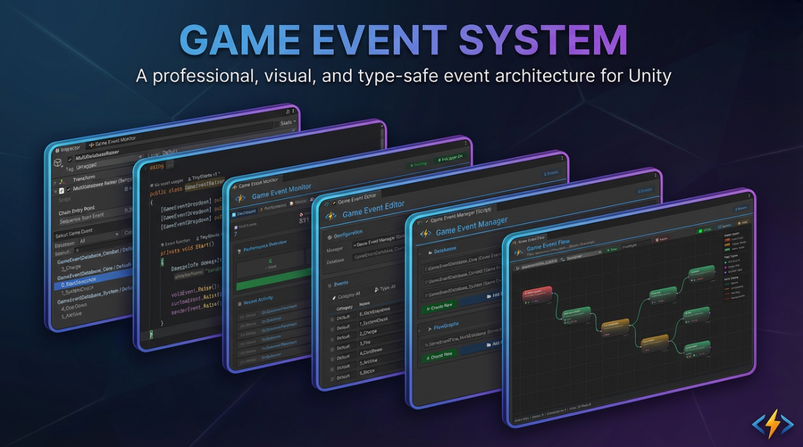
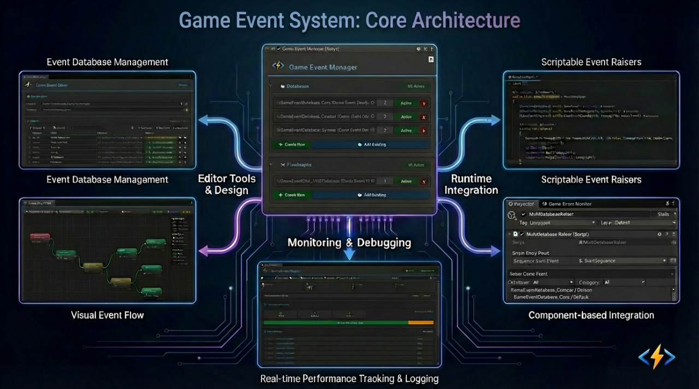
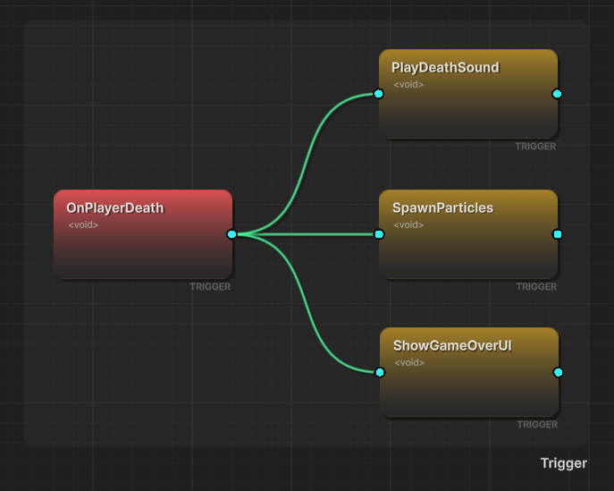
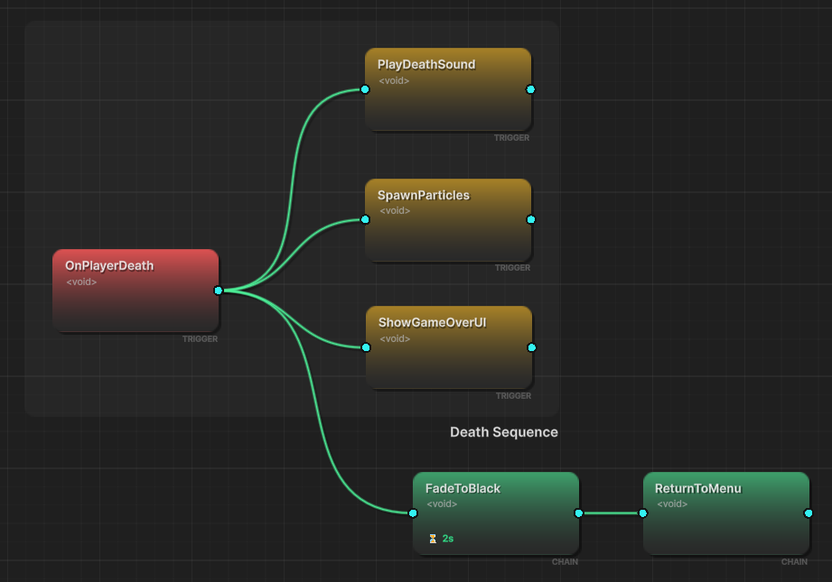

# Game Event System

A production-ready, visual event architecture for Unity that transforms chaotic event management into maintainable, testable workflows.

**From the Creator**
"I built this system because I was tired of battling 'invisible spaghetti code' in my own projects. As an indie developer, I needed a tool that balanced visual clarity with raw coding power—without performance trade-offs. **TinyGiants** is my commitment to professional-grade tools that I use in my own games every day."
—  ***[TinyGiants]** from China*





---

## Why This System Exists

In traditional Unity development, events become invisible spaghetti:

- **Hidden Dependencies**: Who's listening? Where's it triggered? Good luck finding out.
- **Runtime Breakage**: Rename a method, break 10 scene objects.
- **Cross-Scene Hell**: Events die when scenes unload—memory leaks and null references everywhere.
- **No Visibility**: Complex event chains exist only in your head (and outdated comments).

**TinyGiants.GameEventSystem** provides a **Visual-First, Type-Safe** event architecture:

✅ **Events as Assets** - ScriptableObject-based, GUID-protected, survives refactoring  

✅ **Visual Flow Graphs** - See your event chains, triggers, and conditions in one window  

✅ **Zero-Reflection Runtime** - Expression Tree compilation for C++-like performance  

✅ **Designer-Friendly** - Drag-and-drop binding, no coding required for simple workflows  

✅ **Production-Grade Tools** - Real-time monitoring, reference finding, code generation automation

---

## Core Architecture: How It Works

The **GameEventSystem** is built on a "Management-Asset-Action" architecture designed to centralize event logic while maintaining decentralized execution.

<div className="img-full-wrapper">




</div>

### 🏗️ The Foundation: GameEventManager & Databases

At the heart of the system is the **GameEventManager**, which manages and maintains **Event Databases**. 

- **Events as Assets**: Every event is a `ScriptableObject` stored within a database asset.
- **Centralized Management**: The **GameEventEditorWindow** serves as the primary command center. From here, you access specialized tools:
  - **Creator**: Rapidly generate new event assets.
  - **Behavior & Finder**: Configure event properties and locate dependencies across scenes.
  - **FlowGraph**: Design complex, multi-step event sequences visually.
  - **Monitor**: Real-time debugging and performance tracking.

### 🔄 The Hybrid Workflow: Visual & Code

The system seamlessly bridges the gap between technical implementation and creative design:

1.  **Direct Code Integration**: Programmers can trigger events anywhere in their scripts using a simple `.Raise()` call.
2.  **Visual Inspector Binding**: Designers can bind logic to events directly in the Inspector using intuitive **dropdown menus**, completely eliminating the need for "magic strings" or manual component searching.
3.  **Real-Time Monitoring**: The **Monitor** window provides a live view of event activity, helping you verify the flow of data and execution timing during Play Mode.

### 💻 Full API Parity

While the system provides a robust visual interface for designers, it is **API-first**. 
**Every feature available in the visual editors is accessible via the Runtime API.** Whether you prefer building event chains in a graph or Registering/Unregistering listeners dynamically through C# code, the system provides the same level of power and performance.

---

### 💡 Why this architecture?

- **Decoupling**: Senders and receivers don't need to know each other; they only need to know the Event Asset.
- **Visibility**: The "invisible spaghetti" of standard events is replaced by a searchable, visual database.
- **Reliability**: Because events are assets, references don't break when you rename methods or move files.

---

## Architecture Highlights

### 🏗️ Foundation: ScriptableObject-Driven

Unlike string-based or singleton event systems, **events are first-class assets**:

```csharp
// Events are assets, not magic strings
[GameEventDropdown] public GameEvent onPlayerDeath;
[GameEventDropdown] public Int32GameEvent onScoreChanged;

void Die() {
    onPlayerDeath.Raise(); // Type-safe, asset-referenced
}
```

**Benefits**:

- ✅ **Complete Decoupling** - Senders never know receivers. Fire once, notify many.
- ✅ **Cross-Scene Persistence** - Events survive scene loads/unloads.
- ✅ **GUID Identity** - Rename files, reorganize folders—references never break.
- ✅ **Multi-Database Support** - Modular organization for large teams.

<details>
<summary>📖 How GUID Protection Works</summary>


Every event has a unique GUID stored in `.meta` files:

```yaml
# PlayerDeath.asset.meta
guid: a7f3c21e9b4d8f6e2d1a9c8b7e6f5a4d
```

Even if you rename `PlayerDeath` `OnCharacterDied`, Unity maintains the reference via GUID. **No broken scene links.**

</details>

---

### 🕸️ Visual Flow Orchestration

Stop hunting through code to understand event relationships. The **Flow Editor** turns invisible logic into maintainable graphs:


#### Use Cases

**🎯 Triggers (Fan-Out)**



**⛓️ Chains (Sequential)**


**🔀 Hybrid Flows** 

Mix parallel + sequential logic



Visual Benefits

- **Group Organization** - Color-coded groups for large flows
- **Real-Time Validation** - Connection type checking (Green=Valid, Red=Error)
- **Undo/Redo Support** - Full history system (Ctrl+Z/Y)
- **Runtime Debugging** - Active nodes highlight in Play Mode

---

### ⚡ Type-Safe, Zero-Reflection Performance

Unity's generic serialization is broken by design. I fixed it.

#### The Problem

```csharp
// ❌ Unity can't serialize this
[SerializeField] private GameEvent<PlayerData> onPlayerDataChanged;
```

#### Our Solution

```csharp
// ✅ Auto-generated concrete class
[GameEventDropdown] public PlayerDataGameEvent onPlayerDataChanged;

// Generated code (automatic):
[Serializable]
public class PlayerDataGameEvent : GameEvent<PlayerData> { }
```

**Performance Benefits**:

- 🚀 **Expression Tree Compilation** - Conditions compile to delegates at startup (no runtime parsing)
- 🚀 **No Reflection Cost** - Direct method calls, not `Invoke()`
- 🚀 **Native Inspector Support** - Full `UnityEvent<T>` compatibility

<details>
<summary>⚙️ Code Generation Workflow</summary>


1. **Select Types** - Choose your custom types in the Creator window
2. **Generate** - Click "Generate" to create concrete classes
3. **Compile** - Unity auto-compiles the new code
4. **Create** - Now you can create events for your custom types

**Time investment**: ~10 seconds. **Benefit**: Lifetime type safety.

</details>

---

## Feature Matrix

### ⚓ Core Architecture

| Feature                    | Description                                                  |
| :------------------------- | :----------------------------------------------------------- |
| **Asset-Based Events**     | ScriptableObject architecture with **GUID Identity**—references survive renames and file moves. |
| **Comprehensive Generics** | Native support for `GaneEvent<Void>`, `GameEvent<T>`, and source-aware `GameEvent<TSender, TArgs>`. |
| **Multi-Database System**  | Modular organization supporting multiple databases with **Dynamic Loading** and **Health Checks**. |
| **Category System**        | String-based categorization for efficient fuzzy-search filtering within large event libraries. |
| **Auto Static Reset**      | Automatic clearing of static caches in Editor Play Mode to prevent data pollution. |

### 🧠 Advanced Logic & Flow

| Feature                   | Description                                                  |
| :------------------------ | :----------------------------------------------------------- |
| **Expression Trees**      | **Zero-reflection** logic evaluation; conditions are compiled into high-performance delegates at runtime. |
| **Visual Logic Builder**  | Construct complex **nested AND/OR logic** and dynamic property comparisons without code. |
| **Hybrid Execution**      | Seamlessly mix parallel **Fan-out Triggers** and sequential **Blocking Chains** in one graph. |
| **Argument Transformers** | Dynamically extract and pass specific object properties as arguments between flow nodes. |
| **Granular Flow Control** | Per-node delays, **Async/Coroutine waits**, loop counts, and conditional execution gates. |

### 🎧 Listening & Binding

| Feature                   | Description                                                  |
| :------------------------ | :----------------------------------------------------------- |
| **Visual Binding**        | Drag-and-drop **UnityEvent wiring** in the Inspector with visual status markers and type safety. |
| **Priority Listeners**    | **Integer-based sorting** ensuring critical systems react before standard UI/Audio listeners. |
| **Conditional Listeners** | Built-in **Predicate support**—callbacks only fire when specific logical criteria are met. |
| **Persistent Listeners**  | Native support for **cross-scene listeners** that remain active during scene transitions. |
| **Dynamic Runtime API**   | Full programmatic control to register or unregister listeners and manage **Task Handles**. |

### 📊 Tooling & Debug

| Feature                | Description                                                  |
| :--------------------- | :----------------------------------------------------------- |
| **Dashboard & Wizard** | Modern UI for **Batch Operations** and a fuzzy-matching Wizard for rapid event creation. |
| **Code Automation**    | **Tri-Mode CodeGen** (Basic/Custom/Sender) with automatic compilation pipeline integration. |
| **Reference Finder**   | Scene-wide scanner to pinpoint exactly which components reference specific event assets. |
| **Runtime Monitor**    | Real-time profiling of **Execution Time (Avg/Min/Max)**, listener counts, and **GC allocation**. |
| **Automation Tree**    | Real-time visualizer for active Trigger and Chain hierarchies to debug complex logic flows. |

------

## Performance Characteristics

Real-world metrics from production builds:

| Scenario                        | Performance | Notes                        |
| ------------------------------- | ----------- | ---------------------------- |
| **Event Raise (0 listeners)**   | ~0.001ms    | Virtually free               |
| **Event Raise (10 listeners)**  | ~0.02ms     | No GC allocation             |
| **Condition Evaluation**        | ~0.003ms    | Expression Tree compilation  |
| **Flow Node Execution**         | ~0.05ms     | Includes coroutine overhead  |
| **Monitor Window (100 events)** | ~0.3ms      | Editor-only, no runtime cost |

Tested in shipped titles with **500+ events** and **10,000+ listeners** across scenes. Zero performance regressions.

------

## 🗺️ Navigation Roadmap

This map provides a complete overview of the system documentation. Use the tables below to quickly jump to the specific feature or tutorial you need.

Recommended Learning Paths:

- 🚀 **Quickest Start**: Jump straight to [**Example: Quick Start**](./docs/game-event-system/examples/00-quick-start.md).
- 🎨 **Visual Learner**: Focus on the [**Visual Workflow**](#visual-workflow) and [**Flow Orchestration**](#flow-orchestration) tables.
- 💻 **Programmer's Deep Dive**: Head directly to [**Runtime API**](#runtime-api).

### 🏁 1. Introduction {#introduction}

Foundational setup and core philosophy of the event-as-asset architecture.

| Page                                                         | Description                                                  |
| :----------------------------------------------------------- | :----------------------------------------------------------- |
| [**Project Structure**](./docs/game-event-system/intro/project-structure.md) | Understanding directory layout, folder protection, and modular organization. |
| [**Installation**](./docs/game-event-system/intro/installation.md) | Initializing the plugin and setting up the automated static reset pipeline. |

### 💎 2. Visual Workflow {#visual-workflow}

Management tools designed to transform invisible code into a tangible visual dashboard.

| Page                                                         | Description                                                  |
| :----------------------------------------------------------- | :----------------------------------------------------------- |
| [**System Dashboard**](./docs/game-event-system/visual-workflow/game-event-system.md) | Overview of the asset-based workflow and GUID identity system |
| [**Database & FlowGraph**](./docs/game-event-system/visual-workflow/game-event-manager.md) | Handling multi-database and multi-flowgraph setups and database health maintenance |
| [**Edit Game Event**](./docs/game-event-system/visual-workflow/game-event-editor.md) | Using the Dashboard for batch editing, search, and categorization |
| [**Create Game Event**](./docs/game-event-system/visual-workflow/game-event-creator.md) | Rapidly generating event assets using the fuzzy-search batch wizard |
| [**Configure Game Event**](./docs/game-event-system/visual-workflow/game-event-behavior.md) | Mastering Inspector binding with visual status markers and type safety |
| [**Raise Game Event**](./docs/game-event-system/visual-workflow/game-event-raiser.md) | Learn how to call events and enhance inspectors using the built-in GameEventDropdown Attribute |
| [**Find Game Event**](./docs/game-event-system/visual-workflow/game-event-finder.md) | Scanning scenes to locate component-level event dependencies. |
| [**Visual Condition Tree**](./docs/game-event-system/visual-workflow/visual-condition-tree.md) | Learn how to control the logic execution of event action through condition tree configuration |

### 🕸️ 3. Flow Orchestration {#flow-orchestration}

Visualizing and building complex multi-step logic sequences using nodes.

| Page                                                         | Description                                                  |
| :----------------------------------------------------------- | :----------------------------------------------------------- |
| [**Node Editor**](./docs/game-event-system/flow-graph/game-event-node-editor.md) | Managing the GraphView canvas, groups, and snapshot-based Undo/Redo |
| [**Node Connector**](./docs/game-event-system/flow-graph/game-event-node-connector.md) | Rules for hybrid execution modes and real-time connection validation |
| [**Node Behavior**](./docs/game-event-system/flow-graph/game-event-node-behavior.md) | Configuring node-level delays, loops, and argument transformation logic |
| [**Advanced Logic Patterns**](./docs/game-event-system/flow-graph/advanced-logic-patterns.md) | Building no-code nested logic groups and conditional execution gates |

### 💻 4. Scripting & API {#runtime-api}

The developer's guide to high-performance C# integration and lifecycle management.

| Page                                                         | Description                                                  |
| :----------------------------------------------------------- | :----------------------------------------------------------- |
| [**Raising & Scheduling**](./docs/game-event-system/scripting/raising-and-scheduling.md) | Programmatic firing, delayed execution, and Task Handle management |
| [**Listening Strategies**](./docs/game-event-system/scripting/listening-strategies.md) | implementing prioritized, persistent, and source-aware (Sender) listeners |
| [**Programmatic Flow**](./docs/game-event-system/scripting/programmatic-flow.md) | Using Expression Tree-based predicates for zero-reflection logic filtering |
| [**Best Practices**](./docs/game-event-system/scripting/best-practices.md) | Architectural tips for clean decoupling and preventing data pollution |
| [**API Reference**](./docs/game-event-system/scripting/api-reference.md) | Detailed technical documentation for all core classes and attributes |

### 🛠️ 5. Tools & Support {#tools-support}

Automation and monitoring utilities for professional production environments.

| Page                                                         | Description                                                  |
| :----------------------------------------------------------- | :----------------------------------------------------------- |
| [**CodeGen & Cleanup**](./docs/game-event-system/tools/codegen-and-cleanup.md) | Using the Tri-Mode Generator and compilation pipeline automation |
| [**Runtime Monitor**](./docs/game-event-system/tools/runtime-monitor.md) | Real-time performance profiling, deep logging, and warning systems |
| [**Community & Support**](./docs/game-event-system/tools/community-and-support.md) | Accessing updates, reporting bugs, and getting technical assistance |

### 📚 6. Examples {#examples}

Practical, ready-to-use scenes covering every scenario from basics to advanced API usage.

| ID   | Example Page                                                 | Key Learning Point                                           |
| :--- | :----------------------------------------------------------- | :----------------------------------------------------------- |
| 00   | [**Quick Start**](./docs/game-event-system/examples/00-quick-start.md) | The minimal workflow for creating, raising, and binding an event |
| 01   | [**Void Event**](./docs/game-event-system/examples/01-void-event.md) | Using parameterless signals for global triggers like "Level Start" |
| 02   | [**Basic Types Event**](./docs/game-event-system/examples/02-basic-types-event.md) | Passing primitive data (int, float, string) through events   |
| 03   | [**Custom Type Event**](./docs/game-event-system/examples/03-custom-type-event.md) | Leveraging CodeGen for serialized custom data classes and structs |
| 04   | [**Custom Sender Event**](./docs/game-event-system/examples/04-custom-sender-event.md) | Using source-aware events to identify which entity raised the signal |
| 05   | [**Priority Event**](./docs/game-event-system/examples/05-priority-event.md) | Precisely controlling the execution order of multiple listeners |
| 06   | [**Conditional Event**](./docs/game-event-system/examples/06-conditional-event.md) | Using predicates to execute callbacks only when criteria are met |
| 07   | [**Delayed Event**](./docs/game-event-system/examples/07-delayed-event.md) | Managing timed logic and using Task Handles for cancellation |
| 08   | [**Repeating Event**](./docs/game-event-system/examples/08-repeating-event.md) | Creating recurring pulse signals and automated logic loops   |
| 09   | [**Persistent Event**](./docs/game-event-system/examples/09-persistent-event.md) | Handling events during scene transitions (DontDestroyOnLoad) |
| 10   | [**Trigger Event**](./docs/game-event-system/examples/10-trigger-event.md) | Bridging Unity's Physics system with Game Event assets       |
| 11   | [**Chain Event**](./docs/game-event-system/examples/11-chain-event.md) | Building visual sequential logic using the Flow Orchestration graph |
| 12   | [**Multi Database**](./docs/game-event-system/examples/12-multi-database.md) | Isolating events into different assets for modular project organization |
| 13   | [**Runtime API**](./docs/game-event-system/examples/13-runtime-api.md) | Registering and unregistering listeners dynamically via C# scripts |
| 14   | [**Runtime Monitor**](./docs/game-event-system/examples/14-runtime-monitor.md) | Using profiling tools to debug execution timing and GC allocations |

For a hands-on start, we recommend following **Example 00 (Quick Start)** first, then exploring the **Visual Workflow** section to see how the editor tools can streamline your development.
