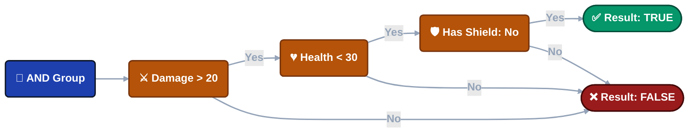
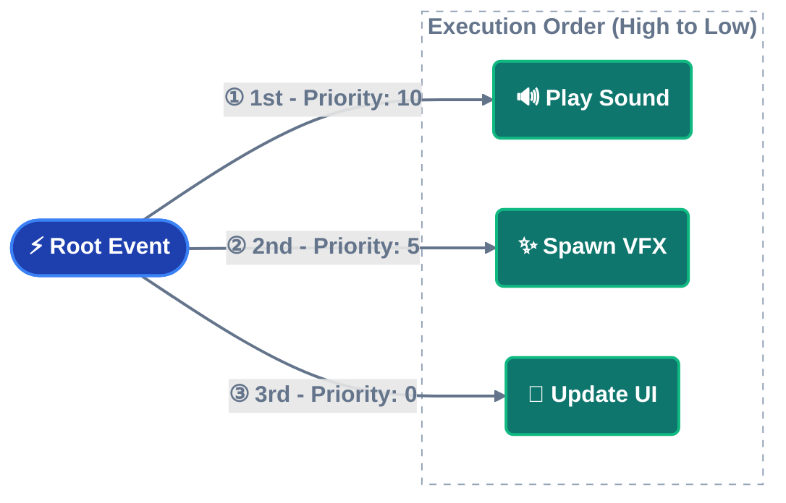
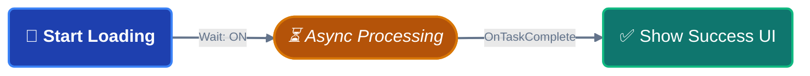
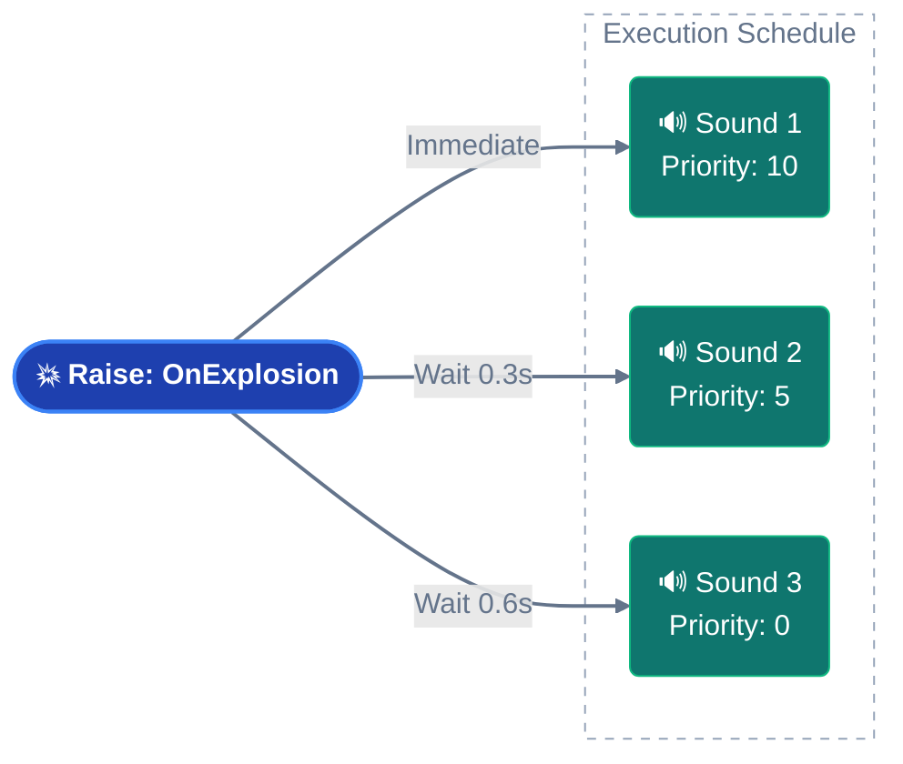

import Tabs from '@theme/Tabs';

import TabItem from '@theme/TabItem';


# Game Event Node Behavior

While the graph shows connections, the **Node Behavior Configuration Window** controls the detailed execution logic of each individual node.

**Access**: Double-click any node in the flow graph to open the configuration window for node behavior.


---

## 🎯 Window Overview

The configuration window is divided into three main sections:

| Section                | Purpose                                     | Applies To                |
| ---------------------- | ------------------------------------------- | ------------------------- |
| **Node Information**   | View event details and type                 | All nodes                 |
| **Node Condition**     | Visual logic gate for execution control     | All nodes                 |
| **Node Configuration** | Timing, priority, and data passing settings | All nodes (type-specific) |

## 📋 Node Information

Displays read-only details about the selected node.


**Event Name**: The Game Event this node will raise.

**Node Type**: Trigger (parallel) or Chain (sequential).

**Event GUID**: Unique identifier for internal tracking.

**Use Case**: Verify you're editing the correct node before making changes.

------

## 🧩 Node Condition (Flow Gate)

Each node has its own **visual condition tree** that controls whether it executes.


### How It Works

**If condition evaluates to FALSE**:

- Node does **not** fire
- Flow stops down this branch
- Connected child nodes are skipped

**If condition evaluates to TRUE**:

- Node fires normally
- Flow continues to children

---

### Condition Context

You have access to:

**Event Argument** (`Arg`): Data from the incoming event

```
Example: Arg.amount > 50
```

**Sender** (`Sender`): Source object (for sender events)

```
Example: Sender.tag == "Enemy"
```

**Scene Objects**: Any GameObject/Component in the scene

```
Example: Player.Health < 20
```

---

### Visual Builder

The condition system uses the same **Visual Condition Tree** as **Event Behaviors**.

**Full Documentation**: See **[Visual Condition Tree](../visual-workflow/visual-condition-tree.md)** for complete guide on:

- Building logic gates (AND/OR groups)
- Source types (Event Argument, Scene Type, Random, Constant)
- Comparison operators
- Type validation
- Best practices

:::tip Reusable Logic
The visual condition system is identical across:

- **Event Behaviors** (in Event Inspector)
- **Flow Nodes** (this window)

Learn it once, use it everywhere!
:::

---

### Practical Example

**Scenario**: Only play "Low Health Warning" when health is critical.

**Condition Tree**:



**Result**: Sound only plays when **all three** conditions pass.

---

## ⚙️ Node Configuration

Settings that control **timing**, **priority**, and **data flow**.

### General Settings (All Nodes)


<details>
<summary>Start Delay</summary>

**Unit**: Seconds (float)

**Effect**: Node waits this duration **before** raising its event.

**Use Cases**:

- Staggered explosions (0.2s apart)
- Delayed reactions to events
- Timed sequences

**Example**:

```
🔘 Raise: OnButtonPressed
│
├─► ⏱️ 0.5s ──┐
│             ▼
│            🎵 PlayClickSound        ✅ Executed
│
├─► ⏱️ 1.0s ────────┐
│                   ▼
│                  💬 ShowConfirmation  ✅ Executed
│
└─► ⏱️ 2.0s ──────────────────┐
                              ▼
                             🚪 CloseMenu        ✅ Finalized
```

**Visual Indicator**: Badge shows ⏱️ **0.5s** at bottom of node.

</details>

<details>
<summary>Pass Argument</summary>

**Type**: Boolean toggle

**Effect**: Controls whether event data flows to this node.

---

### ✅ Checked (Pass Argument: ON)

Node receives data from previous event (if types are compatible).

**When to Use**:

- Forwarding damage info
- Passing scores/values
- Data pipelines

**Example**:


**Connection Color**: Depends on type compatibility (Green/Yellow/Orange).

---

### ❌ Unchecked (Pass Argument: OFF)

Node fires as **static call** with default/null arguments.

**When to Use**:

- Connecting incompatible types
- Generic notifications (no data needed)
- Forcing type-safe connections

**Example**:

```
🚀 Event: OnDamageReceived(DamageInfo)
│   (Payload: { amount: 20.0, ... })
│
🛡️ Filter: [ Pass Argument: OFF ]
│   (Logic: Trigger Only / Data Dropped)
│
└─► 🔊 Callback: PlayGenericSound()
│
🎯 Result: Sound plays reliably without needing DamageInfo data.
```

**Connection Color**: Always 🟢 **Green** (forced safe).

---

### Impact on Connections

**Pass Argument** directly affects connection line colors:

| Pass    | Source Type | Target Type | Result                    |
| ------- | ----------- | ----------- | ------------------------- |
| **OFF** | Any         | Any         | 🟢 Green (always safe)     |
| **ON**  | `<int>`     | `<int>`     | 🟢 Green (perfect match)   |
| **ON**  | `<int>`     | `<void>`    | 🟡 Yellow (data discarded) |
| **ON**  | `<int>`     | `<float>`   | 🟠 Orange (conversion)     |
| **ON**  | `<int>`     | `<string>`  | 🔴 Red (blocked)           |

**Recommendation**: Use **OFF** when connecting incompatible types to avoid red connections.

</details>

---

### Type-Specific Settings

Configuration options change based on node type (Trigger vs Chain).

<details>
<summary>Trigger Node</summary>

## Trigger Node (🟠 Orange)

**Execution**: Parallel (fan-out) - fires and immediately continues.


---

### Priority

**Type**: Integer (default: 0)

**Rule**: **Higher number = Earlier execution**

**Use Case**: Control execution order when multiple Triggers connect to the same parent.

---

### How Priority Works

**Scenario**: Three Triggers connected to one Root node.



**Execution Order**: 10 → 5 → 0 (high to low)

---

### Priority Values

| Value        | Meaning          | Use Case                                 |
| ------------ | ---------------- | ---------------------------------------- |
| **Positive** | Higher priority  | Critical actions (sound, input blocking) |
| **0**        | Default priority | Normal actions                           |
| **Negative** | Lower priority   | Cleanup, logging, analytics              |

**Example Use Cases**:

- **+100**: Block player input
- **+50**: Play critical sound
- **0**: Standard VFX
- **-50**: Log to analytics
- **-100**: Cleanup temporary objects

---

### Visual Indicator

Badge shows ⬆️ **+10** at bottom of node.

</details>

<details>
<summary>Chain Node</summary>

## Chain Node (🟢 Green)

**Execution**: Sequential (blocking) - fires and waits before continuing.


---

### Duration

**Type**: Seconds (float)

**Effect**: Forces graph to **pause** at this node for specified time **after** event fires.

**Use Case**: Wait for animations, timed sequences, cooldowns.

---

### Duration Examples

**Animation Wait**:

```
🖼️ T+0.0s | Initiation
⚔️ PlayAttackAnimation()
│
┆  (Δ 1.5s Delay: Animation Duration)
▼
🖼️ T+1.5s | Execution
💥 DealDamage()
│
📊 Result: 1.5s total duration | ✅ Chain Completed
```

**Timed Sequence**:

```
🖼️ T+0.0s | Activation
⚠️ ShowWarning()
│
┆  (Δ 3.0s Display Duration)
▼
🖼️ T+3.0s | Cleanup
🙈 HideWarning()
│
📊 Lifecycle: 3.0s Active | ✅ Auto-Cleanup Completed
```

**Visual Indicator**: Badge shows ⏳ **3.0s** at bottom of node.

---

### Wait for Completion

**Type**: Boolean toggle

**Effect**: Graph waits for **async operations** to finish before continuing.

**Requirements**: Event listener must return `Task` or `IEnumerator`.

---

### Async Support

**Coroutines** (`IEnumerator`):

```csharp
public IEnumerator OnLoadLevel()
{
    yield return SceneManager.LoadSceneAsync("Level2");
    Debug.Log("Load complete");
}
```

**Async/Await** (`Task`):

```csharp
public async Task OnDownloadData()
{
    await DownloadFromServer();
    Debug.Log("Download complete");
}
```

**Flow Behavior**:



Without "Wait for Completion", `ShowSuccessMessage` would fire immediately (before loading finishes).

---

### Duration + Wait Combined

**Both settings work together**:

**Scenario A: Task < Duration (Minimum Floor)**

*Example: The cutscene finishes quickly (1.5s), but we want to maintain the 2.0s pacing.*

```csharp
🖼️ T+0.0s | Initiation
🎬 PlayCutscene() ➔ [Task Starts]
│
├─ ⏱️ 1.5s: [Task Completed Internally]
│  ⏳ Status: Still Waiting (Safety Floor active)
│
└─ 🏁 T+2.0s: Logic Continues
│
📊 Result: Exact 2.0s duration (Pacing Maintained)
```

**Scenario B: Task > Duration (Async Wait)**

*Example: The cutscene takes longer (5.0s) due to loading. The system waits for the task to finish.*

```
🖼️ T+0.0s | Initiation
🎬 PlayCutscene() ➔ [Task Starts]
│
├─ ⏱️ 2.0s: [Safety Floor Reached]
│  ⏳ Status: Task still running... (Async Wait active)
│
└─ 🏁 T+5.0s: [Task Finally Completed] ➔ Logic Continues
│
📊 Result: 5.0s duration (Full Completion Guaranteed)
```

**Visual Indicators**: 

- ⏳ **2.0s** (duration badge)
- ⚓ **Wait** (completion badge)

</details>

---

## 💡 Configuration Examples

### Example 1: Delayed Trigger Sequence

**Goal**: Play 3 sounds with staggered timing.



---

### Example 2: Conditional Chain with Wait

**Goal**: Load level only if player completed tutorial.


**Flow**:

1. Level completes
2. Check condition (passes if tutorial done)
3. Start async load, wait for completion
4. Show level start UI

---

## 🔄 Quick Node Type Conversion

Changed your mind about node type? **No need to delete and recreate!**

**How To**:

1. Right-click the node in graph
2. Select **"Convert to Trigger"** or **"Convert to Chain"**

**What's Preserved**:

- ✅ Event assignment
- ✅ Connections
- ✅ Start Delay
- ✅ Pass Argument
- ✅ Conditions

**What Changes**:

- Trigger → Chain: Priority removed, Duration/Wait added
- Chain → Trigger: Duration/Wait removed, Priority added

---

## ❓ Troubleshooting

### Node Doesn't Fire

**Checklist**:

1. ✅ Is condition enabled and passing?
2. ✅ Is parent node firing?
3. ✅ Is connection intact?
4. ✅ Is graph enabled in toolbar?

**Debug**: Add temporary condition-less node to test flow.

---

### "Pass Argument" Grayed Out

**Cause**: Event type is `void` (no arguments to pass).

**Solution**: This is expected—void events have no data to forward.

---

### Duration Not Working

**Common Issues**:

- Node type is Trigger (duration only works on Chain nodes)
- Duration set to 0
- "Wait for Completion" blocking longer than duration

**Solution**: Verify node type and check both duration and wait settings.

---

### Async Not Waiting

**Cause**: "Wait for Completion" is unchecked.

**Solution**: Enable "Wait for Completion" toggle.

**Requirement**: Event listener must return `Task` or `IEnumerator`.

---

## 📖 Next Steps

Now that you can configure individual nodes, learn advanced patterns:

**[Advanced Logic Patterns](./advanced-logic-patterns.md)**  

Build complex orchestrations with best practices

**[Visual Condition Tree](../visual-workflow/visual-condition-tree.md)**  

Master the condition builder (full reference)

---

:::tip Configuration Workflow

**Best Practice**: Configure nodes as you build, not after.

1. Add node to graph
2. Double-click to configure
3. Set conditions first (prevents unwanted execution)
4. Add timing settings
5. Test in isolation before connecting

:::

:::info Auto-Save

Changes save automatically when you:

- Close the window
- Switch to another node
- Click outside the window

No manual save button needed!

:::
