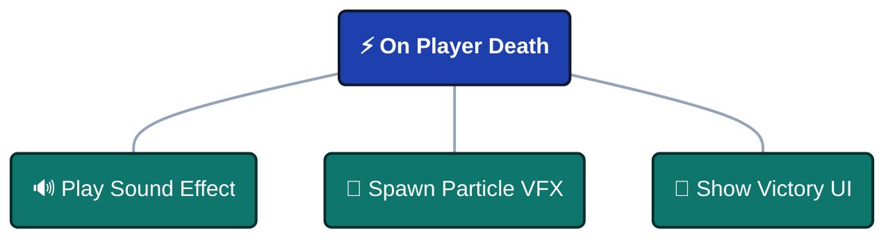
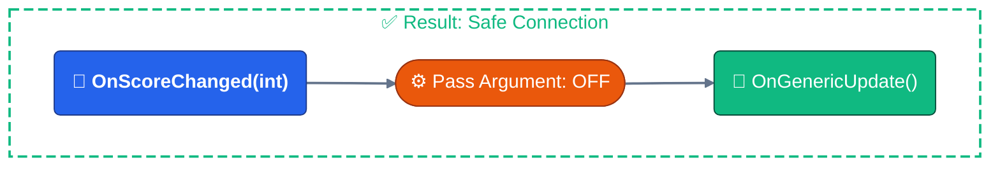

---
sidebar_label: 'Connection Types & Ports'
sidebar_position: 2
---


# Connection Types & Ports

Before building flows, you must understand the **visual language** of the graph. Every color, shape, and line style communicates data flow and execution behavior.

:::tip Quick Reference
The legend shown here is also available in the **Flow Editor** (right-side panel). mouse hover anywhere in the legend to see detailed tooltips.
:::

---

## 🧬 Node Types

A node's **header color** indicates its execution pattern.


### Execution Patterns

| Color        | Type             | Behavior                                                     | Use Case                                          |
| ------------ | ---------------- | ------------------------------------------------------------ | ------------------------------------------------- |
| 🔴 **Red**    | **Root Node**    | **Entry Point** - Fires when event is raised externally      | Game start, player input, collision detection     |
| 🟠 **Orange** | **Trigger Node** | **Parallel (Fan-Out)** - Fires and immediately continues (non-blocking) | Sound + VFX + UI updates happening simultaneously |
| 🟢 **Green**  | **Chain Node**   | **Sequential (Blocking)** - Fires and waits before continuing | Cutscenes, delayed actions, async operations      |

---

### Root Node Rules

**One Per Graph**: Each graph has exactly **one** root node.

**Set Root**: Right-click any node to **Set as Root** to change entry point.

**Visual**: Red header gradient makes it instantly recognizable.

---

### Trigger vs Chain

**Trigger Pattern** (Parallel):



:::info Triggers

All executed in parallel together!

:::

**Chain Pattern** (Sequential):


:::info Chains

Each waits for the previous to finish!

:::

---

## 🔌 Port Types (Data Signatures)

**Port colors** indicate the C# event signature and data payload.


### Port Color Meanings

| Color        | Signature          | Description                            | Example Events                                |
| ------------ | ------------------ | -------------------------------------- | --------------------------------------------- |
| 🔵 **Cyan**   | `()`               | **Void** - No data passed              | `OnGameStart`, `OnButtonClick`                |
| 🌸 **Pink**   | `<T>`              | **Single Argument** - One data payload | `OnScoreChanged(int)`, `OnDamage(DamageInfo)` |
| 💜 **Purple** | `<TSender, TArgs>` | **Dual Arguments** - Sender + Payload  | `OnPlayerDamaged(GameObject, DamageInfo)`     |

---

### Port Anatomy

- **Left Port** (Input): Receives data from previous node.
- **Right Port** (Output): Sends data to next node.

## 🔗 Connection Compatibility

The system provides **real-time type safety** when creating connections.


### Compatibility Levels

| Color        | Status            | Meaning                          | Impact                            |
| ------------ | ----------------- | -------------------------------- | --------------------------------- |
| 🟢 **Green**  | **Perfect Match** | Types match exactly              | Zero overhead, no conversion      |
| 🟡 **Yellow** | **Compatible**    | Safe operation with data discard | Arguments ignored, no errors      |
| 🟠 **Orange** | **Warning**       | Type conversion required         | Auto-converts (e.g., int → float) |
| 🔴 **Red**    | **Incompatible**  | Will fail at runtime             | Connection blocked                |

---

### Visual Feedback

**While Dragging**:
- Preview line shows compatibility color
- Invalid targets appear dimmed
- Valid targets highlight

**After Connection**:
- Line color persists
- Warning icon (⚠️) appears for Orange/Red
- Hover for detailed tooltip

---

## 📊 Compatibility Matrix

Connection color is determined by **Source Type**, **Target Type**, and **Pass Argument** setting.

### Full Compatibility Table

| Source Event | Target Event | Pass Argument | Result   | Explanation                                     |
| ------------ | ------------ | ------------- | -------- | ----------------------------------------------- |
| Any          | Any          | **OFF**       | 🟢 Green  | **Override**: Target ignores all input          |
| Void `()`    | Void `()`    | ON            | 🟢 Green  | Perfect match - no data needed                  |
| Void `()`    | `<T>`        | ON            | 🔴 Red    | **Error**: Target needs data, source has none   |
| Void `()`    | `<S,T>`      | ON            | 🔴 Red    | **Error**: Target needs sender, source has none |
| `<T>`        | Void `()`    | ON            | 🟡 Yellow | **Safe**: Argument discarded                    |
| `<T>`        | `<T>`        | ON            | 🟢 Green  | Perfect match - same type                       |
| `<T>`        | `<S,T>`      | ON            | 🔴 Red    | **Error**: Target needs sender, source has none |
| `<S,T>`      | Void `()`    | ON            | 🟡 Yellow | **Safe**: Both sender & arg discarded           |
| `<S,T>`      | `<T>`        | ON            | 🟡 Yellow | **Safe**: Sender discarded, arg passes          |
| `<S,T>`      | `<S,T>`      | ON            | 🟢 Green  | Perfect match - sender + arg                    |
| `<T1>`       | `<T2>`       | ON            | 🟠 Orange | **Warning**: Type conversion (int ↔ float)      |

---

### Special Cases

**Pass Argument = OFF**:

Always results in 🟢 **Green** connection because target ignores all input data.

**Use Case**: Chain a typed event to a void event without type errors.



---

**Numeric Conversions**:

Auto-converts between compatible numeric types (🟠 Orange):
- `int` ↔ `float`
- `float` ↔ `double`
- `int` ↔ `long`

**Warning**: May lose precision (e.g., `float` 3.14 → `int` 3).

---

**Incompatible Types**:

Blocked at connection time (🔴 Red):
- `string` → `int`
- `GameObject` → `float`
- Custom type mismatches

**System prevents creation** of these connections.

---

## 🏷️ Status Badges

Badges appear at the **bottom of nodes** to show active configuration.


### Badge Reference

| Icon | Badge      | Meaning                         | Applies To   |
| ---- | ---------- | ------------------------------- | ------------ |
| 🧩    | **Cond**   | Visual condition tree active    | All nodes    |
| ⏱️    | **2.5s**   | Start delay (seconds)           | All nodes    |
| ⏳    | **3.0s**   | Blocking duration (seconds)     | Chain only   |
| ⚓    | **Wait**   | Wait for async completion       | Chain only   |
| ⬆️    | **+5**     | Execution priority              | Trigger only |
| 🔗    | **Pass**   | Passing arguments to next node  | All nodes    |
| 📌    | **Static** | Arguments blocked (static call) | All nodes    |

---

### Badge Examples

**Chain Node with Delay + Duration**:
```
⏱️ 1.0s   ← Wait 1 second before starting
⏳ 3.0s   ← Then block for 3 seconds
```

**Trigger Node with Condition + Priority**:
```
🧩 Cond   ← Only fires if condition passes
⬆️ +10    ← Executes before other triggers
```

**Any Node with Argument Passing**:
```
🔗 Pass   ← Forwards event data to next node
```

---

## 🎨 Visual Examples

### Example 1: Perfect Match Chain


**Colors**:

- Line 1: 🟢 Green (perfect match)
- Line 2: 🟡 Yellow (sender discarded safely)

---

### Example 2: Type Conversion Warning


**Color**: 🟠 Orange (int → float conversion)

**Risk**: Precision change, but works

---

### Example 3: Pass Argument


**Colors**: 🟢 Green (void → int)

**No-Blocking:** ignore argument to match

------

### Example 4: Parallel Trigger Fan-Out


**All connections:** Green (void → void), executing immediately in parallel

---

## 💡 Best Practices

### Use Pass Argument Wisely

**When to Pass (ON)**:
- Next node needs the event data
- Building data pipelines
- Forwarding damage info, scores, etc.

**When to Block (OFF)**:
- Connecting incompatible types
- Generic notifications (no data needed)
- Simplifying complex type chains

---

### Color-Code Your Flows

**Green-Heavy Graphs**: Well-typed.

**Yellow Connections**: Acceptable when intentionally discarding data.

**Orange Lines**: Review for correctness—ensure conversions are intentional.

**Red Blocks**: Fix immediately—will fail at runtime.

---

### Organize by Type

**Group similar signature nodes** together:
- Void events in one area
- Data events in another
- Async chains separate from triggers

**Why**: Makes type compatibility easier to visualize.

---

## ❓ Common Questions

### Why is my connection red?

**Cause**: Type mismatch that cannot be resolved.

**Fix**: 
1. Check if target needs sender but source doesn't provide it
2. Disable "Pass Argument" on target node
3. Insert intermediate conversion node

---

### Can I connect different numeric types?

**Yes**: The system auto-converts `int`, `float`, `double`, `long`.

**Result**: 🟠 Orange connection with conversion warning.

**Caution**: Watch for precision loss (float → int).

---

### What does yellow mean?

**Meaning**: Safe connection with **data discard**.

**Example**: Sending `<int>` to `<void>` discards the integer.

**Safe?**: Yes—no runtime errors, just unused data.

:::tip Quick Legend Access

While working in the Flow Graph Editor, the **Legend Panel** (right side) shows all node types, port colors, and connection meanings. Hover over any legend item for detailed tooltips.

:::

:::warning Runtime Errors

🔴 **Red connections** are blocked during creation to prevent runtime crashes. If you need to connect incompatible types, disable "Pass Argument" on the target node—this forces a 🟢 Green connection by ignoring input data.

:::
