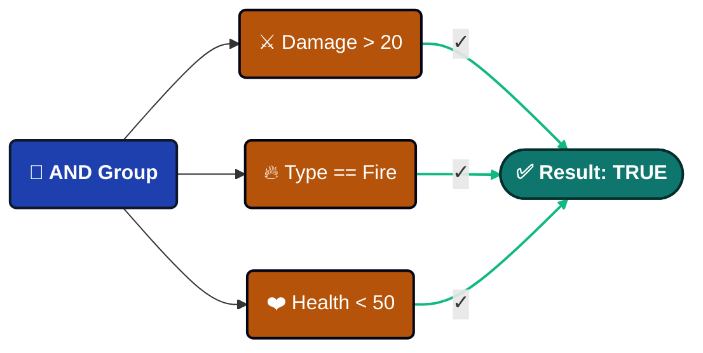
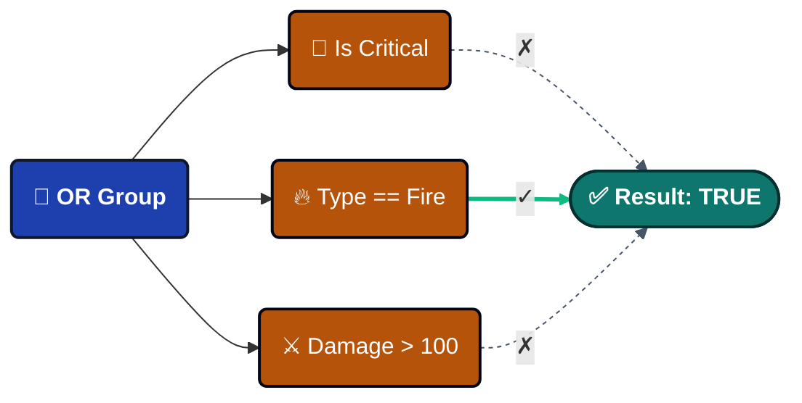
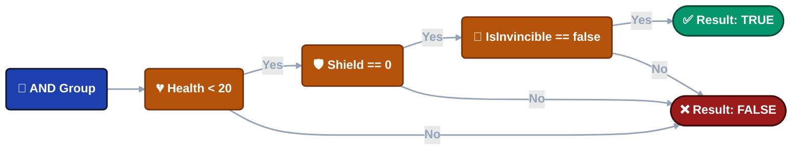
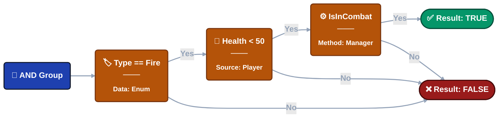

---
sidebar_label: 'Visual Condition Tree'
sidebar_position: 8
---

import Tabs from '@theme/Tabs';
import TabItem from '@theme/TabItem';

# Visual Condition Tree

Build complex boolean logic **visually** to control whether event actions should execute. Create sophisticated runtime checks through an intuitive interface—no coding required.


---

## 🎯 Overview

The Visual Condition Tree is a **logic gate system** that evaluates runtime conditions before executing event actions.

### The Problem It Solves

**Traditional Approach** (scattered logic):

```csharp
// Logic buried in scripts, hard to modify
if (damageInfo.amount > 20 && 
    (damageInfo.isCritical || damageInfo.type == DamageType.Fire) &&
    playerController.Health < 50 &&
    gameManager.IsInCombat()) {
    // Execute actions
}
```

**Visual Approach**:


------

### Build an example

**Event**: `OnPlayerDamaged`

**Event Types**:

- `GameObjectDamageInfoGameEvent` (GameObject sender)
- `PlayerStatsDamageInfoGameEvent` (Custom sender)

**Data Structures**:

```csharp
// Damage type enumeration
public enum DamageType {
    Physical,
    Fire,
    Void
}

// Damage information payload
public class DamageInfo {
    public float amount;           // Damage value
    public bool isCritical;        // Critical hit flag
    public DamageType type;        // Damage type
    public Vector3 hitPoint;       // Impact location
    public string attacker;        // Attacker name
}

// Custom sender type (alternative to GameObject)
public class PlayerStats {
    public string playerName;
    public int level;
    public int factionId;
}
```

**Goal**: Trigger warning effects when player takes significant damage under specific conditions.

---

### Key Benefits

| Feature                | Benefit                                            |
| ---------------------- | -------------------------------------------------- |
| 🎨 **Visual Building**  | Designers create logic without code                |
| 🚀 **High Performance** | Compiles to Expression Trees (zero reflection)     |
| 🔄 **Reusable**         | Same condition applies to all event actions        |
| 🧪 **Live Testing**     | Tweak values in Inspector, see results immediately |
| 🔒 **Type-Safe**        | Auto-validates type compatibility                  |

---

## 🏗️ Tree Structure

The condition tree is built from **two node types**:


### 🌳 Group Nodes

Combine multiple conditions using AND/OR logic.

**Logic Types**:

<Tabs>
<TabItem value="and" label="AND Logic" default>

All child conditions must evaluate to TRUE.



**Visual**: 🟢 Green border

**Use**: "Must satisfy ALL requirements"

</TabItem>

<TabItem value="or" label="OR Logic">

Any child condition can evaluate to TRUE.



**Visual**: 🟠 Orange border

**Use**: "Satisfy ANY requirement"

</TabItem>
</Tabs>

**Toggle Logic**: Click the logic button (AND/OR) to switch.

**Nesting**: Groups can contain other groups—build complex logic with unlimited depth.

```mermaid
graph LR

    classDef root fill:#1e40af,stroke:#0f172a,stroke-width:2px,color:#ffffff,font-weight:bold
    classDef cond fill:#b45309,stroke:#78350f,stroke-width:2px,color:#ffffff
    classDef nested fill:#334155,stroke:#020617,stroke-width:2px,color:#ffffff
    classDef success fill:#0f766e,stroke:#042f2e,stroke-width:2px,color:#ffffff,font-weight:bold

    ROOT(📂 Root: AND Group):::root

    ROOT --> A(📜 Condition A):::cond
    ROOT --> OR(📂 Nested: OR Group):::nested
    ROOT --> D(📜 Condition D):::cond

    OR --> B(📜 Condition B):::cond
    OR --> C(📜 Condition C):::cond

    A --> RES([✅ Logic Result]):::success
    B --> OR_OUT(( ))
    C --> OR_OUT
    OR_OUT --> RES
    D --> RES

    style OR_OUT fill:#334155,stroke:none
    linkStyle 4,5 stroke:#94a3b8,stroke-width:1px
```



**Add Nodes**: Use **+ Condition** or **+ Group** buttons on each group.

---

### ⚖️ Comparison Nodes

**Comparison Nodes** are the fundamental building blocks of your event logic. Each node performs a single **boolean check** (True/False) to determine if the event actions should proceed.

#### 🏗️ Anatomy of a Comparison

Every node follows a standard tripartite structure, making complex logic easy to read at a glance.

> **[ 🟦 Source(Left Operand) ]**  **[ Operator ]**  **[ 🟧 Target (Right Operand) ]** 

**Practical Example:**
Imagine an event that only triggers if a hit is powerful enough:
Argument.amount  **>**  20.0

- **🔍 Source:** Argument.amount — The raw damage value passed by the `SingleGameEvent`
- **📐 Operator:** > — The logical rule (Greater Than)
- **🎯 Target:** 20.0 — The constant threshold or another variable to compare against

------

#### 👓 View Modes

The editor UI adapts to your needs, balancing **readability** with **precision control**.

| View Mode       | Visual Style                            | Best For...                                |
| --------------- | --------------------------------------- | ------------------------------------------ |
| 📖 **Collapsed** | **Summary Text** (e.g., Health < 50)    | Quick overview of complex logic chains.    |
| 🛠️ **Expanded**  | **Detailed Editor** (Dropdowns, Fields) | Modifying specific parameters and sources. |

:::tip **Interaction Hint**
Simply **Click** on any comparison block to toggle between these two views. This allows you to keep your workspace clean while retaining the ability to deep-dive into settings.
:::

---

## **📝** Structure Configuration

<details>
<summary>📌 Source</summary>

<Tabs>
<TabItem value="event-arg" label="Event Argument" default>

### 🧬 Event Argument (Data Payload)

The **Argument** system allows you to drill down into the event's data payload to extract specific values for conditions and actions.

:::info **Availability**
Data access is exclusive to typed events: `GameEvent<T>` or `GameEvent<TSender, TArgs>`.
:::

#### 🔢 Single Parameter Events

**Signature:** `DamageInfoGameEvent`

When an event carries a single object, you can access the object itself or any of its public members.

**Data Structure Example:**

```
📦 (this Argument)      ➔ Full DamageInfo object
├── 🔢 amount           ➔ float
├── ✅ isCritical       ➔ bool
├── 🏷️ type             ➔ DamageType (Enum)
├── 📍 hitPoint         ➔ Vector3
└── 👤 attacker         ➔ string
```

------

#### 👥 Sender Events (Context-Aware)

Sender events provide two distinct roots for data access: **Sender** (Who) and **Argument** (What).

##### 🎮 Case A: GameObject Sender

**Signature:** `GameObjectDamageInfoGameEvent`

| Root         | Path Example              | Data Type |
| ------------ | ------------------------- | --------- |
| **Sender**   | Sender.Transform.position | Vector3   |
| **Argument** | Argument.amount           | float     |

**Visual Hierarchy:**

```
👥 Sender
   ├── 🆔 tag           ➔ string
   ├── 🟢 activeSelf    ➔ bool
   └── 📐 Transform
       ├── 📍 position  ➔ Vector3
       └── 📂 childCount➔ int
🔢 Argument
   ├── 🔢 amount        ➔ float
   └── ✅ isCritical    ➔ bool
```

##### 🛡️ Case B: Custom C# Sender (Advanced)

**Signature:** `PlayerStatsDamageInfoGameEvent`

> 🚀 **Why it's special:** Unlike traditional systems, you are not tied to GameObjects. Use any **Pure C# Class** as a sender for decoupled, logic-first architecture.

- 💎 **Pure Logic** — Works with non-MonoBehaviour classes.
- 🌐 **Network Ready** — Ideal for PlayerData or NetworkAgent sync.
- 🤖 **AI Agents** — Track internal state without scene dependencies.

------

#### 🧭 Deep Property Access

**Precision Navigation.** Navigate nested structures up to **5 levels deep** with high-performance reflection.

**Example: Directional Check**

- **Path:** Argument.hitPoint.normalized.x
- **Condition:** > 0.5
- **Result:** 🎯 "Hit came from the right side."

**Breadcrumb Logic:**
Argument (DamageInfo) ➔ hitPoint (Vector3) ➔ normalized (Vector3) ➔ x (float)

------

#### 📋 Supported Types

The system automatically support below types:

| Category       | Supported Types                                   |
| -------------- | ------------------------------------------------- |
| **Primitives** | int, float, double, long, bool, string            |
| **Math**       | Vector2, Vector3, Quaternion, Color               |
| **Unity**      | GameObject, Transform, Component references       |
| **Logic**      | Enums (with dropdowns), [Serializable] C# Classes |

:::tip **Pro Tip: Custom Classes**
Any public **Field** or **Property** in a [Serializable] class is automatically exposed in the deep-link picker.
:::

</TabItem>

<TabItem value="scene-type" label="Scene Type">

### **🎬** Scene Type

Access runtime data from GameObjects or Components in the scene.

---

#### How to Use

**Step 1**: Drag GameObject or Component from Hierarchy into the object field.

**Step 2**: Click "Select Property..." to browse available members.

---

#### GameObject Example

Drag `PlayerController` GameObject:

```
📦 GameObject (Instance)
├─ 📦 (this GameObject)    ➔ The reference itself
├─ ✅ activeSelf           ➔ bool
├─ 🔤 tag                  ➔ string
└─ 🔢 layer                ➔ int

📐 Transform (Component)
├─ 📍 position             ➔ Vector3
├─ 📏 localScale           ➔ Vector3
└─ 📂 childCount           ➔ int

🧩 PlayerController (Script)
├─ 🔢 Health               ➔ float
├─ 🛡️ Shield               ➔ float
├─ 🏅 Level                ➔ int
├─ ✅ HasFireResistance    ➔ bool
│
├─ ⚡ IsInDangerZone()      ➔ bool (Method)
└─ ⚡ IsCriticallyWounded() ➔ bool (Method)
```

**Usage**:

```
Player.Health < 50                  → Health check
Player.Level >= 10                  → Level requirement
Player.IsInDangerZone() == true     → Complex check via method
```

---

#### Bool Method Support ✨

**Zero-parameter methods** returning `bool` appear in the dropdown!

**Example**:

```csharp
// In your component
public bool IsInDangerZone() {
    return Health < 20 && Shield == 0 && !IsInvincible;
}
```

**In Condition Tree**:

```
Player.IsInDangerZone() == true
```

This encapsulates complex logic in a single method call instead of building it visually.

---

#### Component Example

Drag `GameManager` Component:

```
🏛️ GameManager (Global System)
├─ 🔄 CurrentState        ➔ GameState (Enum)
├─ 🌊 CurrentWave         ➔ int
├─ 🏅 DifficultyLevel     ➔ int
│
├─ ⚡ IsInCombat()         ➔ bool (Method)
└─ ⚡ IsHardMode()         ➔ bool (Method)
```

**Usage**:

```
GameManager.CurrentState == Playing
GameManager.IsInCombat() == true
GameManager.DifficultyLevel >= 3
```

---

#### Important Limitation

⚠️ **Scene Type requires objects to exist at scene load time.**

```
✅ Works: Objects in scene hierarchy (exist at initialization)
❌ Fails: Runtime-instantiated objects (don't exist yet)

Solution: Use Event Argument for runtime objects
```

</TabItem>

<TabItem value="random" label="Random Type">

### **🎲** Random Type

**Purpose**: Generate random values at execution time.

---

#### Two Modes

**Mode 1: Range**

Generate random number within bounds.


**Configuration**:

- **Min**: Lower bound
- **Max**: Upper bound  
- **Integer**: Check for whole numbers, uncheck for decimals

---

**Mode 2: List**

Pick random item from predefined values.


**Configuration**:

- **Data Type**: Choose type (int, float, string, bool, etc.)
- **List Items**: Add/remove values with +/- buttons

---

#### Use Cases

**Critical Hit Chance**:

```
Random(0~100) > 90  → 10% chance
```

**Damage Variance**:

```
Random(0~10) → Add random bonus damage
```

**Dynamic Events**:

```
Random List[Easy, Normal, Hard] → Randomize difficulty
```

</TabItem>
</Tabs>

</details>

<details>
<summary>📌 Operator</summary>


### **📐** Available Operators

**Numeric (6)**

For numbers (int, float, double, long):

| Operator         | Symbol | Example         |
| ---------------- | ------ | --------------- |
| Equals           | `==`   | `Health == 100` |
| Not Equals       | `!=`   | `Health != 0`   |
| Greater          | `>`    | `Damage > 20`   |
| Less             | `<`    | `Health < 50`   |
| Greater Or Equal | `>=`   | `Level >= 10`   |
| Less Or Equal    | `<=`   | `Shield <= 0`   |

**Auto-Conversion**: Compatible numeric types convert automatically (int ↔ float).

---

**String (4)**

For text values:

| Operator    | Symbol         | Example                      |
| ----------- | -------------- | ---------------------------- |
| Equals      | `==`           | `Name == "Hero"`             |
| Not Equals  | `!=`           | `Tag != "Enemy"`             |
| Starts With | `Starts With`  | `Name Starts With "Player_"` |
| Ends With   | `Ends With`    | `File Ends With ".png"`      |
| Contains    | `Contains (⊃)` | `Message Contains "error"`   |

⚠️ **Case-sensitive**: "Hero" ≠ "hero"

---

**Enum Support**

Full enumeration support with dropdown selection!

**Example**:

```csharp
public enum DamageType { Physical, Fire, Void }
```

**In Condition Tree**:

```
Source: Argument.type (DamageType)
Operator: ==
Target: DamageType.Fire (dropdown shows Physical/Fire/Void)
```

**With Lists**:

```
Argument.type In List [Fire, Void]
Result: TRUE if type is DamageType.Fire OR DamageType.Void
```

**Supported Operators**: `==`, `!=`, `In List (∈)`

---

**Collection (1)**

Check list/array membership:

| Operator | Symbol | Purpose                       |
| -------- | ------ | ----------------------------- |
| In List  | `∈`    | Check if value exists in list |

**Structure**:

```
Source: Single value
Operator: In List (∈)
Target: List/Array (matching type)
```

**Examples**:

```
Argument.attacker In List ["Dragon", "Demon", "Lich"]
Player.Level In List [10, 20, 30, 40, 50]
Argument.type In List [Fire, Void]
```

</details>

<details>
<summary>📌 Target</summary>
<Tabs>
<TabItem value="event-arg" label="Event Argument" default>

### 🧬 Event Argument (Data Payload)

:::tip Same as Source

Like Source, please refer to the relevant configuration introduction in Source for specific details

:::

</TabItem>

<TabItem value="scene-type" label="Scene Type">

### **🎬** Scene Type

:::tip Same as Source

Like Source, please refer to the relevant configuration introduction in Source for specific details

:::

</TabItem>

<TabItem value="random" label="Random Type">

### **🎲** Random Type

:::tip Same as Source

Like Source, please refer to the relevant configuration introduction in Source for specific details

:::

</TabItem>

<TabItem value="constant" label="Constant">

### **📌** Constant

Fixed comparison value.

**Note**: Only available as **Target** (right side), not Source.

---

#### Two Modes

**Mode 1: Single Value**

Enter one fixed value.


**Data Types**: Int, Float, Double, String, Bool

---

**Mode 2: List**

Define multiple acceptable values (for "In List" operator).


**Configuration**:

- **Data Type**: Type for all list items
- **+ / -**: Add/remove items

---

#### Use Cases

**Thresholds**:

```
Health < 50.0
```

**Exact Matches**:

```
Name == "Hero"
```

**Multiple Values**:

```
Type In List [Fire, Void, Lightning]
```

:::tip **Key difference**

Additional support type: Constant Type**（only available for Target）**

:::

:::tip **Context-Aware**

Some operators restrict target type:

- Numeric operators (`>`, `<`, etc.) require single values

- "In List" operator requires list types

:::

</TabItem>
</Tabs>

</details>

------

## 🎨 Type Validation

The system automatically validates type compatibility.

**Valid Comparisons**:

```
✅ int == int
✅ float > int (auto-converts)
✅ string Contains string
✅ DamageType == Fire (enum)
✅ int In List<int>
```

**Invalid Comparisons**:

```
❌ string > int (incompatible types)
❌ bool Contains string (meaningless)
❌ float In List<string> (type mismatch)
```

**Visual Feedback**: Red outline + warning text on incompatible types.

---

## 🧩 Bool Methods vs Visual Tree

Two approaches to building conditions—when to use each?

### Approach 1: Bool Methods

**Best for**: Complex multi-step logic.

**Example**:

```csharp
public bool IsInDangerZone() {
    bool lowHealth = Health < 20;
    bool noShield = Shield == 0;
    bool hasEnemies = Physics.OverlapSphere(
        transform.position, 10f, enemyLayer
    ).Length > 0;
    
    return lowHealth && noShield && hasEnemies;
}
```

**In Tree**: `Player.IsInDangerZone() == true`

**Pros**:

- Encapsulates complexity
- Can use Physics, raycasts
- Unit testable
- Code reusable

**Cons**:

- Requires C# coding
- Designers can't modify

---

### Approach 2: Visual Tree

**Best for**: Simple checks designers should control.

**Example**:



**Pros**:

- No coding needed
- Designer-friendly
- Visual representation
- Quick iteration

**Cons**:

- Can't use Physics/algorithms
- Large trees get complex

---

### Hybrid Approach (Recommended)

Combine both for optimal results:



**Guideline**:

- Visual Tree: Thresholds, enums, simple properties
- Bool Methods: Physics queries, complex algorithms, cross-system checks

---

## 🔄 Drag & Reorder

**Change execution order**: Drag the handle (☰) on the left edge of any condition.

**Why Order Matters**:

**AND Groups**: Order doesn't affect result (all must pass).

**OR Groups**: Order affects **short-circuit evaluation** (stops at first TRUE).

**Optimization Example**:

```
❌ Slow:
OR Group
├─ ExpensivePhysicsCheck()  ← Runs first (slow!)
└─ SimpleBoolCheck          ← May never run

✅ Fast:
OR Group
├─ SimpleBoolCheck          ← Runs first (fast!)
└─ ExpensivePhysicsCheck()  ← Only if needed
```

Put cheap checks first in OR groups for better performance.

---

## 🚀 Performance

### Compilation Process

**One-time cost** (scene load):

```
Visual Tree → Expression Tree → IL Code → Compiled Lambda
```

**Runtime execution**:

```
Event Fires → Call Compiled Lambda → Return TRUE/FALSE
```

**Benchmark**: Complex nested conditions execute in ~0.001ms (1 microsecond).

---

### Why It's Fast

**Zero Reflection**: Direct compiled access like hand-written C#.

**Expression Trees**: System generates optimized IL code at initialization.

```
❌ Traditional: GetComponent() + GetField() + Invoke() per check
✅ This System: Direct property access via compiled lambda
```

**Result**: Negligible overhead even with hundreds of events firing per frame.

---

## 🧹 Tree Management

- **Enable/Disable**: Toggle checkbox to bypass all conditions (always TRUE).
- **Reset Tree**: Click "Reset Tree" button to clear all nodes and start fresh.

- **Collapse/Expand**: Click comparison blocks to toggle between summary and detail views.

---

## ❓ Troubleshooting

### Conditions Always Return False

**Checklist**:

- ✅ Is "Enable Conditions" toggle checked?
- ✅ Are there red type mismatch warnings?
- ✅ Are Scene Type references still valid (not destroyed)?
- ✅ Do bool methods return expected values? (add Debug.Log)

---

### Property Not in Dropdown

**For Event Arguments**:

- Must be public field or property
- Must be supported type

**For Scene Types**:

- GameObject must exist in scene at Editor time
- Component must be enabled
- Property must be public
- Methods must: return bool, zero parameters, public, instance (not static)

**For Runtime Objects**: Use Event Argument instead of Scene Type.

---

### Changes Not Saving

**Common Causes**:

- Multiple Behavior Windows open (close duplicates)
- Script compilation during editing (wait for completion)
- Unity didn't apply SerializedProperty changes (wait before closing)

---

## 📖 Where It's Used

The Visual Condition Tree system appears in **two contexts**:

**1. Event Behaviors** → [Game Event Behavior](./game-event-behavior.md)

Controls whether event actions execute:

```
Event Fires → Check Conditions → Execute/Skip Actions
```

**2. Flow Nodes** → Flow Node Configuration *(future documentation)*

Controls whether flow nodes execute:

```
Flow Reaches Node → Check Conditions → Execute/Skip Node
```

Both use the **exact same** condition tree system.

---

:::tip Best Practices

**Simple Checks**: Use Visual Tree for thresholds, enums, basic comparisons

**Complex Logic**: Use Bool Methods for Physics, algorithms, multi-step checks

**Optimal Approach**: Combine both—visual for simple, methods for complex

**Performance**: Put cheap checks first in OR groups for short-circuit optimization

:::
