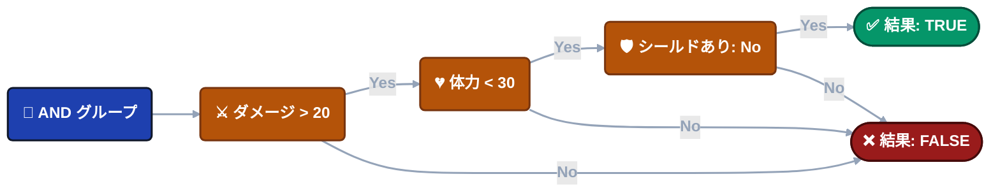
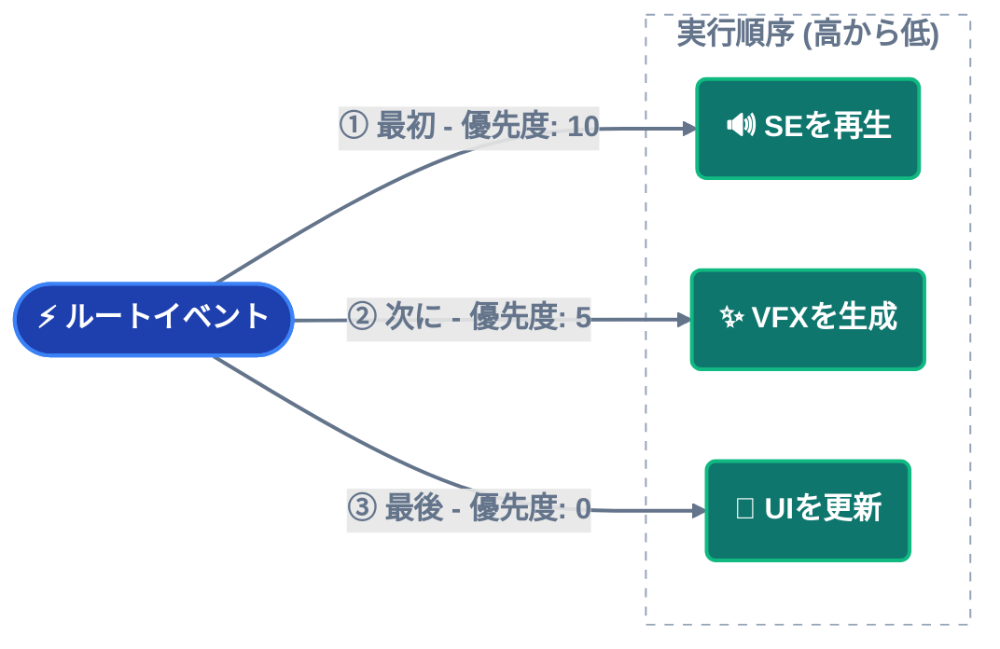
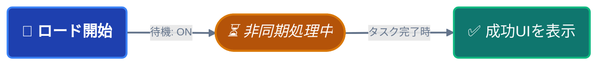
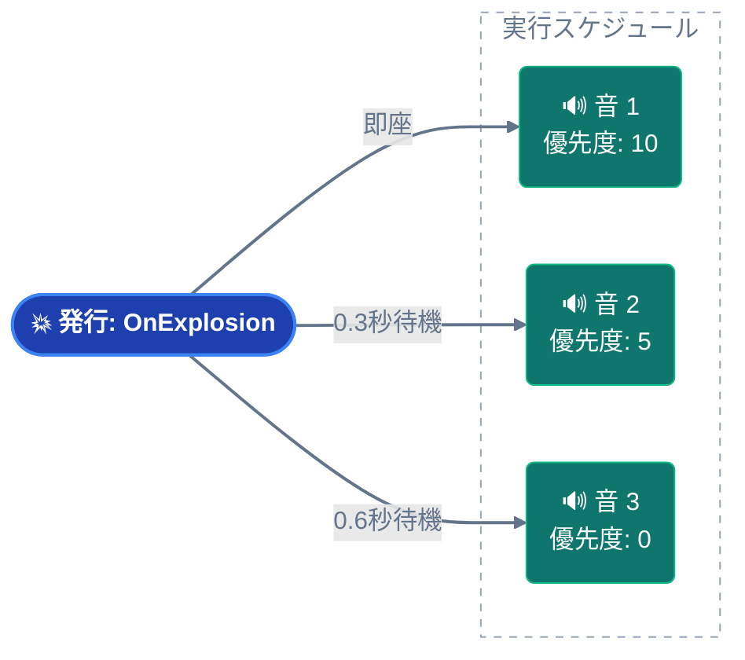

---
sidebar_label: 'ノード動作の設定'
sidebar_position: 3
---

import Tabs from '@theme/Tabs';

import TabItem from '@theme/TabItem';


# ゲームイベントノードの振る舞い (Game Event Node Behavior)

グラフが接続（繋がり）を示すのに対し、**ノード動作設定ウィンドウ**は、個々のノードの詳細な実行ロジックを制御します。

**アクセス方法**: フローグラフ内の任意のノードをダブルクリックすると、そのノードの動作設定ウィンドウが開きます。


---

## 🎯 ウィンドウの概要

設定ウィンドウは主に3つのセクションに分かれています：

| セクション                | 目的                                     | 適用対象                |
| ---------------------- | ------------------------------------------- | ------------------------- |
| **ノード情報 (Node Information)**   | イベントの詳細と型の確認                     | すべてのノード                 |
| **ノード条件 (Node Condition)**     | 実行を制御するビジュアルロジックゲート         | すべてのノード                 |
| **ノード設定 (Node Configuration)** | タイミング、優先度、データ受け渡しの設定       | すべてのノード（型により異なる） |

## 📋 ノード情報

選択されたノードに関する読み取り専用の詳細を表示します。


**イベント名 (Event Name)**: このノードが発行するゲームイベント。

**ノードタイプ (Node Type)**: トリガー（並列）またはチェーン（直列）。

**イベント GUID**: 内部追跡用のユニークな識別子。

**ユースケース**: 変更を加える前に、正しいノードを編集しているか確認するために使用します。

------

## 🧩 ノード条件 (フローゲート)

各ノードは独自の**ビジュアル条件ツリー**を持っており、それによって実行するかどうかを制御できます。


### 仕組み

**条件が FALSE と判定された場合**:

- ノードは発行されません。
- このブランチ以降のフローは停止します。
- 接続されている子ノードはスキップされます。

**条件が TRUE と判定された場合**:

- ノードは通常通り発行されます。
- 子ノードへフローが継続します。

---

### 条件のコンテキスト

以下のデータにアクセスできます：

**イベント引数** (`Arg`): 入力イベントからのデータ。
```
例: Arg.amount > 50
```

**送信元** (`Sender`): ソースオブジェクト（Sender付きイベントの場合）。
```
例: Sender.tag == "Enemy"
```

**シーンオブジェクト**: シーン内の任意の GameObject/Component。
```
例: Player.Health < 20
```

---

### ビジュアルビルダー

条件システムは、**イベントビヘイビア**と同じ**ビジュアル条件ツリー**を使用します。

**詳細なドキュメント**: 以下については **[ビジュアル条件ツリー](../visual-workflow/visual-condition-tree.md)** ガイドを参照してください。

- ロジックゲート（AND/OR グループ）の構築
- ソースタイプ（イベント引数、シーンタイプ、ランダム、定数）
- 比較演算子
- 型の検証
- ベストプラクティス

:::tip ロジックの再利用
このビジュアル条件システムは、以下の場所で共通して使用されています。

- **イベントビヘイビア**（イベントインスペクター内）
- **フローノード**（このウィンドウ）

一度覚えれば、どこでも活用できます！
:::

---

### 具体的な例

**シナリオ**: 体力がピンチの時だけ「Low Health Warning（体力低下警告）」を再生する。

**条件ツリー**:



**結果**: **3つの条件すべて**を満たした場合にのみ、音が再生されます。

---

## ⚙️ ノード設定

**タイミング**、**優先度**、および**データフロー**を制御する設定です。

### 一般設定（全ノード共通）


<details>
<summary>開始遅延 (Start Delay)</summary>

**単位**: 秒 (float)

**効果**: ノードは、イベントを発行する**前**に、指定された時間だけ待機します。

**ユースケース**:
- 爆発を時間差で発生させる（0.2秒間隔など）
- イベントに対する遅延反応
- タイミングを合わせたシーケンス

**例**:
```
🔘 発行: OnButtonPressed
│
├─► ⏱️ 0.5s ──┐
│             ▼
│            🎵 クリック音を再生        ✅ 実行
│
├─► ⏱️ 1.0s ────────┐
│                   ▼
│                  💬 確認画面を表示      ✅ 実行
│
└─► ⏱️ 2.0s ──────────────────┐
                              ▼
                             🚪 メニューを閉じる    ✅ 完了
```

**ビジュアル表示**: ノードの下部に ⏱️ **0.5s** というバッジが表示されます。

</details>

<details>
<summary>引数を渡す (Pass Argument)</summary>

**タイプ**: トグルスイッチ

**効果**: イベントデータがこのノードに流れるかどうかを制御します。

---

### ✅ チェックあり (Pass Argument: ON)

ノードは前のイベントからデータを受け取ります（型に互換性がある場合）。

**いつ使用するか**:
- ダメージ情報を転送する場合
- スコアや値を引き継ぐ場合
- データパイプライン

**例**:


**接続の色**: 型の互換性に依存します（緑/黄色/オレンジ）。

---

### ❌ チェックなし (Pass Argument: OFF)

ノードはデフォルト値または null 引数を使用して、**静的呼び出し（Static Call）**として発行されます。

**いつ使用するか**:
- 互換性のない型同士を接続する場合
- 一般的な通知（データ不要）
- 型安全な接続を強制する場合

**例**:
```
🚀 イベント: OnDamageReceived(DamageInfo)
│   (ペイロード: { amount: 20.0, ... })
│
🛡️ フィルター: [ 引数を渡す: OFF ]
│   (ロジック: トリガーのみ / データは破棄)
│
└─► 🔊 コールバック: PlayGenericSound()
│
🎯 結果: DamageInfo データを必要とせずに、確実に音が再生されます。
```

**接続の色**: 常に 🟢 **緑**（強制的に安全）になります。

---

### 接続への影響

**Pass Argument** の設定は、接続線の色に直接影響します：

| 引数を渡す | ソースの型 | ターゲットの型 | 結果                    |
| ------- | ----------- | ----------- | ------------------------- |
| **OFF** | 任意         | 任意         | 🟢 緑（常に安全）           |
| **ON**  | `<int>`     | `<int>`     | 🟢 緑（完全一致）           |
| **ON**  | `<int>`     | `<void>`    | 🟡 黄色（データ破棄）       |
| **ON**  | `<int>`     | `<float>`   | 🟠 オレンジ（変換）         |
| **ON**  | `<int>`     | `<string>`  | 🔴 赤（ブロック）           |

**推奨**: 互換性のない型を接続して線が赤くなった場合は、**OFF** に設定して回避してください。

</details>

---

### 型固有の設定

ノードのタイプ（トリガーかチェーンか）によって、設定オプションが変わります。

<details>
<summary>トリガーノード (Trigger Node)</summary>

## トリガーノード (🟠 オレンジ)

**実行方式**: 並列（ファンアウト） - 発行後、即座に次へ進みます。


---

### 優先度 (Priority)

**タイプ**: 整数（デフォルト: 0）

**ルール**: **数値が大きいほど、先に実行されます**。

**ユースケース**: 複数のトリガーが同じ親ノードに接続されている場合、その実行順序を制御します。

---

### 優先度の仕組み

**シナリオ**: 1つのルートノードに3つのトリガーが接続されている場合。



**実行順**: 10 → 5 → 0 (高い順)

---

### 優先度の値

| 値        | 意味          | ユースケース                                 |
| ------------ | ---------------- | ---------------------------------------- |
| **プラス** | 高い優先度  | 重要なアクション（音、入力のブロック） |
| **0**        | デフォルト | 通常のアクション                           |
| **マイナス** | 低い優先度   | クリーンアップ、ログ出力、分析用データ送信              |

**具体的なユースケース**:
- **+100**: プレイヤーの入力をブロック
- **+50**: 重要なSEを再生
- **0**: 標準的なVFX
- **-50**: 分析ログの送信
- **-100**: 一時オブジェクトのクリーンアップ

---

### ビジュアル表示

ノードの下部に ⬆️ **+10** というバッジが表示されます。

</details>

<details>
<summary>チェーンノード (Chain Node)</summary>

## チェーンノード (🟢 緑)

**実行方式**: 直列（ブロッキング） - 発行後、完了を待ってから次へ進みます。


---

### 期間 (Duration)

**タイプ**: 秒 (float)

**効果**: イベント発行**後**、指定された時間だけグラフをこのノードで**一時停止（ポーズ）**させます。

**ユースケース**: アニメーションの待機、タイミングを合わせたシーケンス、クールダウン。

---

### 期間の例

**アニメーション待機**:
```
🖼️ T+0.0s | 開始
⚔️ PlayAttackAnimation()
│
┆  (Δ 1.5s 遅延: アニメーションの長さ)
▼
🖼️ T+1.5s | 実行
💥 DealDamage()
│
📊 結果: 合計期間 1.5s | ✅ チェーン完了
```

**タイミングを合わせたシーケンス**:
```
🖼️ T+0.0s | アクティブ化
⚠️ ShowWarning()
│
┆  (Δ 3.0s 表示期間)
▼
🖼️ T+3.0s | クリーンアップ
🙈 HideWarning()
│
📊 ライフサイクル: 3.0s 有効 | ✅ 自動クリーンアップ完了
```

**ビジュアル表示**: ノードの下部に ⏳ **3.0s** というバッジが表示されます。

---

### 完了を待機 (Wait for Completion)

**タイプ**: トグルスイッチ

**効果**: **非同期操作**が完了するのを待ってから、グラフを次へ進めます。

**要件**: イベントリスナーが `Task` または `IEnumerator` を返す必要があります。

---

### 非同期サポート

**コルーチン** (`IEnumerator`):
```csharp
public IEnumerator OnLoadLevel()
{
    yield return SceneManager.LoadSceneAsync("Level2");
    Debug.Log("ロード完了");
}
```

**Async/Await** (`Task`):
```csharp
public async Task OnDownloadData()
{
    await DownloadFromServer();
    Debug.Log("ダウンロード完了");
}
```

**フローの挙動**:

「完了を待機」をオフにすると、`ShowSuccessMessage` は（ロードが終わる前の）即座に発行されます。

---

### 期間 (Duration) ＋ 待機の組み合わせ

**両方の設定は連動します**:

**シナリオ A: タスク < 期間 (最小時間の保証)**
*例: カットシーンはすぐに終わる(1.5s)が、全体のテンポを保つために2.0sは待機させたい。*
```csharp
🖼️ T+0.0s | 開始
🎬 PlayCutscene() ➔ [タスク開始]
│
├─ ⏱️ 1.5s: [内部的にタスク完了]
│  ⏳ ステータス: 待機継続 (セーフティフロアがアクティブ)
│
└─ 🏁 T+2.0s: ロジック継続
│
📊 結果: 正確に 2.0s の継続時間 (テンポを維持)
```

**シナリオ B: タスク > 期間 (非同期待機)**
*例: ロードの影響でカットシーンに時間がかかる(5.0s)。システムはタスクが終わるまで待ちます。*
```
🖼️ T+0.0s | 開始
🎬 PlayCutscene() ➔ [タスク開始]
│
├─ ⏱️ 2.0s: [設定された期間に到達]
│  ⏳ ステータス: タスクがまだ進行中... (非同期待機がアクティブ)
│
└─ 🏁 T+5.0s: [タスクがついに完了] ➔ ロジック継続
│
📊 結果: 5.0s の継続時間 (完全な完了を保証)
```

**ビジュアル表示**: 
- ⏳ **2.0s** (期間バッジ)
- ⚓ **Wait** (完了待機バッジ)

</details>

---

## 💡 設定例

### 例 1: 遅延を伴うトリガーシーケンス

**目標**: 3つの音をタイミングをずらして再生する。



---

### 例 2: 待機を伴う条件付きチェーン

**目標**: プレイヤーがチュートリアルを終えている場合のみ、レベルをロードする。


**フロー**:
1. レベル完了。
2. 条件チェック（チュートリアル済みなら通過）。
3. 非同期ロードを開始し、完了まで待機。
4. レベル開始UIを表示。

---

## 🔄 ノードタイプのクイック変換

ノードのタイプを変更したくなりましたか？ **削除して作り直す必要はありません！**

**手順**:
1. グラフ上のノードを右クリック。
2. **"Convert to Trigger"** または **"Convert to Chain"** を選択。

**引き継がれる設定**:
- ✅ 割り当てられたイベント
- ✅ 接続関係
- ✅ 開始遅延
- ✅ 引数を渡す設定
- ✅ 条件ツリー

**変更される点**:
- トリガー → チェーン: 優先度が削除され、期間/完了待機が追加されます。
- チェーン → トリガー: 期間/完了待機が削除され、優先度が追加されます。

---

## ❓ トラブルシューティング

### ノードが発行されない

**チェックリスト**:
1. ✅ 条件が有効で、パス（TRUE）していますか？
2. ✅ 親ノードは正しく発行されていますか？
3. ✅ 接続は切れていませんか？
4. ✅ ツールバーでグラフ自体が有効（Active）になっていますか？

**デバッグ**: フローをテストするために、一時的に条件のないノードを追加してみてください。

---

### "Pass Argument" がグレーアウトしている

**原因**: イベントの型が `void` です（渡すべき引数が存在しません）。

**解決策**: これは正常な動作です。Voidイベントには転送するデータがありません。

---

### 期間 (Duration) が機能しない

**よくある原因**:
- ノードタイプがトリガーである（期間はチェーンノードでのみ機能します）。
- 期間が 0 に設定されている。
- 「完了を待機」によるブロッキングが期間よりも長い。

**解決策**: ノードタイプを確認し、期間と待機の両方の設定をチェックしてください。

---

### 非同期処理を待ってくれない

**原因**: 「完了を待機 (Wait for Completion)」にチェックが入っていません。

**解決策**: 「完了を待機」トグルを有効にしてください。

**要件**: リスナーは `Task` または `IEnumerator` を返す必要があります。

---

## 📖 次のステップ

個々のノードの設定ができるようになったら、次は高度なパターンを学びましょう：

**[高度なロジックパターン](./advanced-logic-patterns.md)**  
ベストプラクティスに基づいた複雑なオーケストレーションの構築。

**[ビジュアル条件ツリー](../visual-workflow/visual-condition-tree.md)**  
条件ビルダーのマスター（完全リファレンス）。

---

:::tip 設定ワークフロー

**ベストプラクティス**: 後回しにせず、ノードを構築しながら設定を行いましょう。

1. ノードをグラフに追加。
2. ダブルクリックして設定を開く。
3. まず条件（Condition）を設定する（予期せぬ実行を防止）。
4. タイミング設定を追加。
5. 接続する前に、単体で動作をテストする。

:::

:::info 自動保存

変更は以下の場合に自動的に保存されます：
- ウィンドウを閉じたとき
- 別のノードに切り替えたとき
- ウィンドウの外をクリックしたとき

手動の保存ボタンは不要です！
:::