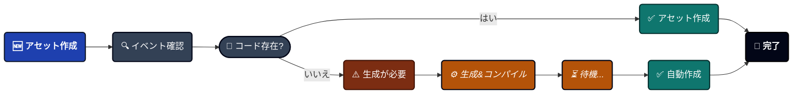
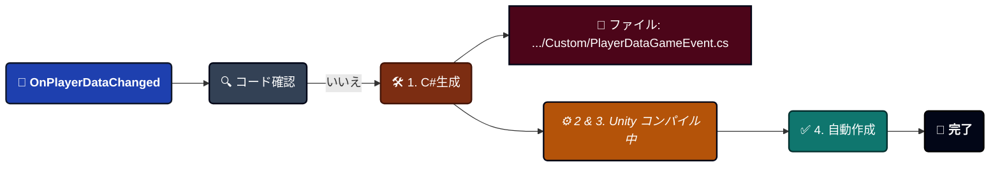

---
sidebar_label: 'ゲームイベント作成'
sidebar_position: 4
---

import Tabs from '@theme/Tabs';

import TabItem from '@theme/TabItem';

import VideoGif from '@site/src/components/Video/VideoGif';


# Game Event Creator

高速イベント作成ウィザード。この特殊なツールは、バッチイベント生成、自動コード コンパイル、ScriptableObject作成を、1つの合理化されたワークフローで処理します。

<VideoGif src="/video/game-event-system/event-create.mp4" />


---

## 🚀 Creatorを開く

Creatorは**[Game Event Editor](./game-event-editor.md)**からのみ開きます:
```
Game Event Editor → 「+ New Event」ボタンをクリック(右上)
```

:::info なぜEditorからのみ?
Creatorは、イベントを追加するデータベースを知る必要があります。Editorから開くことで、適切なコンテキストが保証されます。
:::

---

## 🗺️ インターフェースゾーン

ウィンドウは4つの機能エリアに整理されています:

| ゾーン                      | 位置  | 目的                                                 |
| ------------------------- | --------- | ------------------------------------------------------- |
| **A. イベントモードタブ**    | 上部       | Void、シングルパラメータ、またはSenderイベント間を切り替え |
| **B. 構成エリア** | 中央    | 型を選択してイベントの詳細を構成                |
| **C. イベントキュー**       | 下部    | 作成前に保留中のイベントを確認                   |
| **D. ステータスバッジ**       | 右上 | キューに入っている総数を表示(例: 「7 Queued Total」)       |

---

## 🎭 3つのイベントモード

ニーズに合ったアーキテクチャを選択します:

<Tabs>
<TabItem value="void" label="1. パラメータなし" default>

### パラメータなしイベント

**型**: `GameEvent`(Void)

最もシンプルなシグナル—データなし、通知のみ。


**最適な用途**:
```
🖱️ UIトリガー ➔ OnPauseButtonClick、OnMenuOpen
🌍 グローバル状態 ➔ OnGameStart、OnLevelComplete
🏃 シンプルなアクション ➔ OnJump、OnFire、OnInteract
```

**使用方法**:
1. **「Add Event」**ボタンをクリック
2. イベントがデフォルト名「NewEvent」でキューに表示される
3. キューで名前を変更(例: 「OnGameStart」)
4. 必要に応じてカテゴリを設定(例: 「Core」)
5. 下部の**「Create X Event(s)」**をクリック

**型選択不要**: パラメータなしなので、クリックして追加するだけです。

</TabItem>

<TabItem value="single" label="2. シングルパラメータ">

### シングルパラメータイベント

**型**: `GameEvent<T>`

通知と共に1つのデータを運びます。


**最適な用途**:
```
📈 値の変更 ➔ OnHealthChanged(float)、OnScoreUpdated(int)
🔄 状態更新 ➔ OnGameStateChanged(GameState)
📦 オブジェクトイベント ➔ OnEnemySpawned(GameObject)
💾 データ同期 ➔ OnPlayerDataChanged(PlayerData)
```

**追加する2つの方法**:

#### 方法1: クイック追加 - 基本型

組み込みUnity型(int、float、Vector3、GameObjectなど)の場合:

1. ドロップダウンから**型を選択**(32の基本型すべてを表示)
2. **「Add」**ボタンをクリック
3. イベントが自動的にキューに追加される

**利用可能な基本型**:
- C#プリミティブ: `int`、`float`、`bool`、`string`など
- 数学型: `Vector2`、`Vector3`、`Quaternion`、`Color`など
- コンポーネント: `GameObject`、`Transform`、`Rigidbody`など
- アセット: `Sprite`、`Material`、`AudioClip`など

---

#### 方法2: 検索 - カスタム型

独自のC#クラスの場合:

1. **検索バーに入力**(例: 「PlayerData」)
2. システムがプロジェクト内のすべてのシリアライズ可能な型を検索
3. 型の横にある**「Add」**をクリック
4. イベントがキューに追加される

**検索機能**:
- ✅ ファジーマッチング(「plr」と入力すると「PlayerData」が見つかる)
- ✅ 曖昧さ回避のために名前空間を表示
- ✅ バッジに、この型のキューにあるイベントの数を表示
- ✅ 追加時に緑色のフラッシュ効果

**カスタム型の要件**:
```csharp
// ✅ これは動作します
[System.Serializable]
public class PlayerData {
    public string playerName;
    public int level;
}

// ❌ これは検索に表示されません
public class NonSerializableClass { } // [Serializable]が欠落
```

</TabItem>

<TabItem value="sender" label="3. Sender付き">

### Senderイベント

**型**: `GameEvent<TSender, TArgs>`

**誰が発火したか**(sender)と**何が起こったか**(argument)の両方を運びます。


**最適な用途**:
```
⚔️ 戦闘 ➔ OnDamageTaken(GameObject victim, DamageInfo damage)
🤝 インタラクション ➔ OnItemPickedUp(Player player, ItemID item)
🌐 ネットワーキング ➔ OnPlayerJoined(NetworkPlayer sender, string playerName)
📜 複雑なイベント ➔ OnQuestCompleted(QuestGiver npc, QuestData quest)
```

**推奨パターン**:
- **TSender** = アクター/ソース(`GameObject`、`Player`、`Enemy`)
- **TArgs** = データ/ペイロード(`int`、`DamageInfo`、`Vector3`)

**使用方法**:

1. **Sender型を選択**:
   - 基本型ドロップダウンから選択、または
   - カスタム型を検索
   - 準備ができたら「Select」をクリック

2. **Argument型を選択**:
   - 基本型ドロップダウンから選択、または
   - カスタム型を検索
   - 準備ができたら「Select」をクリック

3. **イベントを追加**:
   - 青いボタンが表示される: 「Add Event: GameObject → int」(例)
   - クリックしてキューに追加

**選択された型の表示**:

型を選択すると、緑色のボックスに表示されます:
```
✅ 選択されたSender: GameObject <small>(UnityEngine)</small>
✅ 選択されたArgument: DamageInfo <small>(YourGame.Combat)</small>
```

**×**をクリックしてクリアし、異なる型を選択します。

</TabItem>
</Tabs>

---

## 📦 バッチ作成ワークフロー

Creatorの強みは**バッチ処理**です—一度に1つずつではなく、多くのイベントを一度に作成します。

### ステップバイステッププロセス

#### 1️⃣ イベントをキューに入れる

異なるモードにわたって複数のイベントを追加:
```
🔘 パラメータなしに切り替え ➔ OnGameStartを追加  
🔘 パラメータなしに切り替え ➔ OnGamePauseを追加  
🔢 シングルパラメータ(int)に切り替え ➔ OnScoreChangedを追加  
🌊 シングルパラメータ(float)に切り替え ➔ OnHealthChangedを追加  
👥 Sender <GameObject,int>に切り替え ➔ OnEnemyDamagedを追加  

キュー内の合計: 5つのイベントが作成待ち
```

**視覚的フィードバック**:
- 右上のバッジが更新される: 「5 Queued Total」
- 各モードが独自のカウントを表示: 「Events Queue (2)」

---

#### 2️⃣ 確認&構成

**Events Queue**セクションで:

**イベントごと**:
- ☑️ **チェックボックス**: 選択を切り替え(選択されたイベントのみが作成されます)
- **名前フィールド**: イベント名を変更(デフォルト: 「NewEvent」、「OnInt」など)
- **カテゴリフィールド**: 後でフィルタリングするためのカテゴリを設定
- **型ラベル**: イベント型シグネチャを表示
- **×ボタン**: キューから削除

**一括アクション**:
- **Select All**: 現在のキュー内のすべてのイベントをチェック
- **Clear Selection**: すべてのイベントのチェックを外す
- **Remove All**: キュー全体をクリア(確認付き)

---

#### 3️⃣ 作成を実行

下部の大きな緑色のボタンをクリック:
```
+ Create 5 Event(s)
```

**次に何が起こるか**: 次のセクションを参照 ⬇️

---

## ⚙️ 作成プロセスの理解

「Create」をクリックすると、洗練された自動化パイプラインが実行されます。舞台裏で何が起こるかを以下に示します:


### シナリオ1: コードがすでに存在 ✅

**例**: `int`イベントを作成。


**速度**: 即座(< 1秒)

**コンパイルなし**: エディターにすぐにイベントが表示されます。

---

### シナリオ2: コード生成が必要 ⚠️

**例**: `PlayerData`イベントを作成(カスタムクラス)。


**速度**: 3-10秒(プロジェクトサイズによる)

**表示されるもの**:
1. Creatorウィンドウが閉じる
2. Unityコンパイルスピナーが表示される
3. コンソールログが表示される
4. イベントが自動的にEditorに表示される

:::info 何が生成されるか?

各カスタム型について、システムは以下を含む**1つのC#ファイル**を作成します:
```csharp
// ファイル: PlayerDataGameEvent.cs

// 1. イベントクラス
public class PlayerDataGameEvent : GameEvent<PlayerData> { }

// 2. バインディングフィールド(インスペクター用)
public partial class GameEventManager {
    public partial class EventBinding {
        public UnityEvent<PlayerData> PlayerDataGameEventAction;
    }
}
```

**なぜ両方?** イベントクラスはイベント発火用。バインディングフィールドはインスペクターコールバック用。
:::

---

### ミックスバッチ処理

**既存の型と新しい型の両方をキューに入れるとどうなるか?**
```
キュー:
1. OnGameStart (void) ✅ コード存在
2. OnScoreChanged (int) ✅ コード存在  
3. OnPlayerDataChanged (PlayerData) ⚠️ 生成が必要
4. OnQuestCompleted (QuestData) ⚠️ 生成が必要
```

**システムの動作**:

```mermaid
graph LR
    %% スタイル定義：ダークシステムに沿って
    classDef instant fill:#0f766e,stroke:#042f2e,stroke-width:2px,color:#ffffff,font-weight:bold
    classDef warning fill:#7c2d12,stroke:#431407,stroke-width:2px,color:#ffffff
    classDef wait fill:#4c0519,stroke:#020617,stroke-width:2px,color:#ffffff,font-style:italic
    classDef system fill:#020617,stroke:#000000,stroke-width:2px,color:#ffffff,font-weight:bold

    %% フローロジック
    A(⚡ ステップ1: イベント1&2を作成):::instant --> B(🛠️ ステップ2: データ型のコード生成):::warning
    
    B --> C(⚙️ ステップ3: コンパイルをトリガー):::wait
    
    C --> D(✅ ステップ4: イベント3&4を自動作成):::instant
    
    D --> E(🏁 すべてのアセット準備完了):::system

    %% ヒント説明(オプション)
    linkStyle 0 stroke:#0f766e,stroke-width:2px
    linkStyle 2 stroke:#0f766e,stroke-width:2px
```


**コンソール出力**:
```
✅ [Batch] 即座のイベントが正常に作成されました。(2イベント)
⏳ 2つのスクリプトファイルを生成しました。作成を完了するためにコンパイルをトリガー中...
   (コンパイル後)
🎯 バッチ作成完了: 2イベントが作成されました。
```

---

### Senderイベントの特殊ケース

Senderイベント(`GameEvent<TSender, TArgs>`)は同じロジックに従いますが、より複雑なコードを生成します:
```csharp
// ファイル: GameObjectDamageInfoGameEvent.cs

// 2つの型パラメータを持つイベントクラス
public class GameObjectDamageInfoGameEvent 
    : GameEvent<GameObject, DamageInfo> { }

// 2つのパラメータを持つバインディングフィールド
public UnityEvent<GameObject, DamageInfo> 
    GameObjectDamageInfoGameEventAction;
```

---

## 🎯 ベストプラクティス

### ✅ 推奨事項

**一般的な型を事前生成**: 特定の型を頻繁に使用することがわかっている場合は、[Code Gen & Cleanup](../tools/codegen-and-cleanup.md)を参照して、カスタム型クラスとイベントバインディングコードを事前生成できます。

---

**意味のある名前を使用**
```
✅ 良い名前:
  - OnPlayerHealthChanged
  - OnEnemySpawned
  - OnQuestCompleted
  - OnScoreUpdated

❌ 避けるべき:
  - NewEvent1
  - Test
  - Event_Copy
  - TempEvent
```

---

**カテゴリで整理**

関連するイベントをグループ化するためにカテゴリを使用:
```
🟥 カテゴリ: "Combat"
  - ⚡ OnDamageTaken
  - ⚡ OnEnemyKilled
  - ⚡ OnWeaponFired

🟩 カテゴリ: "UI"
  - ⚡ OnButtonClicked
  - ⚡ OnMenuOpened
  - ⚡ OnDialogClosed

🟪 カテゴリ: "Player"
  - ⚡ OnPlayerJumped
  - ⚡ OnPlayerDied
  - ⚡ OnLevelUp
```

---

### ❌ 非推奨事項

**コンパイル中に閉じない**
```
❌ 誤り:
1. Createをクリック
2. 「コンパイルをトリガー中...」メッセージを確認
3. すぐにUnityを閉じるか、コンパイルを強制停止

✅ 正解:
1. Createをクリック  
2. コンパイルバーが完了するまで待つ
3. イベントが自動的に表示される
```

**理由は?** コンパイルを中断すると、対応するアセットなしで生成されたコードファイルが残る可能性があります。

---

**生成されたファイルを手動で編集しない**
```
❌ 誤り:
開く: TinyGiantsData/GameEventSystem/CodeGen/Custom/PlayerDataGameEvent.cs
編集: カスタムメソッドを追加、名前空間を変更など

✅ 正解:
システムに生成ファイルを管理させる。
別のスクリプトを通じて機能を拡張。
```

**理由は?** システムがこれらのファイルを再生成し、変更を上書きする可能性があります。

---

## 🔍 進捗インジケーター

### 作成中

**即座の作成**(コード存在):
```
✅ イベントが正常に作成されました。
```

**コード生成**(新しい型):
```
⏳ 3つのスクリプトファイルを生成しました。作成を完了するためにコンパイルをトリガー中...
```

**コンパイル後**:
```
🎯 バッチ作成完了: 1イベントが作成されました。
```

---

### コンソールログの説明

**詳細な生成レポート**:
```
━━━━━━━━━━━━━━━━━━━━━━━━━━━━━━━━━━
🧩 イベントコード生成完了
━━━━━━━━━━━━━━━━━━━━━━━━━━━━━━━━━━

✅ 3つのイベントファイルを生成しました(型 + バインディング)。

━━━━━━━━━━━━━━━━━━━━━━━━━━━━━━━━━━
```

**これが意味すること**:

- 3つの新しいC#ファイルが作成された
- 各ファイルにはイベントクラス + バインディングフィールドが含まれる
- ファイルは`TinyGiantsData/GameEventSystem/CodeGen/Custom/`にある
- コンパイル後にアセットが自動的に作成される

---

## ❓ トラブルシューティング

### コンパイル後にイベントが表示されない

**問題**: Createをクリックし、コンパイルが完了したが、イベントが見つからない。

**解決策**:

**コンソールでエラーを確認**:
```
コンパイル中の赤いエラーを探す
一般的な問題: 型がシリアライズ可能でない
修正: クラスに[System.Serializable]を追加
```

**データベース選択を確認**:
```
1. Game Event Editorを開く
2. どのデータベースが選択されているか確認
3. イベントはそのデータベースに追加される
```

**手動アセット確認**:
```
1. 移動: TinyGiantsData/GameEventSystem/Databases/
2. データベースアセットを見つける
3. Projectウィンドウで展開
4. イベントサブアセットを探す
```

---

### コンパイルに時間がかかりすぎる

**問題**: 「Compiling Scripts...」で数分間スタック。

**原因**:
- 多くのスクリプトを持つ大規模プロジェクト
- 進行をブロックする他のコンパイルエラー
- Unityエディターのパフォーマンス問題

**解決策**:
```
1. コンパイルエラーについてコンソールを確認
2. 最初に赤いエラーを修正
3. 試す: Assets → Reimport All(最後の手段)
4. 5分以上スタックした場合はUnityを再起動
```

---

### 生成後に「Type Not Found」

**問題**: コンパイル後でもコンソールに型が見つからないと表示される。

**チェックリスト**:

✅ 型は[Serializable]か?

✅ 型はpublicか?

✅ Unityは型を認識しているか?(インスペクターで確認)

✅ コンパイルは実際に完了したか?(スピナーなし)

**修正**:
```csharp
// クラスが次のようになっていることを確認:
using System;
using UnityEngine;

[Serializable]  // ← 必須
public class PlayerData  // ← publicである必要がある
{
    public string playerName;
    public int level;
}
```

---

### 重複するイベント名

**問題**: キュー内に同じ名前の2つのイベント。

**動作**: システムが自動的に接尾辞で名前を変更:
```
キュー:
- OnPlayerDeath
- OnPlayerDeath_1
- OnPlayerDeath_2
```

**より良い方法**: 作成前にキュー内で手動で名前を変更。

---

:::tip プロのワークフロー
**初回セットアップ**: すべての一般的なイベント型を1回のバッチセッションで作成します。一度コンパイルを待ちます。それ以降は、すべてのコードが存在するため、イベント作成は即座です。この一度の投資により、プロジェクトの生涯にわたって数時間節約されます。
:::

:::info コードの場所
生成されたファイルは以下にあります:
```
Assets/TinyGiantsData/GameEventSystem/CodeGen/
├─ Basic/    (int、floatなどの事前生成)
└─ Custom/   (カスタム型)
```

これらのフォルダーはバージョン管理にコミットしても安全です—決定論的でマージの競合を引き起こしません。
:::