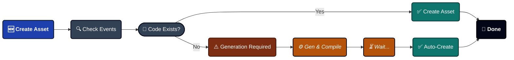
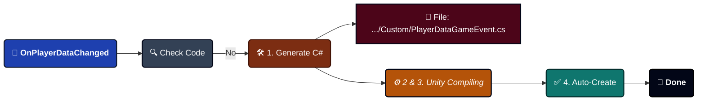

---
sidebar_label: 'Create Game Event'
sidebar_position: 4
---

import Tabs from '@theme/Tabs';

import TabItem from '@theme/TabItem';

import VideoGif from '@site/src/components/Video/VideoGif';


# Game Event Creator

Your high-speed event creation wizard. This specialized tool handles batch event generation, automatic code compilation, and ScriptableObject creation—all in one streamlined workflow.

<VideoGif src="/video/game-event-system/event-create.mp4" />


---

## 🚀 Opening the Creator

The Creator only opens from the **[Game Event Editor](./game-event-editor.md)**:
```
Game Event Editor → Click "+ New Event" button (top-right)
```

:::info Why From Editor Only?
The Creator needs to know which database to add events to. Opening from the Editor ensures proper context.
:::

---

## 🗺️ Interface Zones

The window is organized into four functional areas:

| Zone                      | Location  | Purpose                                                 |
| ------------------------- | --------- | ------------------------------------------------------- |
| **A. Event Mode Tabs**    | Top       | Switch between Void, Single Parameter, or Sender events |
| **B. Configuration Area** | Middle    | Select types and configure event details                |
| **C. Events Queue**       | Bottom    | Review pending events before creation                   |
| **D. Status Badge**       | Top-right | Shows total queued count (e.g., "7 Queued Total")       |

---

## 🎭 Three Event Modes

Choose the architecture that fits your need:

<Tabs>
<TabItem value="void" label="1. Parameterless" default>

### Parameterless Events

**Type**: `GameEvent` (Void)

The simplest signal—no data, just notification.


**Best For**:
```
🖱️ UI Triggers ➔ OnPauseButtonClick, OnMenuOpen
🌍 Global States ➔ OnGameStart, OnLevelComplete
🏃 Simple Actions ➔ OnJump, OnFire, OnInteract
```

**How to Use**:
1. Click **"Add Event"** button
2. Event appears in queue with default name "NewEvent"
3. Rename it in the queue (e.g., "OnGameStart")
4. Set category if desired (e.g., "Core")
5. Click **"Create X Event(s)"** at bottom

**No Type Selection Needed**: Since it's parameterless, you just click and add.

</TabItem>

<TabItem value="single" label="2. Single Parameter">

### Single Parameter Events

**Type**: `GameEvent<T>`

Carries one piece of data with the notification.


**Best For**:
```
📈 Value Changes ➔ OnHealthChanged(float), OnScoreUpdated(int)
🔄 State Updates ➔ OnGameStateChanged(GameState)
📦 Object Events ➔ OnEnemySpawned(GameObject)
💾 Data Sync ➔ OnPlayerDataChanged(PlayerData)
```

**Two Ways to Add**:

#### Method 1: Quick Add - Basic Types

For built-in Unity types (int, float, Vector3, GameObject, etc.):

1. **Select Type** from dropdown (shows all 32 basic types)
2. Click **"Add"** button
3. Event added to queue automatically

**Available Basic Types**:
- C# Primitives: `int`, `float`, `bool`, `string`, etc.
- Math Types: `Vector2`, `Vector3`, `Quaternion`, `Color`, etc.
- Components: `GameObject`, `Transform`, `Rigidbody`, etc.
- Assets: `Sprite`, `Material`, `AudioClip`, etc.

---

#### Method 2: Search - Custom Types

For your own C# classes:

1. **Type in search bar** (e.g., "PlayerData")
2. System searches all serializable types in your project
3. Click **"Add"** next to your type
4. Event added to queue

**Search Features**:
- ✅ Fuzzy matching (type "plr" finds "PlayerData")
- ✅ Shows namespace for disambiguation
- ✅ Badge shows how many events of this type are queued
- ✅ Green flash effect when adding

**Requirements for Custom Types**:
```csharp
// ✅ This works
[System.Serializable]
public class PlayerData {
    public string playerName;
    public int level;
}

// ❌ This won't appear in search
public class NonSerializableClass { } // Missing [Serializable]
```

</TabItem>

<TabItem value="sender" label="3. With Sender">

### Sender Events

**Type**: `GameEvent<TSender, TArgs>`

Carries both **who fired it** (sender) and **what happened** (argument).


**Best For**:
```
⚔️ Combat ➔ OnDamageTaken(GameObject victim, DamageInfo damage)
🤝 Interactions ➔ OnItemPickedUp(Player player, ItemID item)
🌐 Networking ➔ OnPlayerJoined(NetworkPlayer sender, string playerName)
📜 Complex Events ➔ OnQuestCompleted(QuestGiver npc, QuestData quest)
```

**Recommended Pattern**:
- **TSender** = The actor/source (`GameObject`, `Player`, `Enemy`)
- **TArgs** = The data/payload (`int`, `DamageInfo`, `Vector3`)

**How to Use**:

1. **Select Sender Type**:
   - Choose from Basic Types dropdown, OR
   - Search for custom type
   - Click "Select" when ready

2. **Select Argument Type**:
   - Choose from Basic Types dropdown, OR
   - Search for custom type
   - Click "Select" when ready

3. **Add Event**:
   - Blue button appears: "Add Event: GameObject → int" (example)
   - Click it to add to queue

**Selected Type Display**:

When you select types, they appear in green boxes:
```
✅ Selected Sender: GameObject <small>(UnityEngine)</small>
✅ Selected Argument: DamageInfo <small>(YourGame.Combat)</small>
```

Click the **×** to clear and choose different types.

</TabItem>
</Tabs>

---

## 📦 Batch Creation Workflow

The Creator's power is **batch processing**—create many events at once instead of one-by-one.

### Step-by-Step Process

#### 1️⃣ Queue Events

Add multiple events across different modes:
```
🔘 Switch to Parameterless ➔ Add OnGameStart  
🔘 Switch to Parameterless ➔ Add OnGamePause  
🔢 Switch to Single Parameter(int) ➔ Add OnScoreChanged  
🌊 Switch to Single Parameter(float) ➔ Add OnHealthChanged  
👥 Switch to Sender <GameObject,int> ➔ Add OnEnemyDamaged  

Total in Queue: 5 events pending creation
```

**Visual Feedback**:
- Top-right badge updates: "5 Queued Total"
- Each mode shows its own count: "Events Queue (2)"

---

#### 2️⃣ Review & Configure

In the **Events Queue** section:

**Per Event**:
- ☑️ **Checkbox**: Toggle selection (only selected events will be created)
- **Name Field**: Rename event (default: "NewEvent", "OnInt", etc.)
- **Category Field**: Set category for filtering later
- **Type Label**: Shows event type signature
- **× Button**: Remove from queue

**Bulk Actions**:
- **Select All**: Check all events in current queue
- **Clear Selection**: Uncheck all events
- **Remove All**: Clear entire queue (with confirmation)

---

#### 3️⃣ Execute Creation

Click the big green button at bottom:
```
+ Create 5 Event(s)
```

**What Happens Next**: See the next section ⬇️

---

## ⚙️ Understanding the Creation Process

When you click "Create", a sophisticated automation pipeline runs. Here's what happens behind the scenes:



### Scenario 1: Code Already Exists ✅

**Example**: Creating an `int` event.


**Speed**: Instant (< 1 second)

**No Compilation**: You see the event in the Editor immediately.

---

### Scenario 2: Code Needs Generation ⚠️

**Example**: Creating a `PlayerData` event (your custom class).



**Speed**: 3-10 seconds (depends on project size)

**You'll See**:
1. Creator window closes
2. Unity compilation spinner appears
3. Console logs appear
4. Event appears in Editor automatically

:::info What Gets Generated?

For each custom type, the system creates **one C# file** containing:
```csharp
// File: PlayerDataGameEvent.cs

// 1. The Event Class
public class PlayerDataGameEvent : GameEvent<PlayerData> { }

// 2. The Binding Field (for Inspector)
public partial class GameEventManager {
    public partial class EventBinding {
        public UnityEvent<PlayerData> PlayerDataGameEventAction;
    }
}
```

**Why Both?** The event class is for raising events. The binding field is for Inspector callbacks.
:::

---

### Mixed Batch Handling

**What if you queue both existing and new types?**
```
Your Queue:
1. OnGameStart (void) ✅ Code exists
2. OnScoreChanged (int) ✅ Code exists  
3. OnPlayerDataChanged (PlayerData) ⚠️ Needs generation
4. OnQuestCompleted (QuestData) ⚠️ Needs generation
```

**System Behavior**:

```mermaid
graph LR
    %% 样式定义：沿用深色系统
    classDef instant fill:#0f766e,stroke:#042f2e,stroke-width:2px,color:#ffffff,font-weight:bold
    classDef warning fill:#7c2d12,stroke:#431407,stroke-width:2px,color:#ffffff
    classDef wait fill:#4c0519,stroke:#020617,stroke-width:2px,color:#ffffff,font-style:italic
    classDef system fill:#020617,stroke:#000000,stroke-width:2px,color:#ffffff,font-weight:bold

    %% 流程逻辑
    A(⚡ Step 1: Create Events 1 & 2):::instant --> B(🛠️ Step 2: Gen Code for Data Types):::warning
    
    B --> C(⚙️ Step 3: Trigger Compilation):::wait
    
    C --> D(✅ Step 4: Auto-create Events 3 & 4):::instant
    
    D --> E(🏁 All Assets Ready):::system

    %% 提示说明 (可选)
    linkStyle 0 stroke:#0f766e,stroke-width:2px
    linkStyle 2 stroke:#0f766e,stroke-width:2px
```



**Console Output**:
```
✅ [Batch] Immediate events created successfully. (2 events)
⏳ Generated 2 script files. Triggering compilation to finish creation...
   (After compilation)
🎯 Batch Creation Complete: 2 events created.
```

---

### Sender Events Special Case

Sender events (`GameEvent<TSender, TArgs>`) follow the same logic but generate more complex code:
```csharp
// File: GameObjectDamageInfoGameEvent.cs

// Event class with TWO type parameters
public class GameObjectDamageInfoGameEvent 
    : GameEvent<GameObject, DamageInfo> { }

// Binding field with TWO parameters
public UnityEvent<GameObject, DamageInfo> 
    GameObjectDamageInfoGameEventAction;
```

---

## 🎯 Best Practices

### ✅ DO

**Pre-Generate Common Types**: If you know you'll use certain types frequently, you can refer to [Code Gen & Cleanup](../tools/codegen-and-cleanup.md) to pre generate custom type classes and event binding code.

---

**Use Meaningful Names**
```
✅ Good Names:
  - OnPlayerHealthChanged
  - OnEnemySpawned
  - OnQuestCompleted
  - OnScoreUpdated

❌ Avoid:
  - NewEvent1
  - Test
  - Event_Copy
  - TempEvent
```

---

**Organize with Categories**

Use categories to group related events:
```
🟥 Category: "Combat"
  - ⚡ OnDamageTaken
  - ⚡ OnEnemyKilled
  - ⚡ OnWeaponFired

🟩 Category: "UI"
  - ⚡ OnButtonClicked
  - ⚡ OnMenuOpened
  - ⚡ OnDialogClosed

🟪 Category: "Player"
  - ⚡ OnPlayerJumped
  - ⚡ OnPlayerDied
  - ⚡ OnLevelUp
```

---

### ❌ AVOID

**Don't Close During Compilation**
```
❌ WRONG:
1. Click Create
2. See "Triggering compilation..." message
3. Immediately close Unity or force-stop compilation

✅ RIGHT:
1. Click Create  
2. Wait for compilation bar to finish
3. Events appear automatically
```

**Why?** Interrupting compilation may leave generated code files without corresponding assets.

---

**Don't Manually Edit Generated Files**
```
❌ WRONG:
Open: TinyGiantsData/GameEventSystem/CodeGen/Custom/PlayerDataGameEvent.cs
Edit: Add custom methods, change namespace, etc.

✅ RIGHT:
Let the system manage generated files.
Extend functionality through separate scripts.
```

**Why?** The system may regenerate these files, overwriting your changes.

---

## 🔍 Progress Indicators

### During Creation

**Immediate Creation** (code exists):
```
✅ Events created successfully.
```

**Code Generation** (new types):

```
⏳ Generated 3 script files. Triggering compilation to finish creation...
```

**After Compilation**:
```
🎯 Batch Creation Complete: 1 events created.
```

---

### Console Logs Explained

**Detailed Generation Report**:
```
━━━━━━━━━━━━━━━━━━━━━━━━━━━━━━━━━━
🧩 Event Code Generation Complete
━━━━━━━━━━━━━━━━━━━━━━━━━━━━━━━━━━

✅ Generated 3 event files (Type + Binding).

━━━━━━━━━━━━━━━━━━━━━━━━━━━━━━━━━━
```

**What This Means**:

- 3 new C# files created
- Each file contains event class + binding field
- Files are in `TinyGiantsData/GameEventSystem/CodeGen/Custom/`
- Assets will be created automatically after compilation

---

## ❓ Troubleshooting

### Events Not Appearing After Compilation

**Problem**: Clicked Create, compilation finished, but events missing.

**Solutions**:

**Check Console for Errors**:
```
Look for red errors during compilation
Common issue: Type not serializable
Fix: Add [System.Serializable] to your class
```

**Verify Database Selection**:
```
1. Open Game Event Editor
2. Check which database is selected
3. Events are added to THAT database
```

**Manual Asset Check**:
```
1. Navigate to: TinyGiantsData/GameEventSystem/Databases/
2. Find your database asset
3. Expand it in Project window
4. Look for your event sub-assets
```

---

### Compilation Takes Too Long

**Problem**: Stuck on "Compiling Scripts..." for minutes.

**Causes**:
- Large project with many scripts
- Other compilation errors blocking progress
- Unity Editor performance issues

**Solutions**:
```
1. Check Console for compilation errors
2. Fix any red errors first
3. Try: Assets → Reimport All (last resort)
4. Restart Unity if stuck > 5 minutes
```

---

### "Type Not Found" After Generation

**Problem**: Console says type not found even after compilation.

**Checklist**:

✅ Is your type [Serializable]?

✅ Is your type public?

✅ Does Unity recognize your type? (check Inspector)

✅ Did compilation actually finish? (no spinner)

**Fix**:
```csharp
// Make sure your class looks like this:
using System;
using UnityEngine;

[Serializable]  // ← Required
public class PlayerData  // ← Must be public
{
    public string playerName;
    public int level;
}
```

---

### Duplicate Event Names

**Problem**: Two events with same name in queue.

**Behavior**: System auto-renames with suffix:
```
Queue:
- OnPlayerDeath
- OnPlayerDeath_1
- OnPlayerDeath_2
```

**Better Practice**: Rename manually in the queue before creating it.

---

:::tip Pro Workflow
**First-Time Setup**: Create all your common event types in one batch session. Wait for compilation once. From then on, event creation is instant since all code exists. This one-time investment saves hours over the project lifetime.
:::

:::info Code Location
Generated files live in:
```
Assets/TinyGiantsData/GameEventSystem/CodeGen/
├─ Basic/    (pre-generated for int, float, etc.)
└─ Custom/   (your custom types)
```

These folders are safe to commit to version control—they're deterministic and won't cause merge conflicts.
:::
