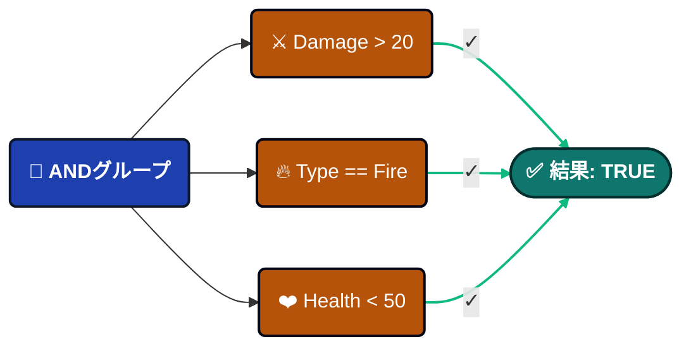
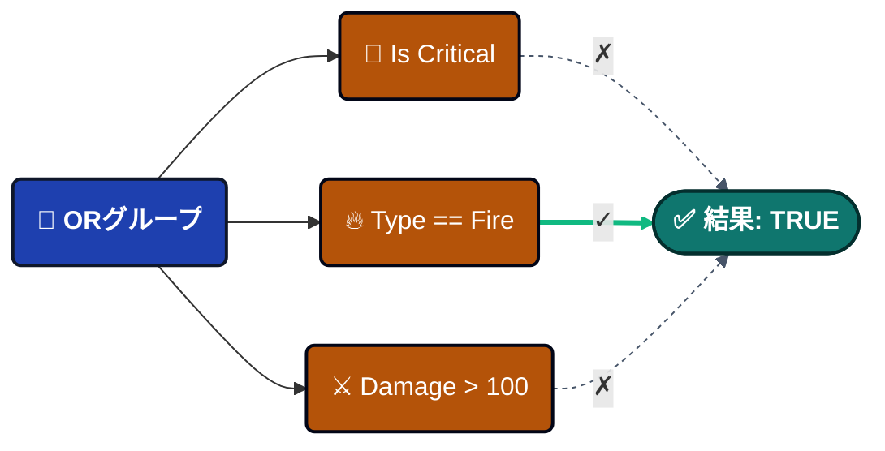
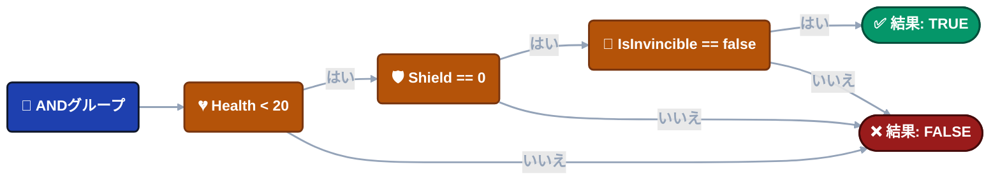
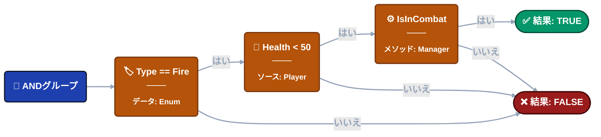

---
sidebar_label: 'ビジュアル条件ツリー'
sidebar_position: 8
---

import Tabs from '@theme/Tabs';
import TabItem from '@theme/TabItem';

# ビジュアル条件ツリー

イベントアクションが実行されるべきかどうかを制御するために、複雑なブール論理を**視覚的に**構築します。直感的なインターフェースを通じて洗練された実行時チェックを作成—コーディング不要。


---

## 🎯 概要

ビジュアル条件ツリーは、イベントアクションを実行する前に実行時条件を評価する**ロジックゲートシステム**です。

### 解決する問題

**従来のアプローチ**(分散したロジック):
```csharp
// ロジックがスクリプトに埋め込まれ、変更が困難
if (damageInfo.amount > 20 && 
    (damageInfo.isCritical || damageInfo.type == DamageType.Fire) &&
    playerController.Health < 50 &&
    gameManager.IsInCombat()) {
    // アクションを実行
}
```

**ビジュアルアプローチ**:


------

### 例を構築

**イベント**: `OnPlayerDamaged`

**イベント型**:

- `GameEvent<GameObject, DamageInfo>` (GameObject sender)
- `GameEvent<PlayerStats, DamageInfo>` (カスタムsender)

**データ構造**:
```csharp
// ダメージ型列挙
public enum DamageType {
    Physical,
    Fire,
    Void
}

// ダメージ情報ペイロード
public class DamageInfo {
    public float amount;           // ダメージ値
    public bool isCritical;        // クリティカルヒットフラグ
    public DamageType type;        // ダメージタイプ
    public Vector3 hitPoint;       // 衝撃位置
    public string attacker;        // 攻撃者名
}

// カスタムsender型(GameObjectの代替)
public class PlayerStats {
    public string playerName;
    public int level;
    public int factionId;
}
```

**目標**: 特定の条件下でプレイヤーが重大なダメージを受けたときに警告エフェクトをトリガー。

---

### 主な利点

| 機能                | 利点                                            |
| ---------------------- | -------------------------------------------------- |
| 🎨 **ビジュアル構築**  | デザイナーがコードなしでロジックを作成                |
| 🚀 **高性能** | Expression Treeにコンパイル(ゼロリフレクション)     |
| 🔄 **再利用可能**         | 同じ条件がすべてのイベントアクションに適用        |
| 🧪 **ライブテスト**     | インスペクターで値を調整し、結果をすぐに確認 |
| 🔒 **型安全**        | 型互換性を自動検証                  |

---

## 🏗️ ツリー構造

条件ツリーは**2つのノードタイプ**から構築されます:


### 🌳 グループノード

AND/ORロジックを使用して複数の条件を結合します。

**ロジックタイプ**:

<Tabs>
<TabItem value="and" label="ANDロジック" default>

すべての子条件がTRUEと評価される必要があります。


**ビジュアル**: 🟢 緑色の枠線

**用途**: 「すべての要件を満たす必要がある」

</TabItem>

<TabItem value="or" label="ORロジック">

任意の子条件がTRUEと評価されることができます。


**ビジュアル**: 🟠 オレンジ色の枠線

**用途**: 「いずれかの要件を満たす」

</TabItem>
</Tabs>

**ロジック切り替え**: ロジックボタン(AND/OR)をクリックして切り替えます。

**ネスト**: グループは他のグループを含むことができます—無制限の深さで複雑なロジックを構築。

```mermaid
graph LR

    classDef root fill:#1e40af,stroke:#0f172a,stroke-width:2px,color:#ffffff,font-weight:bold
    classDef cond fill:#b45309,stroke:#78350f,stroke-width:2px,color:#ffffff
    classDef nested fill:#334155,stroke:#020617,stroke-width:2px,color:#ffffff
    classDef success fill:#0f766e,stroke:#042f2e,stroke-width:2px,color:#ffffff,font-weight:bold

    ROOT(📂 ルート: ANDグループ):::root

    ROOT --> A(📜 条件A):::cond
    ROOT --> OR(📂 ネスト: ORグループ):::nested
    ROOT --> D(📜 条件D):::cond

    OR --> B(📜 条件B):::cond
    OR --> C(📜 条件C):::cond

    A --> RES([✅ ロジック結果]):::success
    B --> OR_OUT(( ))
    C --> OR_OUT
    OR_OUT --> RES
    D --> RES

    style OR_OUT fill:#334155,stroke:none
    linkStyle 4,5 stroke:#94a3b8,stroke-width:1px
```


**ノードを追加**: 各グループの**+ Condition**または**+ Group**ボタンを使用します。

---

### ⚖️ 比較ノード

**比較ノード**は、イベントロジックの基本的な構成要素です。各ノードは、イベントアクションが続行すべきかどうかを判断するために、単一の**ブールチェック**(True/False)を実行します。

#### 🏗️ 比較の構造

すべてのノードは標準的な三部構造に従っており、複雑なロジックを一目で読みやすくしています。

> **[ 🟦 ソース(左オペランド) ]**  **[ 演算子 ]**  **[ 🟧 ターゲット(右オペランド) ]** 

**実用例:**
ヒットが十分に強力な場合にのみトリガーするイベントを想像してください:
Argument.amount  **>**  20.0

- **🔍 ソース:** Argument.amount — `GameEvent<float>`によって渡される生のダメージ値
- **📐 演算子:** > — 論理ルール(より大きい)
- **🎯 ターゲット:** 20.0 — 比較する定数閾値または別の変数

------

#### 👓 表示モード

エディターUIはニーズに適応し、**可読性**と**精密制御**のバランスを取ります。

| 表示モード       | ビジュアルスタイル                            | 最適な用途...                                |
| --------------- | --------------------------------------- | ------------------------------------------ |
| 📖 **折りたたみ** | **要約テキスト**(例: Health < 50)    | 複雑なロジックチェーンの概要。    |
| 🛠️ **展開**  | **詳細エディター**(ドロップダウン、フィールド) | 特定のパラメータとソースの変更。 |

:::tip **操作ヒント**
任意の比較ブロックを**クリック**するだけで、これら2つのビュー間を切り替えられます。これにより、設定に深く入る能力を保持しながら、ワークスペースをクリーンに保つことができます。
:::

---

## **📝** 構造設定

<details>
<summary>📌 ソース</summary>

<Tabs>
<TabItem value="event-arg" label="イベント引数" default>

### 🧬 イベント引数(データペイロード)

**Argument**システムにより、イベントのデータペイロードを詳しく調べて、条件とアクションのための特定の値を抽出できます。

:::info **利用可能性**
データアクセスは型付きイベント専用です: `GameEvent<T>`または`GameEvent<TSender, TArgs>`。
:::

#### 🔢 シングルパラメータイベント

**シグネチャ:** `GameEvent<DamageInfo>`

イベントが単一のオブジェクトを運ぶ場合、オブジェクト自体またはそのパブリックメンバーのいずれかにアクセスできます。

**データ構造例:**
```
📦 (this Argument)      ➔ 完全なDamageInfoオブジェクト
├── 🔢 amount           ➔ float
├── ✅ isCritical       ➔ bool
├── 🏷️ type             ➔ DamageType (Enum)
├── 📍 hitPoint         ➔ Vector3
└── 👤 attacker         ➔ string
```

------

#### 👥 Senderイベント(コンテキスト認識)

Senderイベントは、データアクセスのための2つの異なるルートを提供します: **Sender**(誰)と**Argument**(何)。

##### 🎮 ケースA: GameObject Sender

**シグネチャ:** `GameEvent<GameObject, DamageInfo>`

| ルート         | パス例              | データ型 |
| ------------ | ------------------------- | --------- |
| **Sender**   | Sender.Transform.position | Vector3   |
| **Argument** | Argument.amount           | float     |

**ビジュアル階層:**
```
👥 Sender
   ├── 🆔 tag           ➔ string
   ├── 🟢 activeSelf    ➔ bool
   └── 📐 Transform
       ├── 📍 position  ➔ Vector3
       └── 📂 childCount➔ int
🔢 Argument
   ├── 🔢 amount        ➔ float
   └── ✅ isCritical    ➔ bool
```

##### 🛡️ ケースB: カスタムC# Sender(高度)

**シグネチャ:** `GameEvent<PlayerStats, DamageInfo>`

> 🚀 **なぜ特別か:** 従来のシステムとは異なり、GameObjectに縛られません。疎結合でロジック優先のアーキテクチャのために、任意の**Pure C#クラス**をSenderとして使用できます。

- 💎 **純粋なロジック** — MonoBehaviourでないクラスで動作します。
- 🌐 **ネットワーク対応** — PlayerDataまたはNetworkAgent同期に最適。
- 🤖 **AIエージェント** — シーン依存なしで内部状態を追跡。

------

#### 🧭 深いプロパティアクセス

**精密ナビゲーション。** 高性能リフレクションで**5レベルの深さ**までネストされた構造をナビゲート。

**例: 方向チェック**

- **パス:** Argument.hitPoint.normalized.x
- **条件:** > 0.5
- **結果:** 🎯 「ヒットは右側から来ました。」

**ブレッドクラムロジック:**
Argument (DamageInfo) ➔ hitPoint (Vector3) ➔ normalized (Vector3) ➔ x (float)

------

#### 📋 サポートされている型

システムは以下の型を自動的にサポートします:

| カテゴリ       | サポートされている型                                   |
| -------------- | ------------------------------------------------- |
| **プリミティブ** | int、float、double、long、bool、string            |
| **数学**       | Vector2、Vector3、Quaternion、Color               |
| **Unity**      | GameObject、Transform、Component参照       |
| **ロジック**      | Enum(ドロップダウン付き)、[Serializable] C#クラス |

:::tip **プロのヒント: カスタムクラス**
[Serializable]クラス内の任意のパブリック**フィールド**または**プロパティ**は、ディープリンクピッカーで自動的に公開されます。
:::

</TabItem>

<TabItem value="scene-type" label="シーンタイプ">

### **🎬** シーンタイプ

シーン内のGameObjectまたはComponentから実行時データにアクセスします。

---

#### 使用方法

**ステップ1**: HierarchyからGameObjectまたはComponentをオブジェクトフィールドにドラッグします。

**ステップ2**: 「Select Property...」をクリックして利用可能なメンバーを参照します。

---

#### GameObject例

`PlayerController` GameObjectをドラッグ:
```
📦 GameObject (インスタンス)
├─ 📦 (this GameObject)    ➔ 参照自体
├─ ✅ activeSelf           ➔ bool
├─ 🔤 tag                  ➔ string
└─ 🔢 layer                ➔ int

📐 Transform (コンポーネント)
├─ 📍 position             ➔ Vector3
├─ 📏 localScale           ➔ Vector3
└─ 📂 childCount           ➔ int

🧩 PlayerController (スクリプト)
├─ 🔢 Health               ➔ float
├─ 🛡️ Shield               ➔ float
├─ 🏅 Level                ➔ int
├─ ✅ HasFireResistance    ➔ bool
│
├─ ⚡ IsInDangerZone()      ➔ bool (メソッド)
└─ ⚡ IsCriticallyWounded() ➔ bool (メソッド)
```

**使用法**:
```
Player.Health < 50                  → ヘルスチェック
Player.Level >= 10                  → レベル要件
Player.IsInDangerZone() == true     → メソッド経由の複雑なチェック
```

---

#### Boolメソッドサポート ✨

`bool`を返す**ゼロパラメータメソッド**がドロップダウンに表示されます!

**例**:
```csharp
// コンポーネント内
public bool IsInDangerZone() {
    return Health < 20 && Shield == 0 && !IsInvincible;
}
```

**条件ツリー内**:
```
Player.IsInDangerZone() == true
```

これにより、視覚的に構築する代わりに、単一のメソッド呼び出しで複雑なロジックをカプセル化できます。

---

#### Component例

`GameManager` Componentをドラッグ:
```
🏛️ GameManager (グローバルシステム)
├─ 🔄 CurrentState        ➔ GameState (Enum)
├─ 🌊 CurrentWave         ➔ int
├─ 🏅 DifficultyLevel     ➔ int
│
├─ ⚡ IsInCombat()         ➔ bool (メソッド)
└─ ⚡ IsHardMode()         ➔ bool (メソッド)
```

**使用法**:
```
GameManager.CurrentState == Playing
GameManager.IsInCombat() == true
GameManager.DifficultyLevel >= 3
```

---

#### 重要な制限

⚠️ **シーンタイプは、シーンロード時にオブジェクトが存在する必要があります。**
```
✅ 動作: シーン階層内のオブジェクト(初期化時に存在)
❌ 失敗: 実行時にインスタンス化されたオブジェクト(まだ存在しない)

解決策: 実行時オブジェクトにはイベント引数を使用
```

</TabItem>

<TabItem value="random" label="ランダムタイプ">

### **🎲** ランダムタイプ

**目的**: 実行時にランダム値を生成します。

---

#### 2つのモード

**モード1: 範囲**

境界内でランダム数値を生成します。


**構成**:

- **Min**: 下限
- **Max**: 上限  
- **Integer**: 整数の場合はチェック、小数の場合はチェックを外す

---

**モード2: リスト**

事前定義された値からランダムアイテムを選択します。


**構成**:

- **Data Type**: 型を選択(int、float、string、boolなど)
- **List Items**: +/-ボタンで値を追加/削除

---

#### 使用例

**クリティカルヒット確率**:
```
Random(0~100) > 90  → 10%の確率
```

**ダメージばらつき**:
```
Random(0~10) → ランダムボーナスダメージを追加
```

**動的イベント**:
```
Random List[Easy, Normal, Hard] → 難易度をランダム化
```

</TabItem>
</Tabs>

</details>

<details>
<summary>📌 演算子</summary>


### **📐** 利用可能な演算子

**数値(6)**

数値用(int、float、double、long):

| 演算子         | シンボル | 例         |
| ---------------- | ------ | --------------- |
| 等しい           | `==`   | `Health == 100` |
| 等しくない       | `!=`   | `Health != 0`   |
| より大きい          | `>`    | `Damage > 20`   |
| より小さい             | `<`    | `Health < 50`   |
| 以上 | `>=`   | `Level >= 10`   |
| 以下    | `<=`   | `Shield <= 0`   |

**自動変換**: 互換性のある数値型は自動的に変換されます(int ↔ float)。

---

**文字列(4)**

テキスト値用:

| 演算子    | シンボル         | 例                      |
| ----------- | -------------- | ---------------------------- |
| 等しい      | `==`           | `Name == "Hero"`             |
| 等しくない  | `!=`           | `Tag != "Enemy"`             |
| で始まる | `Starts With`  | `Name Starts With "Player_"` |
| で終わる   | `Ends With`    | `File Ends With ".png"`      |
| 含む    | `Contains (⊃)` | `Message Contains "error"`   |

⚠️ **大文字小文字を区別**: "Hero" ≠ "hero"

---

**Enumサポート**

ドロップダウン選択付きの完全な列挙サポート!

**例**:
```csharp
public enum DamageType { Physical, Fire, Void }
```

**条件ツリー内**:
```
ソース: Argument.type (DamageType)
演算子: ==
ターゲット: DamageType.Fire (ドロップダウンにPhysical/Fire/Voidを表示)
```

**リストと共に**:
```
Argument.type In List [Fire, Void]
結果: typeがDamageType.FireまたはDamageType.Voidの場合TRUE
```

**サポートされている演算子**: `==`、`!=`、`In List (∈)`

---

**コレクション(1)**

リスト/配列メンバーシップをチェック:

| 演算子 | シンボル | 目的                       |
| -------- | ------ | ----------------------------- |
| In List  | `∈`    | 値がリストに存在するかをチェック |

**構造**:
```
ソース: 単一値
演算子: In List (∈)
ターゲット: リスト/配列(一致する型)
```

**例**:
```
Argument.attacker In List ["Dragon", "Demon", "Lich"]
Player.Level In List [10, 20, 30, 40, 50]
Argument.type In List [Fire, Void]
```

</details>

<details>
<summary>📌 ターゲット</summary>
<Tabs>
<TabItem value="event-arg" label="イベント引数" default>

### 🧬 イベント引数(データペイロード)

:::tip ソースと同じ

ソースと同様に、具体的な詳細についてはソースの関連する構成説明を参照してください

:::

</TabItem>

<TabItem value="scene-type" label="シーンタイプ">

### **🎬** シーンタイプ

:::tip ソースと同じ

ソースと同様に、具体的な詳細についてはソースの関連する構成説明を参照してください

:::

</TabItem>

<TabItem value="random" label="ランダムタイプ">

### **🎲** ランダムタイプ

:::tip ソースと同じ

ソースと同様に、具体的な詳細についてはソースの関連する構成説明を参照してください

:::

</TabItem>

<TabItem value="constant" label="定数">

### **📌** 定数

固定比較値。

**注意**: **ターゲット**(右側)としてのみ使用可能、ソースではありません。

---

#### 2つのモード

**モード1: 単一値**

1つの固定値を入力します。


**データ型**: Int、Float、Double、String、Bool

---

**モード2: リスト**

複数の許容値を定義します(「In List」演算子用)。


**構成**:

- **Data Type**: すべてのリストアイテムの型
- **+ / -**: アイテムを追加/削除

---

#### 使用例

**閾値**:
```
Health < 50.0
```

**完全一致**:
```
Name == "Hero"
```

**複数値**:
```
Type In List [Fire, Void, Lightning]
```

:::tip **主な違い**

追加サポート型: 定数型**（ターゲットのみ利用可能）**

:::

:::tip **コンテキスト認識**

一部の演算子はターゲット型を制限します:

- 数値演算子(`>`、`<`など)は単一値が必要

- 「In List」演算子はリスト型が必要

:::

</TabItem>
</Tabs>

</details>

------

## 🎨 型検証

システムは型の互換性を自動的に検証します。

**有効な比較**:
```
✅ int == int
✅ float > int (自動変換)
✅ string Contains string
✅ DamageType == Fire (enum)
✅ int In List<int>
```

**無効な比較**:
```
❌ string > int (互換性のない型)
❌ bool Contains string (無意味)
❌ float In List<string> (型の不一致)
```

**ビジュアルフィードバック**: 互換性のない型に赤いアウトライン+警告テキスト。

---

## 🧩 Boolメソッド vs ビジュアルツリー

条件を構築する2つのアプローチ—それぞれをいつ使用するか?

### アプローチ1: Boolメソッド

**最適**: 複雑な複数ステップロジック。

**例**:
```csharp
public bool IsInDangerZone() {
    bool lowHealth = Health < 20;
    bool noShield = Shield == 0;
    bool hasEnemies = Physics.OverlapSphere(
        transform.position, 10f, enemyLayer
    ).Length > 0;
    
    return lowHealth && noShield && hasEnemies;
}
```

**ツリー内**: `Player.IsInDangerZone() == true`

**長所**:

- 複雑さをカプセル化
- Physics、raycastsを使用可能
- ユニットテスト可能
- コードの再利用可能

**短所**:

- C#コーディングが必要
- デザイナーが変更不可

---

### アプローチ2: ビジュアルツリー

**最適**: デザイナーが制御すべきシンプルなチェック。

**例**:


**長所**:

- コーディング不要
- デザイナーフレンドリー
- ビジュアル表現
- 迅速な反復

**短所**:

- Physics/アルゴリズムを使用不可
- 大きなツリーは複雑化

---

### ハイブリッドアプローチ(推奨)

最適な結果のために両方を組み合わせます:


**ガイドライン**:

- ビジュアルツリー: 閾値、enum、シンプルなプロパティ
- Boolメソッド: Physicsクエリ、複雑なアルゴリズム、クロスシステムチェック

---

## 🔄 ドラッグ&並べ替え

**実行順序を変更**: 任意の条件の左端にあるハンドル(☰)をドラッグします。

**順序が重要な理由**:

**ANDグループ**: 順序は結果に影響しません(すべてが合格する必要がある)。

**ORグループ**: 順序は**短絡評価**に影響します(最初のTRUEで停止)。

**最適化例**:
```
❌ 遅い:
ORグループ
├─ ExpensivePhysicsCheck()  ← 最初に実行(遅い!)
└─ SimpleBoolCheck          ← 実行されない可能性

✅ 速い:
ORグループ
├─ SimpleBoolCheck          ← 最初に実行(速い!)
└─ ExpensivePhysicsCheck()  ← 必要な場合のみ
```

より良いパフォーマンスのために、ORグループで安価なチェックを最初に配置します。

---

## 🚀 パフォーマンス

### コンパイルプロセス

**一度だけのコスト**(シーンロード):
```
ビジュアルツリー → Expression Tree → ILコード → コンパイル済みラムダ
```

**実行時実行**:
```
イベント発火 → コンパイル済みラムダを呼び出し → TRUE/FALSEを返す
```

**ベンチマーク**: 複雑なネストされた条件が約0.001ms(1マイクロ秒)で実行されます。

---

### なぜ速いのか

**ゼロリフレクション**: 手書きC#のような直接コンパイルアクセス。

**Expression Tree**: システムが初期化時に最適化されたILコードを生成します。
```
❌ 従来: GetComponent() + GetField() + Invoke() チェックごと
✅ このシステム: コンパイル済みラムダを介した直接プロパティアクセス
```

**結果**: フレームごとに数百のイベントが発火しても無視できるオーバーヘッド。

---

## 🧹 ツリー管理

- **有効/無効**: すべての条件をバイパスするためにチェックボックスを切り替えます(常にTRUE)。
- **ツリーをリセット**: 「Reset Tree」ボタンをクリックして、すべてのノードをクリアして最初からやり直します。

- **折りたたみ/展開**: 比較ブロックをクリックして、要約ビューと詳細ビュー間を切り替えます。

---

## ❓ トラブルシューティング

### 条件が常にFalseを返す

**チェックリスト**:

- ✅ 「Enable Conditions」トグルがチェックされているか?
- ✅ 赤い型不一致警告はあるか?
- ✅ シーンタイプ参照はまだ有効か(破棄されていない)?
- ✅ boolメソッドは期待値を返すか?(Debug.Logを追加)

---

### プロパティがドロップダウンにない

**イベント引数の場合**:

- publicフィールドまたはプロパティである必要がある
- サポートされている型である必要がある

**シーンタイプの場合**:

- GameObjectがエディター時にシーンに存在する必要がある
- Componentが有効である必要がある
- プロパティがpublicである必要がある
- メソッドは: boolを返す、ゼロパラメータ、public、インスタンス(staticではない)

**実行時オブジェクトの場合**: シーンタイプの代わりにイベント引数を使用。

---

### 変更が保存されない

**一般的な原因**:

- 複数のBehaviorウィンドウが開いている(重複を閉じる)
- 編集中のスクリプトコンパイル(完了まで待つ)
- UnityがSerializedPropertyの変更を適用しなかった(閉じる前に待つ)

---

## 📖 使用される場所

ビジュアル条件ツリーシステムは**2つのコンテキスト**で表示されます:

**1. イベントビヘイビア** → [Game Event Behavior](./game-event-behavior.md)

イベントアクションが実行されるかどうかを制御:
```
イベント発火 → 条件をチェック → アクションを実行/スキップ
```

**2. フローノード** → フローノード構成 *(将来のドキュメント)*

フローノードが実行されるかどうかを制御:
```
フローがノードに到達 → 条件をチェック → ノードを実行/スキップ
```

両方とも**まったく同じ**条件ツリーシステムを使用します。

---

:::tip ベストプラクティス

**シンプルなチェック**: 閾値、enum、基本比較にはビジュアルツリーを使用

**複雑なロジック**: Physics、アルゴリズム、複数ステップチェックにはBoolメソッドを使用

**最適なアプローチ**: 両方を組み合わせる—シンプルにはビジュアル、複雑にはメソッド

**パフォーマンス**: 短絡最適化のためにORグループで安価なチェックを最初に配置

:::