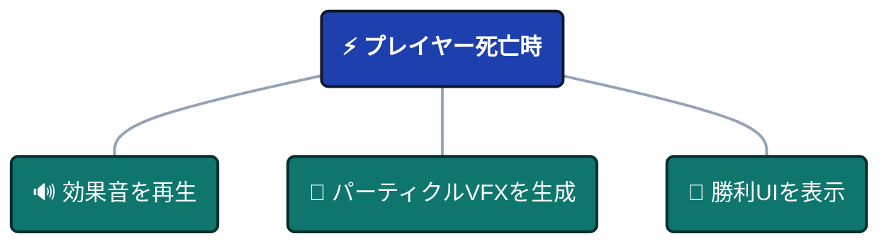
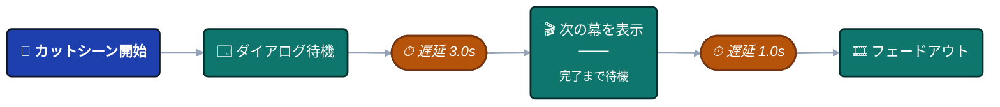
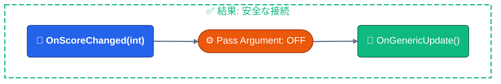

# 接続タイプとポート

フローを構築する前に、グラフの「視覚言語」を理解する必要があります。色、形状、線のスタイルはすべて、データフローと実行時の振る舞いを表しています。

:::tip クイックリファレンス
ここに記載されている凡例は、**フローエディタ**（右側のパネル）でも確認できます。凡例内の項目にマウスをホバーすると、詳細なツールチップが表示されます。
:::

---

## 🧬 ノードタイプ

ノードの**ヘッダーの色**は、その実行パターンを示しています。


### 実行パターン

| 色            | タイプ             | 振る舞い                                                     | ユースケース                                      |
| ------------ | ---------------- | ------------------------------------------------------------ | ------------------------------------------------- |
| 🔴 **赤**    | **ルートノード**    | **エントリポイント** - イベントが外部から発行されたときに開始されます | ゲーム開始、プレイヤー入力、衝突検知               |
| 🟠 **オレンジ** | **トリガーノード** | **並列 (ファンアウト)** - 発行後、即座に次へ進みます（非ブロッキング） | SE再生 + VFX発生 + UI更新を同時に行う場合           |
| 🟢 **緑**    | **チェーンノード**   | **直列 (ブロッキング)** - 発行後、完了を待ってから次へ進みます         | カットシーン、遅延アクション、非同期操作           |

---

### ルートノードのルール

**1グラフにつき1つ**: 各グラフには、必ず**1つ**のルートノードが存在します。

**ルートの設定**: 任意のノードを右クリックして **"Set as Root"** を選択することで、開始点を変更できます。

**視覚効果**: 赤いヘッダーグラデーションにより、即座に識別可能です。

---

### トリガー vs チェーン

**トリガーパターン** (並列):



:::info トリガー

すべてが同時に並列実行されます！

:::

**チェーンパターン** (直列):



:::info チェーン

それぞれが前の処理の完了を待ってから実行されます！

:::

---

## 🔌 ポートタイプ (データシグネチャ)

**ポートの色**は、C#イベントのシグネチャとデータペイロードを示しています。


### ポートの色の意味

| 色            | シグネチャ          | 説明                            | イベント例                                |
| ------------ | ------------------ | -------------------------------------- | --------------------------------------------- |
| 🔵 **シアン**   | `()`               | **Void** - 渡されるデータなし              | `OnGameStart`, `OnButtonClick`                |
| 🌸 **ピンク**   | `<T>`              | **単一引数** - 1つのデータペイロード | `OnScoreChanged(int)`, `OnDamage(DamageInfo)` |
| 💜 **パープル** | `<TSender, TArgs>` | **二重引数** - 送信元 + ペイロード  | `OnPlayerDamaged(GameObject, DamageInfo)`     |

---

### ポートの構造

- **左ポート** (入力): 前のノードからデータを受け取ります。
- **右ポート** (出力): 次のノードへデータを送ります。

## 🔗 接続の互換性

システムは、接続作成時に**リアルタイムの型安全性**を提供します。


### 互換性レベル

| 色            | ステータス            | 意味                          | 影響                            |
| ------------ | ----------------- | -------------------------------- | --------------------------------- |
| 🟢 **緑**    | **完全一致** | 型が完全に一致しています              | オーバーヘッドなし、変換不要      |
| 🟡 **黄色** | **互換あり**    | データを破棄して安全に実行可能 | 引数は無視され、エラーは発生しません      |
| 🟠 **オレンジ** | **警告**       | 型変換が必要         | 自動変換（例：int → float）が行われます |
| 🔴 **赤**    | **互換性なし**  | 実行時に失敗します             | 接続がブロックされます                |

---

### ビジュアルフィードバック

**ドラッグ中**:
- プレビュー線に互換性の色が表示されます
- 無効なターゲットは暗く表示されます
- 有効なターゲットはハイライトされます

**接続後**:
- 線の色が維持されます
- オレンジ/赤の場合は警告アイコン (⚠️) が表示されます
- ホバーすると詳細なツールチップが表示されます

---

## 📊 互換性マトリクス

接続の色は、**ソース（送信元）の型**、**ターゲット（送信先）の型**、および **Pass Argument（引数を渡す）** 設定によって決定されます。

### 完全互換性テーブル

| ソースイベント | ターゲットイベント | 引数を渡す (Pass Argument) | 結果   | 説明                                     |
| ------------ | ------------ | ------------- | -------- | ----------------------------------------------- |
| すべて          | すべて          | **OFF**       | 🟢 緑  | **上書き**: ターゲットはすべての入力を無視します          |
| Void `()`    | Void `()`    | ON            | 🟢 緑  | 完全一致 - データ不要                  |
| Void `()`    | `<T>`        | ON            | 🔴 赤  | **エラー**: ターゲットはデータを必要としますが、ソースにありません   |
| Void `()`    | `<S,T>`      | ON            | 🔴 赤  | **エラー**: ターゲットは送信元を必要としますが、ソースにありません |
| `<T>`        | Void `()`    | ON            | 🟡 黄色 | **安全**: 引数は破棄されます                    |
| `<T>`        | `<T>`        | ON            | 🟢 緑  | 完全一致 - 同じ型                       |
| `<T>`        | `<S,T>`      | ON            | 🔴 赤  | **エラー**: ターゲットは送信元を必要としますが、ソースにありません |
| `<S,T>`      | Void `()`    | ON            | 🟡 黄色 | **安全**: 送信元と引数の両方が破棄されます           |
| `<S,T>`      | `<T>`        | ON            | 🟡 黄色 | **安全**: 送信元は破棄され、引数のみ渡されます          |
| `<S,T>`      | `<S,T>`      | ON            | 🟢 緑  | 完全一致 - 送信元 + 引数                    |
| `<T1>`       | `<T2>`       | ON            | 🟠 オレンジ | **警告**: 型変換 (int ↔ float)      |

---

### 特殊なケース

**Pass Argument = OFF**:

ターゲットがすべての入力データを無視するため、常に 🟢 **緑** の接続になります。

**ユースケース**: 型エラーを発生させずに、型付きイベントをVoidイベントに連結する場合。



---

**数値変換**:

互換性のある数値型間では自動変換されます (🟠 オレンジ):
- `int` ↔ `float`
- `float` ↔ `double`
- `int` ↔ `long`

**警告**: 精度が失われる可能性があります（例：`float` 3.14 → `int` 3）。

---

**互換性のない型**:

接続時にブロックされます (🔴 赤):
- `string` → `int`
- `GameObject` → `float`
- カスタム型の不一致

**システムにより作成が防止**されます。

---

## 🏷️ ステータスバッジ

ノードの**下部**に、現在のアクティブな設定を示すバッジが表示されます。


### バッジ・リファレンス

| アイコン | バッジ      | 意味                         | 対象ノード   |
| ---- | ---------- | ------------------------------- | ------------ |
| 🧩    | **Cond**   | ビジュアル条件ツリーがアクティブ    | 全ノード    |
| ⏱️    | **2.5s**   | 開始遅延（秒）           | 全ノード    |
| ⏳    | **3.0s**   | ブロッキング期間（秒）     | チェーンのみ   |
| ⚓    | **Wait**   | 非同期完了を待機       | チェーンのみ   |
| ⬆️    | **+5**     | 実行優先度              | トリガーのみ |
| 🔗    | **Pass**   | 次のノードへ引数を渡す  | 全ノード    |
| 📌    | **Static** | 引数がブロックされている（静的呼び出し） | 全ノード    |

---

### バッジの例

**遅延 ＋ 期間が設定されたチェーンノード**:
```
⏱️ 1.0s   ← 開始前に1秒待機
⏳ 3.0s   ← その後、3秒間ブロッキング
```

**条件 ＋ 優先度が設定されたトリガーノード**:
```
🧩 Cond   ← 条件を満たした場合のみ発行
⬆️ +10    ← 他のトリガーより先に実行
```

**引数渡しが有効なノード**:
```
🔗 Pass   ← イベントデータを次のノードへ転送
```

---

## 🎨 視覚的な例

### 例 1: 完全一致のチェーン


**色**:

- Line 1: 🟢 緑 (完全一致)
- Line 2: 🟡 黄色 (送信元は安全に破棄)

---

### 例 2: 型変換の警告


**色**: 🟠 オレンジ (int → float 変換)

**リスク**: 精度の変化はありますが、動作します。

---

### 例 3: 引数の無視 (Pass Argument OFF)


**色**: 🟢 緑 (void → int)

**非ブロッキング:** 一致させるために引数を無視。

------

### 例 4: 並列トリガーのファンアウト


**すべての接続:** 緑 (void → void)、即座に並列実行。

---

## 💡 ベストプラクティス

### 引数渡しの賢い使い方

**渡す場合 (ON)**:
- 次のノードがイベントデータを必要としている場合
- データパイプラインを構築する場合
- ダメージ情報やスコアなどを転送する場合

**ブロックする場合 (OFF)**:
- 互換性のない型同士を接続する場合
- 一般的な通知（データ不要）の場合
- 複雑な型の連鎖を簡略化する場合

---

### フローを色で判断する

**緑が多いグラフ**: 型定義が適切になされています。

**黄色の接続**: 意図的にデータを破棄している場合は許容されます。

**オレンジの線**: 正確性を確認してください。変換が意図したものであることを再確認してください。

**赤のブロック**: 即座に修正してください。実行時に失敗します。

---

### 型ごとに整理する

**似たシグネチャのノードをグループ化**しましょう：
- Voidイベントは一つのエリアに
- データ付きイベントは別のエリアに
- 非同期チェーンはトリガーとは別に

**理由**: 型の互換性が視覚的に判断しやすくなります。

---

## ❓ よくある質問

### なぜ接続が赤くなるのですか？

**原因**: 解決できない型の不一致です。

**修正方法**: 
1. ターゲットが送信元を必要としているが、ソースが提供していないか確認。
2. ターゲットノードの "Pass Argument" を無効にする。
3. 中間に変換ノードを挿入する。

---

### 異なる数値型を接続できますか？

**はい**: システムは `int`, `float`, `double`, `long` 間で自動変換します。

**結果**: 変換警告を伴う 🟠 オレンジの接続になります。

**注意**: 精度損失（float → int）に注意してください。

---

### 黄色はどういう意味ですか？

**意味**: **データ破棄**を伴う安全な接続です。

**例**: `<int>` を `<void>` に送ると、整数データは破棄されます。

**安全ですか？**: はい。実行時エラーは発生せず、単にデータが使われないだけです。

:::tip クイック凡例アクセス

フローグラフエディタでの作業中、右側の**凡例パネル (Legend Panel)** にすべてのノードタイプ、ポートの色、接続の意味が表示されます。凡例項目にホバーすると詳細なツールチップを確認できます。

:::

:::warning 実行時エラー

🔴 **赤色の接続**は、実行時のクラッシュを防ぐために作成時にブロックされます。どうしても互換性のない型を接続する必要がある場合は、ターゲットノードの "Pass Argument" を無効にしてください。これにより入力データが無視され、🟢 緑色の接続として強制できます。

:::