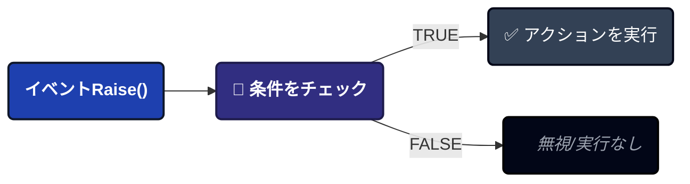
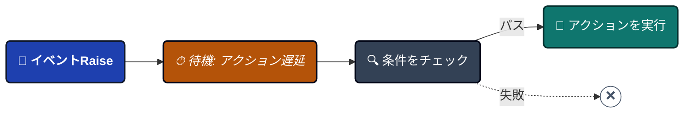
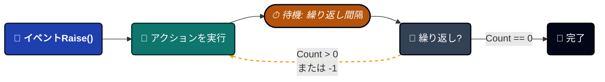
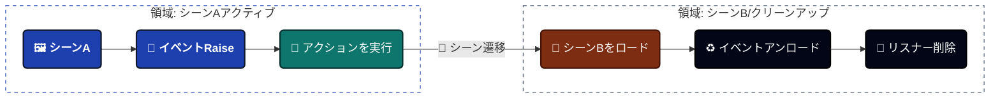

import Tabs from '@theme/Tabs';

import TabItem from '@theme/TabItem';


# ゲームイベントビヘイビア

イベントが発火したときに**何が起こるか**を定義します。盲目的に実行される従来のイベントとは異なり、このシステムでは、条件、遅延、ループ、およびビジュアルアクションをイベントアセット自体に直接アタッチできます。


---

## 🚀 Behaviorウィンドウを開く

**[Game Event Editor](./game-event-editor.md)**からアクセス:
```
Game Event Editor → 任意のイベント行のBehaviorボタン(カラーピル)をクリック
```

**ボタンの色の状態**:

| 色    | アイコン | 意味                    | 詳細                                      |
| -------- | ---- | -------------------------- | -------------------------------------------- |
| 🟢 緑  | ✓    | 構成済み(インスペクター)     | ManagerにUnityEventアクションあり            |
| 🔵 青   | ▶    | 実行時アクティブ(プレイモード) | `AddListener()`を介したコードベースのリスナーあり |
| 🟡 オレンジ | ⚠    | 未構成             | アクションまたはリスナーなし                      |

**ボタンラベル**: イベント型シグネチャを表示(例: `<void>`、`<int>`、`<GameObject, DamageInfo>`)

---

## 📋 ウィンドウ概要

Behaviorウィンドウには4つの主要セクションがあります:

1. **Event Information** - 識別確認(名前、カテゴリ、GUID)
2. **Action Condition** - ビジュアルロジックツリー(実行ゲート)
3. **Event Action** - UnityEventコールバック(実行内容)
4. **Schedule Configuration** - タイミングコントロール(遅延、ループ、永続性)

---

## 1️⃣ Event Information

正しいイベントを編集していることを確認する読み取り専用の要約。


**表示データ**:
- **Event Name**: アセット名
- **Category**: 組織グループ
- **GUID**: 一意の内部識別子(リネーム間で保持)

:::tip GUIDが重要な理由
GUIDは、イベントの名前を変更してもリファレンスが無傷のままであることを保証します。これがEditorでの安全なリネーミングが機能する理由です!
:::

---

## 2️⃣ Action Condition(実行ゲート)

**ロジックエンジン**: これらの条件が`TRUE`と評価された場合にのみアクションが実行されます。


### 動作内容

実行時の値に基づいて**アクションが実行されるかどうか**を制御します:



### ビジュアルロジックツリー

**コードなし**で複雑なブール論理を構築:

- **グループ**: AND/ORロジックで条件を結合
- **比較**: 個別チェック(例: `Health < 20`)
- **ネスト**: グループ内のグループ(無制限の深さ)

### パフォーマンス

:::tip ゼロリフレクションオーバーヘッド
条件は初期化時に**Expression Tree**にコンパイルされます。手書きのC#コードと同じ速さで実行されます!
:::

### 詳細を学ぶ

ビジュアル条件ツリーは多くの機能を持つ強力なシステムです:

- **4つのソースタイプ**: イベント引数、シーン型、ランダム、定数
- **10の比較演算子**: 数値、文字列、コレクションチェック
- **Boolメソッドサポート**: カスタム`bool`メソッドを条件として使用
- **ドラッグ&ドロップ並べ替え**: ロジックを視覚的に整理
- **型検証**: 互換性のない比較を自動検出

**📖 完全ガイド**: **[Visual Condition Tree](./visual-condition-tree.md)**

---

## 3️⃣ Event Action(コールバックレイヤー)

**Action**は、イベントがトリガーされ、すべての条件が満たされた後に実行されるUnityコールバックを定義します。


### 🧩 UnityEventフィールドの理解

システムはUnityのネイティブ**UnityEvent**アーキテクチャを活用し、既存のMonoBehaviourやUIコンポーネントとのシームレスな統合を保証します。

------

#### 🔘 パラメータなしイベント(`GameEvent`)の場合

*標準トリガーのみのロジック。*

| タイプ      | バックエンドフィールド       | 互換性                            |
| --------- | ------------------- | ---------------------------------------- |
| **ロジック** | `UnityEvent (void)` | 🟢 任意の**ゼロパラメータ**メソッドを受け入れます。 |

**例:** OnGameStart ➔ AudioManager.PlayBGM()、UI.FadeIn()

------

#### 🔢 シングルパラメータイベント(`GameEvent<T>`)の場合

*ペイロード駆動ロジック。リスナーにデータを直接渡します。*

| タイプ      | バックエンドフィールド   | 互換性                                       |
| --------- | --------------- | --------------------------------------------------- |
| **ロジック** | `UnityEvent<T>` | 🟡 型Tの**1つのパラメータ**を持つメソッドを受け入れます。 |

**例:** OnHealthChanged(float) ➔ HealthBar.UpdateFill(float)

------

#### 👥 Senderイベント(`GameEvent<TSender, TArgs>`)の場合

*コンテキスト認識ロジック。ソースとデータペイロードの両方を渡します。*

| タイプ      | バックエンドフィールド                | 互換性                              |
| --------- | ---------------------------- | ------------------------------------------ |
| **ロジック** | `UnityEvent<TSender, TArgs>` | 🔵 **2つのパラメータ**を持つメソッドを受け入れます。 |

**例:** OnDamage(GameObject, int) ➔ VFXManager.SpawnAt(GameObject.pos)、Popup.Show(int)

:::info **ネイティブ統合**
**ネイティブUnityEvents**を使用するため、インスペクターで直接リスナーを割り当てるか、AddListener()を使用してコードで割り当てることができます。**静的**および**動的**呼び出しの両方をサポートします。
:::

:::tip **シグネチャマッチング**
インスペクターUIは、イベントのシグネチャに一致する関数のみを表示するようにメソッドリストを自動的にフィルタリングし、実行時エラーを防ぎます。
:::

------

### ➕ アクションの追加(ワークフロー)


Unityインスペクターを介してロジックを接続するための3つの簡単なステップに従ってください。

#### 1️⃣ ターゲットオブジェクトを割り当て

ロジックを含むGameObjectまたはComponentを**Object**スロットに**ドラッグ&ドロップ**します。

- 🖱️ **アクション:** HierarchyからドラッグしてEmptyスロットにドロップ。
- 📦 **結果:** フィールドがスクリプトの特定のインスタンスを参照するようになります。

#### 2️⃣ コールバックメソッドを選択

**Function Dropdown**をクリックして、割り当てられたオブジェクトで利用可能なすべてのパブリックメソッドを参照します。

- 🔍 **アクション:** No Functionをクリック ➔ スクリプト/コンポーネントに移動。
- ⚡ **ヒント:** **イベントシグネチャ**(例: void、int)に一致するメソッドのみが簡単に選択できるように上部に表示されます。

#### 3️⃣ パラメータマッピングを定義

イベントのライブデータを使用するか、固定値を使用するかを決定します。

- ⚖️ **Dynamic Call:** イベントによって送信される**実行時の値**を使用します(例: 実際に与えられたダメージ)。
- ⚙️ **Static Parameters:** インスペクターで手動で定義した**固定値**を使用します。

------

### 💡 Dynamic vs Static: どちらを選ぶ?

| モード        | ビジュアルアイコン | 最適な用途...                                                  |
| ----------- | ----------- | ------------------------------------------------------------ |
| **Dynamic** | 🚀           | リアルタイムデータ(例: 現在のHPでHealth Barを更新)。 |
| **Static**  | 📌           | 固定トリガー(例: コンソールに「Button Clicked」をログ記録)。 |

:::tip **プロのヒント**
ドロップダウンでは、**Dynamic**メソッドは常にメニューの**上部**にリストされます。そこにメソッドが表示されない場合は、パラメータ型が正確に一致しているか確認してください!
:::

---

### Dynamic vs Static関数

**Dynamic**(イベントデータ付き):
```csharp
// イベントパラメータを受け取る
public void TakeDamage(float amount) {
    health -= amount;
}

// Senderイベントの場合
public void OnDamageReceived(GameObject attacker, DamageInfo info) {
    // senderとargsの両方を使用
}
```

**Static**(イベントデータを無視):
```csharp
// パラメータ不要
public void PlaySound() {
    audioSource.Play();
}
```

**それぞれを使用するタイミング**:

| Dynamicを使用する場合            | Staticを使用する場合        |
| --------------------------- | ---------------------- |
| イベントのデータが必要   | 通知のみが必要 |
| float/int値の処理 | サウンド/エフェクトの再生 |
| Sender参照の確認   | アニメーションのトリガー  |
| データ駆動の反応       | 状態変更          |

---

### 複数のアクション&優先度

**複数追加**: +を繰り返しクリックしてアクションを追加。

**実行順序**: 上から下へ。

**並べ替え**: 各アクションの左側にある☰ハンドルをドラッグ。

**例**:
```csharp
📜 LogDamageEvent() ➔ 
    🥇 最初(メタデータ/ログ記録)
🎵 PlayHitSound() ➔ 
    🥈 2番目(オーディオ/VFXフィードバック)
📊 UpdateHealthBar(float) ➔ 
    🥉 3番目(UI/ビジュアル表現)
🏁 CheckDeathCondition() ➔ 
    🏆 最後(ゲーム状態ロジック)
```

---

### すべてのアクションをクリア

**「Clear All」**ボタン(右上)をクリックして、すべてのアクションを一度に削除。

⚠️ **確認を表示**: 「本当によろしいですか?」

---

## 4️⃣ Schedule Configuration

**Schedule**レイヤーは、イベントが発火した後、アクションが**いつ**、**どのくらいの頻度で**実行されるかを決定します。


<Tabs>
<TabItem value="delay" label="⏱️ アクション遅延" default>

### アクション遅延

**時間オフセット。** イベントトリガーと実際の実行の間にギャップを導入します。

- 🕒 **値:** float(秒)
- 🎯 **目的:** アニメーション、VFX、または遅延ゲームロジックと同期。

**動作方法:**

1. 🔔 **イベント発火** ➔ シグナルが受信されます。
2. ⏳ **遅延中** ➔ システムが指定されたX秒間待機します。
3. 🔍 **条件チェック** ➔ 待機*後*に条件を再検証します。
4. 🚀 **実行** ➔ 条件がまだ満たされている場合にのみアクションが発火します。


</TabItem>

<TabItem value="interval" label="🔄 繰り返し間隔">

### 繰り返し間隔

**自動ループ。** 手動介入なしにイベントを定期的に再発火できるようにします。

- 🕒 **パラメータ:** float(秒)
- 🔄 **ロジック:** 繰り返しサイクルの「ティックレート」を決定します。

**値のマッピング:**

- 0.0s ➔ 🚫 **無効**(1回のみの実行)
- \> 0s ➔ 🔁 **アクティブループ**(X秒ごとに実行)

:::info **遅延との相互作用**
**Delay**と**Interval**の両方が設定されている場合、最初の実行はDelayを尊重し、その後の繰り返しはIntervalに従います。
:::

</TabItem>

<TabItem value="count" label="🔢 繰り返し回数">

### 繰り返し回数

**ライフサイクルコントロール。** イベントが繰り返すことができる回数を制限します。

**構成ガイド:**

| 値 | 動作            | 総実行回数        |
| ----- | ------------------- | ----------------------- |
| 0     | **繰り返しなし**      | 1(初回のみ)        |
| N     | **有限ループ**     | 1 + N                   |
| -1    | **無限ループ** ♾️ | 停止/破棄されるまで |

**UIインジケーター:**
-1に設定すると、**↺ Reset**ボタンが表示されます。クリックすると、カウントを1にすばやく戻します。


</TabItem>

<TabItem value="persistent" label="🛡️ 永続イベント">

### 永続イベント

**シーン生存。** 新しいUnityシーンがロードされたときにイベントオブジェクトが生き残るかどうかを決定します。

🔳 **未チェック(デフォルト):** イベントはシーンロード時に破棄されます(標準動作)。


☑️ **チェック:** DontDestroyOnLoadのように動作します。

```mermaid
graph LR

    classDef sceneA fill:#1e40af,stroke:#0f172a,stroke-width:2px,color:#ffffff,font-weight:bold
    classDef action fill:#0f766e,stroke:#042f2e,stroke-width:2px,color:#ffffff
    classDef transition fill:#7c2d12,stroke:#431407,stroke-width:2px,color:#ffffff
    classDef persistence fill:#b45309,stroke:#020617,stroke-width:2px,color:#ffffff,font-weight:bold
    classDef success fill:#0f766e,stroke:#042f2e,stroke-width:2px,color:#ffffff

    subgraph Scene_A [領域: シーンAアクティブ]
        direction LR
        A(🖼️ シーンA):::sceneA --> B(🔔 イベントRaise):::sceneA
        B --> C(🚀 アクションを実行):::action
    end
    style Scene_A fill:none,stroke:#1e40af,stroke-dasharray: 5 5

    C -- "✨ DontDestroyOnLoad" --> D(🚚 シーンBをロード中):::transition

    subgraph Scene_B [領域: シーンB - まだ生きている]
        direction LR
        D --> E(🛡️ イベント永続化):::persistence
        E --> F(💎 リスナー残存):::persistence
        F --> G(🔥 Raise準備完了):::success
    end
    style Scene_B fill:none,stroke:#0f766e,stroke-dasharray: 5 5
```


**最適な使用例:**

| ✅ 永続を使用する場合       | ❌ 使用しない場合             |
| -------------------------- | --------------------------- |
| 🎵 **グローバルBGMマネージャー**   | 🏰 レベル固有のパズル    |
| 💾 **セーブ/ロードシステム**     | 👾 シーン固有のAIパス |
| 🏆 **実績トラッカー** | 🖼️ ローカルメニューアニメーション     |
| 🌐 **マルチプレイヤー状態**    | 🔦 一時的な部屋の照明   |

:::warning **⚠️ 重要: 依存性注入**
永続イベントは、遷移後にシーン固有のオブジェクトへの参照を維持**できません**。OnSceneLoaded後に**依存性注入**または**サービスロケーター**を介して、新しいシーンオブジェクトを永続イベントに再バインドする必要があります。
:::

</TabItem>
</Tabs>

---

## ❓ トラブルシューティング

### アクションが実行されない

**問題**: イベントが発火するが何も起こらない。

**チェックリスト**:

✅ **条件を確認**:
```
1. 条件が有効になっているか?(条件セクションで切り替え)
2. 条件がTRUEと評価されるか?
3. 条件ロジックをテスト - Visual Condition Treeガイドを参照
4. Debug.Log()を追加して値を確認
```

✅ **アクションを確認**:
```
1. UnityEventフィールドが空か?アクションを追加!
2. ターゲットGameObjectが破棄されているか?
3. ターゲットComponentが無効になっているか?
4. エラーについてコンソールを確認
```

✅ **スケジュールを確認**:
```
1. アクション遅延が長すぎるか?
2. 繰り返し間隔が混乱を引き起こしているか?
3. イベントが不適切に永続化されているか?
```

---

### 「Field Not Found」警告

**問題**: `Field 'IntGameEventAction' not found.`

**原因**: イベント型がバインディングコードを欠いている。

**解決策**:

**「Force Rebuild All (Fix Missing Bindings)」**ボタンをクリック。

これによりすべてのバインディングフィールドが再生成されます:
```
Assets/TinyGiantsData/GameEventSystem/CodeGen/Basic/
└─ IntGameEvent.cs (バインディングフィールド付きで再生成)
```

**コンパイル後**: Behaviorウィンドウを再度開く。

---

### アクションが複数回発火する

**問題**: アクションが予想以上に実行される。

**一般的な原因**:

**原因1: 繰り返し設定**
```
確認:
- 繰り返し間隔 > 0?
- 繰り返し回数 > 0?

はいの場合、イベントはループしています(意図的または偶発的)
```

**原因2: 複数のイベントRaise**
```
イベントがコード内で複数回発火:
  OnHealthChanged.Raise(newHealth);  ← 繰り返し呼び出される

解決策: イベントが必要なときにのみ発火することを確認
```

**原因3: 複数のリスナー**
```
UnityEventに同じアクションが複数回追加されている

解決策: アクションリストを確認し、重複を削除
```

---

:::tip 次のステップ
イベントビヘイビアを理解したので、**[Visual Condition Tree](./visual-condition-tree.md)**を探索して高度な条件ロジックをマスターしてください。または**[Flow Editor](../flow-graph/game-event-node-editor.md)**にジャンプしてイベントオーケストレーションを構築しましょう!
:::