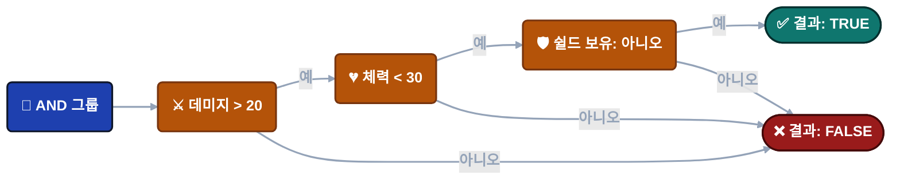
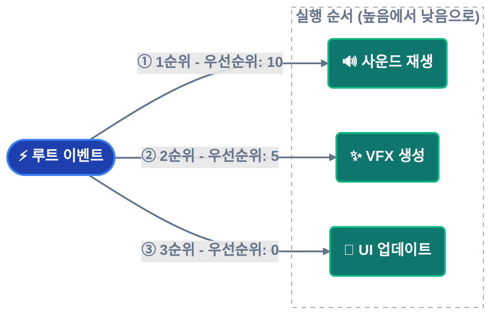
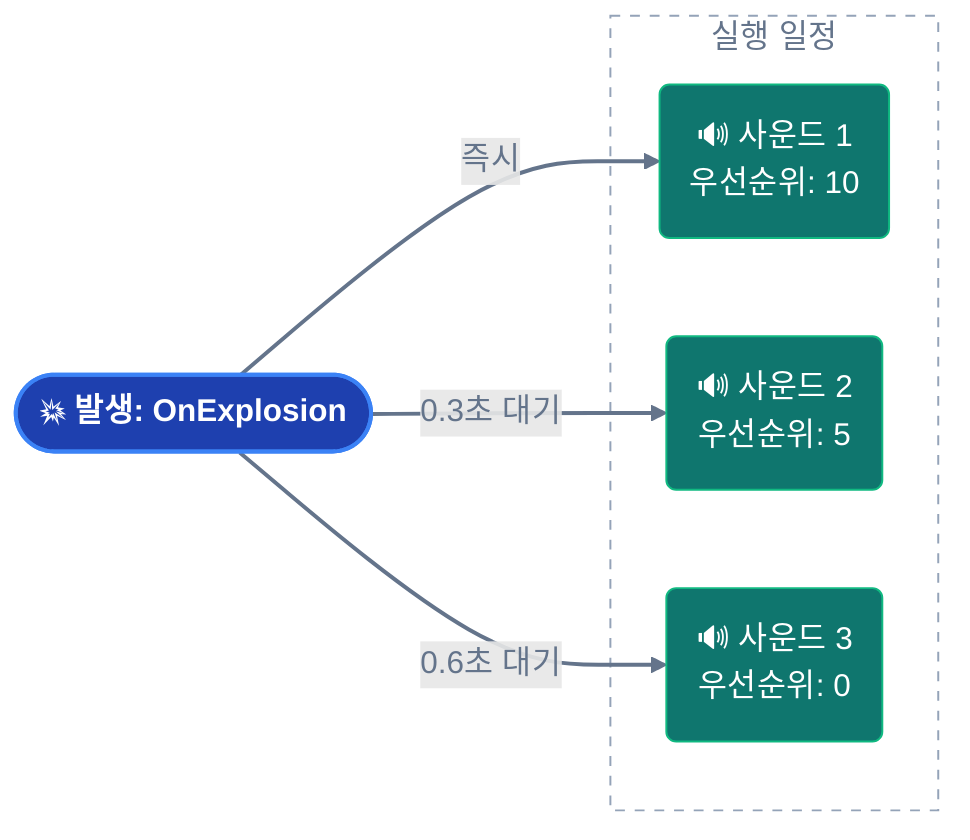

---
sidebar_label: '노드 동작 설정'
sidebar_position: 3
---

import Tabs from '@theme/Tabs';

import TabItem from '@theme/TabItem';


# 게임 이벤트 노드 동작 (Game Event Node Behavior)

그래프가 노드 간의 연결을 보여준다면, **노드 동작 설정 창(Node Behavior Configuration Window)**은 각 개별 노드의 상세한 실행 로직을 제어합니다.

**접속 방법**: 플로우 그래프에서 임의의 노드를 더블 클릭하면 해당 노드의 동작 설정 창이 열립니다.


---

## 🎯 창 개요

설정 창은 크게 세 가지 섹션으로 나뉩니다:

| 섹션 | 용도 | 적용 대상 |
| ---------------------- | ------------------------------------------- | ------------------------- |
| **노드 정보** | 이벤트 상세 정보 및 타입 확인 | 모든 노드 |
| **노드 조건** | 실행 제어를 위한 시각적 로직 게이트 | 모든 노드 |
| **노드 설정** | 타이밍, 우선순위 및 데이터 전달 설정 | 모든 노드 (타입별 상이) |

## 📋 노드 정보

선택한 노드에 대한 읽기 전용 상세 정보를 표시합니다.


**이벤트 이름 (Event Name)**: 이 노드가 발생시킬 게임 이벤트입니다.

**노드 타입 (Node Type)**: 트리거(병렬) 또는 체인(순차) 타입입니다.

**이벤트 GUID**: 내부 추적을 위한 고유 식별자입니다.

**사용 사례**: 변경 사항을 적용하기 전에 올바른 노드를 편집하고 있는지 확인하십시오.

------

## 🧩 노드 조건 (플로우 게이트)

각 노드는 실행 여부를 결정하는 고유한 **시각적 조건 트리**를 가집니다.


### 작동 방식

**조건 평가 결과가 FALSE인 경우**:

- 노드가 발생하지 않습니다.
- 해당 분기의 플로우가 중단됩니다.
- 연결된 자식 노드들은 건너뜁니다.

**조건 평가 결과가 TRUE인 경우**:

- 노드가 정상적으로 발생합니다.
- 자식 노드로 플로우가 계속됩니다.

---

### 조건 컨텍스트 (Condition Context)

다음에 접근할 수 있습니다:

**이벤트 인자** (`Arg`): 유입되는 이벤트로부터 전달된 데이터
```
예시: Arg.amount > 50
```

**송신자** (`Sender`): 소스 오브젝트 (송신자 포함 이벤트의 경우)
```
예시: Sender.tag == "Enemy"
```

**씬 오브젝트**: 씬에 있는 모든 GameObject/Component
```
예시: Player.Health < 20
```

---

### 시각적 빌더 (Visual Builder)

조건 시스템은 **이벤트 비헤이비어(Event Behaviors)**와 동일한 **시각적 조건 트리**를 사용합니다.

**전체 문서**: 다음 내용에 대한 전체 가이드는 **[시각적 조건 트리](../visual-workflow/visual-condition-tree.md)**를 참조하십시오:

- 로직 게이트(AND/OR 그룹) 구축
- 소스 타입(이벤트 인자, 씬 타입, 랜덤, 상수)
- 비교 연산자
- 타입 검증
- 권장 사항

:::tip 로직 재사용
시각적 조건 시스템은 다음 위치에서 동일하게 작동합니다:

- **이벤트 비헤이비어** (이벤트 인스펙터 내)
- **플로우 노드** (본 창)

한 번 익히면 모든 곳에서 활용할 수 있습니다!
:::

---

### 실전 예시

**시나리오**: 체력이 위험 수준일 때만 "낮은 체력 경고" 사운드 재생.

**조건 트리**:



**결과**: **세 가지 조건이 모두** 충족될 때만 사운드가 재생됩니다.

---

## ⚙️ 노드 설정

**타이밍**, **우선순위** 및 **데이터 흐름**을 제어하는 설정입니다.

### 일반 설정 (모든 노드 공통)


<details>
<summary>시작 지연 (Start Delay)</summary>

**단위**: 초 (float)

**효과**: 노드가 이벤트를 발생시키기 **전**에 이 시간만큼 대기합니다.

**사용 사례**:

- 일정한 간격(예: 0.2초)을 둔 연속 폭발 효과
- 이벤트에 대한 지연 반응
- 타이밍이 정해진 시퀀스

**예시**:

```
🔘 발생: OnButtonPressed
│
├─► ⏱️ 0.5초 ──┐
│             ▼
│            🎵 클릭 사운드 재생        ✅ 실행됨
│
├─► ⏱️ 1.0초 ────────┐
│                   ▼
│                  💬 확인창 표시           ✅ 실행됨
│
└─► ⏱️ 2.0초 ──────────────────┐
                              ▼
                             🚪 메뉴 닫기           ✅ 완료됨
```

**시각적 지표**: 노드 하단 배지에 ⏱️ **0.5s**와 같이 표시됩니다.

</details>

<details>
<summary>인자 전달 (Pass Argument)</summary>

**타입**: Boolean 토글

**효과**: 이벤트 데이터가 이 노드로 흐를지 여부를 제어합니다.

---

### ✅ 체크됨 (인자 전달: ON)

이전 이벤트로부터 데이터를 수신합니다 (타입이 호환되는 경우).

**사용 시기**:

- 데미지 정보 전달
- 점수/값 전달
- 데이터 파이프라인 구축

**예시**:


**연결 선 색상**: 타입 호환성에 따라 결정됩니다 (녹색/노란색/주황색).

---

### ❌ 체크 해제됨 (인자 전달: OFF)

기본값 또는 null 인자를 사용하는 **정적 호출(Static call)**로 노드가 실행됩니다.

**사용 시기**:

- 호환되지 않는 타입 간 연결
- 일반적인 알림 (데이터 불필요)
- 타입 안전 연결 강제

**예시**:

```
🚀 이벤트: OnDamageReceived(DamageInfo)
│   (페이로드: { amount: 20.0, ... })
│
🛡️ 필터: [ 인자 전달: OFF ]
│   (로직: 트리거 전용 / 데이터 폐기)
│
└─► 🔊 콜백: PlayGenericSound()
│
🎯 결과: DamageInfo 데이터 없이도 안정적으로 사운드가 재생됩니다.
```

**연결 선 색상**: 항상 🟢 **녹색**으로 표시됩니다 (안전 강제).

---

### 연결에 미치는 영향

**인자 전달(Pass Argument)** 설정은 연결 선 색상에 직접적인 영향을 줍니다:

| 인자 전달 | 소스 타입 | 타겟 타입 | 결과 |
| ------- | ----------- | ----------- | ------------------------- |
| **OFF** | 모든 타입 | 모든 타입 | 🟢 녹색 (항상 안전) |
| **ON** | `<int>` | `<int>` | 🟢 녹색 (완벽한 일치) |
| **ON** | `<int>` | `<void>` | 🟡 노란색 (데이터 폐기) |
| **ON** | `<int>` | `<float>` | 🟠 주황색 (타입 변환) |
| **ON** | `<int>` | `<string>` | 🔴 빨간색 (차단됨) |

**권장 사항**: 빨간색 연결을 피하고 호환되지 않는 타입을 연결하려면 **OFF**를 사용하십시오.

</details>

---

### 타입별 설정 (Type-Specific Settings)

노드 타입(트리거 vs 체인)에 따라 설정 옵션이 변경됩니다.

<details>
<summary>트리거 노드 (Trigger Node)</summary>

## 트리거 노드 (🟠 주황색)

**실행 방식**: 병렬(팬아웃) - 발생 즉시 다음으로 진행합니다.


---

### 우선순위 (Priority)

**타입**: 정수 (기본값: 0)

**규칙**: **숫자가 높을수록 = 먼저 실행됨**

**사용 사례**: 여러 트리거가 동일한 부모 노드에 연결되어 있을 때 실행 순서를 제어합니다.

---

### 우선순위 작동 방식

**시나리오**: 하나의 루트 노드에 세 개의 트리거가 연결된 경우.



**실행 순서**: 10 → 5 → 0 (높은 순서대로)

---

### 우선순위 값 가이드

| 값 | 의미 | 사용 사례 |
| ------------ | ---------------- | ---------------------------------------- |
| **양수 (+)** | 높은 우선순위 | 중요한 액션 (사운드, 입력 차단 등) |
| **0** | 기본 우선순위 | 일반적인 액션 |
| **음수 (-)** | 낮은 우선순위 | 정리 작업, 로깅, 분석 데이터 전송 |

**상세 사례**:

- **+100**: 플레이어 입력 차단
- **+50**: 크리티컬 사운드 재생
- **0**: 표준 VFX 생성
- **-50**: 분석 데이터 로깅
- **-100**: 임시 오브젝트 정리

---

### 시각적 지표

노드 하단 배지에 ⬆️ **+10**과 같이 표시됩니다.

</details>

<details>
<summary>체인 노드 (Chain Node)</summary>

## 체인 노드 (🟢 녹색)

**실행 방식**: 순차(차단) - 이벤트를 발생시키고 완료를 기다린 후 다음으로 진행합니다.


---

### 지속 시간 (Duration)

**타입**: 초 (float)

**효과**: 이벤트 발생 **후**, 지정된 시간 동안 그래프의 흐름을 이 노드에서 **정지**시킵니다.

**사용 사례**: 애니메이션 대기, 시간차 시퀀스, 쿨타임 대기.

---

### 지속 시간 예시

**애니메이션 대기**:

```
🖼️ T+0.0s | 시작
⚔️ PlayAttackAnimation()
│
┆  (Δ 1.5초 대기: 애니메이션 지속 시간)
▼
🖼️ T+1.5s | 실행
💥 DealDamage()
│
📊 결과: 총 1.5초 지속 | ✅ 체인 완료
```

**시간제 시퀀스**:

```
🖼️ T+0.0s | 활성화
⚠️ ShowWarning()
│
┆  (Δ 3.0초 표시 지속)
▼
🖼️ T+3.0s | 정리
🙈 HideWarning()
│
📊 라이프사이클: 3.0초 활성 | ✅ 자동 정리 완료
```

**시각적 지표**: 노드 하단 배지에 ⏳ **3.0s**와 같이 표시됩니다.

---

### 완료 대기 (Wait for Completion)

**타입**: Boolean 토글

**효과**: **비동기 작업(Async operations)**이 끝날 때까지 그래프가 대기합니다.

**요구 사항**: 이벤트 리스너가 `Task` 또는 `IEnumerator`를 반환해야 합니다.

---

### 비동기 지원 (Async Support)

**코루틴** (`IEnumerator`):

```csharp
public IEnumerator OnLoadLevel()
{
    yield return SceneManager.LoadSceneAsync("Level2");
    Debug.Log("로드 완료");
}
```

**Async/Await** (`Task`):

```csharp
public async Task OnDownloadData()
{
    await DownloadFromServer();
    Debug.Log("다운로드 완료");
}
```

**플로우 동작**:


"완료 대기"를 설정하지 않으면, 로딩이 끝나기 전에 `ShowSuccessMessage`가 즉시 실행됩니다.

---

### 지속 시간 + 완료 대기 결합

**두 설정은 상호 보완적으로 작동합니다**:

**시나리오 A: 태스크 완료 < 지속 시간 (최소 시간 보장)**

*예시: 컷씬이 예상보다 빨리(1.5초) 끝났지만, 전체적인 템포를 위해 2.0초는 유지하고 싶은 경우.*

```csharp
🖼️ T+0.0s | 시작
🎬 PlayCutscene() ➔ [태스크 시작]
│
├─ ⏱️ 1.5초 시점: [내부 태스크 완료]
│  ⏳ 상태: 계속 대기 중 (최소 보장 시간 작동)
│
└─ 🏁 T+2.0초 시점: 로직 계속 진행
│
📊 결과: 정확히 2.0초 지속 (템포 유지)
```

**시나리오 B: 태스크 완료 > 지속 시간 (비동기 대기 우선)**

*예시: 로딩 지연으로 컷씬이 5.0초간 지속되는 경우. 시스템은 태스크가 끝날 때까지 기다립니다.*

```
🖼️ T+0.0s | 시작
🎬 PlayCutscene() ➔ [태스크 시작]
│
├─ ⏱️ 2.0초 시점: [설정된 지속 시간 도달]
│  ⏳ 상태: 태스크 진행 중... (비동기 대기 작동)
│
└─ 🏁 T+5.0초 시점: [태스크 최종 완료] ➔ 로직 계속 진행
│
📊 결과: 5.0초 지속 (완전한 완료 보장)
```

**시각적 지표**: 

- ⏳ **2.0s** (지속 시간 배지)
- ⚓ **Wait** (완료 대기 배지)

</details>

---

## 💡 설정 예시

### 예시 1: 지연된 트리거 시퀀스

**목표**: 3개의 사운드를 시간차를 두고 재생.



---

### 예시 2: 대기가 포함된 조건부 체인

**목표**: 플레이어가 튜토리얼을 완료한 경우에만 레벨 로드.


**흐름**:

1. 레벨 완료
2. 조건 확인 (튜토리얼 완료 시 통과)
3. 비동기 로드 시작, 완료될 때까지 대기
4. 레벨 시작 UI 표시

---

## 🔄 노드 타입 퀵 전환 (Quick Conversion)

노드 타입을 바꾸고 싶으신가요? **삭제하고 다시 만들 필요가 없습니다!**

**방법**:

1. 그래프에서 해당 노드를 우클릭합니다.
2. **"Convert to Trigger"** 또는 **"Convert to Chain"**을 선택합니다.

**유지되는 항목**:

- ✅ 이벤트 할당 정보
- ✅ 연결 관계 (Connections)
- ✅ 시작 지연 설정
- ✅ 인자 전달 설정
- ✅ 조건 설정

**변경되는 항목**:

- 트리거 → 체인: 우선순위 제거, 지속 시간/완료 대기 추가
- 체인 → 트리거: 지속 시간/완료 대기 제거, 우선순위 추가

---

## ❓ 문제 해결

### 노드가 실행되지 않음

**체크리스트**:

1. ✅ 조건이 활성화되어 있고 TRUE인가요?
2. ✅ 부모 노드가 정상적으로 실행되었나요?
3. ✅ 연결선이 끊어지지 않았나요?
4. ✅ 툴바에서 그래프 전체가 활성화(Active) 상태인가요?

**디버깅**: 조건이 없는 임시 노드를 추가하여 플로우를 테스트해 보십시오.

---

### "Pass Argument"가 비활성화됨 (Grayed out)

**원인**: 이벤트 타입이 `void`입니다 (전달할 인자가 없음).

**해결**: 이는 정상입니다. Void 이벤트는 전달할 데이터가 없습니다.

---

### 지속 시간(Duration)이 작동하지 않음

**일반적인 문제**:

- 노드 타입이 트리거임 (지속 시간은 체인 노드에서만 작동함)
- 지속 시간이 0으로 설정됨
- "완료 대기"에 의한 차단 시간이 지속 시간보다 김

**해결**: 노드 타입을 확인하고 지속 시간과 완료 대기 설정을 모두 점검하십시오.

---

### 비동기(Async) 대기가 작동하지 않음

**원인**: "Wait for Completion" 체크가 해제되어 있음.

**해결**: "Wait for Completion" 토글을 활성화하십시오.

**요구 사항**: 이벤트 리스너가 반드시 `Task` 또는 `IEnumerator`를 반환해야 합니다.

---

## 📖 다음 단계

이제 개별 노드를 설정할 수 있으므로, 고급 패턴을 익혀 보십시오:

**[고급 로직 패턴](./advanced-logic-patterns.md)**  

권장 사항에 따른 복잡한 오케스트레이션 구축법

**[비주얼 조건 트리](../visual-workflow/visual-condition-tree.md)**  

조건 빌더 마스터하기 (전체 리퍼런스)

---

:::tip 설정 워크플로우

**권장 사항**: 나중에 하지 말고, 노드를 그래프에 추가하는 즉시 설정하십시오.

1. 그래프에 노드 추가
2. 더블 클릭하여 설정 열기
3. 조건부터 설정 (의도치 않은 실행 방지)
4. 타이밍 설정 추가
5. 연결하기 전에 단독으로 테스트

:::

:::info 자동 저장

변경 사항은 다음 상황에서 자동으로 저장됩니다:

- 창을 닫을 때
- 다른 노드를 선택할 때
- 창 외부를 클릭할 때

별도의 수동 저장 버튼이 필요 없습니다!

:::