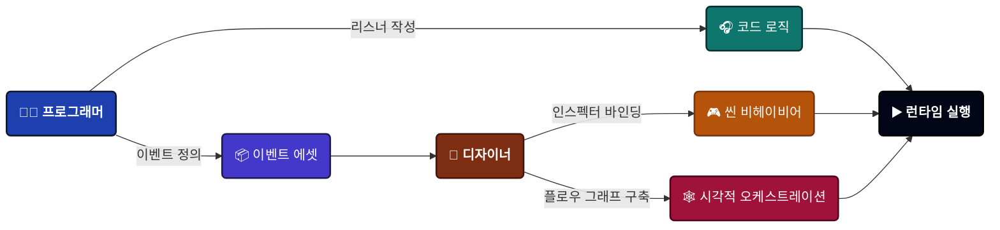

---
sidebar_label: 개요
sidebar_position: 1
---

# 게임 이벤트 시스템

혼란스러운 이벤트 관리를 유지보수와 테스트가 가능한 워크플로우로 전환해 주는, 유니티를 위한 상용화 수준의 시각적 이벤트 아키텍처입니다.

:::tip 개발자의 한마디
"제 프로젝트에서 '보이지 않는 스파게티 코드'와 싸우는 데 지쳐 이 시스템을 구축했습니다. 인디 개발자로서 성능 저하 없이 시각적 명확성과 강력한 코딩 제어권 사이의 균형을 맞출 수 있는 도구가 필요했습니다. **TinyGiants**는 제가 매일 게임 개발에 실제로 사용하는 전문가급 도구를 만들겠다는 약속입니다."
—  ***[TinyGiants]** (중국)*
:::

<div className="img-full-wrapper">


</div>


---

## 이 시스템이 존재하는 이유

:::danger 문제점
전통적인 유니티 개발 방식에서 이벤트는 보이지 않는 스파게티 코드가 되기 쉽습니다:

- **숨겨진 의존성**: 누가 리스닝하고 있는지, 어디서 트리거되는지 파악하기가 매우 어렵습니다.
- **런타임 오류**: 메서드 이름 하나만 바꿔도 10개의 씬 오브젝트가 먹통이 됩니다.
- **교차 씬(Cross-Scene)의 지옥**: 씬이 언로드될 때 이벤트가 유실되며, 곳곳에서 메모리 누수와 null 참조가 발생합니다.
- **가시성 부족**: 복잡한 이벤트 체인은 오직 개발자의 머릿속(그리고 오래된 주석)에만 존재합니다.

:::

:::success 해결책
**TinyGiants.GameEventSystem**은 **시각적 우선, 타입 안정성 보장**의 이벤트 아키텍처를 제공합니다:

✅ **에셋 기반 이벤트** - 스크립터블 오브젝트(ScriptableObject) 기반으로 GUID로 보호되며 리팩토링에도 안전합니다.

✅ **시각적 플로우 그래프** - 이벤트 체인, 트리거, 조건을 하나의 창에서 한눈에 확인할 수 있습니다.

✅ **리플렉션 비용 제로 런타임** - C++에 가까운 성능을 위해 익스프레션 트리(Expression Tree) 컴파일 방식을 사용합니다.

✅ **디자이너 친화적** - 드래그 앤 드롭 바인딩을 지원하여 단순한 워크플로우에는 코딩이 필요 없습니다.

✅ **전문가급 도구** - 실시간 모니터링, 레퍼런스 찾기, 코드 생성 자동화 도구를 제공합니다.

:::

---

## 핵심 철학: 하이브리드 워크플로우

이 시스템은 프로그래머와 디자이너 간의 **효율적인 분업**을 지향합니다:




| 역할              | 책임 범위                                               | 도구                                   |
| ----------------- | ------------------------------------------------------------ | -------------------------------------- |
| **프로그래머**    | 이벤트가 언제 발생하는지(`Raise()`)와 어떤 로직이 응답하는지 정의 | C# API, 리스너                      |
| **디자이너**      | 이벤트를 **씬 오브젝트**에 연결하고 **비헤이비어**를 설정 | 인스펙터 바인딩, `GameEventBehavior` |
| **테크 디자이너** | **복잡한 시퀀스**(지연, 체인, 조건)를 오케스트레이션 | 시각적 플로우 에디터                     |

**결과**: 이벤트 관계에 대한 완전한 가시성을 확보하면서 관심사를 깔끔하게 분리할 수 있습니다.

---

## 아키텍처 주요 특징

### 🏗️ 기반: 스크립터블 오브젝트(ScriptableObject) 기반

문자열 기반이나 싱글톤 이벤트 시스템과 달리, **이벤트가 일급 에셋(First-class asset)**으로 취급됩니다:

```csharp
// 이벤트는 '매직 스트링'이 아닌 에셋입니다.
[GameEventDropdown] public GameEvent onPlayerDeath;
[GameEventDropdown] public GameEvent<int> onScoreChanged;

void Die() {
    onPlayerDeath.Raise(); // 타입 안정성 보장, 에셋 참조 방식
}
```

**장점**:

- ✅ **완벽한 디커플링** - 송신자는 수신자를 알 필요가 없습니다. 한 번 발생시키면 다수에게 알립니다.
- ✅ **씬 간 지속성** - 씬이 로드되거나 언로드되어도 이벤트 바인딩이 유지됩니다.
- ✅ **GUID 고유 식별** - 파일 이름을 바꾸거나 폴더를 옮겨도 참조가 깨지지 않습니다.
- ✅ **멀티 데이터베이스 지원** - 대규모 팀을 위한 모듈식 조직화가 가능합니다.

<details>
<summary>📖 GUID 보호 작동 방식</summary>


모든 이벤트는 `.meta` 파일에 저장된 고유한 GUID를 가집니다:

```yaml
# PlayerDeath.asset.meta
guid: a7f3c21e9b4d8f6e2d1a9c8b7e6f5a4d
```

`PlayerDeath` 에셋의 이름을 `OnCharacterDied`로 바꿔도, 유니티는 GUID를 통해 참조를 유지합니다. **씬 링크가 깨질 걱정이 없습니다.**

</details>

---

### 🕸️ 시각적 플로우 오케스트레이션

이벤트 관계를 이해하기 위해 더 이상 코드를 뒤질 필요가 없습니다. **플로우 에디터**는 보이지 않는 로직을 관리 가능한 그래프로 바꿔줍니다:


#### 유스케이스

**🎯 트리거 (팬-아웃)**


**⛓️ 체인 (순차 실행)**


**🔀 하이브리드 플로우** 

병렬 로직과 순차 로직을 혼합


:::tip 시각적 도구의 장점

- **그룹 조직화** - 대규모 플로우를 위해 색상별 그룹 지정 가능
- **실시간 검증** - 연결 타입 체크 (녹색=유효, 빨간색=오류)
- **실행 취소/다시 실행 지원** - 완전한 히스토리 시스템 (Ctrl+Z/Y)
- **런타임 디버깅** - 플레이 모드에서 활성화된 노드 하이라이트

:::

---

### ⚡ 타입 안정성 및 리플렉션 프리 성능

유니티의 제네릭 직렬화 한계를 해결했습니다.

#### 문제점

```csharp
// ❌ 유니티는 이를 기본적으로 직렬화할 수 없습니다.
[SerializeField] private GameEvent<PlayerData> onPlayerDataChanged;
```

#### 해결책

```csharp
// ✅ 자동 생성된 구체 클래스 사용
[GameEventDropdown] public PlayerDataGameEvent onPlayerDataChanged;

// 생성된 코드 (자동):
[Serializable]
public class PlayerDataGameEvent : GameEvent<PlayerData> { }
```

**성능상 이점**:

- 🚀 **익스프레션 트리 컴파일** - 조건문이 시작 시 대리자(Delegate)로 컴파일되어 런타임 분석 비용이 없습니다.
- 🚀 **리플렉션 비용 없음** - `Invoke()`가 아닌 직접적인 메서드 호출 방식을 사용합니다.
- 🚀 **네이티브 인스펙터 지원** - `UnityEvent<T>`와 완벽하게 호환됩니다.

<details>
<summary>⚙️ 코드 생성 워크플로우</summary>


1. **타입 선택** - 생성기 창에서 커스텀 타입을 선택합니다.
2. **생성** - "Generate"를 클릭하여 구체 클래스를 생성합니다.
3. **컴파일** - 유니티가 새 코드를 자동으로 컴파일합니다.
4. **생성** - 이제 커스텀 타입에 대한 이벤트를 생성할 수 있습니다.

**소요 시간**: 약 10초. **장점**: 평생 보장되는 타입 안정성.

</details>

---

## 기능 매트릭스

### ⚓ 코어 아키텍처

| 기능 | 설명 |
| :------------------------- | :----------------------------------------------------------- |
| **에셋 기반 이벤트** | **GUID 식별** 기반의 스크립터블 오브젝트 아키텍처 — 이름 변경이나 파일 이동에도 참조가 유지됩니다. |
| **포괄적인 제네릭 지원** | `GameEvent<Void>`, `GameEvent<T>`, 그리고 소스 인지형 `GameEvent<TSender, TArgs>`를 기본 지원합니다. |
| **멀티 데이터베이스 시스템** | **동적 로드** 및 **상태 체크** 기능을 갖춘 여러 데이터베이스를 지원하는 모듈식 구조입니다. |
| **카테고리 시스템** | 대규모 이벤트 라이브러리 내에서 효율적인 검색과 필터링을 위한 문자열 기반 카테고리화 기능입니다. |
| **자동 정적 데이터 리셋** | 데이터 오염을 방지하기 위해 에디터 플레이 모드 시 정적 캐시를 자동으로 초기화합니다. |

### 🧠 고급 로직 및 플로우
| 기능 | 설명 |
| :------------------------ | :----------------------------------------------------------- |
| **익스프레션 트리** | **리플렉션 없는** 로직 평가; 조건문은 런타임에 고성능 대리자로 컴파일됩니다. |
| **시각적 로직 빌더** | 코드 없이 복잡한 **중첩 AND/OR 로직**과 동적 프로퍼티 비교를 구성할 수 있습니다. |
| **하이브리드 실행** | 하나의 그래프에서 병렬 **팬-아웃 트리거**와 순차적 **블로킹 체인**을 매끄럽게 혼합합니다. |
| **인자 트랜스포머** | 플로우 노드 사이에서 특정 오브젝트 프로퍼티를 동적으로 추출하여 인자로 전달합니다. |
| **세밀한 플로우 제어** | 노드별 지연, **비동기/코루틴 대기**, 루프 횟수 및 조건부 실행 게이트를 지원합니다. |

### 🎧 리스닝 및 바인딩
| 기능 | 설명 |
| :------------------------ | :----------------------------------------------------------- |
| **시각적 바인딩** | 시각적 상태 표시기와 타입 안정성을 갖춘 인스펙터 내 드래그 앤 드롭 방식의 **UnityEvent 연결**입니다. |
| **우선순위 리스너** | **정수 기반 정렬**을 통해 표준 UI/오디오 리스너보다 크리티컬한 시스템이 먼저 반응하도록 보장합니다. |
| **조건부 리스너** | 특정 논리적 기준을 충족할 때만 콜백이 실행되는 내장 **조건자(Predicate) 지원** 기능입니다. |
| **상주 리스너** | 씬 전환 중에도 활성 상태를 유지하는 **교차 씬 리스너**를 기본 지원합니다. |
| **동적 런타임 API** | 리스너 등록/해제 및 **태스크 핸들(Task Handles)** 관리를 위한 완전한 프로그래밍 제어권을 제공합니다. |

### 📊 도구 및 디버깅
| 기능 | 설명 |
| :--------------------- | :----------------------------------------------------------- |
| **대시보드 및 위자드** | **일괄 작업**을 위한 현대적인 UI와 빠른 이벤트 생성을 위한 유사 일치 위자드를 제공합니다. |
| **코드 자동화** | 자동 컴파일 파이프라인 통합 기능을 갖춘 **3중 모드 코드 생성기**(기본/커스텀/송신자)입니다. |
| **레퍼런스 파인더** | 특정 이벤트 에셋을 참조하는 컴포넌트 수준의 의존성을 씬 전체에서 정밀하게 스캔합니다. |
| **런타임 모니터** | **실행 시간(평균/최소/최대)**, 리스너 수, **GC 할당**에 대한 실시간 프로파일링을 지원합니다. |
| **자동화 트리** | 복잡한 로직 플로우를 디버깅하기 위해 활성 트리거 및 체인 계층 구조를 실시간으로 시각화합니다. |

------

## 성능 지표

실제 상용 빌드에서의 측정 수치:

| 시나리오 | 성능 | 비고 |
| ------------------------------- | ----------- | ---------------------------- |
| **이벤트 발생 (리스너 0개)** | ~0.001ms    | 사실상 비용 없음 |
| **이벤트 발생 (리스너 10개)** | ~0.02ms     | GC 할당 없음 |
| **조건 평가** | ~0.003ms    | 익스프레션 트리 컴파일 방식 |
| **플로우 노드 실행** | ~0.05ms     | 코루틴 오버헤드 포함 |
| **모니터 창 (이벤트 100개)** | ~0.3ms      | 에디터 전용, 런타임 비용 없음 |

:::success 상용 준비 완료
씬 전체에 걸쳐 **500개 이상의 이벤트**와 **10,000개 이상의 리스너**가 있는 출시 프로젝트에서 테스트되었습니다. 성능 저하가 전혀 발생하지 않았습니다.
:::

------

## 🗺️ 네비게이션 가이드맵

이 맵은 시스템 문서에 대한 전체 개요를 제공합니다. 아래 표를 사용하여 필요한 특정 기능이나 튜토리얼로 빠르게 이동하세요.

:::info 추천 학습 경로

- 🚀 **빠른 시작**: [**예제: 퀵 스타트**](../examples/00-quick-start.md)로 바로 이동하세요.
- 🎨 **시각적 학습**: [**시각적 워크플로우**](#visual-workflow) 및 [**플로우 오케스트레이션**](#flow-orchestration) 표에 집중하세요.
- 💻 **개발자 심화**: [**런타임 API**](#runtime-api) 섹션으로 바로 이동하세요.

:::

### 🏁 1. 소개 {#introduction}

에셋 기반 이벤트 아키텍처의 기본 설정과 핵심 철학입니다.

| 페이지 | 설명 |
| :---------------------------------------------- | :----------------------------------------------------------- |
| [**프로젝트 구조**](./project-structure.md) | 디렉토리 레이아웃, 폴더 보호 및 모듈식 조직화 이해하기. |
| [**설치 가이드**](./installation.md) | 플러그인 초기화 및 자동 정적 리셋 파이프라인 설정하기. |

### 💎 2. 시각적 워크플로우 {#visual-workflow}

보이지 않는 코드를 실질적인 시각적 대시보드로 변환해 주는 관리 도구입니다.

| 페이지 | 설명 |
| :----------------------------------------------------------- | :----------------------------------------------------------- |
| [**시스템 대시보드**](../visual-workflow/game-event-system.md) | 에셋 기반 워크플로우 및 GUID 식별 시스템 개요 |
| [**데이터베이스 및 플로우 그래프**](../visual-workflow/game-event-manager.md) | 멀티 데이터베이스/플로우 그래프 설정 및 데이터베이스 상태 유지 관리 |
| [**게임 이벤트 편집**](../visual-workflow/game-event-editor.md) | 대시보드를 사용한 일괄 편집, 검색 및 카테고리화 |
| [**게임 이벤트 생성**](../visual-workflow/game-event-creator.md) | 유사 검색 일괄 위자드를 사용한 빠른 이벤트 에셋 생성 |
| [**게임 이벤트 설정**](../visual-workflow/game-event-behavior.md) | 시각적 상태 표시기와 타입 안정성을 갖춘 인스펙터 바인딩 마스터하기 |
| [**게임 이벤트 발생**](../visual-workflow/game-event-raiser.md) | 내장된 GameEventDropdown 속성을 사용하여 이벤트 호출 및 인스펙터 개선하기 |
| [**게임 이벤트 찾기**](../visual-workflow/game-event-finder.md) | 컴포넌트 수준의 이벤트 의존성을 찾기 위해 씬 스캔하기 |
| [**비주얼 조건ツリー**](../visual-workflow/visual-condition-tree.md) | 조건ツリー 설정을 통해 이벤트 액션의 로직 실행 제어하기 |

### 🕸️ 3. 플로우 오케스트레이션 {#flow-orchestration}

노드를 사용하여 복잡한 다단계 로직 시퀀스를 시각화하고 구축합니다.

| 페이지 | 설명 |
| :----------------------------------------------------------- | :----------------------------------------------------------- |
| [**노드 에디터**](../flow-graph/game-event-node-editor.md) | GraphView 캔버스, 그룹, 스냅샷 기반의 Undo/Redo 관리하기 |
| [**노드 커넥터**](../flow-graph/game-event-node-connector.md) | 하이브리드 실행 모드 규칙 및 실시간 연결 검증 |
| [**노드 비헤이비어**](../flow-graph/game-event-node-behavior.md) | 노드 수준의 지연, 루프 및 인자 변환 로직 설정하기 |
| [**고급 로직 패턴**](../flow-graph/advanced-logic-patterns.md) | 코드 없는 중첩 로직 그룹 및 조건부 실행 게이트 구축하기 |

### 💻 4. 스크립팅 및 API {#runtime-api}

고성능 C# 통합 및 ライフサイクル 관리를 위한 개발자 가이드입니다.

| 페이지 | 설명 |
| :----------------------------------------------------------- | :----------------------------------------------------------- |
| [**발생 및 스케줄링**](../scripting/raising-and-scheduling.md) | 프로그래밍 방식의 호출, 지연 실행 및 태스크 핸들 관리 |
| [**리스닝 전략**](../scripting/listening-strategies.md) | 우선순위 지정, 상주형 및 소스 인지형(Sender) 리스너 구현하기 |
| [**프로그래매틱 플로우**](../scripting/programmatic-flow.md) | 리플렉션 없는 로직 필터링을 위한 익스프레션 트리 기반 조건자 사용하기 |
| [**베스트 프랙티스**](../scripting/best-practices.md) | 깔끔한 디커플링과 데이터 오염 방지를 위한 아키텍처 팁 |
| [**API 레퍼런스**](../scripting/api-reference.md) | 모든 핵심 클래스 및 속성에 대한 상세 기술 문서 |

### 🛠️ 5. 도구 및 지원 {#tools-support}

전문적인 제작 환경을 위한 자동화 및 모니터링 유틸리티입니다.

| 페이지 | 설명 |
| :----------------------------------------------------------- | :----------------------------------------------------------- |
| [**코드 생성 및 정리**](../tools/codegen-and-cleanup.md) | 3중 모드 생성기 및 컴파일 파이프라인 자동화 사용하기 |
| [**런타임 모니터**](../tools/runtime-monitor.md) | 실시간 성능 프로파일링, 상세 로깅 및 경고 시스템 |
| [**커뮤니티 및 지원**](../tools/community-and-support.md) | 업데이트 확인, 버그 보고 및 기술 지원 받기 |

### 📚 6. 예제 {#examples}

기초부터 고급 API 사용까지 모든 시나리오를 다루는 즉시 사용 가능한 실습용 씬입니다.

| ID | 예제 페이지 | 핵심 학습 포인트 |
| :--- | :----------------------------------------------------------- | :----------------------------------------------------------- |
| 00 | [**퀵 스타트**](../examples/00-quick-start.md) | 이벤트 생성, 발생 및 바인딩을 위한 최소한의 워크플로우 |
| 01 | [**Void 이벤트**](../examples/01-void-event.md) | "레벨 시작"과 같은 글로벌 트리거를 위해 인자 없는 신호 사용하기 |
| 02 | [**기본 타입 이벤트**](../examples/02-basic-types-event.md) | 이벤트를 통해 기본 데이터(int, float, string) 전달하기 |
| 03 | [**커스텀 타입 이벤트**](../examples/03-custom-type-event.md) | 직렬화된 커스텀 데이터 클래스 및 구조체를 위해 CodeGen 활용하기 |
| 04 | [**커스텀 송신자 이벤트**](../examples/04-custom-sender-event.md) | 신호를 보낸 엔티티를 식별하기 위해 소스 인지형 이벤트 사용하기 |
| 05 | [**우선순위 이벤트**](../examples/05-priority-event.md) | 여러 리스너의 실행 순서를 정밀하게 제어하기 |
| 06 | [**조건부 이벤트**](../examples/06-conditional-event.md) | 기준을 충족할 때만 콜백을 실행하기 위해 조건자 사용하기 |
| 07 | [**지연 이벤트**](../examples/07-delayed-event.md) | 타이밍 로직 관리 및 취소를 위해 태스크 핸들 사용하기 |
| 08 | [**반복 이벤트**](../examples/08-repeating-event.md) | 반복적인 펄스 신호 및 자동화된 로직 루프 생성하기 |
| 09 | [**상주 이벤트**](../examples/09-persistent-event.md) | 씬 전환 중에도 이벤트 처리하기 (DontDestroyOnLoad) |
| 10 | [**트리거 이벤트**](../examples/10-trigger-event.md) | 유니티의 물리 시스템과 게임 이벤트 에셋 연결하기 |
| 11 | [**체인 이벤트**](../examples/11-chain-event.md) | 플로우 오케스트레이션 그래프를 사용하여 시각적 순차 로직 구축하기 |
| 12 | [**멀티 데이터베이스**](../examples/12-multi-database.md) | 모듈식 프로젝트 구성을 위해 이벤트를 다른 에셋으로 분리하기 |
| 13 | [**런타임 API**](../examples/13-runtime-api.md) | C# 스크립트를 통해 동적으로 리스너 등록 및 해제하기 |
| 14 | [**런타임 모니터**](../examples/14-runtime-monitor.md) | 실행 타이밍과 GC 할당 디버깅을 위해 프로파일링 도구 사용하기 |

:::tip 탐색 팁
실습을 시작하려면 **예제 00 (퀵 스타트)**를 먼저 따라 해본 다음, **시각적 워크플로우** 섹션을 살펴보며 에디터 도구가 개발 속도를 어떻게 높여주는지 확인해 보시는 것을 권장합니다.
:::