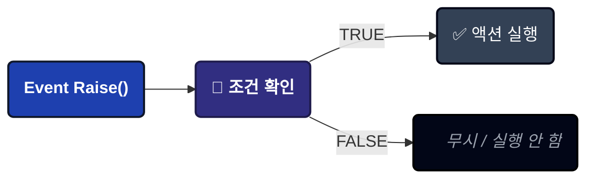
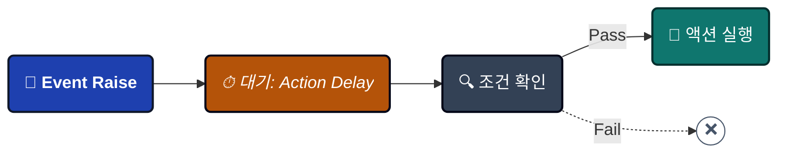
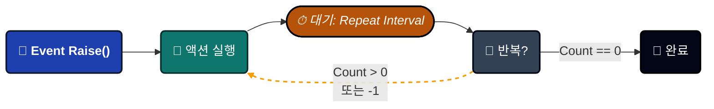
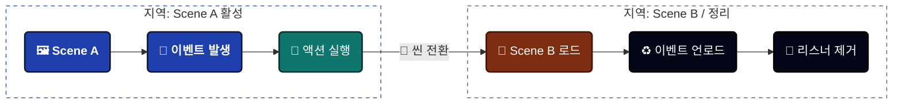

---
sidebar_label: '게임 이벤트 설정'
sidebar_position: 5
---

import Tabs from '@theme/Tabs';

import TabItem from '@theme/TabItem';


# 게임 이벤트 비헤이비어 (Game Event Behavior)

이벤트가 발생할 때 **어떤 일이 일어날지** 정의합니다. 맹목적으로 실행되는 기존 이벤트 시스템과 달리, 이 시스템을 사용하면 조건, 지연, 루프 및 시각적 액션을 이벤트 에셋 자체에 직접 연결할 수 있습니다.


---

## 🚀 비헤이비어 창 열기

**[게임 이벤트 에디터](./game-event-editor.md)**에서 접근할 수 있습니다:
```
게임 이벤트 에디터 → 이벤트 행의 비헤이비어 버튼(색상 알약 모양)을 클릭
```

**버튼 색상 상태**:

| 색상 | 아이콘 | 의미 | 상세 내용 |
| -------- | ---- | -------------------------- | -------------------------------------------- |
| 🟢 녹색 | ✓ | 설정됨 (인스펙터) | 매니저에 UnityEvent 액션이 있음 |
| 🔵 파란색 | ▶ | 런타임 활성 (플레이 모드) | `AddListener()`를 통한 코드 기반 리스너가 있음 |
| 🟡 주황색 | ⚠ | 설정되지 않음 | 액션이나 리스너가 없음 |

**버튼 라벨**: 이벤트 타입 시그니처를 표시합니다 (예: `<void>`, `<int>`, `<GameObject, DamageInfo>`)

---

## 📋 창 개요

비헤이비어 창은 네 개의 주요 섹션으로 나뉩니다:

1. **이벤트 정보 (Event Information)** - ID 확인 (이름, 카테고리, GUID)
2. **액션 조건 (Action Condition)** - 시각적 로직 트리 (실행 게이트)
3. **이벤트 액션 (Event Action)** - UnityEvent 콜백 (실행할 내용)
4. **스케줄 설정 (Schedule Configuration)** - 타이밍 제어 (지연, 루프, 지속성)

---

## 1️⃣ 이벤트 정보

편집 중인 이벤트가 올바른지 확인하기 위한 읽기 전용 요약입니다.


**표시 데이터**:
- **이벤트 이름 (Event Name)**: 에셋 이름
- **카테고리 (Category)**: 조직화된 그룹
- **GUID**: 고유 내부 식별자 (이름 변경 시에도 유지됨)

:::tip GUID가 중요한 이유
GUID는 이벤트를 리네임하더라도 참조가 그대로 유지되도록 보장합니다. 에디터에서 안전한 이름 변경이 가능한 이유가 바로 이것입니다!
:::

---

## 2️⃣ 액션 조건 (실행 게이트)

**로직 엔진**: 이 조건들이 `TRUE`로 평가될 때만 액션이 실행됩니다.


### 기능 설명

런타임 값에 따라 **액션 실행 여부**를 제어합니다:




### 시각적 로직 트리

코드 없이 다음과 같은 기능을 사용하여 복잡한 불리언 로직을 구축하십시오:

- **그룹 (Groups)**: AND/OR 로직으로 조건 결합
- **비교 (Comparisons)**: 개별 확인 (예: `Health < 20`)
- **중첩 (Nesting)**: 그룹 내 그룹 생성 (깊이 제한 없음)

### 성능

:::tip 리플렉션 오버헤드 제로
조건은 초기화 시 **익스프레션 트리(Expression Trees)**로 컴파일됩니다. 직접 작성한 C# 코드만큼 빠르게 실행됩니다!
:::

### 더 알아보기

시각적 조건 트리는 다양한 기능을 갖춘 강력한 시스템입니다:

- **4가지 소스 타입**: 이벤트 인자, 씬 타입, 랜덤, 상수
- **10가지 비교 연산자**: 숫자, 문자열, 컬렉션 확인
- **Bool 메서드 지원**: 커스텀 `bool` 메서드를 조건으로 사용
- **드래그 앤 드롭 순서 변경**: 시각적으로 로직 구성
- **타입 검증**: 호환되지 않는 비교를 자동 감지

**📖 전체 가이드**: **[시각적 조건 트리](./visual-condition-tree.md)**

---

## 3️⃣ 이벤트 액션 (콜백 레이어)

**액션**은 이벤트가 트리거되고 모든 조건이 충족되면 실행되는 Unity 콜백을 정의합니다.


### 🧩 UnityEvent 필드 이해하기

시스템은 유니티 고유의 **UnityEvent** 아키텍처를 활용하여 기존 MonoBehaviour 및 UI 컴포넌트와 원활하게 통합됩니다.

------

#### 🔘 매개변수 없는 이벤트 (`GameEvent`)

*표준 트리거 전용 로직.*

| 타입 | 백엔드 필드 | 호환성 |
| --------- | ------------------- | ---------------------------------------- |
| **로직** | `UnityEvent (void)` | 🟢 **매개변수가 없는** 모든 메서드를 수용합니다. |

**예시:** OnGameStart ➔ AudioManager.PlayBGM(), UI.FadeIn()

------

#### 🔢 단일 매개변수 이벤트 (`GameEvent<T>`)

*데이터 기반 로직. 데이터를 리스너에게 직접 전달합니다.*

| 타입 | 백엔드 필드 | 호환성 |
| --------- | --------------- | --------------------------------------------------- |
| **로직** | `UnityEvent<T>` | 🟡 T 타입의 **매개변수가 하나인** 메서드를 수용합니다. |

**예시:** OnHealthChanged(float) ➔ HealthBar.UpdateFill(float)

------

#### 👥 송신자 이벤트 (`GameEvent<TSender, TArgs>`)

*컨텍스트 인지 로직. 소스(보낸 이)와 데이터 페이로드를 모두 전달합니다.*

| 타입 | 백엔드 필드 | 호환성 |
| --------- | ---------------------------- | ------------------------------------------ |
| **로직** | `UnityEvent<TSender, TArgs>` | 🔵 **두 개의 매개변수**를 가진 메서드를 수용합니다. |

**예시:** OnDamage(GameObject, int) ➔ VFXManager.SpawnAt(GameObject.pos), Popup.Show(int)

:::info **기본 통합**
**네이티브 UnityEvents**를 사용하기 때문에 인스펙터에서 직접 리스너를 할당하거나 코드를 통해 AddListener()를 사용할 수 있습니다. **정적(Static)** 및 **동적(Dynamic)** 호출을 모두 지원합니다.
:::

:::tip **시그니처 매칭**
인스펙터 UI는 런타임 에러를 방지하기 위해 이벤트의 시그니처와 일치하는 함수만 표시하도록 메서드 목록을 자동으로 필터링합니다.
:::

------

### ➕ 액션 추가하기 (워크플로우)


유니티 인스펙터를 통해 로직을 연결하려면 다음 세 단계를 따르십시오.

#### 1️⃣ 타겟 오브젝트 할당

로직이 포함된 GameObject 또는 컴포넌트를 **Object** 슬롯에 **드래그 앤 드롭**하십시오.

- 🖱️ **액션:** Hierarchy에서 드래그 ➔ 빈 슬롯에 드롭.
- 📦 **결과:** 필드가 이제 해당 스크립트의 특정 인스턴스를 참조합니다.

#### 2️⃣ 콜백 메서드 선택

**Function 드롭다운**을 클릭하여 할당된 오브젝트에서 사용 가능한 모든 퍼블릭 메서드를 찾아보십시오.

- 🔍 **액션:** No Function 클릭 ➔ 원하는 스크립트/컴포넌트로 이동.
- ⚡ **팁:** **이벤트 시그니처**(예: void, int)와 일치하는 메서드만 상단에 나타나 선택이 쉽습니다.

#### 3️⃣ 매개변수 매핑 정의

이벤트의 실시간 데이터를 사용할지 아니면 고정된 값을 사용할지 결정하십시오.

- ⚖️ **Dynamic 호출:** 이벤트가 보낸 **런타임 값**을 사용합니다 (예: 실제로 입힌 데미지 양).
- ⚙️ **Static 매개변수:** 인스펙터에서 수동으로 정의한 **고정 값**을 사용합니다.

------

### 💡 동적(Dynamic) vs. 정적(Static): 무엇을 선택해야 하나요?

| 모드 | 시각적 아이콘 | 적합한 용도... |
| ----------- | ----------- | ------------------------------------------------------------ |
| **동적** | 🚀 | 실시간 데이터 (예: 현재 HP로 체력 바 업데이트). |
| **정적** | 📌 | 고정된 트리거 (예: 콘솔에 "버튼 클릭됨" 로그 남기기). |

:::tip **전문가 팁**
드롭다운 메뉴에서 **Dynamic** 메서드는 항상 메뉴의 **상단**에 나열됩니다. 메서드가 보이지 않는다면 매개변수 타입이 정확히 일치하는지 확인하십시오!
:::

---

### 동적(Dynamic) vs 정적(Static) 함수

**동적(Dynamic)** (이벤트 데이터 포함):
```csharp
// 이벤트 매개변수를 받습니다.
public void TakeDamage(float amount) {
    health -= amount;
}

// 송신자(Sender) 이벤트용
public void OnDamageReceived(GameObject attacker, DamageInfo info) {
    // 송신자와 인자를 모두 사용합니다.
}
```

**정적(Static)** (이벤트 데이터 무시):
```csharp
// 매개변수가 필요 없습니다.
public void PlaySound() {
    audioSource.Play();
}
```

**상황별 사용 가이드**:

| 이럴 때 Dynamic 사용            | 이럴 때 Static 사용        |
| --------------------------- | ---------------------- |
| 이벤트 데이터가 필요할 때   | 알림만 필요할 때 |
| float/int 값을 처리할 때 | 사운드/이펙트를 재생할 때 |
| 송신자 참조를 확인할 때   | 애니메이션을 트리거할 때  |
| 데이터 기반 반응이 필요할 때       | 상태를 변경할 때          |

---

### 다중 액션 및 우선순위

**다중 추가**: + 버튼을 반복해서 클릭하여 더 많은 액션을 추가하십시오.

**실행 순서**: 위에서 아래로 실행됩니다.

**순서 변경**: 각 액션 왼쪽의 ☰ 핸들을 드래그하십시오.

**예시**:

```csharp
📜 LogDamageEvent() ➔ 
    🥇 첫 번째 (메타데이터/로깅)
🎵 PlayHitSound() ➔ 
    🥈 두 번째 (오디오/VFX 피드백)
📊 UpdateHealthBar(float) ➔ 
    🥉 세 번째 (UI/시각적 표현)
🏁 CheckDeathCondition() ➔ 
    🏆 마지막 (게임 상태 로직)
```

---

### 모든 액션 지우기

우측 상단의 **"Clear All"** 버튼을 클릭하여 모든 액션을 한 번에 제거할 수 있습니다.

⚠️ **확인 창 표시**: "정말로 삭제하시겠습니까?"

---

## 4️⃣ 스케줄 설정 (Schedule Configuration)

**스케줄** 레이어는 이벤트가 발생한 후 액션이 **언제**, **얼마나 자주** 실행될지를 결정합니다.


<Tabs>
<TabItem value="delay" label="⏱️ 액션 지연" default>

### 액션 지연 (Action Delay)

**시간 오프셋.** 이벤트 트리거와 실제 실행 사이에 간격을 둡니다.

- 🕒 **값:** float (초 단위)
- 🎯 **목적:** 애니메이션, VFX 또는 지연된 게임 로직과 동기화합니다.

**작동 방식:**

1. 🔔 **이벤트 발생** ➔ 신호를 수신합니다.
2. ⏳ **지연 중** ➔ 지정된 X초 동안 시스템이 대기합니다.
3. 🔍 **조건 확인** ➔ 대기 *이후*에 조건을 다시 검증합니다.
4. 🚀 **실행** ➔ 조건이 여전히 충족될 때만 액션이 실행됩니다.



</TabItem>

<TabItem value="interval" label="🔄 반복 간격">

### 반복 간격 (Repeat Interval)

**자동 루프.** 수동 개입 없이 이벤트가 주기적으로 다시 발생하도록 합니다.

- 🕒 **매개변수:** float (초 단위)
- 🔄 **로직:** 반복 사이클의 "틱 레이트(tick rate)"를 결정합니다.

**값 매핑:**

- 0.0s ➔ 🚫 **비활성화** (단발성 실행)
- \> 0s ➔ 🔁 **활성 루프** (X초마다 실행)

:::info **지연(Delay)과의 상호작용**
**지연(Delay)**과 **간격(Interval)**이 모두 설정된 경우, 첫 번째 실행은 지연 시간을 따르고 이후 반복은 간격 시간을 따릅니다.
:::

</TabItem>

<TabItem value="count" label="🔢 반복 횟수">

### 반복 횟수 (Repeat Count)

**라이프사이클 제어.** 이벤트가 반복될 수 있는 횟수를 제한합니다.

**설정 가이드:**

| 값 | 동작 | 총 실행 횟수 |
| ----- | ------------------- | ----------------------- |
| 0 | **반복 없음** | 1 (최초 실행만) |
| N | **유한 루프** | 1 + N |
| -1 | **무한 루프** ♾️ | 중지/파괴될 때까지 |

**UI 표시:**
-1로 설정하면 **↺ Reset** 버튼이 나타납니다. 이를 클릭하여 횟수를 빠르게 1로 되돌릴 수 있습니다.



</TabItem>

<TabItem value="persistent" label="🛡️ 상주 이벤트">

### 상주 이벤트 (Persistent Event)

**씬 생존.** 새로운 유니티 씬이 로드될 때 이벤트 오브젝트가 파괴되지 않고 유지될지 결정합니다.

🔳 **체크 해제 (기본값):** 씬 로드 시 이벤트가 파괴됩니다 (표준 동작).



☑️ **체크 시:** DontDestroyOnLoad처럼 동작합니다.

```mermaid
graph LR

    classDef sceneA fill:#1e40af,stroke:#0f172a,stroke-width:2px,color:#ffffff,font-weight:bold
    classDef action fill:#0f766e,stroke:#042f2e,stroke-width:2px,color:#ffffff
    classDef transition fill:#7c2d12,stroke:#431407,stroke-width:2px,color:#ffffff
    classDef persistence fill:#b45309,stroke:#020617,stroke-width:2px,color:#ffffff,font-weight:bold
    classDef success fill:#0f766e,stroke:#042f2e,stroke-width:2px,color:#ffffff

    subgraph Scene_A [지역: Scene A 활성]
        direction LR
        A(🖼️ Scene A):::sceneA --> B(🔔 이벤트 발생):::sceneA
        B --> C(🚀 액션 실행):::action
    end
    style Scene_A fill:none,stroke:#1e40af,stroke-dasharray: 5 5

    C -- "✨ DontDestroyOnLoad" --> D(🚚 Scene B 로딩):::transition

    subgraph Scene_B [지역: Scene B - 유지됨]
        direction LR
        D --> E(🛡️ 이벤트 상주함):::persistence
        E --> F(💎 리스너 유지됨):::persistence
        F --> G(🔥 발생 대기):::success
    end
    style Scene_B fill:none,stroke:#0f766e,stroke-dasharray: 5 5
```



**주요 활용 사례:**

| ✅ Persistent 권장 사례       | ❌ 권장하지 않는 사례             |
| -------------------------- | --------------------------- |
| 🎵 **글로벌 BGM 매니저**   | 🏰 레벨별 퍼즐 로직    |
| 💾 **저장/로드 시스템**     | 👾 씬 전용 AI 경로 탐색 |
| 🏆 **업적 트래커** | 🖼️ 로컬 메뉴 애니메이션     |
| 🌐 **멀티플레이어 상태**    | 🔦 임시 구역 조명 효과   |

:::warning **⚠️ 중요: 의존성 주입 (Dependency Injection)**
상주 이벤트는 씬 전환 후에 특정 씬의 오브젝트에 대한 참조를 유지할 수 **없습니다**. OnSceneLoaded 이후에 **의존성 주입(Dependency Injection)**이나 **서비스 로케이터(Service Locator)**를 통해 새로운 씬 오브젝트를 상주 이벤트에 다시 바인딩해야 합니다.
:::

</TabItem>
</Tabs>

---

## ❓ 문제 해결

### 액션이 실행되지 않음

**문제**: 이벤트가 발생했는데 아무 일도 일어나지 않습니다.

**체크리스트**:

✅ **조건 확인**:
```
1. 조건이 활성화되어 있습니까? (조건 섹션의 토글 확인)
2. 조건이 TRUE로 평가됩니까?
3. 조건 로직을 테스트하십시오 - '시각적 조건 트리' 가이드를 참조하십시오.
4. Debug.Log()를 추가하여 값을 확인하십시오.
```

✅ **액션 확인**:
```
1. UnityEvent 필드가 비어 있습니까? 액션을 추가하십시오!
2. 타겟 GameObject가 파괴되었습니까?
3. 타겟 컴포넌트가 비활성화되었습니까?
4. 콘솔에 에러가 있는지 확인하십시오.
```

✅ **스케줄 확인**:
```
1. 액션 지연 시간이 너무 길지 않습니까?
2. 반복 간격 설정이 의도와 다르게 되어 있습니까?
3. 필요하지 않은데 이벤트가 Persistent로 설정되어 있습니까?
```

---

### "Field Not Found" 경고

**문제**: `Field 'IntGameEventAction' not found.`

**원인**: 이벤트 타입에 바인딩 코드가 누락되었습니다.

**해결 방법**:

**"Force Rebuild All (Fix Missing Bindings)"** 버튼을 클릭하십시오.

그러면 모든 바인딩 필드가 재생성됩니다:
```
Assets/TinyGiantsData/GameEventSystem/CodeGen/Basic/
└─ IntGameEvent.cs (바인딩 필드가 포함되어 재생성됨)
```

**컴파일 완료 후**: 비헤이비어 창을 다시 여십시오.

---

### 액션이 여러 번 실행됨

**문제**: 액션이 예상보다 더 많이 실행됩니다.

**일반적인 원인**:

**원인 1: 반복 설정**
```
확인 사항:
- Repeat Interval > 0?
- Repeat Count > 0?

그렇다면 이벤트가 의도적으로 혹은 실수로 루프되고 있는 것입니다.
```

**원인 2: 중복된 이벤트 발생**
```
코드에서 이벤트가 여러 번 발생하고 있습니다:
  OnHealthChanged.Raise(newHealth);  ← 반복적으로 호출됨

해결 방법: 필요할 때만 이벤트가 발생하도록 로직을 수정하십시오.
```

**원인 3: 중복된 리스너**
```
동일한 액션이 UnityEvent에 여러 번 추가되었습니다.

해결 방법: 액션 목록을 확인하고 중복 항목을 제거하십시오.
```

---

:::tip 다음 단계
이제 이벤트 비헤이비어를 이해했으므로, **[시각적 조건 트리](./visual-condition-tree.md)**를 탐구하여 고급 조건부 로직을 마스터하십시오. 또는 **[플로우 에디터](../flow-graph/game-event-node-editor.md)**로 이동하여 이벤트 오케스트레이션을 구축해 보십시오!
:::