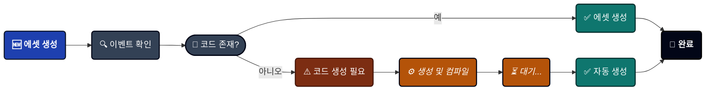
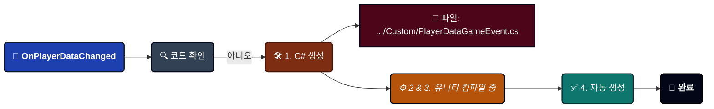

---
sidebar_label: '게임 이벤트 생성'
sidebar_position: 4
---

import Tabs from '@theme/Tabs';

import TabItem from '@theme/TabItem';

import VideoGif from '@site/src/components/Video/VideoGif';


# 게임 이벤트 생성기

고속 이벤트 생성 위자드입니다. 이 전문 도구는 일괄 이벤트 생성, 자동 코드 컴파일, ScriptableObject 제작을 하나의 효율적인 워크플로우로 처리합니다.

<VideoGif src="/video/game-event-system/event-create.mp4" />


---

## 🚀 생성기 열기

생성기는 **[게임 이벤트 에디터](./game-event-editor.md)**에서만 열 수 있습니다:
```
게임 이벤트 에디터 → 우측 상단의 "+ New Event" 버튼 클릭
```

:::info 왜 에디터에서만 열 수 있나요?
생성기는 이벤트를 추가할 데이터베이스를 알아야 합니다. 에디터에서 열면 적절한 컨텍스트가 보장됩니다.
:::

---

## 🗺️ 인터페이스 구역

창은 네 개의 기능 영역으로 구성되어 있습니다:

| 구역                      | 위치  | 용도                                                 |
| ------------------------- | --------- | ------------------------------------------------------- |
| **A. 이벤트 모드 탭**    | 상단       | Void, 단일 매개변수 또는 송신자(Sender) 이벤트 간 전환 |
| **B. 설정 영역** | 중간    | 타입 선택 및 이벤트 세부 사항 설정                |
| **C. 이벤트 큐**       | 하단    | 생성 전 대기 중인 이벤트 검토                   |
| **D. 상태 배지**       | 우측 상단 | 총 대기열 수 표시 (예: "7 Queued Total")       |

---

## 🎭 세 가지 이벤트 모드

필요에 맞는 아키텍처를 선택하세요:

<Tabs>
<TabItem value="void" label="1. 매개변수 없음" default>

### 매개변수 없는 이벤트

**타입**: `GameEvent` (Void)

데이터 없이 알림만 전달하는 가장 단순한 신호입니다.


**적합한 용도**:
```
🖱️ UI 트리거 ➔ OnPauseButtonClick, OnMenuOpen
🌍 글로벌 상태 ➔ OnGameStart, OnLevelComplete
🏃 단순 액션 ➔ OnJump, OnFire, OnInteract
```

**사용 방법**:
1. **"Add Event"** 버튼 클릭
2. 대기열에 기본 이름 "NewEvent"로 이벤트가 나타남
3. 대기열에서 이름 변경 (예: "OnGameStart")
4. 원하는 경우 카테고리 설정 (예: "Core")
5. 하단의 **"Create X Event(s)"** 클릭

**타입 선택 불필요**: 매개변수가 없으므로 클릭하여 추가하기만 하면 됩니다.

</TabItem>

<TabItem value="single" label="2. 단일 매개변수">

### 단일 매개변수 이벤트

**타입**: `GameEvent<T>`

알림과 함께 한 가지 데이터를 전달합니다.


**적합한 용도**:
```
📈 값 변경 ➔ OnHealthChanged(float), OnScoreUpdated(int)
🔄 상태 업데이트 ➔ OnGameStateChanged(GameState)
📦 오브젝트 이벤트 ➔ OnEnemySpawned(GameObject)
💾 데이터 동기화 ➔ OnPlayerDataChanged(PlayerData)
```

**추가하는 두 가지 방법**:

#### 방법 1: 빠른 추가 - 기본 타입

내장된 유니티 타입(int, float, Vector3, GameObject 등)의 경우:

1. 드롭다운에서 **타입 선택** (모든 32개 기본 타입 표시)
2. **"Add"** 버튼 클릭
3. 이벤트가 자동으로 대기열에 추가됨

**사용 가능한 기본 타입**:
- C# 기본형: `int`, `float`, `bool`, `string` 등
- 수학 타입: `Vector2`, `Vector3`, `Quaternion`, `Color` 등
- 컴포넌트: `GameObject`, `Transform`, `Rigidbody` 등
- 에셋: `Sprite`, `Material`, `AudioClip` 등

---

#### 방법 2: 검색 - 커스텀 타입

직접 만든 C# 클래스의 경우:

1. **검색바에 입력** (예: "PlayerData")
2. 시스템이 프로젝트 내의 모든 직렬화 가능한 타입을 검색
3. 타입 옆의 **"Add"** 클릭
4. 이벤트가 대기열에 추가됨

**검색 기능**:
- ✅ 퍼지 매칭 (유사 검색) 지원 ("plr" 입력 시 "PlayerData" 찾음)
- ✅ 중복 방지를 위해 네임스페이스 표시
- ✅ 이 타입의 이벤트가 몇 개 대기열에 있는지 배지로 표시
- ✅ 추가 시 녹색 플래시 효과

**커스텀 타입 요구 사항**:
```csharp
// ✅ 작동함
[System.Serializable]
public class PlayerData {
    public string playerName;
    public int level;
}

// ❌ 검색에 나타나지 않음
public class NonSerializableClass { } // [Serializable] 누락
```

</TabItem>

<TabItem value="sender" label="3. 송신자 포함">

### 송신자(Sender) 이벤트

**타입**: `GameEvent<TSender, TArgs>`

**누가 실행했는지**(sender)와 **무슨 일이 일어났는지**(argument)를 모두 전달합니다.


**적합한 용도**:
```
⚔️ 전투 ➔ OnDamageTaken(GameObject victim, DamageInfo damage)
🤝 상호작용 ➔ OnItemPickedUp(Player player, ItemID item)
🌐 네트워킹 ➔ OnPlayerJoined(NetworkPlayer sender, string playerName)
📜 복잡한 이벤트 ➔ OnQuestCompleted(QuestGiver npc, QuestData quest)
```

**권장 패턴**:
- **TSender** = 행위자/소스 (`GameObject`, `Player`, `Enemy`)
- **TArgs** = 데이터/페이로드 (`int`, `DamageInfo`, `Vector3`)

**사용 방법**:

1. **송신자(Sender) 타입 선택**:
   - 기본 타입 드롭다운에서 선택 또는
   - 커스텀 타입 검색
   - 준비되면 "Select" 클릭

2. **인자(Argument) 타입 선택**:
   - 기본 타입 드롭다운에서 선택 또는
   - 커스텀 타입 검색
   - 준비되면 "Select" 클릭

3. **이벤트 추가**:
   - 파란색 버튼 나타남: "Add Event: GameObject → int" (예시)
   - 클릭하여 대기열에 추가

**선택된 타입 표시**:

타입을 선택하면 녹색 상자에 나타납니다:
```
✅ Selected Sender: GameObject <small>(UnityEngine)</small>
✅ Selected Argument: DamageInfo <small>(YourGame.Combat)</small>
```

**×**를 클릭하여 지우고 다른 타입을 선택할 수 있습니다.

</TabItem>
</Tabs>

---

## 📦 일괄 생성 워크플로우

생성기의 강점은 **일괄 처리**입니다. 하나씩 만들지 않고 여러 이벤트를 한 번에 생성할 수 있습니다.

### 단계별 프로세스

#### 1️⃣ 이벤트 대기열 추가

다양한 모드에서 여러 이벤트를 추가합니다:
```
🔘 매개변수 없음으로 전환 ➔ OnGameStart 추가  
🔘 매개변수 없음으로 전환 ➔ OnGamePause 추가  
🔢 단일 매개변수(int)로 전환 ➔ OnScoreChanged 추가  
🌊 단일 매개변수(float)로 전환 ➔ OnHealthChanged 추가  
👥 송신자 <GameObject,int>로 전환 ➔ OnEnemyDamaged 추가  

대기열 합계: 생성 보류 중인 이벤트 5개
```

**시각적 피드백**:
- 우측 상단 배지 업데이트: "5 Queued Total"
- 각 모드별 개수 표시: "Events Queue (2)"

---

#### 2️⃣ 검토 및 설정

**이벤트 큐** 섹션에서:

**이벤트별 설정**:
- ☑️ **체크박스**: 선택 전환 (선택된 이벤트만 생성됨)
- **이름 필드**: 이벤트 이름 변경 (기본값: "NewEvent", "OnInt" 등)
- **카테고리 필드**: 나중에 필터링을 위한 카테고리 설정
- **타입 라벨**: 이벤트 타입 시그니처 표시
- **× 버튼**: 대기열에서 제거

**대량 작업**:
- **Select All**: 현재 대기열의 모든 이벤트 체크
- **Clear Selection**: 모든 이벤트 체크 해제
- **Remove All**: 전체 대기열 비우기 (확인 창 표시)

---

#### 3️⃣ 생성 실행

하단의 큰 녹색 버튼을 클릭합니다:
```
+ Create 5 Event(s)
```

**이후 단계**: 다음 섹션을 참조하세요 ⬇️

---

## ⚙️ 생성 프로세스 이해하기

"Create"를 클릭하면 정교한 자동화 파이프라인이 실행됩니다. 무대 뒤에서 일어나는 일은 다음과 같습니다:



### 시나리오 1: 코드가 이미 존재하는 경우 ✅

**예시**: `int` 이벤트를 생성할 때.


**속도**: 즉시 (1초 미만)

**컴파일 불필요**: 에디터에서 즉시 이벤트를 확인할 수 있습니다.

---

### 시나리오 2: 코드 생성이 필요한 경우 ⚠️

**예시**: `PlayerData` 이벤트(사용자 정의 커스텀 클래스)를 생성할 때.



**속도**: 3-10초 (프로젝트 규모에 따라 다름)

**진행 상황**:
1. 생성기 창이 닫힘
2. 유니티 컴파일 스피너가 나타남
3. 콘솔 로그가 표시됨
4. 이벤트가 에디터에 자동으로 나타남

:::info 무엇이 생성되나요?

각 커스텀 타입에 대해 시스템은 다음을 포함하는 **하나의 C# 파일**을 생성합니다:
```csharp
// 파일: PlayerDataGameEvent.cs

// 1. 이벤트 클래스
public class PlayerDataGameEvent : GameEvent<PlayerData> { }

// 2. 바인딩 필드 (인스펙터용)
public partial class GameEventManager {
    public partial class EventBinding {
        public UnityEvent<PlayerData> PlayerDataGameEventAction;
    }
}
```

**왜 둘 다 필요한가요?** 이벤트 클래스는 이벤트를 발생시키기 위한 것이고, 바인딩 필드는 인스펙터 콜백을 위한 것입니다.
:::

---

### 혼합 일괄 처리

**기존 타입과 새로운 타입이 섞여 있으면 어떻게 되나요?**
```
대기열:
1. OnGameStart (void) ✅ 코드 존재
2. OnScoreChanged (int) ✅ 코드 존재  
3. OnPlayerDataChanged (PlayerData) ⚠️ 생성 필요
4. OnQuestCompleted (QuestData) ⚠️ 생성 필요
```

**시스템 동작**:


**콘솔 출력**:
```
✅ [Batch] Immediate events created successfully. (2 events)
⏳ Generated 2 script files. Triggering compilation to finish creation...
   (컴파일 후)
🎯 Batch Creation Complete: 2 events created.
```

---

### 송신자(Sender) 이벤트 특이 사항

송신자 이벤트(`GameEvent<TSender, TArgs>`)도 동일한 로직을 따르지만 더 복잡한 코드를 생성합니다:
```csharp
// 파일: GameObjectDamageInfoGameEvent.cs

// 두 개의 타입 매개변수를 가진 이벤트 클래스
public class GameObjectDamageInfoGameEvent 
    : GameEvent<GameObject, DamageInfo> { }

// 두 개의 매개변수를 가진 바인딩 필드
public UnityEvent<GameObject, DamageInfo> 
    GameObjectDamageInfoGameEventAction;
```

---

## 🎯 권장 사항

### ✅ 하세요 (DO)

**자주 쓰는 타입 미리 생성**: 특정 타입을 자주 사용할 예정이라면, [코드 생성 및 정리](../tools/codegen-and-cleanup.md)를 참고하여 커스텀 타입 클래스와 이벤트 바인딩 코드를 미리 생성해 둘 수 있습니다.

---

**의미 있는 이름 사용**
```
✅ 좋은 이름:
  - OnPlayerHealthChanged
  - OnEnemySpawned
  - OnQuestCompleted
  - OnScoreUpdated

❌ 피할 이름:
  - NewEvent1
  - Test
  - Event_Copy
  - TempEvent
```

---

**카테고리로 정리**

관련된 이벤트를 그룹화하려면 카테고리를 사용하세요:
```
🟥 카테고리: "Combat"
  - ⚡ OnDamageTaken
  - ⚡ OnEnemyKilled
  - ⚡ OnWeaponFired

🟩 카테고리: "UI"
  - ⚡ OnButtonClicked
  - ⚡ OnMenuOpened
  - ⚡ OnDialogClosed

🟪 카테고리: "Player"
  - ⚡ OnPlayerJumped
  - ⚡ OnPlayerDied
  - ⚡ OnLevelUp
```

---

### ❌ 피하세요 (AVOID)

**컴파일 중 종료 금지**
```
❌ 잘못된 예:
1. Create 클릭
2. "Triggering compilation..." 메시지 확인
3. 즉시 유니티를 닫거나 컴파일 강제 중단

✅ 올바른 예:
1. Create 클릭  
2. 컴파일 바가 끝날 때까지 대기
3. 이벤트가 자동으로 나타나는 것 확인
```

**이유?** 컴파일을 중단하면 생성된 코드 파일은 있지만 그에 해당하는 에셋이 없는 상태가 될 수 있습니다.

---

**생성된 파일 수동 수정 금지**
```
❌ 잘못된 예:
파일 열기: TinyGiantsData/GameEventSystem/CodeGen/Custom/PlayerDataGameEvent.cs
수정: 커스텀 메서드 추가, 네임스페이스 변경 등

✅ 올바른 예:
생성된 파일은 시스템이 관리하게 두십시오.
기능 확장은 별도의 스크립트를 통해 수행하십시오.
```

**이유?** 시스템이 파일을 다시 생성할 때 수동으로 수정한 내용이 덮어씌워질 수 있습니다.

---

## 🔍 진행 상태 표시

### 생성 중

**즉시 생성** (코드 존재 시):
```
✅ Events created successfully.
```

**코드 생성** (새로운 타입):

```
⏳ Generated 3 script files. Triggering compilation to finish creation...
```

**컴파일 후**:
```
🎯 Batch Creation Complete: 1 events created.
```

---

### 콘솔 로그 설명

**상세 생성 보고서**:
```
━━━━━━━━━━━━━━━━━━━━━━━━━━━━━━━━━━
🧩 Event Code Generation Complete
━━━━━━━━━━━━━━━━━━━━━━━━━━━━━━━━━━

✅ Generated 3 event files (Type + Binding).

━━━━━━━━━━━━━━━━━━━━━━━━━━━━━━━━━━
```

**의미**:

- 3개의 새로운 C# 파일이 생성됨
- 각 파일에는 이벤트 클래스 + 바인딩 필드가 포함됨
- 파일 위치: `TinyGiantsData/GameEventSystem/CodeGen/Custom/`
- 컴파일 후 에셋이 자동으로 생성됨

---

## ❓ 문제 해결

### 컴파일 후에도 이벤트가 나타나지 않음

**문제**: Create를 클릭하고 컴파일이 끝났는데 이벤트가 보이지 않음.

**해결 방법**:

**콘솔 에러 확인**:
```
컴파일 중 빨간색 에러가 있는지 확인하세요.
흔한 문제: 타입이 직렬화 가능하지 않음
해결: 클래스 위에 [System.Serializable] 추가
```

**데이터베이스 선택 확인**:
```
1. 게임 이벤트 에디터 열기
2. 어떤 데이터베이스가 선택되어 있는지 확인
3. 이벤트는 '그' 데이터베이스에 추가됩니다.
```

**수동 에셋 확인**:
```
1. 경로 이동: TinyGiantsData/GameEventSystem/Databases/
2. 데이터베이스 에셋 찾기
3. 프로젝트 창에서 확장하여 보기
4. 이벤트 하위 에셋이 있는지 확인
```

---

### 컴파일이 너무 오래 걸림

**문제**: "Compiling Scripts..." 상태로 몇 분간 멈춤.

**원인**:
- 스크립트가 많은 대규모 프로젝트
- 진행을 방해하는 다른 컴파일 에러
- 유니티 에디터 성능 문제

**해결 방법**:
```
1. 콘솔에서 컴파일 에러 확인
2. 빨간색 에러부터 먼저 수정
3. 시도: Assets → Reimport All (최후의 수단)
4. 5분 이상 멈춰 있다면 유니티 재시작
```

---

### 생성 후 "Type Not Found" 에러

**문제**: 컴파일 후에도 타입을 찾을 수 없다는 콘솔 로그 발생.

**체크리스트**:

✅ 타입이 [Serializable]입니까?

✅ 타입이 public입니까?

✅ 유니티가 타입을 인식합니까? (인스펙터에서 확인)

✅ 컴파일이 실제로 끝났습니까? (스피너 사라짐)

**해결**:
```csharp
// 클래스가 다음과 같은지 확인하세요:
using System;
using UnityEngine;

[Serializable]  // ← 필수
public class PlayerData  // ← 반드시 public이어야 함
{
    public string playerName;
    public int level;
}
```

---

### 중복된 이벤트 이름

**문제**: 대기열에 같은 이름의 이벤트가 두 개 있음.

**동작**: 시스템이 접미사를 붙여 자동으로 이름을 변경합니다:
```
대기열:
- OnPlayerDeath
- OnPlayerDeath_1
- OnPlayerDeath_2
```

**권장 사항**: 생성하기 전에 대기열에서 수동으로 이름을 변경하는 것이 좋습니다.

---

:::tip 전문가 워크플로우
**최초 설정**: 자주 사용하는 모든 이벤트 타입을 한 번에 일괄 생성하세요. 컴파일을 한 번만 기다리면 됩니다. 그 이후로는 코드가 이미 존재하므로 이벤트 생성이 즉시 이루어집니다. 이 한 번의 투자가 프로젝트 기간 내내 수많은 시간을 아껴줍니다.
:::

:::info 코드 위치
생성된 파일 저장 위치:
```
Assets/TinyGiantsData/GameEventSystem/CodeGen/
├─ Basic/    (int, float 등 미리 생성된 타입)
└─ Custom/   (직접 정의한 커스텀 타입)
```

이 폴더들은 버전 관리 시스템(Git 등)에 커밋해도 안전합니다. 결정론적으로 생성되므로 머지 충돌을 일으키지 않습니다.
:::