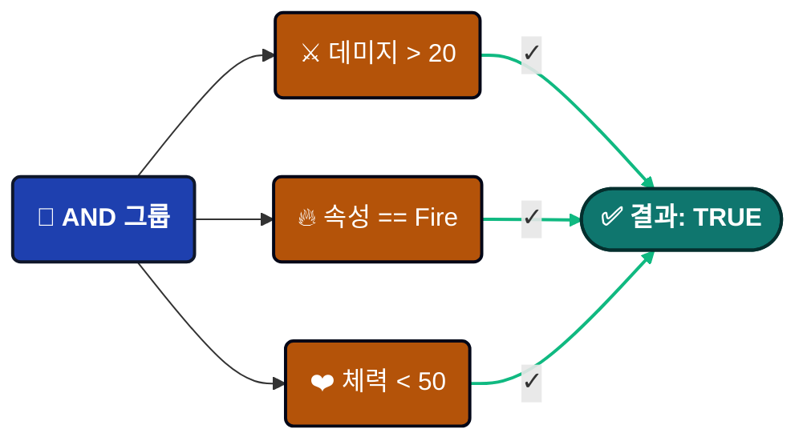
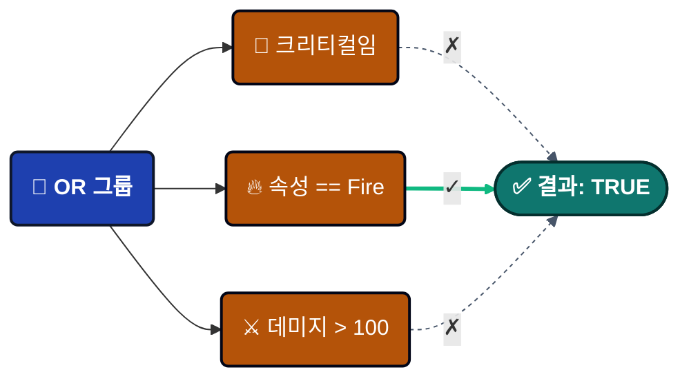
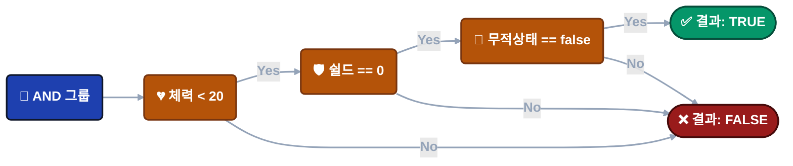
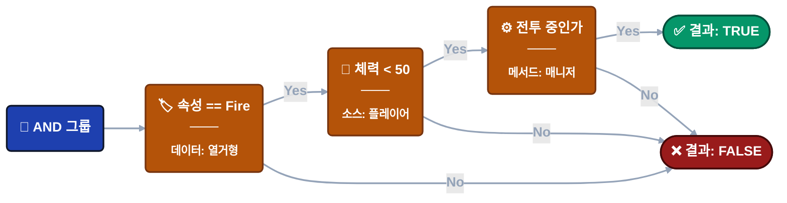

---
sidebar_label: '비주얼 조건 트리'
sidebar_position: 8
---

import Tabs from '@theme/Tabs';
import TabItem from '@theme/TabItem';

# 비주얼 조건 트리 (Visual Condition Tree)

이벤트 액션의 실행 여부를 제어하기 위해 복잡한 불리언 로직을 **시각적**으로 구축합니다. 코딩 없이 직관적인 인터페이스를 통해 정교한 런타임 체크 로직을 생성할 수 있습니다.


---

## 🎯 개요

비주얼 조건 트리는 이벤트 액션을 실행하기 전에 런타임 조건을 평가하는 **로직 게이트 시스템**입니다.

### 해결하고자 하는 문제

**기존 방식** (분산된 로직):

```csharp
// 스크립트에 파묻혀 있어 수정하기 어려운 로직
if (damageInfo.amount > 20 && 
    (damageInfo.isCritical || damageInfo.type == DamageType.Fire) &&
    playerController.Health < 50 &&
    gameManager.IsInCombat()) {
    // 액션 실행
}
```

**시각적 방식**:


------

### 예제 구축

**이벤트**: `OnPlayerDamaged`

**이벤트 타입**:

- `GameEvent<GameObject, DamageInfo>` (GameObject 송신자)
- `GameEvent<PlayerStats, DamageInfo>` (커스텀 송신자)

**데이터 구조**:

```csharp
// 데미지 타입 열거형
public enum DamageType {
    Physical,
    Fire,
    Void
}

// 데미지 정보 페이로드
public class DamageInfo {
    public float amount;           // 데미지 수치
    public bool isCritical;        // 크리티컬 여부
    public DamageType type;        // 데미지 속성
    public Vector3 hitPoint;       // 충격 지점
    public string attacker;        // 공격자 이름
}

// 커스텀 송신자 타입 (GameObject 대신 사용 가능)
public class PlayerStats {
    public string playerName;
    public int level;
    public int factionId;
}
```

**목표**: 특정 조건 하에서 플레이어가 큰 데미지를 입었을 때만 경고 효과를 트리거합니다.

---

### 주요 장점

| 특징 | 이점 |
| ---------------------- | -------------------------------------------------- |
| 🎨 **시각적 구축** | 디자이너가 코드 없이 로직을 생성 가능 |
| 🚀 **높은 성능** | 익스프레션 트리(Expression Trees)로 컴파일 (리플렉션 비용 제로) |
| 🔄 **재사용성** | 동일한 조건이 모든 이벤트 액션에 적용됨 |
| 🧪 **실시간 테스트** | 인스펙터에서 값을 수정하고 즉시 결과 확인 가능 |
| 🔒 **타입 안정성** | 타입 호환성을 자동으로 검증 |

---

## 🏗️ 트리 구조

조건 트리는 **두 가지 노드 타입**으로 구성됩니다.


### 🌳 그룹 노드 (Group Nodes)

AND/OR 로직을 사용하여 여러 조건을 결합합니다.

**로직 타입**:

<Tabs>
<TabItem value="and" label="AND 로직" default>

모든 자식 조건이 TRUE여야 합니다.



**시각적 특징**: 🟢 녹색 테두리

**용도**: "모든 요구 사항을 충족해야 함"

</TabItem>

<TabItem value="or" label="OR 로직">

자식 조건 중 하나라도 TRUE이면 됩니다.



**시각적 특징**: 🟠 주황색 테두리

**용도**: "요구 사항 중 하나만 충족해도 됨"

</TabItem>
</Tabs>

**로직 전환**: 로직 버튼(AND/OR)을 클릭하여 전환합니다.

**중첩**: 그룹 내에 다른 그룹을 포함할 수 있으며, 제한 없는 깊이로 복잡한 로직을 구축할 수 있습니다.

```mermaid
graph LR

    classDef root fill:#1e40af,stroke:#0f172a,stroke-width:2px,color:#ffffff,font-weight:bold
    classDef cond fill:#b45309,stroke:#78350f,stroke-width:2px,color:#ffffff
    classDef nested fill:#334155,stroke:#020617,stroke-width:2px,color:#ffffff
    classDef success fill:#0f766e,stroke:#042f2e,stroke-width:2px,color:#ffffff,font-weight:bold

    ROOT(📂 루트: AND 그룹):::root

    ROOT --> A(📜 조건 A):::cond
    ROOT --> OR(📂 중첩: OR 그룹):::nested
    ROOT --> D(📜 조건 D):::cond

    OR --> B(📜 조건 B):::cond
    OR --> C(📜 조건 C):::cond

    A --> RES([✅ 로직 결과]):::success
    B --> OR_OUT(( ))
    C --> OR_OUT
    OR_OUT --> RES
    D --> RES

    style OR_OUT fill:#334155,stroke:none
    linkStyle 4,5 stroke:#94a3b8,stroke-width:1px
```



**노드 추가**: 각 그룹의 **+ Condition** 또는 **+ Group** 버튼을 사용합니다.

---

### ⚖️ 비교 노드 (Comparison Nodes)

**비교 노드**는 이벤트 로직의 가장 기본이 되는 구성 요소입니다. 각 노드는 이벤트 액션을 진행할지 결정하기 위해 단일 **불리언 체크**(True/False)를 수행합니다.

#### 🏗️ 비교 노드의 구조

모든 노드는 표준 3단 구조를 따르므로 복잡한 로직도 한눈에 쉽게 읽을 수 있습니다.

> **[ 🟦 소스 (좌측 피연산자) ]**  **[ 연산자 ]**  **[ 🟧 타겟 (우측 피연산자) ]** 

**실습 예제:**
데미지 수치가 일정 수준 이상일 때만 트리거되는 이벤트:
Argument.amount  **>**  20.0

- **🔍 소스:** Argument.amount — `GameEvent<float>`에 의해 전달된 원본 데미지 값
- **📐 연산자:** > — 논리 규칙 (보다 큼)
- **🎯 타겟:** 20.0 — 비교 대상이 되는 상수 임계값 또는 다른 변수

------

#### 👓 보기 모드

에디터 UI는 **가독성**과 **정밀한 제어** 사이의 균형을 맞추기 위해 사용자의 필요에 따라 적응합니다.

| 보기 모드 | 시각적 스타일 | 용도 |
| --------------- | --------------------------------------- | ------------------------------------------ |
| 📖 **축소됨** | **요약 텍스트** (예: Health < 50) | 복잡한 로직 체인의 빠른 개요 확인. |
| 🛠️ **확장됨** | **상세 에디터** (드롭다운, 필드) | 특정 파라미터 및 소스 수정. |

:::tip **상호작용 힌트**
비교 블록을 **클릭**하면 이 두 가지 보기 모드 사이를 전환할 수 있습니다. 이를 통해 설정을 자세히 살펴보면서도 작업 공간을 깔끔하게 유지할 수 있습니다.
:::

---

## **📝** 구조 설정

<details>
<summary>📌 소스 (Source)</summary>

<Tabs>
<TabItem value="event-arg" label="이벤트 인자 (Event Argument)" default>

### 🧬 이벤트 인자 (데이터 페이로드)

**인자(Argument)** 시스템을 통해 이벤트의 데이터 페이로드 내부를 깊이 파고들어 조건 및 액션에 필요한 특정 값을 추출할 수 있습니다.

:::info **사용 가능 여부**
데이터 액세스는 타입이 지정된 이벤트인 `GameEvent<T>` 또는 `GameEvent<TSender, TArgs>`에서만 가능합니다.
:::

#### 🔢 단일 매개변수 이벤트

**시그니처:** `GameEvent<DamageInfo>`

이벤트가 단일 오브젝트를 포함하는 경우, 해당 오브젝트 자체 또는 오브젝트의 퍼블릭 멤버에 액세스할 수 있습니다.

**데이터 구조 예시:**

```
📦 (이 Argument)      ➔ DamageInfo 오브젝트 전체
├── 🔢 amount           ➔ float
├── ✅ isCritical       ➔ bool
├── 🏷️ type             ➔ DamageType (열거형)
├── 📍 hitPoint         ➔ Vector3
└── 👤 attacker         ➔ string
```

------

#### 👥 송신자 이벤트 (컨텍스트 인지형)

송신자 이벤트는 데이터 액세스를 위한 두 가지 시작점을 제공합니다: **송신자(Sender)**(누가)와 **인자(Argument)**(무엇을).

##### 🎮 사례 A: GameObject 송신자

**시그니처:** `GameEvent<GameObject, DamageInfo>`

| 시작점 | 경로 예시 | 데이터 타입 |
| ------------ | ------------------------- | --------- |
| **Sender** | Sender.Transform.position | Vector3 |
| **Argument** | Argument.amount | float |

**시각적 계층 구조:**

```
👥 Sender
   ├── 🆔 tag           ➔ string
   ├── 🟢 activeSelf    ➔ bool
   └── 📐 Transform
       ├── 📍 position  ➔ Vector3
       └── 📂 childCount➔ int
🔢 Argument
   ├── 🔢 amount        ➔ float
   └── ✅ isCritical    ➔ bool
```

##### 🛡️ 사례 B: 커스텀 C# 송신자 (고급)

**시그니처:** `GameEvent<PlayerStats, DamageInfo>`

> 🚀 **특별한 이유:** 기존 시스템과 달리 GameObject에 종속되지 않습니다. 디커플링된 로직 우선 아키텍처를 위해 **순수 C# 클래스**를 송신자로 사용할 수 있습니다.

- 💎 **순수 로직** — MonoBehaviour가 아닌 클래스와도 작동합니다.
- 🌐 **네트워크 지원** — PlayerData나 NetworkAgent 동기화에 이상적입니다.
- 🤖 **AI 에이전트** — 씬 의존성 없이 내부 상태를 추적합니다.

------

#### 🧭 딥 프로퍼티 액세스 (Deep Property Access)

**정밀한 탐색.** 고성능 리플렉션을 통해 중첩된 구조를 최대 **5단계 깊이**까지 탐색할 수 있습니다.

**예제: 방향 체크**

- **경로:** Argument.hitPoint.normalized.x
- **조건:** > 0.5
- **결과:** 🎯 "오른쪽에서 피격됨."

**추적 로직:**
Argument (DamageInfo) ➔ hitPoint (Vector3) ➔ normalized (Vector3) ➔ x (float)

------

#### 📋 지원되는 타입

시스템은 아래 타입들을 자동으로 지원합니다:

| 카테고리 | 지원 타입 |
| -------------- | ------------------------------------------------- |
| **기본형** | int, float, double, long, bool, string |
| **수학** | Vector2, Vector3, Quaternion, Color |
| **Unity** | GameObject, Transform, Component 참조 |
| **로직** | 열거형(Enum, 드롭다운 지원), [Serializable] C# 클래스 |

:::tip **전문가 팁: 커스텀 클래스**
[Serializable] 클래스의 모든 퍼블릭 **필드(Field)** 또는 **프로퍼티(Property)**는 딥링크 선택기에 자동으로 노출됩니다.
:::

</TabItem>

<TabItem value="scene-type" label="씬 타입 (Scene Type)">

### **🎬** 씬 타입 (Scene Type)

씬에 있는 GameObject 또는 컴포넌트의 런타임 데이터에 액세스합니다.

---

#### 사용 방법

**1단계**: 하이어라키(Hierarchy)에서 GameObject 또는 컴포넌트를 오브젝트 필드로 드래그합니다.

**2단계**: "Select Property..."를 클릭하여 사용 가능한 멤버를 탐색합니다.

---

#### GameObject 예제

`PlayerController` GameObject를 드래그한 경우:

```
📦 GameObject (인스턴스)
├─ 📦 (이 GameObject)    ➔ 참조 자체
├─ ✅ activeSelf           ➔ bool
├─ 🔤 tag                  ➔ string
└─ 🔢 layer                ➔ int

📐 Transform (컴포넌트)
├─ 📍 position             ➔ Vector3
├─ 📏 localScale           ➔ Vector3
└─ 📂 childCount           ➔ int

🧩 PlayerController (스크립트)
├─ 🔢 Health               ➔ float
├─ 🛡️ Shield               ➔ float
├─ 🏅 Level                ➔ int
├─ ✅ HasFireResistance    ➔ bool
│
├─ ⚡ IsInDangerZone()      ➔ bool (메서드)
└─ ⚡ IsCriticallyWounded() ➔ bool (메서드)
```

**사용 예시**:

```
Player.Health < 50                  → 체력 체크
Player.Level >= 10                  → 레벨 요구 사항
Player.IsInDangerZone() == true     → 메서드를 통한 복합 체크
```

---

#### Bool 메서드 지원 ✨

드롭다운에 **매개변수가 없는** `bool` 반환 메서드가 나타납니다!

**예제**:

```csharp
// 컴포넌트 내부
public bool IsInDangerZone() {
    return Health < 20 && Shield == 0 && !IsInvincible;
}
```

**조건 트리에서의 설정**:

```
Player.IsInDangerZone() == true
```

이를 통해 복잡한 로직을 시각적으로 일일이 구축하는 대신 단일 메서드 호출로 캡슐화할 수 있습니다.

---

#### 컴포넌트 예제

`GameManager` 컴포넌트를 드래그한 경우:

```
🏛️ GameManager (글로벌 시스템)
├─ 🔄 CurrentState        ➔ GameState (열거형)
├─ 🌊 CurrentWave         ➔ int
├─ 🏅 DifficultyLevel     ➔ int
│
├─ ⚡ IsInCombat()         ➔ bool (메서드)
└─ ⚡ IsHardMode()         ➔ bool (메서드)
```

**사용 예시**:

```
GameManager.CurrentState == Playing
GameManager.IsInCombat() == true
GameManager.DifficultyLevel >= 3
```

---

#### 중요한 제한 사항

⚠️ **씬 타입은 씬 로드 시점에 이미 존재하는 오브젝트여야 합니다.**

```
✅ 작동: 씬 하이어라키에 있는 오브젝트 (초기화 시 존재)
❌ 실패: 런타임에 인스턴스화된 오브젝트 (아직 존재하지 않음)

해결책: 런타임 오브젝트의 경우 이벤트 인자(Event Argument)를 사용하십시오.
```

</TabItem>

<TabItem value="random" label="랜덤 타입 (Random Type)">

### **🎲** 랜덤 타입 (Random Type)

**목적**: 실행 시점에 무작위 값을 생성합니다.

---

#### 두 가지 모드

**모드 1: 범위 (Range)**

범위 내에서 무작위 숫자를 생성합니다.


**설정**:

- **Min**: 하한값
- **Max**: 상한값  
- **Integer**: 정수를 원하면 체크, 소수를 원하면 체크 해제

---

**모드 2: 목록 (List)**

미리 정의된 값 중 하나를 무작위로 선택합니다.


**설정**:

- **Data Type**: 데이터 타입 선택 (int, float, string, bool 등)
- **List Items**: +/- 버튼으로 값 추가/제거

---

#### 활용 사례

**크리티컬 확률**:

```
Random(0~100) > 90  → 10% 확률
```

**데미지 편차**:

```
Random(0~10) → 무작위 추가 데미지 합산
```

**동적 이벤트**:

```
Random List[Easy, Normal, Hard] → 난이도 무작위 지정
```

</TabItem>
</Tabs>

</details>

<details>
<summary>📌 연산자 (Operator)</summary>


### **📐** 사용 가능한 연산자

**수치형 (6개)**

숫자 타입용 (int, float, double, long):

| 연산자 | 기호 | 예시 |
| ---------------- | ------ | --------------- |
| Equals | `==` | `Health == 100` |
| Not Equals | `!=` | `Health != 0` |
| Greater | `>` | `Damage > 20` |
| Less | `<` | `Health < 50` |
| Greater Or Equal | `>=` | `Level >= 10` |
| Less Or Equal | `<=` | `Shield <= 0` |

**자동 변환**: 호환되는 수치 타입은 자동으로 변환됩니다 (int ↔ float).

---

**문자열 (4개)**

텍스트 값용:

| 연산자 | 기호 | 예시 |
| ----------- | -------------- | ---------------------------- |
| Equals | `==` | `Name == "Hero"` |
| Not Equals | `!=` | `Tag != "Enemy"` |
| Starts With | `Starts With` | `Name Starts With "Player_"` |
| Ends With | `Ends With` | `File Ends With ".png"` |
| Contains | `Contains (⊃)` | `Message Contains "error"` |

⚠️ **대소문자 구분**: "Hero" ≠ "hero"

---

**열거형(Enum) 지원**

드롭다운 선택을 통한 완전한 열거형 지원!

**예제**:

```csharp
public enum DamageType { Physical, Fire, Void }
```

**조건 트리 설정**:

```
소스: Argument.type (DamageType)
연산자: ==
타겟: DamageType.Fire (드롭다운에 Physical/Fire/Void 표시)
```

**목록 활용**:

```
Argument.type In List [Fire, Void]
결과: 타입이 DamageType.Fire 또는 DamageType.Void이면 TRUE
```

**지원 연산자**: `==`, `!=`, `In List (∈)`

---

**컬렉션 (1개)**

목록/배열 포함 여부 확인:

| 연산자 | 기호 | 목적 |
| -------- | ------ | ----------------------------- |
| In List | `∈` | 값이 목록에 존재하는지 확인 |

**구조**:

```
소스: 단일 값
연산자: In List (∈)
타겟: 목록/배열 (타입 일치 필요)
```

**예시**:

```
Argument.attacker In List ["Dragon", "Demon", "Lich"]
Player.Level In List [10, 20, 30, 40, 50]
Argument.type In List [Fire, Void]
```

</details>

<details>
<summary>📌 타겟 (Target)</summary>
<Tabs>
<TabItem value="event-arg" label="이벤트 인자 (Event Argument)" default>

### 🧬 이벤트 인자 (데이터 페이로드)

:::tip 소스(Source)와 동일

소스(Source)와 동일하게 작동하므로, 상세 내용은 소스 섹션의 관련 설정을 참조하십시오.

:::

</TabItem>

<TabItem value="scene-type" label="씬 타입 (Scene Type)">

### **🎬** 씬 타입 (Scene Type)

:::tip 소스(Source)와 동일

소스(Source)와 동일하게 작동하므로, 상세 내용은 소스 섹션의 관련 설정을 참조하십시오.

:::

</TabItem>

<TabItem value="random" label="랜덤 타입 (Random Type)">

### **🎲** 랜덤 타입 (Random Type)

:::tip 소스(Source)와 동일

소스(Source)와 동일하게 작동하므로, 상세 내용은 소스 섹션의 관련 설정을 참조하십시오.

:::

</TabItem>

<TabItem value="constant" label="상수 (Constant)">

### **📌** 상수 (Constant)

고정된 비교 값입니다.

**참고**: 소스(좌측)가 아닌 **타겟**(우측)으로만 사용 가능합니다.

---

#### 두 가지 모드

**모드 1: 단일 값 (Single Value)**

하나의 고정 값을 입력합니다.


**데이터 타입**: Int, Float, Double, String, Bool

---

**모드 2: 목록 (List)**

여러 허용 가능한 값을 정의합니다 ("In List" 연산자용).


**설정**:

- **Data Type**: 모든 목록 아이템의 타입
- **+ / -**: 아이템 추가/제거

---

#### 활용 사례

**임계값**:

```
Health < 50.0
```

**정확한 일치**:

```
Name == "Hero"
```

**다중 값**:

```
Type In List [Fire, Void, Lightning]
```

:::tip **주요 차이점**

추가 지원 타입: 상수 타입 **(타겟 전용)**

:::

:::tip **컨텍스트 인지**

일부 연산자는 타겟 타입을 제한합니다:

- 수치 연산자 (`>`, `<` 등)는 단일 값을 필요로 합니다.
- "In List" 연산자는 목록 타입을 필요로 합니다.

:::

</TabItem>
</Tabs>

</details>

------

## 🎨 타입 검증 (Type Validation)

시스템은 타입 호환성을 자동으로 검증합니다.

**유효한 비교**:

```
✅ int == int
✅ float > int (자동 변환됨)
✅ string Contains string
✅ DamageType == Fire (열거형)
✅ int In List<int>
```

**유효하지 않은 비교**:

```
❌ string > int (호환되지 않는 타입)
❌ bool Contains string (의미 없음)
❌ float In List<string> (타입 불일치)
```

**시각적 피드백**: 호환되지 않는 타입인 경우 빨간색 테두리와 경고 텍스트가 표시됩니다.

---

## 🧩 Bool 메서드 vs 비주얼 트리

조건을 구축하는 두 가지 접근 방식 중 언제 무엇을 사용해야 할까요?

### 방식 1: Bool 메서드

**적합한 용도**: 복잡한 다단계 로직.

**예제**:

```csharp
public bool IsInDangerZone() {
    bool lowHealth = Health < 20;
    bool noShield = Shield == 0;
    bool hasEnemies = Physics.OverlapSphere(
        transform.position, 10f, enemyLayer
    ).Length > 0;
    
    return lowHealth && noShield && hasEnemies;
}
```

**트리에서의 설정**: `Player.IsInDangerZone() == true`

**장점**:

- 복잡성을 캡슐화함
- 물리 엔진, 레이캐스트 사용 가능
- 유닛 테스트 가능
- 코드 재사용 가능

**단점**:

- C# 코딩이 필요함
- 디자이너가 수정할 수 없음

---

### 방식 2: 비주얼 트리

**적합한 용도**: 디자이너가 제어해야 하는 단순 체크.

**예제**:



**장점**:

- 코딩이 필요 없음
- 디자이너 친화적임
- 시각적 표현 가능
- 빠른 반복 수정 가능

**단점**:

- 복잡한 알고리즘이나 물리 연산을 직접 사용하기 어려움
- 트리가 너무 커지면 복잡해질 수 있음

---

### 하이브리드 방식 (권장)

최적의 결과를 위해 두 방식을 결합하십시오:



**가이드라인**:

- 비주얼 트리: 임계값, 열거형, 단순 프로퍼티 체크용
- Bool 메서드: 물리 쿼리, 복잡한 알고리즘, 시스템 간 교차 체크용

---

## 🔄 드래그 앤 순서 변경

**실행 순서 변경**: 조건 블록의 왼쪽 가장자리에 있는 핸들(☰)을 드래그하십시오.

**순서가 중요한 이유**:

**AND 그룹**: 순서가 결과에 영향을 주지 않습니다 (모두 통과해야 함).

**OR 그룹**: 순서가 **단락 평가(Short-circuit evaluation)**에 영향을 줍니다 (첫 번째 TRUE에서 멈춤).

**최적화 예제**:

```
❌ 느림:
OR 그룹
├─ 비용이 큰 물리 체크()  ← 먼저 실행 (느림!)
└─ 단순 Bool 체크          ← 실행되지 않을 수 있음

✅ 빠름:
OR 그룹
├─ 단순 Bool 체크          ← 먼저 실행 (빠름!)
└─ 비용이 큰 물리 체크()  ← 필요한 경우에만 실행
```

성능 향상을 위해 OR 그룹에서는 비용이 적게 드는 체크를 앞에 배치하십시오.

---

## 🚀 성능 (Performance)

### 컴파일 프로세스

**일회성 비용** (씬 로드 시):

```
비주얼 트리 → 익스프레션 트리 → IL 코드 → 컴파일된 람다(Lambda)
```

**런타임 실행**:

```
이벤트 발생 → 컴파일된 람다 호출 → TRUE/FALSE 반환
```

**벤치마크**: 복잡하게 중첩된 조건도 약 0.001ms(1마이크로초) 내에 실행됩니다.

---

### 빠른 이유

**리플렉션 없음**: 직접 수기로 작성한 C# 코드와 같이 컴파일된 직접 액세스 방식을 사용합니다.

**익스프레션 트리**: 시스템이 초기화 시 최적화된 IL 코드를 생성합니다.

```
❌ 전통적 방식: 체크당 GetComponent() + GetField() + Invoke() 호출
✅ 본 시스템: 컴파일된 람다를 통한 직접 프로퍼티 액세스
```

**결과**: 프레임당 수백 개의 이벤트가 발생하더라도 오버헤드가 거의 없습니다.

---

## 🧹 트리 관리

- **활성화/비활성화**: 체크박스를 토글하여 모든 조건을 무시할 수 있습니다 (항상 TRUE 반환).
- **트리 리셋**: "Reset Tree" 버튼을 클릭하여 모든 노드를 지우고 새로 시작합니다.

- **축소/확장**: 비교 블록을 클릭하여 요약 보기와 상세 보기 사이를 전환합니다.

---

## ❓ 문제 해결

### 조건이 항상 False를 반환함

**체크리스트**:

- ✅ "Enable Conditions" 토글이 체크되어 있습니까?
- ✅ 빨간색 타입 불일치 경고가 있습니까?
- ✅ 씬 타입 참조가 여전히 유효합니까 (오브젝트가 파괴되지 않았나요)?
- ✅ Bool 메서드가 예상한 값을 반환합니까? (Debug.Log로 확인)

---

### 프로퍼티가 드롭다운에 없음

**이벤트 인자(Event Argument)의 경우**:

- 반드시 public 필드나 프로퍼티여야 합니다.
- 지원되는 타입이어야 합니다.

**씬 타입(Scene Type)의 경우**:

- GameObject가 에디터 시점에 씬 하이어라키에 존재해야 합니다.
- 컴포넌트가 활성화되어 있어야 합니다.
- 프로퍼티가 public이어야 합니다.
- 메서드 조건: bool 반환, 매개변수 없음, public, 인스턴스 메서드(static 아님).

**런타임 오브젝트의 경우**: 씬 타입 대신 이벤트 인자를 사용하십시오.

---

### 변경 사항이 저장되지 않음

**일반적인 원인**:

- 여러 개의 비헤이비어 창이 열려 있음 (중복된 창을 닫으십시오)
- 편집 중 스크립트 컴파일 발생 (컴파일 완료까지 기다리십시오)
- 유니티가 SerializedProperty 변경 사항을 적용하지 않음 (창을 닫기 전에 잠시 기다리십시오)

---

## 📖 사용처

비주얼 조건 트리 시스템은 **두 가지 컨텍스트**에서 나타납니다:

**1. 이벤트 비헤이비어** → [게임 이벤트 설정](./game-event-behavior.md)

이벤트 액션의 실행 여부를 제어합니다:

```
이벤트 발생 → 조건 확인 → 액션 실행/스킵
```

**2. 플로우 노드 (Flow Nodes)** → 플로우 노드 설정 *(추후 문서화 예정)*

플로우 노드의 실행 여부를 제어합니다:

```
플로우가 노드에 도달 → 조건 확인 → 노드 실행/스킵
```

두 곳 모두 **완전히 동일한** 조건 트리 시스템을 사용합니다.

---

:::tip 권장 사항

**단순 체크**: 임계값, 열거형, 기본 비교에는 비주얼 트리를 사용하십시오.

**복잡한 로직**: 물리 쿼리, 알고리즘, 다단계 체크에는 Bool 메서드를 사용하십시오.

**최적의 접근**: 단순한 것은 비주얼로, 복잡한 것은 메서드로 결합하여 사용하십시오.

**성능**: 단락 평가 최적화를 위해 OR 그룹에서는 가벼운 체크를 먼저 배치하십시오.

:::