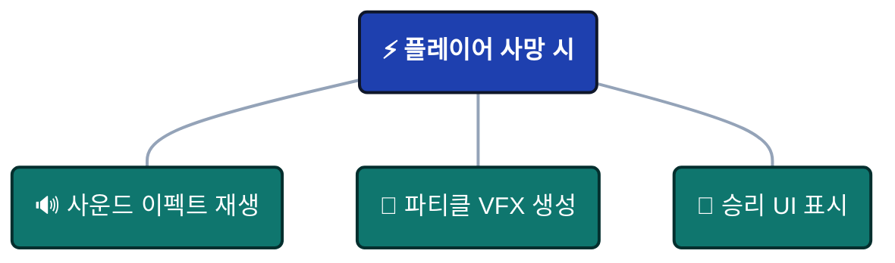
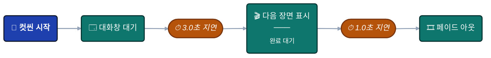
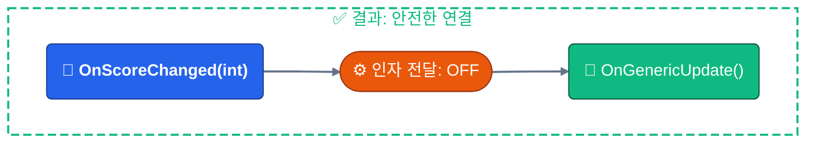

# 연결 타입 및 포트

플로우를 구축하기 전에 그래프의 **시각적 언어**를 이해해야 합니다. 모든 색상, 모양 및 선 스타일은 데이터 흐름과 실행 동작을 나타냅니다.

:::tip 퀵 리퍼런스 (Quick Reference)
여기에 표시된 범례는 **플로우 에디터**(우측 패널)에서도 확인할 수 있습니다. 범례 어디든 마우스를 올리면 상세한 툴팁을 볼 수 있습니다.
:::

---

## 🧬 노드 타입 (Node Types)

노드의 **헤더 색상**은 실행 패턴을 나타냅니다.


### 실행 패턴 (Execution Patterns)

| 색상          | 타입             | 동작                                                         | 유스케이스                                          |
| ------------ | ---------------- | ------------------------------------------------------------ | ------------------------------------------------- |
| 🔴 **빨간색** | **루트 노드**     | **진입점 (Entry Point)** - 이벤트가 외부에서 발생할 때 실행됨      | 게임 시작, 플레이어 입력, 충돌 감지                 |
| 🟠 **주황색** | **트리거 노드**   | **병렬 (팬아웃)** - 실행 후 즉시 다음으로 진행 (비차단/Non-blocking) | 사운드 + VFX + UI 업데이트가 동시에 발생하는 경우     |
| 🟢 **녹색**   | **체인 노드**     | **순차 (차단)** - 실행 후 완료될 때까지 대기한 뒤 다음으로 진행     | 컷씬, 지연된 액션, 비동기 작업                      |

---

### 루트 노드 규칙 (Root Node Rules)

**그래프당 하나**: 각 그래프는 정확히 **하나**의 루트 노드를 가집니다.

**루트 설정**: 노드를 우클릭하고 **Set as Root**를 선택하여 진입점을 변경할 수 있습니다.

**시각적 특징**: 빨간색 헤더 그라데이션으로 즉시 식별할 수 있습니다.

---

### 트리거 vs 체인 (Trigger vs Chain)

**트리거 패턴** (병렬):



:::info 트리거 (Triggers)

모두 동시에 병렬로 실행됩니다!

:::

**체인 패턴** (순차):



:::info 체인 (Chains)

각 단계는 이전 단계가 끝날 때까지 기다립니다!

:::

---

## 🔌 포트 타입 (데이터 시그니처) (Port Types)

**포트 색상**은 C# 이벤트 시그니처와 데이터 페이로드를 나타냅니다.


### 포트 색상의 의미

| 색상          | 시그니처          | 설명                                   | 예시 이벤트                                 |
| ------------ | ------------------ | -------------------------------------- | --------------------------------------------- |
| 🔵 **시안색** | `()`               | **Void** - 전달되는 데이터 없음             | `OnGameStart`, `OnButtonClick`                |
| 🌸 **분홍색** | `<T>`              | **단일 인자** - 하나의 데이터 페이로드        | `OnScoreChanged(int)`, `OnDamage(DamageInfo)` |
| 💜 **보라색** | `<TSender, TArgs>` | **이중 인자** - 송신자(Sender) + 페이로드 | `OnPlayerDamaged(GameObject, DamageInfo)`     |

---

### 포트 구조 (Port Anatomy)

- **왼쪽 포트** (입력): 이전 노드로부터 데이터를 수신합니다.
- **오른쪽 포트** (출력): 다음 노드로 데이터를 전송합니다.

## 🔗 연결 호환성 (Connection Compatibility)

시스템은 연결을 생성할 때 **실시간 타입 안정성**을 제공합니다.


### 호환성 단계

| 색상          | 상태               | 의미                             | 영향                              |
| ------------ | ----------------- | -------------------------------- | --------------------------------- |
| 🟢 **녹색**   | **완벽한 일치**     | 타입이 정확히 일치함              | 오버헤드 없음, 변환 불필요         |
| 🟡 **노란색** | **호환 가능**       | 데이터 폐기를 동반한 안전한 작업    | 인자가 무시됨, 오류 없음           |
| 🟠 **주황색** | **경고**           | 타입 변환 필요                    | 자동 변환 (예: int → float)       |
| 🔴 **빨간색** | **호환 불가**       | 런타임에 실패함                   | 연결 차단됨                       |

---

### 시각적 피드백

**드래그 중**:
- 프리뷰 선에 호환성 색상이 표시됩니다.
- 유효하지 않은 대상은 흐릿하게 표시됩니다.
- 유효한 대상은 하이라이트됩니다.

**연결 후**:
- 선 색상이 유지됩니다.
- 주황색/빨간색의 경우 경고 아이콘(⚠️)이 나타납니다.
- 마우스를 올리면 상세 툴팁이 표시됩니다.

---

## 📊 호환성 매트릭스 (Compatibility Matrix)

연결 색상은 **소스(Source) 타입**, **타겟(Target) 타입**, 그리고 **인자 전달(Pass Argument)** 설정에 의해 결정됩니다.

### 전체 호환성 테이블

| 소스 이벤트 | 타겟 이벤트 | 인자 전달 | 결과      | 설명                                            |
| ------------ | ------------ | ------------- | -------- | ----------------------------------------------- |
| Any          | Any          | **OFF**       | 🟢 녹색  | **재정의(Override)**: 타겟이 모든 입력을 무시함      |
| Void `()`    | Void `()`    | ON            | 🟢 녹색  | 완벽한 일치 - 데이터 불필요                       |
| Void `()`    | `<T>`        | ON            | 🔴 빨간색 | **오류**: 타겟은 데이터를 필요로 하지만 소스에 없음   |
| Void `()`    | `<S,T>`      | ON            | 🔴 빨간색 | **오류**: 타겟은 송신자를 필요로 하지만 소스에 없음 |
| `<T>`        | Void `()`    | ON            | 🟡 노란색 | **안전**: 인자가 폐기됨                          |
| `<T>`        | `<T>`        | ON            | 🟢 녹색  | 완벽한 일치 - 동일한 타입                         |
| `<T>`        | `<S,T>`      | ON            | 🔴 빨간색 | **오류**: 타겟은 송신자를 필요로 하지만 소스에 없음 |
| `<S,T>`      | Void `()`    | ON            | 🟡 노란색 | **안전**: 송신자와 인자 모두 폐기됨                |
| `<S,T>`      | `<T>`        | ON            | 🟡 노란색 | **안전**: 송신자는 폐기되고 인자만 전달됨          |
| `<S,T>`      | `<S,T>`      | ON            | 🟢 녹색  | 완벽한 일치 - 송신자 + 인자                       |
| `<T1>`       | `<T2>`       | ON            | 🟠 주황색 | **경고**: 타입 변환 (예: int ↔ float)             |

---

### 특수 케이스

**인자 전달(Pass Argument) = OFF**:

타겟이 모든 입력 데이터를 무시하므로 항상 🟢 **녹색** 연결이 됩니다.

**유스케이스**: 타입 에러 없이 타입 지정 이벤트를 Void 이벤트에 체인으로 연결할 때 사용합니다.



---

**숫자 타입 변환 (Numeric Conversions)**:

호환되는 숫자 타입 간에는 자동으로 변환됩니다 (🟠 주황색):
- `int` ↔ `float`
- `float` ↔ `double`
- `int` ↔ `long`

**주의**: 정밀도가 손실될 수 있습니다 (예: `float` 3.14 → `int` 3).

---

**호환되지 않는 타입**:

연결 시점에 차단됩니다 (🔴 빨간색):
- `string` → `int`
- `GameObject` → `float`
- 커스텀 타입 불일치

**시스템은 이러한 연결이 생성되는 것을 방지합니다.**

---

## 🏷️ 상태 배지 (Status Badges)

노드의 **하단**에 활성화된 설정을 보여주는 배지가 나타납니다.


### 배지 리퍼런스

| 아이콘 | 배지        | 의미                              | 적용 대상      |
| ---- | ---------- | --------------------------------- | ------------ |
| 🧩    | **Cond**   | 시각적 조건 트리 활성화               | 모든 노드     |
| ⏱️    | **2.5s**   | 시작 지연 시간 (초)                 | 모든 노드     |
| ⏳    | **3.0s**   | 차단 지속 시간 (초)                 | 체인 노드 전용 |
| ⚓    | **Wait**   | 비동기 완료 대기                    | 체인 노드 전용 |
| ⬆️    | **+5**     | 실행 우선순위                      | 트리거 노드 전용 |
| 🔗    | **Pass**   | 다음 노드로 인자 전달                | 모든 노드     |
| 📌    | **Static** | 인자 차단 (정적 호출)               | 모든 노드     |

---

### 배지 예시

**지연 시간 + 지속 시간이 설정된 체인 노드**:
```
⏱️ 1.0s   ← 시작 전 1초 대기
⏳ 3.0s   ← 그 후 3초간 플로우 차단
```

**조건 + 우선순위가 설정된 트리거 노드**:
```
🧩 Cond   ← 조건이 충족될 때만 실행
⬆️ +10    ← 다른 트리거보다 먼저 실행
```

**인자 전달이 설정된 모든 노드**:
```
🔗 Pass   ← 이벤트 데이터를 다음 노드로 전달
```

---

## 🎨 시각적 예시

### 예시 1: 완벽한 일치 체인 (Perfect Match Chain)


**색상**:
- Line 1: 🟢 녹색 (완벽한 일치)
- Line 2: 🟡 노란색 (송신자가 안전하게 폐기됨)

---

### 예시 2: 타입 변환 경고 (Type Conversion Warning)


**색상**: 🟠 주황색 (int → float 변환)

**위험**: 정밀도가 변할 수 있지만 작동은 합니다.

---

### 예시 3: 인자 전달 (Pass Argument)


**색상**: 🟢 녹색 (void → int)

**차단 없음**: 일치를 위해 인자를 무시합니다.

------

### 예시 4: 병렬 트리거 팬아웃 (Parallel Trigger Fan-Out)


**모든 연결**: 녹색 (void → void), 병렬로 즉시 실행됩니다.

---

## 💡 베스트 프랙티스

### 인자 전달(Pass Argument)을 현명하게 사용하기

**전달할 때 (ON)**:
- 다음 노드가 이벤트 데이터를 필요로 할 때
- 데이터 파이프라인을 구축할 때
- 데미지 정보, 점수 등을 전달할 때

**차단할 때 (OFF)**:
- 호환되지 않는 타입을 연결할 때
- 일반적인 알림(데이터 불필요)을 보낼 때
- 복잡한 타입 체인을 단순화할 때

---

### 플로우의 색상 코드 확인

**녹색 위주의 그래프**: 타입이 잘 지정된 상태입니다.

**노란색 연결**: 의도적으로 데이터를 폐기하는 경우 수용 가능합니다.

**주황색 선**: 정확성을 검토하십시오 — 변환이 의도적인지 확인해야 합니다.

**빨간색 블록**: 즉시 수정하십시오 — 런타임에 실패합니다.

---

### 타입별로 정리

**비슷한 시그니처를 가진 노드들을 함께 그룹화**하십시오:
- Void 이벤트는 한 구역에
- 데이터 이벤트는 다른 구역에
- 비동기 체인은 트리거와 분리하여 배치

**이유**: 타입 호환성을 시각적으로 파악하기가 훨씬 쉬워집니다.

---

## ❓ 자주 묻는 질문

### 연결이 왜 빨간색인가요?

**원인**: 해결할 수 없는 타입 불일치입니다.

**해결**: 
1. 타겟은 송신자를 필요로 하지만 소스가 제공하지 않는지 확인하십시오.
2. 타겟 노드에서 "Pass Argument"를 끕니다.
3. 중간에 변환 노드를 삽입하십시오.

---

### 서로 다른 숫자 타입을 연결할 수 있나요?

**예**: 시스템은 `int`, `float`, `double`, `long` 간의 자동 변환을 지원합니다.

**결과**: 변환 경고와 함께 🟠 주황색으로 연결됩니다.

**주의**: 정밀도 손실(float → int)에 주의하십시오.

---

### 노란색은 무엇을 의미하나요?

**의미**: **데이터 폐기**를 동반한 안전한 연결입니다.

**예시**: `<int>`를 `<void>`로 보내면 정수 데이터가 폐기됩니다.

**안전한가요?**: 예 — 런타임 에러는 발생하지 않으며, 단지 데이터가 사용되지 않을 뿐입니다.

:::tip 범례 퀵 액세스

플로우 그래프 에디터에서 작업하는 동안, 우측의 **범례 패널(Legend Panel)**에서 모든 노드 타입, 포트 색상 및 연결의 의미를 확인할 수 있습니다. 범례 항목 위에 마우스를 올리면 상세 툴팁이 표시됩니다.

:::

:::warning 런타임 에러

🔴 **빨간색 연결**은 런타임 충돌을 방지하기 위해 생성 시 차단됩니다. 호환되지 않는 타입을 연결해야 하는 경우, 타겟 노드에서 "Pass Argument"를 비활성화하십시오 — 이렇게 하면 입력 데이터를 무시하도록 강제하여 🟢 녹색 연결로 만들 수 있습니다.

:::