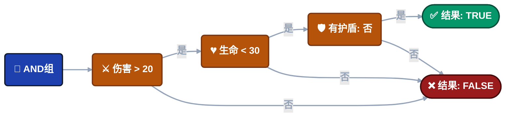
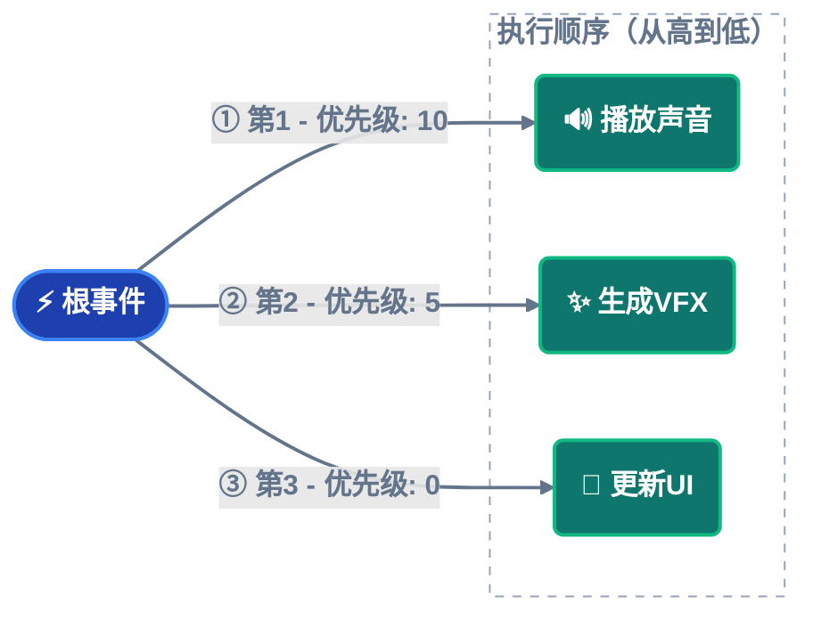
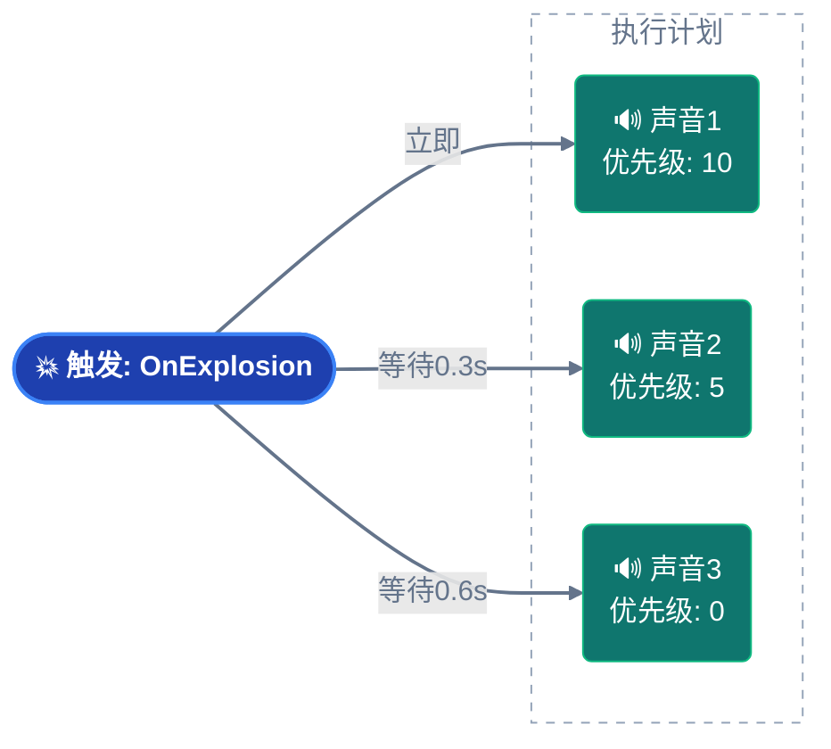

---
sidebar_label: '配置节点行为'
sidebar_position: 3
---

import Tabs from '@theme/Tabs';

import TabItem from '@theme/TabItem';


# 游戏事件节点行为

虽然图表显示连接，但**节点行为配置窗口**控制每个单独节点的详细执行逻辑。

**访问**：在流程图中双击任何节点以打开节点行为的配置窗口。


---

## 🎯 窗口概览

配置窗口分为三个主要部分：

| 部分 | 目的 | 适用于 |
| ---------------------- | ------------------------------------------- | ------------------------- |
| **节点信息** | 查看事件详情和类型 | 所有节点 |
| **节点条件** | 用于执行控制的可视化逻辑门 | 所有节点 |
| **节点配置** | 时间、优先级和数据传递设置 | 所有节点（特定类型） |

## 📋 节点信息

显示有关所选节点的只读详细信息。


**事件名称**：此节点将触发的游戏事件。

**节点类型**：触发器（并行）或链（顺序）。

**事件GUID**：用于内部跟踪的唯一标识符。

**使用场景**：在进行更改之前验证您正在编辑正确的节点。

------

## 🧩 节点条件（流程门）

每个节点都有自己的**可视化条件树**来控制其是否执行。


### 工作原理

**如果条件评估为FALSE**：

- 节点**不**触发
- 流程沿此分支停止
- 连接的子节点被跳过

**如果条件评估为TRUE**：

- 节点正常触发
- 流程继续到子节点

---

### 条件上下文

您可以访问：

**事件参数**（`Arg`）：来自传入事件的数据
```
示例：Arg.amount > 50
```

**Sender**（`Sender`）：源对象（用于sender事件）
```
示例：Sender.tag == "Enemy"
```

**场景对象**：场景中的任何GameObject/Component
```
示例：Player.Health < 20
```

---

### 可视化构建器

条件系统使用与**事件行为**相同的**可视化条件树**。

**完整文档**：请参阅**[可视化条件树](../visual-workflow/visual-condition-tree.md)**获取完整指南：

- 构建逻辑门（AND/OR组）
- 源类型（事件参数、场景类型、随机、常量）
- 比较运算符
- 类型验证
- 最佳实践

:::tip 可重用逻辑
可视化条件系统在以下位置相同：

- **事件行为**（在事件Inspector中）
- **流程节点**（此窗口）

学一次，到处用！
:::

---

### 实际示例

**场景**：仅在生命值危急时播放"低生命值警告"。

**条件树**：


**结果**：仅当**所有三个**条件都通过时才播放声音。

---

## ⚙️ 节点配置

控制**时间**、**优先级**和**数据流**的设置。

### 通用设置（所有节点）


<details>
<summary>开始延迟</summary>

**单位**：秒（float）

**效果**：节点在触发其事件**之前**等待此持续时间。

**使用场景**：

- 交错爆炸（间隔0.2秒）
- 对事件的延迟反应
- 定时序列

**示例**：
```
🔘 触发：OnButtonPressed
│
├─► ⏱️ 0.5s ──┐
│             ▼
│            🎵 PlayClickSound        ✅ 已执行
│
├─► ⏱️ 1.0s ────────┐
│                   ▼
│                  💬 ShowConfirmation  ✅ 已执行
│
└─► ⏱️ 2.0s ──────────────────┐
                              ▼
                             🚪 CloseMenu        ✅ 已完成
```

**可视化指示器**：徽章在节点底部显示⏱️ **0.5s**。

</details>

<details>
<summary>传递参数</summary>

**类型**：布尔切换

**效果**：控制事件数据是否流向此节点。

---

### ✅ 选中（传递参数：开启）

节点从前一个事件接收数据（如果类型兼容）。

**何时使用**：

- 转发伤害信息
- 传递分数/值
- 数据管道

**示例**：


**连接颜色**：取决于类型兼容性（绿色/黄色/橙色）。

---

### ❌ 未选中（传递参数：关闭）

节点作为**静态调用**触发，使用默认/空参数。

**何时使用**：

- 连接不兼容的类型
- 通用通知（不需要数据）
- 强制类型安全连接

**示例**：
```
🚀 事件：OnDamageReceived(DamageInfo)
│   (有效载荷: { amount: 20.0, ... })
│
🛡️ 过滤器: [ 传递参数: 关 ]
│   (逻辑: 仅触发/数据丢弃)
│
└─► 🔊 回调：PlayGenericSound()
│
🎯 结果：声音可靠播放，无需DamageInfo数据。
```

**连接颜色**：始终🟢 **绿色**（强制安全）。

---

### 对连接的影响

**传递参数**直接影响连接线颜色：

| 传递 | 源类型 | 目标类型 | 结果 |
| ------- | ----------- | ----------- | ------------------------- |
| **关** | 任何 | 任何 | 🟢 绿色（始终安全） |
| **开** | `<int>` | `<int>` | 🟢 绿色（完美匹配） |
| **开** | `<int>` | `<void>` | 🟡 黄色（数据丢弃） |
| **开** | `<int>` | `<float>` | 🟠 橙色（转换） |
| **开** | `<int>` | `<string>` | 🔴 红色（阻止） |

**建议**：连接不兼容类型时使用**关**以避免红色连接。

</details>

---

### 特定类型设置

配置选项根据节点类型（触发器vs链）而变化。

<details>
<summary>触发器节点</summary>

## 触发器节点（🟠 橙色）

**执行**：并行（扇出）- 触发后立即继续。


---

### 优先级

**类型**：整数（默认：0）

**规则**：**数字越大 = 越早执行**

**使用场景**：当多个触发器连接到同一父节点时控制执行顺序。

---

### 优先级工作原理

**场景**：三个触发器连接到一个根节点。


**执行顺序**：10 → 5 → 0（从高到低）

---

### 优先级值

| 值 | 含义 | 使用场景 |
| ------------ | ---------------- | ---------------------------------------- |
| **正数** | 更高优先级 | 关键动作（声音、输入阻止） |
| **0** | 默认优先级 | 普通动作 |
| **负数** | 更低优先级 | 清理、日志记录、分析 |

**示例使用场景**：

- **+100**：阻止玩家输入
- **+50**：播放关键声音
- **0**：标准VFX
- **-50**：记录到分析
- **-100**：清理临时对象

---

### 可视化指示器

徽章在节点底部显示⬆️ **+10**。

</details>

<details>
<summary>链节点</summary>

## 链节点（🟢 绿色）

**执行**：顺序（阻塞）- 触发并在继续之前等待。


---

### 持续时间

**类型**：秒（float）

**效果**：强制图表在事件触发**之后**在此节点**暂停**指定时间。

**使用场景**：等待动画、定时序列、冷却时间。

---

### 持续时间示例

**动画等待**：
```
🖼️ T+0.0s | 启动
⚔️ PlayAttackAnimation()
│
┆  (Δ 1.5s 延迟: 动画持续时间)
▼
🖼️ T+1.5s | 执行
💥 DealDamage()
│
📊 结果：总持续时间1.5s | ✅ 链完成
```

**定时序列**：
```
🖼️ T+0.0s | 激活
⚠️ ShowWarning()
│
┆  (Δ 3.0s 显示持续时间)
▼
🖼️ T+3.0s | 清理
🙈 HideWarning()
│
📊 生命周期：3.0s活动 | ✅ 自动清理完成
```

**可视化指示器**：徽章在节点底部显示⏳ **3.0s**。

---

### 等待完成

**类型**：布尔切换

**效果**：图表等待**异步操作**完成后再继续。

**要求**：事件监听器必须返回`Task`或`IEnumerator`。

---

### 异步支持

**协程**（`IEnumerator`）：
```csharp
public IEnumerator OnLoadLevel()
{
    yield return SceneManager.LoadSceneAsync("Level2");
    Debug.Log("加载完成");
}
```

**异步/等待**（`Task`）：
```csharp
public async Task OnDownloadData()
{
    await DownloadFromServer();
    Debug.Log("下载完成");
}
```

**流程行为**：


如果没有"等待完成"，`ShowSuccessMessage`会立即触发（在加载完成之前）。

---

### 持续时间 + 等待组合

**两个设置一起工作**：

**场景A：任务 < 持续时间（最小下限）**

*示例：过场动画快速完成（1.5秒），但我们想保持2.0秒的节奏。*
```csharp
🖼️ T+0.0s | 启动
🎬 PlayCutscene() ➔ [任务开始]
│
├─ ⏱️ 1.5s: [任务内部完成]
│  ⏳ 状态：仍在等待（安全下限激活）
│
└─ 🏁 T+2.0s: 逻辑继续
│
📊 结果：精确2.0秒持续时间（节奏保持）
```

**场景B：任务 > 持续时间（异步等待）**

*示例：由于加载，过场动画需要更长时间（5.0秒）。系统等待任务完成。*
```
🖼️ T+0.0s | 启动
🎬 PlayCutscene() ➔ [任务开始]
│
├─ ⏱️ 2.0s: [安全下限达到]
│  ⏳ 状态：任务仍在运行...（异步等待激活）
│
└─ 🏁 T+5.0s: [任务最终完成] ➔ 逻辑继续
│
📊 结果：5.0秒持续时间（完全完成保证）
```

**可视化指示器**：

- ⏳ **2.0s**（持续时间徽章）
- ⚓ **等待**（完成徽章）

</details>

---

## 💡 配置示例

### 示例1：延迟触发序列

**目标**：以交错时间播放3个声音。


---

### 示例2：带等待的条件链

**目标**：仅在玩家完成教程后加载关卡。


**流程**：

1. 关卡完成
2. 检查条件（如果教程完成则通过）
3. 开始异步加载，等待完成
4. 显示关卡开始UI

---

## 🔄 快速节点类型转换

改变了对节点类型的想法？**无需删除并重新创建！**

**操作方法**：

1. 在图表中右键点击节点
2. 选择**"转换为触发器"**或**"转换为链"**

**保留的内容**：

- ✅ 事件分配
- ✅ 连接
- ✅ 开始延迟
- ✅ 传递参数
- ✅ 条件

**变化的内容**：

- 触发器 → 链：优先级移除，添加持续时间/等待
- 链 → 触发器：持续时间/等待移除，添加优先级

---

## ❓ 故障排除

### 节点不触发

**检查清单**：

1. ✅ 条件是否启用并通过？
2. ✅ 父节点是否触发？
3. ✅ 连接是否完整？
4. ✅ 工具栏中的图表是否启用？

**调试**：添加临时无条件节点以测试流程。

---

### "传递参数"显示为灰色

**原因**：事件类型为`void`（无参数可传递）。

**解决方案**：这是预期的——void事件没有要转发的数据。

---

### 持续时间不起作用

**常见问题**：

- 节点类型是触发器（持续时间仅适用于链节点）
- 持续时间设置为0
- "等待完成"阻塞时间超过持续时间

**解决方案**：验证节点类型并检查持续时间和等待设置。

---

### 异步不等待

**原因**："等待完成"未选中。

**解决方案**：启用"等待完成"切换。

**要求**：事件监听器必须返回`Task`或`IEnumerator`。

---

## 📖 下一步

现在您可以配置单个节点，学习高级模式：

**[高级逻辑模式](./advanced-logic-patterns.md)**

使用最佳实践构建复杂编排

**[可视化条件树](../visual-workflow/visual-condition-tree.md)**

掌握条件构建器（完整参考）

---

:::tip 配置工作流

**最佳实践**：在构建时配置节点，而不是之后。

1. 将节点添加到图表
2. 双击配置
3. 首先设置条件（防止不需要的执行）
4. 添加时间设置
5. 在连接之前单独测试

:::

:::info 自动保存

当您执行以下操作时更改会自动保存：

- 关闭窗口
- 切换到另一个节点
- 点击窗口外部

无需手动保存按钮！

:::