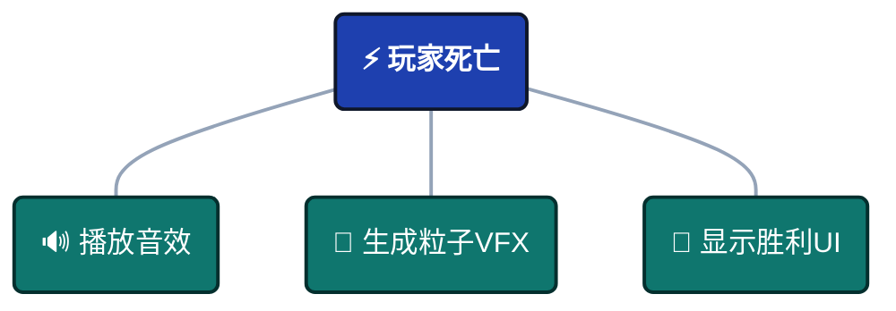
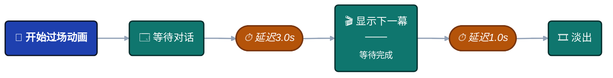
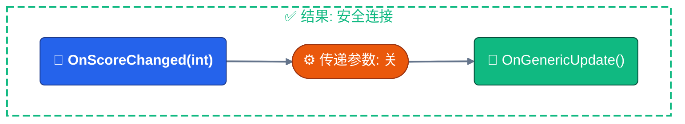

# 连接类型与端口

在构建流程之前，您必须理解图表的**可视化语言**。每种颜色、形状和线条样式都传达了数据流和执行行为。

:::tip 快速参考
此处显示的图例也可在**流程编辑器**（右侧面板）中找到。将鼠标悬停在图例的任何位置以查看详细工具提示。
:::

---

## 🧬 节点类型

节点的**标题颜色**表示其执行模式。


### 执行模式

| 颜色 | 类型 | 行为 | 使用场景 |
| ------------ | ---------------- | ------------------------------------------------------------ | ------------------------------------------------- |
| 🔴 **红色** | **根节点** | **入口点** - 外部触发事件时触发 | 游戏开始、玩家输入、碰撞检测 |
| 🟠 **橙色** | **触发器节点** | **并行（扇出）** - 触发后立即继续（非阻塞） | 声音 + VFX + UI更新同时发生 |
| 🟢 **绿色** | **链节点** | **顺序（阻塞）** - 触发后等待再继续 | 过场动画、延迟动作、异步操作 |

---

### 根节点规则

**每个图一个**：每个图表只有**一个**根节点。

**设置根**：右键点击任何节点以**设置为根**来更改入口点。

**可视化**：红色标题渐变使其立即可识别。

---

### 触发器 vs 链

**触发器模式**（并行）：


:::info 触发器

全部并行一起执行！

:::

**链模式**（顺序）：


:::info 链

每个都等待前一个完成！

:::

---

## 🔌 端口类型（数据签名）

**端口颜色**表示C#事件签名和数据有效载荷。


### 端口颜色含义

| 颜色 | 签名 | 描述 | 示例事件 |
| ------------ | ------------------ | -------------------------------------- | --------------------------------------------- |
| 🔵 **青色** | `()` | **Void** - 不传递数据 | `OnGameStart`、`OnButtonClick` |
| 🌸 **粉色** | `<T>` | **单参数** - 一个数据有效载荷 | `OnScoreChanged(int)`、`OnDamage(DamageInfo)` |
| 💜 **紫色** | `<TSender, TArgs>` | **双参数** - Sender + 有效载荷 | `OnPlayerDamaged(GameObject, DamageInfo)` |

---

### 端口解剖

- **左端口**（输入）：从前一个节点接收数据。
- **右端口**（输出）：将数据发送到下一个节点。

## 🔗 连接兼容性

系统在创建连接时提供**实时类型安全**。


### 兼容性级别

| 颜色 | 状态 | 含义 | 影响 |
| ------------ | ----------------- | -------------------------------- | --------------------------------- |
| 🟢 **绿色** | **完美匹配** | 类型完全匹配 | 零开销，无转换 |
| 🟡 **黄色** | **兼容** | 安全操作，数据丢弃 | 参数被忽略，无错误 |
| 🟠 **橙色** | **警告** | 需要类型转换 | 自动转换（例如，int → float） |
| 🔴 **红色** | **不兼容** | 运行时将失败 | 连接被阻止 |

---

### 视觉反馈

**拖动时**：
- 预览线显示兼容性颜色
- 无效目标显示为暗淡
- 有效目标高亮显示

**连接后**：
- 线条颜色保持
- 橙色/红色出现警告图标（⚠️）
- 悬停查看详细工具提示

---

## 📊 兼容性矩阵

连接颜色由**源类型**、**目标类型**和**传递参数**设置决定。

### 完整兼容性表

| 源事件 | 目标事件 | 传递参数 | 结果 | 说明 |
| ------------ | ------------ | ------------- | -------- | ----------------------------------------------- |
| 任何 | 任何 | **关** | 🟢 绿色 | **覆盖**：目标忽略所有输入 |
| Void `()` | Void `()` | 开 | 🟢 绿色 | 完美匹配 - 不需要数据 |
| Void `()` | `<T>` | 开 | 🔴 红色 | **错误**：目标需要数据，源没有 |
| Void `()` | `<S,T>` | 开 | 🔴 红色 | **错误**：目标需要sender，源没有 |
| `<T>` | Void `()` | 开 | 🟡 黄色 | **安全**：参数丢弃 |
| `<T>` | `<T>` | 开 | 🟢 绿色 | 完美匹配 - 相同类型 |
| `<T>` | `<S,T>` | 开 | 🔴 红色 | **错误**：目标需要sender，源没有 |
| `<S,T>` | Void `()` | 开 | 🟡 黄色 | **安全**：sender和arg都丢弃 |
| `<S,T>` | `<T>` | 开 | 🟡 黄色 | **安全**：sender丢弃，arg传递 |
| `<S,T>` | `<S,T>` | 开 | 🟢 绿色 | 完美匹配 - sender + arg |
| `<T1>` | `<T2>` | 开 | 🟠 橙色 | **警告**：类型转换（int ↔ float） |

---

### 特殊情况

**传递参数 = 关**：

始终产生🟢 **绿色**连接，因为目标忽略所有输入数据。

**使用场景**：将类型化事件链接到void事件而无类型错误。


---

**数值转换**：

在兼容的数值类型之间自动转换（🟠 橙色）：
- `int` ↔ `float`
- `float` ↔ `double`
- `int` ↔ `long`

**警告**：可能丢失精度（例如，`float` 3.14 → `int` 3）。

---

**不兼容类型**：

在连接时被阻止（🔴 红色）：
- `string` → `int`
- `GameObject` → `float`
- 自定义类型不匹配

**系统阻止创建**这些连接。

---

## 🏷️ 状态徽章

徽章出现在**节点底部**以显示活动配置。


### 徽章参考

| 图标 | 徽章 | 含义 | 适用于 |
| ---- | ---------- | ------------------------------- | ------------ |
| 🧩 | **Cond** | 可视化条件树活动 | 所有节点 |
| ⏱️ | **2.5s** | 开始延迟（秒） | 所有节点 |
| ⏳ | **3.0s** | 阻塞持续时间（秒） | 仅链 |
| ⚓ | **Wait** | 等待异步完成 | 仅链 |
| ⬆️ | **+5** | 执行优先级 | 仅触发器 |
| 🔗 | **Pass** | 将参数传递给下一个节点 | 所有节点 |
| 📌 | **Static** | 参数被阻止（静态调用） | 所有节点 |

---

### 徽章示例

**带延迟 + 持续时间的链节点**：
```
⏱️ 1.0s   ← 开始前等待1秒
⏳ 3.0s   ← 然后阻塞3秒
```

**带条件 + 优先级的触发器节点**：
```
🧩 Cond   ← 仅在条件通过时触发
⬆️ +10    ← 在其他触发器之前执行
```

**带参数传递的任何节点**：
```
🔗 Pass   ← 将事件数据转发到下一个节点
```

---

## 🎨 可视化示例

### 示例1：完美匹配链


**颜色**：

- 线1：🟢 绿色（完美匹配）
- 线2：🟡 黄色（sender安全丢弃）

---

### 示例2：类型转换警告


**颜色**：🟠 橙色（int → float转换）

**风险**：精度变化，但有效

---

### 示例3：传递参数


**颜色**：🟢 绿色（void → int）

**无阻塞：** 忽略参数以匹配

------

### 示例4：并行触发器扇出


**所有连接：** 绿色（void → void），立即并行执行

---

## 💡 最佳实践

### 明智使用传递参数

**何时传递（开启）**：
- 下一个节点需要事件数据
- 构建数据管道
- 转发伤害信息、分数等

**何时阻止（关闭）**：
- 连接不兼容的类型
- 通用通知（不需要数据）
- 简化复杂类型链

---

### 为流程进行颜色编码

**绿色为主的图表**：类型良好。

**黄色连接**：有意丢弃数据时可以接受。

**橙色线条**：检查正确性——确保转换是有意的。

**红色块**：立即修复——运行时将失败。

---

### 按类型组织

**将相似签名节点分组**在一起：
- Void事件在一个区域
- 数据事件在另一个区域
- 异步链与触发器分开

**为什么**：使类型兼容性更容易可视化。

---

## ❓ 常见问题

### 为什么我的连接是红色的？

**原因**：无法解决的类型不匹配。

**修复**：
1. 检查目标是否需要sender但源不提供
2. 在目标节点上禁用"传递参数"
3. 插入中间转换节点

---

### 我可以连接不同的数值类型吗？

**可以**：系统自动转换`int`、`float`、`double`、`long`。

**结果**：🟠 橙色连接，带转换警告。

**注意**：注意精度损失（float → int）。

---

### 黄色是什么意思？

**含义**：安全连接，但**数据丢弃**。

**示例**：将`<int>`发送到`<void>`会丢弃整数。

**安全吗？**：是——无运行时错误，只是未使用的数据。

:::tip 快速访问图例

在流程图编辑器中工作时，**图例面板**（右侧）显示所有节点类型、端口颜色和连接含义。将鼠标悬停在任何图例项上以获取详细工具提示。

:::

:::warning 运行时错误

🔴 **红色连接**在创建期间被阻止以防止运行时崩溃。如果您需要连接不兼容的类型，请在目标节点上禁用"传递参数"——这通过忽略输入数据强制🟢 绿色连接。

:::