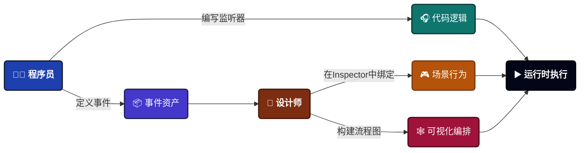

---
sidebar_label: 概览

sidebar_position: 1
---

# 游戏事件系统

一个生产就绪的可视化事件架构系统，专为Unity打造，将混乱的事件管理转变为可维护、可测试的工作流程。

:::tip 来自作者
"我开发这个系统是因为厌倦了在自己的项目中与'隐形意大利面代码'作斗争。作为独立开发者，我需要一个能够平衡可视化清晰度与原始编码能力的工具——而且不能有性能损失。**TinyGiants** 是我对专业级工具的承诺，这些工具我每天都在自己的游戏中使用。"
—  ***[TinyGiants]** 来自中国*
:::

<div className="img-full-wrapper">


</div>


---

## 系统存在的意义

:::danger 问题所在
在传统的Unity开发中，事件会变成隐形的意大利面条代码:

- **隐藏的依赖关系**: 谁在监听？在哪里触发？祝你好运才能找到答案。
- **运行时崩溃**: 重命名一个方法，破坏10个场景对象。
- **跨场景噩梦**: 场景卸载时事件消失——到处都是内存泄漏和空引用。
- **缺乏可见性**: 复杂的事件链只存在于你的脑海中（以及过时的注释里）。

:::

:::success 解决方案
**TinyGiants.GameEventSystem** 提供了一个 **可视化优先、类型安全** 的事件架构:

✅ **事件即资产** - 基于ScriptableObject，受GUID保护，经得起重构  

✅ **可视化流程图** - 在一个窗口中查看你的事件链、触发器和条件  

✅ **零反射运行时** - 表达式树编译，实现接近C++的性能  

✅ **设计师友好** - 拖放式绑定，简单工作流无需编码  

✅ **生产级工具** - 实时监控、引用查找、代码生成自动化

:::

---

## 核心理念: 混合工作流

本系统采用程序员和设计师之间的 **分工协作** 模式:



| 角色 | 职责 | 工具 |
| ----------------- | ------------------------------------------------------------ | -------------------------------------- |
| **程序员** | 定义 **何时** 触发事件 `Raise()` 以及 **什么** 逻辑响应 | C# API, 监听器 |
| **设计师** | 将事件连接到 **场景对象** 并配置 **行为** | Inspector绑定, `GameEventBehavior` |
| **技术设计师** | 编排 **复杂序列**（延迟、链式、条件） | 可视化流程编辑器 |

**结果**: 清晰的关注点分离，同时完全可视化事件关系。

---

## 架构亮点

### 🏗️ 基础: ScriptableObject驱动

与基于字符串或单例的事件系统不同，**事件是一等公民资产**:
```csharp
// 事件是资产，而非魔法字符串
[GameEventDropdown] public GameEvent onPlayerDeath;
[GameEventDropdown] public GameEvent<int> onScoreChanged;

void Die() {
    onPlayerDeath.Raise(); // 类型安全，资产引用
}
```

**优势**:

- ✅ **完全解耦** - 发送者永远不知道接收者。触发一次，通知所有。
- ✅ **跨场景持久化** - 事件在场景加载/卸载中存活。
- ✅ **GUID标识** - 重命名文件、重组文件夹——引用永不断裂。
- ✅ **多数据库支持** - 为大型团队提供模块化组织。

<details>
<summary>📖 GUID保护机制的工作原理</summary>


每个事件都有一个存储在 `.meta` 文件中的唯一GUID:
```yaml
# PlayerDeath.asset.meta
guid: a7f3c21e9b4d8f6e2d1a9c8b7e6f5a4d
```

即使你将 `PlayerDeath` 重命名为 `OnCharacterDied`，Unity也会通过GUID维护引用。**场景链接永不断裂。**

</details>

---

### 🕸️ 可视化流程编排

不再需要在代码中寻找事件关系。**流程编辑器** 将不可见的逻辑转化为可维护的图表:


#### 使用场景

**🎯 触发器（扇出）**


**⛓️ 链式（顺序）**


**🔀 混合流程** 

混合并行 + 顺序逻辑


:::tip 可视化优势

- **分组组织** - 为大型流程提供颜色编码的分组
- **实时验证** - 连接类型检查（绿色=有效，红色=错误）
- **撤销/重做支持** - 完整的历史系统（Ctrl+Z/Y）
- **运行时调试** - 播放模式下活动节点会高亮显示

:::

---

### ⚡ 类型安全、零反射性能

Unity的泛型序列化设计存在缺陷。我修复了它。

#### 问题所在
```csharp
// ❌ Unity无法序列化这个
[SerializeField] private GameEvent<PlayerData> onPlayerDataChanged;
```

#### 我们的解决方案
```csharp
// ✅ 自动生成的具体类
[GameEventDropdown] public PlayerDataGameEvent onPlayerDataChanged;

// 生成的代码（自动）:
[Serializable]
public class PlayerDataGameEvent : GameEvent<PlayerData> { }
```

**性能优势**:

- 🚀 **表达式树编译** - 条件在启动时编译为委托（无运行时解析）
- 🚀 **无反射成本** - 直接方法调用，而非 `Invoke()`
- 🚀 **原生Inspector支持** - 完全兼容 `UnityEvent<T>`

<details>
<summary>⚙️ 代码生成工作流</summary>


1. **选择类型** - 在Creator窗口中选择你的自定义类型
2. **生成** - 点击"Generate"创建具体类
3. **编译** - Unity自动编译新代码
4. **创建** - 现在你可以为自定义类型创建事件了

**时间投入**: ~10秒。**收益**: 终身类型安全。

</details>

---

## 功能特性总览

### ⚓ 核心架构

| 特性 | 描述 |
| :------------------------- | :----------------------------------------------------------- |
| **基于资产的事件** | ScriptableObject架构，具有 **GUID标识**——引用在重命名和文件移动后仍然有效。 |
| **全面的泛型支持** | 原生支持 `GaneEvent<Void>`、`GameEvent<T>` 和源感知的 `GameEvent<TSender, TArgs>`。 |
| **多数据库系统** | 支持多个数据库的模块化组织，具有 **动态加载** 和 **健康检查** 功能。 |
| **分类系统** | 基于字符串的分类，用于在大型事件库中进行高效的模糊搜索过滤。 |
| **自动静态重置** | 在编辑器播放模式下自动清除静态缓存，以防止数据污染。 |

### 🧠 高级逻辑与流程
| 特性 | 描述 |
| :------------------------ | :----------------------------------------------------------- |
| **表达式树** | **零反射** 逻辑评估；条件在运行时编译为高性能委托。 |
| **可视化逻辑构建器** | 无需代码即可构建复杂的 **嵌套AND/OR逻辑** 和动态属性比较。 |
| **混合执行** | 在一个图表中无缝混合并行 **扇出触发器** 和顺序 **阻塞链**。 |
| **参数转换器** | 动态提取并传递特定对象属性作为流程节点之间的参数。 |
| **精细流程控制** | 每个节点的延迟、**异步/协程等待**、循环计数和条件执行门控。 |

### 🎧 监听与绑定
| 特性 | 描述 |
| :------------------------ | :----------------------------------------------------------- |
| **可视化绑定** | 在Inspector中拖放式 **UnityEvent连接**，带有可视状态标记和类型安全。 |
| **优先级监听器** | **基于整数的排序**，确保关键系统在标准UI/音频监听器之前响应。 |
| **条件监听器** | 内置 **谓词支持**——仅在满足特定逻辑条件时触发回调。 |
| **持久化监听器** | 原生支持在场景转换期间保持活动的 **跨场景监听器**。 |
| **动态运行时API** | 完整的编程控制，用于注册或注销监听器并管理 **任务句柄**。 |

### 📊 工具与调试
| 特性 | 描述 |
| :--------------------- | :----------------------------------------------------------- |
| **仪表板与向导** | 用于 **批量操作** 的现代UI和用于快速事件创建的模糊匹配向导。 |
| **代码自动化** | **三模式代码生成**（基础/自定义/Sender），带有自动编译管线集成。 |
| **引用查找器** | 场景范围扫描器，精确定位哪些组件引用了特定事件资产。 |
| **运行时监控器** | 实时分析 **执行时间（平均/最小/最大）**、监听器计数和 **GC分配**。 |
| **自动化树** | 活动触发器和链式层次结构的实时可视化工具，用于调试复杂逻辑流程。 |

------

## 性能特征

来自生产构建的实际指标:

| 场景 | 性能 | 备注 |
| ------------------------------- | ----------- | ---------------------------- |
| **事件触发（0个监听器）** | ~0.001ms | 几乎无消耗 |
| **事件触发（10个监听器）** | ~0.02ms | 无GC分配 |
| **条件评估** | ~0.003ms | 表达式树编译 |
| **流程节点执行** | ~0.05ms | 包含协程开销 |
| **监控窗口（100个事件）** | ~0.3ms | 仅编辑器，无运行时成本 |

:::success 生产就绪
已在发布的游戏中测试，包含 **500+事件** 和跨场景的 **10,000+监听器**。零性能退化。
:::

------

## 🗺️ 导航路线图

此地图提供了系统文档的完整概览。使用下表快速跳转到您需要的特定功能或教程。

:::info 推荐的学习路径

- 🚀 **最快入门**: 直接跳到 [**示例: 快速开始**](../examples/00-quick-start.md)。
- 🎨 **可视化学习者**: 专注于 [**可视化工作流**](#visual-workflow) 和 [**流程编排**](#flow-orchestration) 表格。
- 💻 **程序员深度学习**: 直接前往 [**运行时API**](#runtime-api)。

:::

### 🏁 1. 介绍 {#introduction}

事件即资产架构的基础设置和核心理念。

| 页面 | 描述 |
| :---------------------------------------------- | :----------------------------------------------------------- |
| [**项目结构**](./project-structure.md) | 理解目录布局、文件夹保护和模块化组织。 |
| [**安装**](./installation.md) | 初始化插件并设置自动静态重置管线。 |

### 💎 2. 可视化工作流 {#visual-workflow}

将不可见代码转化为有形可视化仪表板的管理工具。

| 页面 | 描述 |
| :----------------------------------------------------------- | :----------------------------------------------------------- |
| [**系统仪表板**](../visual-workflow/game-event-system.md) | 基于资产的工作流和GUID身份系统概览 |
| [**数据库与流程图**](../visual-workflow/game-event-manager.md) | 处理多数据库和多流程图设置以及数据库健康维护 |
| [**编辑游戏事件**](../visual-workflow/game-event-editor.md) | 使用仪表板进行批量编辑、搜索和分类 |
| [**创建游戏事件**](../visual-workflow/game-event-creator.md) | 使用模糊搜索批量向导快速生成事件资产 |
| [**配置游戏事件**](../visual-workflow/game-event-behavior.md) | 掌握带有可视状态标记和类型安全的Inspector绑定 |
| [**触发游戏事件**](../visual-workflow/game-event-raiser.md) | 学习如何调用事件并使用内置GameEventDropdown属性增强Inspector |
| [**查找游戏事件**](../visual-workflow/game-event-finder.md) | 扫描场景以定位组件级事件依赖关系。 |
| [**可视化条件树**](../visual-workflow/visual-condition-tree.md) | 学习如何通过条件树配置控制事件动作的逻辑执行 |

### 🕸️ 3. 流程编排 {#flow-orchestration}

使用节点可视化和构建复杂的多步骤逻辑序列。

| 页面 | 描述 |
| :----------------------------------------------------------- | :----------------------------------------------------------- |
| [**节点编辑器**](../flow-graph/game-event-node-editor.md) | 管理GraphView画布、分组和基于快照的撤销/重做 |
| [**节点连接器**](../flow-graph/game-event-node-connector.md) | 混合执行模式的规则和实时连接验证 |
| [**节点行为**](../flow-graph/game-event-node-behavior.md) | 配置节点级延迟、循环和参数转换逻辑 |
| [**高级逻辑模式**](../flow-graph/advanced-logic-patterns.md) | 构建无代码嵌套逻辑组和条件执行门控 |

### 💻 4. 脚本与API {#runtime-api}

开发者的高性能C#集成和生命周期管理指南。

| 页面 | 描述 |
| :----------------------------------------------------------- | :----------------------------------------------------------- |
| [**触发与调度**](../scripting/raising-and-scheduling.md) | 编程式触发、延迟执行和任务句柄管理 |
| [**监听策略**](../scripting/listening-strategies.md) | 实现优先级、持久化和源感知（Sender）监听器 |
| [**编程式流程**](../scripting/programmatic-flow.md) | 使用基于表达式树的谓词实现零反射逻辑过滤 |
| [**最佳实践**](../scripting/best-practices.md) | 清晰解耦和防止数据污染的架构技巧 |
| [**API参考**](../scripting/api-reference.md) | 所有核心类和属性的详细技术文档 |

### 🛠️ 5. 工具与支持 {#tools-support}

专业生产环境的自动化和监控实用工具。

| 页面 | 描述 |
| :----------------------------------------------------------- | :----------------------------------------------------------- |
| [**代码生成与清理**](../tools/codegen-and-cleanup.md) | 使用三模式生成器和编译管线自动化 |
| [**运行时监控器**](../tools/runtime-monitor.md) | 实时性能分析、深度日志记录和警告系统 |
| [**社区与支持**](../tools/community-and-support.md) | 访问更新、报告错误和获取技术支持 |

### 📚 6. 示例 {#examples}

涵盖从基础到高级API使用的每个场景的实用即用场景。

| ID | 示例页面 | 核心学习点 |
| :--- | :----------------------------------------------------------- | :----------------------------------------------------------- |
| 00 | [**快速开始**](../examples/00-quick-start.md) | 创建、触发和绑定事件的最小工作流 |
| 01 | [**空事件**](../examples/01-void-event.md) | 使用无参数信号进行全局触发，如"关卡开始" |
| 02 | [**基础类型事件**](../examples/02-basic-types-event.md) | 通过事件传递原始数据（int、float、string） |
| 03 | [**自定义类型事件**](../examples/03-custom-type-event.md) | 利用CodeGen实现序列化自定义数据类和结构体 |
| 04 | [**自定义Sender事件**](../examples/04-custom-sender-event.md) | 使用源感知事件识别哪个实体触发了信号 |
| 05 | [**优先级事件**](../examples/05-priority-event.md) | 精确控制多个监听器的执行顺序 |
| 06 | [**条件事件**](../examples/06-conditional-event.md) | 使用谓词仅在满足条件时执行回调 |
| 07 | [**延迟事件**](../examples/07-delayed-event.md) | 管理定时逻辑并使用任务句柄进行取消 |
| 08 | [**重复事件**](../examples/08-repeating-event.md) | 创建循环脉冲信号和自动化逻辑循环 |
| 09 | [**持久化事件**](../examples/09-persistent-event.md) | 处理场景转换期间的事件（DontDestroyOnLoad） |
| 10 | [**触发器事件**](../examples/10-trigger-event.md) | 将Unity的物理系统与游戏事件资产桥接 |
| 11 | [**链式事件**](../examples/11-chain-event.md) | 使用流程编排图构建可视化顺序逻辑 |
| 12 | [**多数据库**](../examples/12-multi-database.md) | 将事件隔离到不同资产中以实现模块化项目组织 |
| 13 | [**运行时API**](../examples/13-runtime-api.md) | 通过C#脚本动态注册和注销监听器 |
| 14 | [**运行时监控器**](../examples/14-runtime-monitor.md) | 使用分析工具调试执行时间和GC分配 |

:::tip 导航提示
对于实践入门，我们建议首先遵循 **示例00（快速开始）**，然后探索 **可视化工作流** 部分，了解编辑器工具如何简化您的开发。
:::