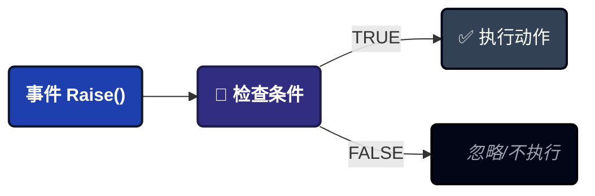
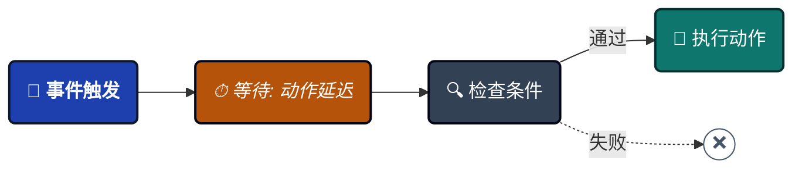
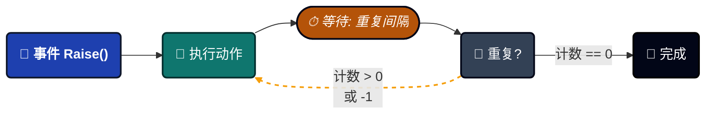
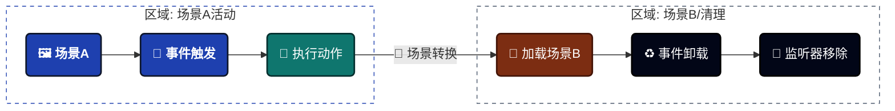
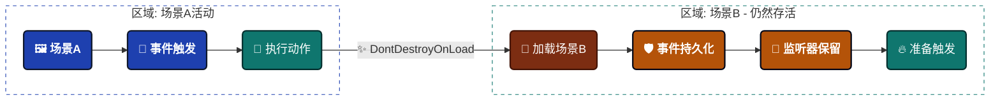

import Tabs from '@theme/Tabs';

import TabItem from '@theme/TabItem';


# 游戏事件行为

定义事件触发时**发生什么**。与盲目执行的传统事件不同，此系统允许您直接将条件、延迟、循环和可视化动作附加到事件资产本身。


---

## 🚀 打开行为窗口

从 **[游戏事件编辑器](./game-event-editor.md)** 访问：
```
游戏事件编辑器 → 点击任意事件行上的行为按钮（彩色药丸）
```

**按钮颜色状态**：

| 颜色 | 图标 | 含义 | 详情 |
| -------- | ---- | -------------------------- | -------------------------------------------- |
| 🟢 绿色 | ✓ | 已配置（Inspector） | 在Manager中有UnityEvent动作 |
| 🔵 蓝色 | ▶ | 运行时活动（播放模式） | 通过 `AddListener()` 有基于代码的监听器 |
| 🟡 橙色 | ⚠ | 未配置 | 无动作或监听器 |

**按钮标签**：显示事件类型签名（例如，`<void>`、`<int>`、`<GameObject, DamageInfo>`）

---

## 📋 窗口概览

行为窗口有四个主要部分：

1. **事件信息** - 身份确认（名称、类别、GUID）
2. **动作条件** - 可视化逻辑树（执行门控）
3. **事件动作** - UnityEvent回调（要执行什么）
4. **调度配置** - 时间控制（延迟、循环、持久化）

---

## 1️⃣ 事件信息

只读摘要，确认您正在编辑正确的事件。


**显示的数据**：
- **事件名称**：资产名称
- **类别**：组织分组
- **GUID**：唯一的内部标识符（在重命名后保留）

:::tip 为什么GUID很重要
GUID确保即使您重命名事件，引用也保持完整。这就是为什么在编辑器中安全重命名有效的原因！
:::

---

## 2️⃣ 动作条件（执行门控）

**逻辑引擎**：仅当这些条件评估为 `TRUE` 时，动作才会执行。


### 它的作用

根据运行时值控制**是否执行动作**：



### 可视化逻辑树

**无需代码**即可构建复杂的布尔逻辑，使用：

- **组**：使用AND/OR逻辑组合条件
- **比较**：单个检查（例如，`Health < 20`）
- **嵌套**：组内嵌套组（无限深度）

### 性能

:::tip 零反射开销
条件在初始化时编译为 **表达式树**。它们的运行速度与手写C#代码一样快！
:::

### 了解更多

可视化条件树是一个功能强大的系统，具有许多特性：

- **4种源类型**：事件参数、场景类型、随机、常量
- **10种比较运算符**：数值、字符串、集合检查
- **Bool方法支持**：使用自定义 `bool` 方法作为条件
- **拖放重新排序**：可视化组织逻辑
- **类型验证**：自动检测不兼容的比较

**📖 完整指南**：**[可视化条件树](./visual-condition-tree.md)**

---

## 3️⃣ 事件动作（回调层）

**动作**定义了在事件被触发且满足所有条件后执行的Unity回调。


### 🧩 理解UnityEvent字段

系统利用Unity的原生 **UnityEvent** 架构，确保与现有的MonoBehaviour和UI组件无缝集成。

------

#### 🔘 对于无参数事件（`GameEvent`）

*仅标准触发逻辑。*

| 类型 | 后端字段 | 兼容性 |
| --------- | ------------------- | ---------------------------------------- |
| **逻辑** | `UnityEvent (void)` | 🟢 接受任何 **零参数** 方法。 |

**示例：** OnGameStart ➔ AudioManager.PlayBGM()、UI.FadeIn()

------

#### 🔢 对于单参数事件（`GameEvent<T>`）

*有效载荷驱动的逻辑。直接将数据传递给监听器。*

| 类型 | 后端字段 | 兼容性 |
| --------- | --------------- | --------------------------------------------------- |
| **逻辑** | `UnityEvent<T>` | 🟡 接受具有 **一个类型T参数** 的方法。 |

**示例：** OnHealthChanged(float) ➔ HealthBar.UpdateFill(float)

------

#### 👥 对于Sender事件（`GameEvent<TSender, TArgs>`）

*上下文感知逻辑。同时传递源和数据有效载荷。*

| 类型 | 后端字段 | 兼容性 |
| --------- | ---------------------------- | ------------------------------------------ |
| **逻辑** | `UnityEvent<TSender, TArgs>` | 🔵 接受具有 **两个参数** 的方法。 |

**示例：** OnDamage(GameObject, int) ➔ VFXManager.SpawnAt(GameObject.pos)、Popup.Show(int)

:::info **原生集成**
因为我们使用 **原生UnityEvent**，您可以直接在Inspector中或通过代码使用AddListener()分配监听器。它支持 **静态** 和 **动态** 调用。
:::

:::tip **签名匹配**
Inspector UI将自动过滤方法列表，仅显示与事件签名匹配的函数，防止运行时错误。
:::

------

### ➕ 添加动作（工作流）


按照这三个简单步骤通过Unity Inspector连接您的逻辑。

#### 1️⃣ 分配目标对象

将包含您逻辑的GameObject或Component **拖放** 到 **Object** 插槽中。

- 🖱️ **操作：** 从层级视图拖动 ➔ 放入空插槽。
- 📦 **结果：** 该字段现在引用您脚本的特定实例。

#### 2️⃣ 选择回调方法

点击 **Function Dropdown** 浏览分配对象上所有可用的公共方法。

- 🔍 **操作：** 点击No Function ➔ 导航到您的脚本/组件。
- ⚡ **提示：** 只有与 **事件签名** 匹配的方法（例如，void、int）才会出现在顶部以便于选择。

#### 3️⃣ 定义参数映射

决定是使用事件的实时数据还是固定值。

- ⚖️ **动态调用：** 使用事件发送的 **运行时值**（例如，实际造成的伤害）。
- ⚙️ **静态参数：** 使用您在Inspector中手动定义的 **固定值**。

------

### 💡 动态与静态：选择哪一个？

| 模式 | 视觉图标 | 最适合... |
| ----------- | ----------- | ------------------------------------------------------------ |
| **动态** | 🚀 | 实时数据（例如，使用当前HP更新生命条）。 |
| **静态** | 📌 | 固定触发（例如，记录"按钮已点击"到控制台）。 |

:::tip **专业提示**
在下拉菜单中，**动态** 方法始终列在菜单的 **顶部**。如果您没有看到您的方法，请检查参数类型是否完全匹配！
:::

---

### 动态与静态函数

**动态**（带事件数据）：
```csharp
// 接收事件参数
public void TakeDamage(float amount) {
    health -= amount;
}

// 对于Sender事件
public void OnDamageReceived(GameObject attacker, DamageInfo info) {
    // 同时使用sender和args
}
```

**静态**（忽略事件数据）：
```csharp
// 不需要参数
public void PlaySound() {
    audioSource.Play();
}
```

**何时使用每种**：

| 使用动态当 | 使用静态当 |
| --------------------------- | ---------------------- |
| 您需要事件的数据 | 只需要通知 |
| 处理float/int值 | 播放声音/效果 |
| 检查sender引用 | 触发动画 |
| 数据驱动的反应 | 状态变化 |

---

### 多个动作与优先级

**添加多个**：重复点击+以添加更多动作。

**执行顺序**：从上到下。

**重新排序**：拖动每个动作左侧的☰把手。

**示例**：
```csharp
📜 LogDamageEvent() ➔ 
    🥇 第一（元数据/日志记录）
🎵 PlayHitSound() ➔ 
    🥈 第二（音频/VFX反馈）
📊 UpdateHealthBar(float) ➔ 
    🥉 第三（UI/视觉表示）
🏁 CheckDeathCondition() ➔ 
    🏆 最终（游戏状态逻辑）
```

---

### 清除所有动作

点击 **"Clear All"** 按钮（右上角）一次性删除所有动作。

⚠️ **显示确认**："您确定吗？"

---

## 4️⃣ 调度配置

**调度**层决定在事件触发后**何时**以及**多久**执行一次您的动作。


<Tabs>
<TabItem value="delay" label="⏱️ 动作延迟" default>

### 动作延迟

**时间偏移。** 在事件触发和实际执行之间引入间隙。

- 🕒 **值：** float（秒）
- 🎯 **目的：** 与动画、VFX或延迟游戏逻辑同步。

**工作原理：**

1. 🔔 **事件触发** ➔ 接收到信号。
2. ⏳ **延迟中** ➔ 系统等待指定的X秒。
3. 🔍 **条件检查** ➔ 在等待*之后*重新验证条件。
4. 🚀 **执行** ➔ 仅当条件仍然通过时才触发动作。


</TabItem>

<TabItem value="interval" label="🔄 重复间隔">

### 重复间隔

**自动循环。** 使事件能够周期性地自动重新触发，无需手动干预。

- 🕒 **参数：** float（秒）
- 🔄 **逻辑：** 确定重复周期的"节拍速率"。

**值映射：**

- 0.0s ➔ 🚫 **禁用**（单次执行）
- \> 0s ➔ 🔁 **活动循环**（每X秒执行一次）

:::info **与延迟的交互**
如果同时设置了 **延迟** 和 **间隔**，第一次执行遵循延迟，后续重复遵循间隔。
:::

</TabItem>

<TabItem value="count" label="🔢 重复计数">

### 重复计数

**生命周期控制。** 限制事件可以重复的次数。

**配置指南：**

| 值 | 行为 | 总执行次数 |
| ----- | ------------------- | ----------------------- |
| 0 | **不重复** | 1（仅初始） |
| N | **有限循环** | 1 + N |
| -1 | **无限循环** ♾️ | 直到停止/销毁 |

**UI指示器：**
当设置为-1时，会出现一个 **↺ 重置** 按钮。点击它可以快速将计数恢复为1。


</TabItem>

<TabItem value="persistent" label="🛡️ 持久化事件">

### 持久化事件

**场景存活。** 决定加载新Unity场景时事件对象是否存活。

🔳 **未选中（默认）：** 场景加载时事件被销毁（标准行为）。


☑️ **选中：** 行为类似DontDestroyOnLoad。


**最佳使用场景：**

| ✅ 使用持久化用于 | ❌ 不要用于 |
| -------------------------- | --------------------------- |
| 🎵 **全局BGM管理器** | 🏰 关卡特定谜题 |
| 💾 **保存/加载系统** | 👾 场景特定AI寻路 |
| 🏆 **成就追踪器** | 🖼️ 本地菜单动画 |
| 🌐 **多人游戏状态** | 🔦 临时房间照明 |

:::warning **⚠️ 关键：依赖注入**
持久化事件在转换后**无法**维护对场景特定对象的引用。您必须在OnSceneLoaded后通过 **依赖注入** 或 **服务定位器** 将新场景对象重新绑定到持久化事件。
:::

</TabItem>
</Tabs>

---

## ❓ 故障排除

### 动作未执行

**问题**：事件触发但什么都没发生。

**检查清单**：

✅ **检查条件**：
```
1. 条件是否启用？（在条件部分切换）
2. 条件是否评估为TRUE？
3. 测试条件逻辑 - 参见可视化条件树指南
4. 添加Debug.Log()以验证值
```

✅ **检查动作**：
```
1. UnityEvent字段是否为空？添加动作！
2. 目标GameObject是否被销毁？
3. 目标Component是否被禁用？
4. 检查控制台是否有错误
```

✅ **检查调度**：
```
1. 动作延迟是否太长？
2. 重复间隔是否造成混淆？
3. 事件是否在不应该时是持久化的？
```

---

### "找不到字段"警告

**问题**：`Field 'IntGameEventAction' not found.`

**原因**：事件类型缺少其绑定代码。

**解决方案**：

点击 **"Force Rebuild All (Fix Missing Bindings)"** 按钮。

这会重新生成所有绑定字段：
```
Assets/TinyGiantsData/GameEventSystem/CodeGen/Basic/
└─ IntGameEvent.cs（使用绑定字段重新生成）
```

**编译后**：重新打开行为窗口。

---

### 动作触发多次

**问题**：动作执行次数超过预期。

**常见原因**：

**原因1：重复设置**
```
检查：
- 重复间隔 > 0？
- 重复计数 > 0？

如果是，事件正在循环（有意或无意）
```

**原因2：多次事件触发**
```
代码中多次触发事件：
  OnHealthChanged.Raise(newHealth);  ← 重复调用

解决方案：确保事件仅在需要时触发
```

**原因3：多个监听器**
```
在UnityEvent中多次添加相同动作

解决方案：检查动作列表，删除重复项
```

---

:::tip 下一步
现在您已经了解了事件行为，探索 **[可视化条件树](./visual-condition-tree.md)** 以掌握高级条件逻辑。或跳转到 **[流程编辑器](../flow-graph/game-event-node-editor.md)** 构建事件编排！
:::