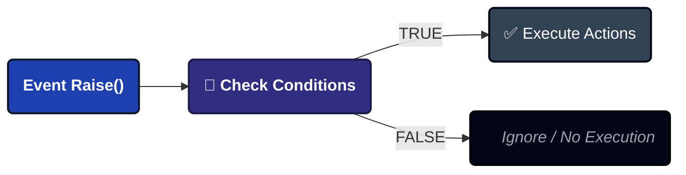
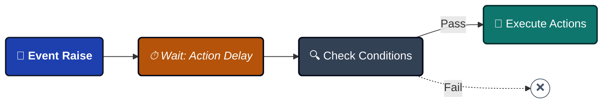
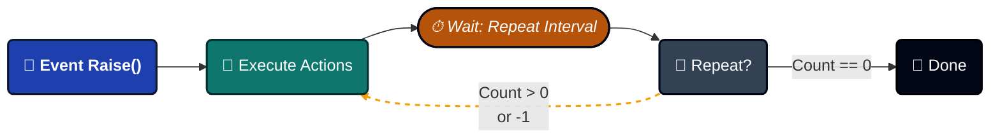
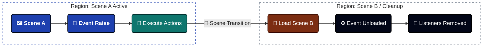

import Tabs from '@theme/Tabs';

import TabItem from '@theme/TabItem';


# Game Event Behavior

Define **what happens** when an event fires. Unlike traditional events that execute blindly, this system lets you attach conditions, delays, loops, and visual actions directly to the event asset itself.


---

## 🚀 Opening the Behavior Window

Access from the **[Game Event Editor](./game-event-editor.md)**:
```
Game Event Editor → Click Behavior Button (colored pill) on any event row
```

**Button Color States**:

| Color    | Icon | Meaning                    | Details                                      |
| -------- | ---- | -------------------------- | -------------------------------------------- |
| 🟢 Green  | ✓    | Configured (Inspector)     | Has UnityEvent actions in Manager            |
| 🔵 Blue   | ▶    | Runtime Active (Play Mode) | Has code-based listeners via `AddListener()` |
| 🟡 Orange | ⚠    | Not Configured             | No actions or listeners                      |

**Button Label**: Shows event type signature (e.g., `<void>`, `<int>`, `<GameObject, DamageInfo>`)

---

## 📋 Window Overview

The Behavior Window has four main sections:

1. **Event Information** - Identity confirmation (name, category, GUID)
2. **Action Condition** - Visual logic tree (execution gate)
3. **Event Action** - UnityEvent callbacks (what to execute)
4. **Schedule Configuration** - Timing controls (delays, loops, persistence)

---

## 1️⃣ Event Information

Read-only summary confirming you're editing the correct event.


**Displayed Data**:
- **Event Name**: Asset name
- **Category**: Organizational group
- **GUID**: Unique internal identifier (preserved across renames)

:::tip Why GUID Matters
The GUID ensures references stay intact even if you rename the event. This is why safe renaming works in the Editor!
:::

---

## 2️⃣ Action Condition (Execution Gate)

**The Logic Engine**: Actions only execute if these conditions evaluate to `TRUE`.


### What It Does

Controls **whether actions execute** based on runtime values:




### Visual Logic Tree

Build complex boolean logic **without code** using:

- **Groups**: Combine conditions with AND/OR logic
- **Comparisons**: Individual checks (e.g., `Health < 20`)
- **Nesting**: Groups inside groups (unlimited depth)

### Performance

:::tip Zero Reflection Overhead
Conditions compile to **Expression Trees** at initialization. They run as fast as hand-written C# code!
:::

### Learn More

The Visual Condition Tree is a powerful system with many features:

- **4 Source Types**: Event Argument, Scene Type, Random, Constant
- **10 Comparison Operators**: Numeric, String, Collection checks
- **Bool Method Support**: Use custom `bool` methods as conditions
- **Drag & Drop Reordering**: Organize logic visually
- **Type Validation**: Auto-detects incompatible comparisons

**📖 Complete Guide**: **[Visual Condition Tree](./visual-condition-tree.md)**

---

## 3️⃣ Event Action (Callback Layer)

The **Action** defines the Unity callbacks that execute once an event is triggered and all conditions are met.


### 🧩 Understanding the UnityEvent Field

The system leverages Unity's native **UnityEvent** architecture, ensuring seamless integration with your existing MonoBehaviours and UI components.

------

#### 🔘 For Parameterless Events (`GameEvent`)

*Standard trigger-only logic.*

| Type      | Backend Field       | Compatibility                            |
| --------- | ------------------- | ---------------------------------------- |
| **Logic** | `UnityEvent (void)` | 🟢 Accepts any **zero-parameter** method. |

**Example:** OnGameStart ➔ AudioManager.PlayBGM(), UI.FadeIn()

------

#### 🔢 For Single Parameter Events (`GameEvent<T>`)

*Payload-driven logic. Passes data directly to the listener.*

| Type      | Backend Field   | Compatibility                                       |
| --------- | --------------- | --------------------------------------------------- |
| **Logic** | `UnityEvent<T>` | 🟡 Accepts methods with **one parameter** of type T. |

**Example:** OnHealthChanged(float) ➔ HealthBar.UpdateFill(float)

------

#### 👥 For Sender Events (`GameEvent<TSender, TArgs>`)

*Context-aware logic. Passes both the source and the data payload.*

| Type      | Backend Field                | Compatibility                              |
| --------- | ---------------------------- | ------------------------------------------ |
| **Logic** | `UnityEvent<TSender, TArgs>` | 🔵 Accepts methods with **two parameters**. |

**Example:** OnDamage(GameObject, int) ➔ VFXManager.SpawnAt(GameObject.pos), Popup.Show(int)

:::info **Native Integration**
Because we use **Native UnityEvents**, you can assign listeners directly in the Inspector or via code using AddListener(). It supports both **Static** and **Dynamic** calls.
:::

:::tip **Signature Matching**
The inspector UI will automatically filter the method list to only show functions that match the event's signature, preventing runtime errors.
:::

------

### ➕ Adding Actions (Workflow)


Follow these three simple steps to connect your logic via the Unity Inspector.

#### 1️⃣ Assign Target Object

**Drag and drop** the GameObject or Component that contains your logic into the **Object** slot.

- 🖱️ **Action:** Drag from Hierarchy ➔ Drop into the empty slot.
- 📦 **Result:** The field now references the specific instance of your script.

#### 2️⃣ Select Callback Method

Click the **Function Dropdown** to browse all public methods available on the assigned object.

- 🔍 **Action:** Click No Function ➔ Navigate to your Script/Component.
- ⚡ **Tip:** Only methods that match the **Event Signature** (e.g., void, int) will appear at the top for easy selection.

#### 3️⃣ Define Parameter Mapping

Decide whether to use the event's live data or a fixed value.

- ⚖️ **Dynamic Call:** Uses the **runtime value** sent by the event (e.g., the actual damage dealt).
- ⚙️ **Static Parameters:** Uses a **fixed value** you define manually in the Inspector.

------

### 💡 Dynamic vs. Static: Which one to choose?

| Mode        | Visual Icon | Best For...                                                  |
| ----------- | ----------- | ------------------------------------------------------------ |
| **Dynamic** | 🚀           | Real-time data (e.g., Updating a Health Bar with current HP). |
| **Static**  | 📌           | Fixed triggers (e.g., Logging "Button Clicked" to the console). |

:::tip **Pro Tip**
In the dropdown, **Dynamic** methods are always listed at the **top** of the menu. If you don't see your method there, check if the parameter types match exactly!
:::

---

### Dynamic vs Static Functions

**Dynamic** (with event data):
```csharp
// Receives event parameter(s)
public void TakeDamage(float amount) {
    health -= amount;
}

// For Sender events
public void OnDamageReceived(GameObject attacker, DamageInfo info) {
    // Use both sender and args
}
```

**Static** (ignores event data):
```csharp
// No parameters needed
public void PlaySound() {
    audioSource.Play();
}
```

**When to Use Each**:

| Use Dynamic When            | Use Static When        |
| --------------------------- | ---------------------- |
| You need the event's data   | Just need notification |
| Processing float/int values | Playing sounds/effects |
| Checking sender reference   | Triggering animations  |
| Data-driven reactions       | State changes          |

---

### Multiple Actions & Priority

**Add Multiple**: Click + repeatedly to add more actions.

**Execution Order**: Top to bottom.

**Reordering**: Drag the ☰ handle on the left of each action.

**Example**:

```csharp
📜 LogDamageEvent() ➔ 
    🥇 First (Metadata/Logging)
🎵 PlayHitSound() ➔ 
    🥈 Second (Audio/VFX Feedback)
📊 UpdateHealthBar(float) ➔ 
    🥉 Third (UI/Visual Representation)
🏁 CheckDeathCondition() ➔ 
    🏆 Final (Game State Logic)
```

---

### Clear All Actions

Click **"Clear All"** button (top-right) to remove all actions at once.

⚠️ **Shows confirmation**: "Are you sure?"

---

## 4️⃣ Schedule Configuration

The **Schedule** layer determines **when** and **how often** your actions are executed after an event is raised.


<Tabs>
<TabItem value="delay" label="⏱️ Action Delay" default>

### Action Delay

**Time Offset.** Introduces a gap between the event trigger and the actual execution.

- 🕒 **Value:** float (Seconds)
- 🎯 **Purpose:** Synchronize with animations, VFX, or delayed game logic.

**How It Works:**

1. 🔔 **Event Raised** ➔ The signal is received.
2. ⏳ **Delaying** ➔ System waits for the specified X seconds.
3. 🔍 **Condition Check** ➔ Re-validates conditions *after* the wait.
4. 🚀 **Execution** ➔ Actions fire only if conditions still pass.



</TabItem>

<TabItem value="interval" label="🔄 Repeat Interval">

### Repeat Interval

**Automatic Looping.** Enables the event to re-fire periodically without manual intervention.

- 🕒 **Parameter:** float (Seconds)
- 🔄 **Logic:** Determines the "tick rate" of the repeat cycle.

**Value Mapping:**

- 0.0s ➔ 🚫 **Disabled** (Single-shot execution)
- \> 0s ➔ 🔁 **Active Loop** (Executes every X seconds)

:::info **Interaction with Delay**
If both **Delay** and **Interval** are set, the first execution respects the Delay, and subsequent repeats follow the Interval.
:::

</TabItem>

<TabItem value="count" label="🔢 Repeat Count">

### Repeat Count

**Lifecycle Control.** Limits the number of times an event can repeat.

**Configuration Guide:**

| Value | Behavior            | Total Executions        |
| ----- | ------------------- | ----------------------- |
| 0     | **No Repeats**      | 1 (Initial only)        |
| N     | **Finite Loop**     | 1 + N                   |
| -1    | **Infinite Loop** ♾️ | Until stopped/destroyed |

**UI Indicator:**
When set to -1, a **↺ Reset** button appears. Click it to quickly revert the count back to 1.



</TabItem>

<TabItem value="persistent" label="🛡️ Persistent Event">

### Persistent Event

**Scene Survival.** Determines if the event object survives when a new Unity scene is loaded.

🔳 **Unchecked (Default):** Event is destroyed on scene load (Standard behavior).



☑️ **Checked:** Behaves like DontDestroyOnLoad.

```mermaid
graph LR

    classDef sceneA fill:#1e40af,stroke:#0f172a,stroke-width:2px,color:#ffffff,font-weight:bold
    classDef action fill:#0f766e,stroke:#042f2e,stroke-width:2px,color:#ffffff
    classDef transition fill:#7c2d12,stroke:#431407,stroke-width:2px,color:#ffffff
    classDef persistence fill:#b45309,stroke:#020617,stroke-width:2px,color:#ffffff,font-weight:bold
    classDef success fill:#0f766e,stroke:#042f2e,stroke-width:2px,color:#ffffff

    subgraph Scene_A [Region: Scene A Active]
        direction LR
        A(🖼️ Scene A):::sceneA --> B(🔔 Event Raise):::sceneA
        B --> C(🚀 Execute Actions):::action
    end
    style Scene_A fill:none,stroke:#1e40af,stroke-dasharray: 5 5

    C -- "✨ DontDestroyOnLoad" --> D(🚚 Loading Scene B):::transition

    subgraph Scene_B [Region: Scene B - Still Alive]
        direction LR
        D --> E(🛡️ Event Persisted):::persistence
        E --> F(💎 Listeners Remain):::persistence
        F --> G(🔥 Ready to Raise):::success
    end
    style Scene_B fill:none,stroke:#0f766e,stroke-dasharray: 5 5
```



**Best Use Cases:**

| ✅ Use Persistent For       | ❌ Don't Use For             |
| -------------------------- | --------------------------- |
| 🎵 **Global BGM Manager**   | 🏰 Level-Specific Puzzles    |
| 💾 **Save/Load System**     | 👾 Scene-Specific AI Pathing |
| 🏆 **Achievement Trackers** | 🖼️ Local Menu Animations     |
| 🌐 **Multiplayer State**    | 🔦 Temporary Room Lighting   |

:::warning **⚠️ Critical: Dependency Injection**
Persistent events **cannot** maintain references to scene-specific objects after a transition. You must re-bind new scene objects to the persistent event via **Dependency Injection** or a **Service Locator** after OnSceneLoaded.
:::

</TabItem>
</Tabs>

---

## ❓ Troubleshooting

### Actions Not Executing

**Problem**: Event fires but nothing happens.

**Checklist**:

✅ **Check Conditions**:
```
1. Are conditions enabled? (toggle in condition section)
2. Do conditions evaluate to TRUE?
3. Test condition logic - see Visual Condition Tree guide
4. Add Debug.Log() to verify values
```

✅ **Check Actions**:
```
1. Is UnityEvent field empty? Add actions!
2. Is target GameObject destroyed?
3. Is target Component disabled?
4. Check Console for errors
```

✅ **Check Schedule**:
```
1. Is Action Delay too long?
2. Is Repeat Interval causing confusion?
3. Is event Persistent when it shouldn't be?
```

---

### "Field Not Found" Warning

**Problem**: `Field 'IntGameEventAction' not found.`

**Cause**: Event type missing its binding code.

**Solution**:

Click **"Force Rebuild All (Fix Missing Bindings)"** button.

This regenerates all binding fields:
```
Assets/TinyGiantsData/GameEventSystem/CodeGen/Basic/
└─ IntGameEvent.cs (regenerated with binding field)
```

**After Compilation**: Reopen Behavior Window.

---

### Actions Fire Multiple Times

**Problem**: Actions execute more than expected.

**Common Causes**:

**Cause 1: Repeat Settings**
```
Check:
- Repeat Interval > 0?
- Repeat Count > 0?

If yes, event is looping (intentional or accidental)
```

**Cause 2: Multiple Event Raises**
```
Event fires multiple times in code:
  OnHealthChanged.Raise(newHealth);  ← Called repeatedly

Solution: Ensure event only raises when needed
```

**Cause 3: Multiple Listeners**
```
Same action added multiple times in UnityEvent

Solution: Check action list, remove duplicates
```

---

:::tip Next Steps
Now that you understand event behaviors, explore the **[Visual Condition Tree](./visual-condition-tree.md)** to master advanced conditional logic. Or jump to **[Flow Editor](../flow-graph/game-event-node-editor.md)** to build event orchestrations!
:::
