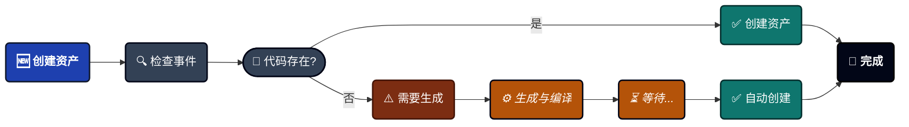
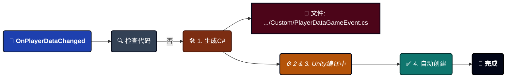

---
sidebar_label: '创建游戏事件'
sidebar_position: 4
---

import Tabs from '@theme/Tabs';

import TabItem from '@theme/TabItem';

import VideoGif from '@site/src/components/Video/VideoGif';


# 游戏事件创建器

您的高速事件创建向导。这个专业工具处理批量事件生成、自动代码编译和ScriptableObject创建——全部在一个精简的工作流中完成。

<VideoGif src="/video/game-event-system/event-create.mp4" />


---

## 🚀 打开创建器

创建器只能从 **[游戏事件编辑器](./game-event-editor.md)** 打开：
```
游戏事件编辑器 → 点击"+ New Event"按钮（右上角）
```

:::info 为什么只能从编辑器打开？
创建器需要知道将事件添加到哪个数据库。从编辑器打开可确保正确的上下文。
:::

---

## 🗺️ 界面区域

窗口组织为四个功能区域：

| 区域 | 位置 | 目的 |
| ------------------------- | --------- | ------------------------------------------------------- |
| **A. 事件模式选项卡** | 顶部 | 在Void、单参数或Sender事件之间切换 |
| **B. 配置区域** | 中部 | 选择类型并配置事件详情 |
| **C. 事件队列** | 底部 | 在创建前查看待处理的事件 |
| **D. 状态徽章** | 右上角 | 显示队列总数（例如，"7 Queued Total"） |

---

## 🎭 三种事件模式

选择适合您需求的架构：

<Tabs>
<TabItem value="void" label="1. 无参数" default>

### 无参数事件

**类型**：`GameEvent`（Void）

最简单的信号——没有数据，只有通知。


**最适合**：
```
🖱️ UI触发器 ➔ OnPauseButtonClick、OnMenuOpen
🌍 全局状态 ➔ OnGameStart、OnLevelComplete
🏃 简单动作 ➔ OnJump、OnFire、OnInteract
```

**使用方法**：
1. 点击 **"Add Event"** 按钮
2. 事件出现在队列中，默认名称为"NewEvent"
3. 在队列中重命名（例如，"OnGameStart"）
4. 如需要设置类别（例如，"Core"）
5. 点击底部的 **"Create X Event(s)"**

**无需类型选择**：由于是无参数的，您只需点击并添加。

</TabItem>

<TabItem value="single" label="2. 单参数">

### 单参数事件

**类型**：`GameEvent<T>`

随通知携带一条数据。


**最适合**：

```
📈 值变化 ➔ OnHealthChanged(float)、OnScoreUpdated(int)
🔄 状态更新 ➔ OnGameStateChanged(GameState)
📦 对象事件 ➔ OnEnemySpawned(GameObject)
💾 数据同步 ➔ OnPlayerDataChanged(PlayerData)
```

**两种添加方式**：

#### 方法1：快速添加 - 基础类型

对于内置Unity类型（int、float、Vector3、GameObject等）：

1. 从下拉菜单中 **选择类型**（显示所有32种基础类型）
2. 点击 **"Add"** 按钮
3. 事件自动添加到队列

**可用的基础类型**：
- C#基础类型：`int`、`float`、`bool`、`string`等。
- 数学类型：`Vector2`、`Vector3`、`Quaternion`、`Color`等。
- 组件：`GameObject`、`Transform`、`Rigidbody`等。
- 资产：`Sprite`、`Material`、`AudioClip`等。

---

#### 方法2：搜索 - 自定义类型

对于您自己的C#类：

1. 在搜索栏中 **输入**（例如，"PlayerData"）
2. 系统搜索项目中所有可序列化类型
3. 点击您类型旁边的 **"Add"**
4. 事件添加到队列

**搜索功能**：
- ✅ 模糊匹配（输入"plr"可找到"PlayerData"）
- ✅ 显示命名空间以消除歧义
- ✅ 徽章显示此类型已排队的事件数量
- ✅ 添加时有绿色闪光效果

**自定义类型的要求**：
```csharp
// ✅ 这样可以
[System.Serializable]
public class PlayerData {
    public string playerName;
    public int level;
}

// ❌ 这不会出现在搜索中
public class NonSerializableClass { } // 缺少[Serializable]
```

</TabItem>

<TabItem value="sender" label="3. 带Sender">

### Sender事件

**类型**：`GameEvent<TSender, TArgs>`

同时携带 **谁触发的**（sender）和 **发生了什么**（参数）。


**最适合**：
```
⚔️ 战斗 ➔ OnDamageTaken(GameObject victim, DamageInfo damage)
🤝 交互 ➔ OnItemPickedUp(Player player, ItemID item)
🌐 网络 ➔ OnPlayerJoined(NetworkPlayer sender, string playerName)
📜 复杂事件 ➔ OnQuestCompleted(QuestGiver npc, QuestData quest)
```

**推荐模式**：
- **TSender** = 行为者/源（`GameObject`、`Player`、`Enemy`）
- **TArgs** = 数据/有效载荷（`int`、`DamageInfo`、`Vector3`）

**使用方法**：

1. **选择Sender类型**：
   - 从基础类型下拉菜单中选择，或
   - 搜索自定义类型
   - 准备好后点击"Select"

2. **选择参数类型**：
   - 从基础类型下拉菜单中选择，或
   - 搜索自定义类型
   - 准备好后点击"Select"

3. **添加事件**：
   - 出现蓝色按钮："Add Event: GameObject → int"（示例）
   - 点击它添加到队列

**选定类型显示**：

当您选择类型时，它们会出现在绿色框中：
```
✅ Selected Sender: GameObject <small>(UnityEngine)</small>
✅ Selected Argument: DamageInfo <small>(YourGame.Combat)</small>
```

点击 **×** 清除并选择不同的类型。

</TabItem>
</Tabs>

---

## 📦 批量创建工作流

创建器的强大之处在于 **批处理**——一次创建多个事件而不是逐个创建。

### 分步流程

#### 1️⃣ 排队事件

在不同模式下添加多个事件：
```
🔘 切换到无参数 ➔ 添加OnGameStart  
🔘 切换到无参数 ➔ 添加OnGamePause  
🔢 切换到单参数(int) ➔ 添加OnScoreChanged  
🌊 切换到单参数(float) ➔ 添加OnHealthChanged  
👥 切换到Sender <GameObject,int> ➔ 添加OnEnemyDamaged  

队列总数：5个待创建事件
```

**视觉反馈**：
- 右上角徽章更新："5 Queued Total"
- 每个模式显示自己的计数："Events Queue (2)"

---

#### 2️⃣ 审查与配置

在 **事件队列** 部分：

**每个事件**：
- ☑️ **复选框**：切换选择（只有选中的事件会被创建）
- **名称字段**：重命名事件（默认："NewEvent"、"OnInt"等）
- **类别字段**：设置类别以便稍后过滤
- **类型标签**：显示事件类型签名
- **× 按钮**：从队列中移除

**批量操作**：
- **全选**：勾选当前队列中的所有事件
- **清除选择**：取消勾选所有事件
- **全部移除**：清空整个队列（需确认）

---

#### 3️⃣ 执行创建

点击底部的大绿色按钮：
```
+ Create 5 Event(s)
```

**接下来会发生什么**：请参阅下一节 ⬇️

---

## ⚙️ 理解创建过程

当您点击"Create"时，一个复杂的自动化管线会运行。以下是幕后发生的事情：


### 场景1：代码已存在 ✅

**示例**：创建 `int` 事件。


**速度**：即时（< 1秒）

**无需编译**：您立即在编辑器中看到事件。

---

### 场景2：需要生成代码 ⚠️

**示例**：创建 `PlayerData` 事件（您的自定义类）。


**速度**：3-10秒（取决于项目大小）

**您会看到**：
1. 创建器窗口关闭
2. Unity编译进度条出现
3. 控制台日志出现
4. 事件自动出现在编辑器中

:::info 生成了什么？

对于每个自定义类型，系统创建 **一个C#文件**，包含：
```csharp
// 文件：PlayerDataGameEvent.cs

// 1. 事件类
public class PlayerDataGameEvent : GameEvent<PlayerData> { }

// 2. 绑定字段（用于Inspector）
public partial class GameEventManager {
    public partial class EventBinding {
        public UnityEvent<PlayerData> PlayerDataGameEventAction;
    }
}
```

**为什么两者都要？** 事件类用于触发事件。绑定字段用于Inspector回调。
:::

---

### 混合批处理

**如果您排队同时包含现有和新类型怎么办？**
```
您的队列：
1. OnGameStart (void) ✅ 代码存在
2. OnScoreChanged (int) ✅ 代码存在  
3. OnPlayerDataChanged (PlayerData) ⚠️ 需要生成
4. OnQuestCompleted (QuestData) ⚠️ 需要生成
```

**系统行为**：


**控制台输出**：
```
✅ [批处理] 即时事件创建成功。(2个事件)
⏳ 生成了2个脚本文件。触发编译以完成创建...
   (编译后)
🎯 批量创建完成：2个事件已创建。
```

---

### Sender事件特殊情况

Sender事件（`GameEvent<TSender, TArgs>`）遵循相同的逻辑，但生成更复杂的代码：
```csharp
// 文件：GameObjectDamageInfoGameEvent.cs

// 具有两个类型参数的事件类
public class GameObjectDamageInfoGameEvent 
    : GameEvent<GameObject, DamageInfo> { }

// 具有两个参数的绑定字段
public UnityEvent<GameObject, DamageInfo> 
    GameObjectDamageInfoGameEventAction;
```

---

## 🎯 最佳实践

### ✅ 应该做

**预生成常用类型**：如果您知道会频繁使用某些类型，可以参考[代码生成与清理](../tools/codegen-and-cleanup.md)预先生成自定义类型类和事件绑定代码。

---

**使用有意义的名称**
```
✅ 好的名称：
  - OnPlayerHealthChanged
  - OnEnemySpawned
  - OnQuestCompleted
  - OnScoreUpdated

❌ 避免：
  - NewEvent1
  - Test
  - Event_Copy
  - TempEvent
```

---

**使用类别组织**

使用类别对相关事件进行分组：
```
🟥 类别："Combat"
  - ⚡ OnDamageTaken
  - ⚡ OnEnemyKilled
  - ⚡ OnWeaponFired

🟩 类别："UI"
  - ⚡ OnButtonClicked
  - ⚡ OnMenuOpened
  - ⚡ OnDialogClosed

🟪 类别："Player"
  - ⚡ OnPlayerJumped
  - ⚡ OnPlayerDied
  - ⚡ OnLevelUp
```

---

### ❌ 避免

**编译期间不要关闭**
```
❌ 错误：
1. 点击创建
2. 看到"触发编译..."消息
3. 立即关闭Unity或强制停止编译

✅ 正确：
1. 点击创建  
2. 等待编译条完成
3. 事件自动出现
```

**为什么？** 中断编译可能会留下生成的代码文件而没有相应的资产。

---

**不要手动编辑生成的文件**
```
❌ 错误：
打开：TinyGiantsData/GameEventSystem/CodeGen/Custom/PlayerDataGameEvent.cs
编辑：添加自定义方法、更改命名空间等。

✅ 正确：
让系统管理生成的文件。
通过单独的脚本扩展功能。
```

**为什么？** 系统可能会重新生成这些文件，覆盖您的更改。

---

## 🔍 进度指示器

### 创建期间

**即时创建**（代码存在）：
```
✅ 事件创建成功。
```

**代码生成**（新类型）：
```
⏳ 生成了3个脚本文件。触发编译以完成创建...
```

**编译后**：
```
🎯 批量创建完成：1个事件已创建。
```

---

### 控制台日志说明

**详细生成报告**：
```
━━━━━━━━━━━━━━━━━━━━━━━━━━━━━━━━━━
🧩 事件代码生成完成
━━━━━━━━━━━━━━━━━━━━━━━━━━━━━━━━━━

✅ 生成了3个事件文件（类型 + 绑定）。

━━━━━━━━━━━━━━━━━━━━━━━━━━━━━━━━━━
```

**这意味着什么**：

- 创建了3个新的C#文件
- 每个文件包含事件类 + 绑定字段
- 文件位于 `TinyGiantsData/GameEventSystem/CodeGen/Custom/`
- 编译后将自动创建资产

---

## ❓ 故障排除

### 编译后事件未出现

**问题**：点击创建，编译完成，但事件缺失。

**解决方案**：

**检查控制台错误**：
```
在编译期间查找红色错误
常见问题：类型不可序列化
修复：向您的类添加[System.Serializable]
```

**验证数据库选择**：
```
1. 打开游戏事件编辑器
2. 检查选择了哪个数据库
3. 事件被添加到该数据库
```

**手动资产检查**：
```
1. 导航到：TinyGiantsData/GameEventSystem/Databases/
2. 找到您的数据库资产
3. 在项目窗口中展开它
4. 查找您的事件子资产
```

---

### 编译时间过长

**问题**：卡在"编译脚本..."数分钟。

**原因**：
- 大型项目有许多脚本
- 其他编译错误阻止进度
- Unity编辑器性能问题

**解决方案**：
```
1. 检查控制台的编译错误
2. 首先修复任何红色错误
3. 尝试：Assets → Reimport All（最后手段）
4. 如果卡住 > 5分钟，重启Unity
```

---

### 生成后"找不到类型"

**问题**：即使在编译后，控制台仍说找不到类型。

**检查清单**：

✅ 您的类型是[Serializable]吗？

✅ 您的类型是public吗？

✅ Unity识别您的类型吗？（检查Inspector）

✅ 编译真的完成了吗？（无进度条）

**修复**：
```csharp
// 确保您的类看起来像这样：
using System;
using UnityEngine;

[Serializable]  // ← 必需
public class PlayerData  // ← 必须是public
{
    public string playerName;
    public int level;
}
```

---

### 重复的事件名称

**问题**：队列中有两个同名事件。

**行为**：系统自动重命名，添加后缀：
```
队列：
- OnPlayerDeath
- OnPlayerDeath_1
- OnPlayerDeath_2
```

**更好的做法**：在创建前在队列中手动重命名。

---

:::tip 专业工作流
**首次设置**：在一次批处理会话中创建所有常用事件类型。等待一次编译。从那时起，事件创建是即时的，因为所有代码都存在了。这一次性投资可以在项目生命周期中节省数小时。
:::

:::info 代码位置
生成的文件位于：
```
Assets/TinyGiantsData/GameEventSystem/CodeGen/
├─ Basic/    (为int、float等预生成)
└─ Custom/   (您的自定义类型)
```

这些文件夹可以安全地提交到版本控制——它们是确定性的，不会导致合并冲突。
:::