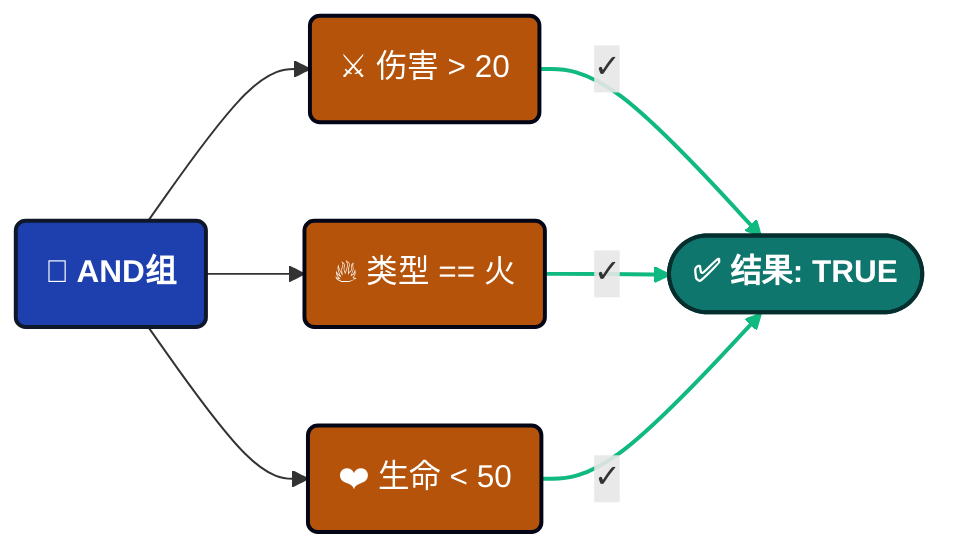
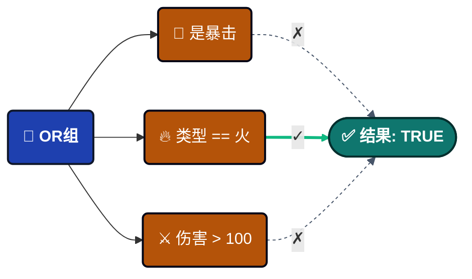
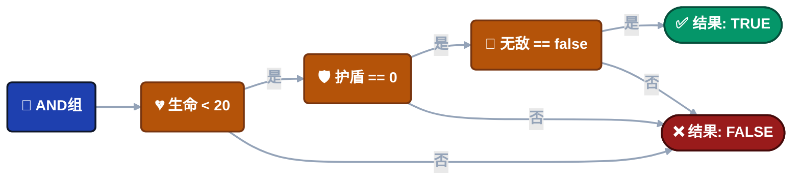
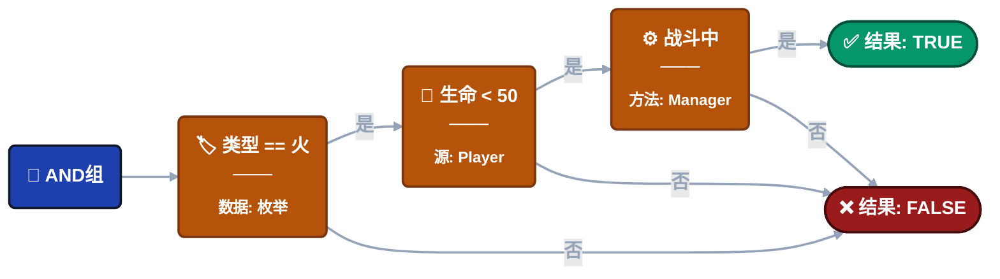

import Tabs from '@theme/Tabs';
import TabItem from '@theme/TabItem';

# 可视化条件树

**可视化地**构建复杂的布尔逻辑以控制事件动作是否应该执行。通过直观的界面创建复杂的运行时检查——无需编码。


---

## 🎯 概览

可视化条件树是一个**逻辑门系统**，在执行事件动作之前评估运行时条件。

### 它解决的问题

**传统方法**（分散的逻辑）：
```csharp
// 逻辑埋藏在脚本中，难以修改
if (damageInfo.amount > 20 && 
    (damageInfo.isCritical || damageInfo.type == DamageType.Fire) &&
    playerController.Health < 50 &&
    gameManager.IsInCombat()) {
    // 执行动作
}
```

**可视化方法**：


------

### 构建示例

**事件**：`OnPlayerDamaged`

**事件类型**：

- `GameObjectDamageInfoGameEvent`（GameObject sender）
- `PlayerStatsDamageInfoGameEvent`（自定义sender）

**数据结构**：
```csharp
// 伤害类型枚举
public enum DamageType {
    Physical,
    Fire,
    Void
}

// 伤害信息有效载荷
public class DamageInfo {
    public float amount;           // 伤害值
    public bool isCritical;        // 暴击标志
    public DamageType type;        // 伤害类型
    public Vector3 hitPoint;       // 撞击位置
    public string attacker;        // 攻击者名称
}

// 自定义sender类型（GameObject的替代方案）
public class PlayerStats {
    public string playerName;
    public int level;
    public int factionId;
}
```

**目标**：在特定条件下，当玩家受到重大伤害时触发警告效果。

---

### 核心优势

| 功能 | 好处 |
| ---------------------- | -------------------------------------------------- |
| 🎨 **可视化构建** | 设计师无需代码即可创建逻辑 |
| 🚀 **高性能** | 编译为表达式树（零反射） |
| 🔄 **可重用** | 相同条件适用于所有事件动作 |
| 🧪 **实时测试** | 在Inspector中调整值，立即查看结果 |
| 🔒 **类型安全** | 自动验证类型兼容性 |

---

## 🏗️ 树结构

条件树由**两种节点类型**构建：


### 🌳 组节点

使用AND/OR逻辑组合多个条件。

**逻辑类型**：

<Tabs>
<TabItem value="and" label="AND逻辑" default>

所有子条件必须评估为TRUE。


**可视化**：🟢 绿色边框

**用途**："必须满足所有要求"

</TabItem>

<TabItem value="or" label="OR逻辑">

任何子条件可以评估为TRUE。


**可视化**：🟠 橙色边框

**用途**："满足任何要求"

</TabItem>
</Tabs>

**切换逻辑**：点击逻辑按钮（AND/OR）进行切换。

**嵌套**：组可以包含其他组——构建无限深度的复杂逻辑。

```mermaid
graph LR

    classDef root fill:#1e40af,stroke:#0f172a,stroke-width:2px,color:#ffffff,font-weight:bold
    classDef cond fill:#b45309,stroke:#78350f,stroke-width:2px,color:#ffffff
    classDef nested fill:#334155,stroke:#020617,stroke-width:2px,color:#ffffff
    classDef success fill:#0f766e,stroke:#042f2e,stroke-width:2px,color:#ffffff,font-weight:bold

    ROOT(📂 根: AND组):::root

    ROOT --> A(📜 条件A):::cond
    ROOT --> OR(📂 嵌套: OR组):::nested
    ROOT --> D(📜 条件D):::cond

    OR --> B(📜 条件B):::cond
    OR --> C(📜 条件C):::cond

    A --> RES([✅ 逻辑结果]):::success
    B --> OR_OUT(( ))
    C --> OR_OUT
    OR_OUT --> RES
    D --> RES

    style OR_OUT fill:#334155,stroke:none
    linkStyle 4,5 stroke:#94a3b8,stroke-width:1px
```


**添加节点**：在每个组上使用**+ 条件**或**+ 组**按钮。

---

### ⚖️ 比较节点

**比较节点**是事件逻辑的基本构建块。每个节点执行单个**布尔检查**（True/False）以确定事件动作是否应该继续。

#### 🏗️ 比较的结构

每个节点遵循标准的三部分结构，使复杂逻辑一目了然。

> **[ 🟦 源（左操作数）]** **[ 运算符 ]** **[ 🟧 目标（右操作数）]**

**实际示例：**
想象一个只有在命中足够强大时才触发的事件：
Argument.amount **>** 20.0

- **🔍 源：** Argument.amount — `SingleGameEvent` 传递的原始伤害值
- **📐 运算符：** > — 逻辑规则（大于）
- **🎯 目标：** 20.0 — 要比较的常量阈值或另一个变量

------

#### 👓 查看模式

编辑器UI适应您的需求，平衡**可读性**与**精确控制**。

| 查看模式 | 可视化样式 | 最适合... |
| --------------- | --------------------------------------- | ------------------------------------------ |
| 📖 **折叠** | **摘要文本**（例如，Health < 50） | 快速概览复杂逻辑链。 |
| 🛠️ **展开** | **详细编辑器**（下拉菜单、字段） | 修改特定参数和源。 |

:::tip **交互提示**
只需**点击**任何比较块即可在这两种视图之间切换。这允许您保持工作区整洁，同时保留深入设置的能力。
:::

---

## **📝** 结构配置

<details>
<summary>📌 源</summary>

<Tabs>
<TabItem value="event-arg" label="事件参数" default>

### 🧬 事件参数（数据有效载荷）

**Argument**系统允许您深入事件的数据有效载荷以提取特定值用于条件和动作。

:::info **可用性**
数据访问专属于类型化事件：`GameEvent<T>` 或 `GameEvent<TSender, TArgs>`。
:::

#### 🔢 单参数事件

**签名：** `DamageInfoGameEvent`

当事件携带单个对象时，您可以访问对象本身或其任何公共成员。

**数据结构示例：**
```
📦 (this Argument)      ➔ 完整的DamageInfo对象
├── 🔢 amount           ➔ float
├── ✅ isCritical       ➔ bool
├── 🏷️ type             ➔ DamageType（枚举）
├── 📍 hitPoint         ➔ Vector3
└── 👤 attacker         ➔ string
```

------

#### 👥 Sender事件（上下文感知）

Sender事件为数据访问提供两个不同的根：**Sender**（谁）和**Argument**（什么）。

##### 🎮 情况A：GameObject Sender

**签名：** `GameObjectDamageInfoGameEvent`

| 根 | 路径示例 | 数据类型 |
| ------------ | ------------------------- | --------- |
| **Sender** | Sender.Transform.position | Vector3 |
| **Argument** | Argument.amount | float |

**可视化层次结构：**
```
👥 Sender
   ├── 🆔 tag           ➔ string
   ├── 🟢 activeSelf    ➔ bool
   └── 📐 Transform
       ├── 📍 position  ➔ Vector3
       └── 📂 childCount➔ int
🔢 Argument
   ├── 🔢 amount        ➔ float
   └── ✅ isCritical    ➔ bool
```

##### 🛡️ 情况B：自定义C# Sender（高级）

**签名：** `PlayerStatsDamageInfoGameEvent`

> 🚀 **为什么它特别：** 与传统系统不同，您不受GameObject的限制。使用任何**纯C#类**作为sender，实现解耦的逻辑优先架构。

- 💎 **纯逻辑** — 适用于非MonoBehaviour类。
- 🌐 **网络就绪** — 适用于PlayerData或NetworkAgent同步。
- 🤖 **AI代理** — 跟踪内部状态而无需场景依赖。

------

#### 🧭 深度属性访问

**精确导航。** 使用高性能反射导航最多**5层深**的嵌套结构。

**示例：方向检查**

- **路径：** Argument.hitPoint.normalized.x
- **条件：** > 0.5
- **结果：** 🎯 "命中来自右侧。"

**面包屑逻辑：**
Argument (DamageInfo) ➔ hitPoint (Vector3) ➔ normalized (Vector3) ➔ x (float)

------

#### 📋 支持的类型

系统自动支持以下类型：

| 类别 | 支持的类型 |
| -------------- | ------------------------------------------------- |
| **基础类型** | int、float、double、long、bool、string |
| **数学** | Vector2、Vector3、Quaternion、Color |
| **Unity** | GameObject、Transform、Component引用 |
| **逻辑** | 枚举（带下拉菜单）、[Serializable] C#类 |

:::tip **专业提示：自定义类**
[Serializable]类中的任何公共**字段**或**属性**都会自动在深度链接选择器中公开。
:::

</TabItem>

<TabItem value="scene-type" label="场景类型">

### **🎬** 场景类型

从场景中的GameObject或Component访问运行时数据。

---

#### 使用方法

**步骤1**：从层级视图将GameObject或Component拖到对象字段。

**步骤2**：点击"选择属性..."浏览可用成员。

---

#### GameObject示例

拖动`PlayerController` GameObject：
```
📦 GameObject（实例）
├─ 📦 (this GameObject)    ➔ 引用本身
├─ ✅ activeSelf           ➔ bool
├─ 🔤 tag                  ➔ string
└─ 🔢 layer                ➔ int

📐 Transform（组件）
├─ 📍 position             ➔ Vector3
├─ 📏 localScale           ➔ Vector3
└─ 📂 childCount           ➔ int

🧩 PlayerController（脚本）
├─ 🔢 Health               ➔ float
├─ 🛡️ Shield               ➔ float
├─ 🏅 Level                ➔ int
├─ ✅ HasFireResistance    ➔ bool
│
├─ ⚡ IsInDangerZone()      ➔ bool（方法）
└─ ⚡ IsCriticallyWounded() ➔ bool（方法）
```

**用法**：
```
Player.Health < 50                  → 生命值检查
Player.Level >= 10                  → 等级要求
Player.IsInDangerZone() == true     → 通过方法进行复杂检查
```

---

#### Bool方法支持 ✨

返回`bool`的**零参数方法**出现在下拉菜单中！

**示例**：
```csharp
// 在您的组件中
public bool IsInDangerZone() {
    return Health < 20 && Shield == 0 && !IsInvincible;
}
```

**在条件树中**：
```
Player.IsInDangerZone() == true
```

这将复杂逻辑封装在单个方法调用中，而不是可视化构建它。

---

#### Component示例

拖动`GameManager` Component：
```
🏛️ GameManager（全局系统）
├─ 🔄 CurrentState        ➔ GameState（枚举）
├─ 🌊 CurrentWave         ➔ int
├─ 🏅 DifficultyLevel     ➔ int
│
├─ ⚡ IsInCombat()         ➔ bool（方法）
└─ ⚡ IsHardMode()         ➔ bool（方法）
```

**用法**：
```
GameManager.CurrentState == Playing
GameManager.IsInCombat() == true
GameManager.DifficultyLevel >= 3
```

---

#### 重要限制

⚠️ **场景类型要求对象在场景加载时存在。**
```
✅ 有效：场景层级中的对象（在初始化时存在）
❌ 失败：运行时实例化的对象（尚不存在）

解决方案：对运行时对象使用事件参数
```

</TabItem>

<TabItem value="random" label="随机类型">

### **🎲** 随机类型

**目的**：在执行时生成随机值。

---

#### 两种模式

**模式1：范围**

在边界内生成随机数。


**配置**：

- **最小值**：下界
- **最大值**：上界
- **整数**：勾选表示整数，取消勾选表示小数

---

**模式2：列表**

从预定义值中随机选择项目。


**配置**：

- **数据类型**：选择类型（int、float、string、bool等）
- **列表项**：使用+/-按钮添加/删除值

---

#### 使用场景

**暴击几率**：
```
Random(0~100) > 90  → 10%几率
```

**伤害变化**：
```
Random(0~10) → 添加随机额外伤害
```

**动态事件**：
```
Random List[简单, 普通, 困难] → 随机化难度
```

</TabItem>
</Tabs>

</details>

<details>
<summary>📌 运算符</summary>

### **📐** 可用运算符

**数值（6个）**

用于数字（int、float、double、long）：

| 运算符 | 符号 | 示例 |
| ---------------- | ------ | --------------- |
| 等于 | `==` | `Health == 100` |
| 不等于 | `!=` | `Health != 0` |
| 大于 | `>` | `Damage > 20` |
| 小于 | `<` | `Health < 50` |
| 大于或等于 | `>=` | `Level >= 10` |
| 小于或等于 | `<=` | `Shield <= 0` |

**自动转换**：兼容的数值类型自动转换（int ↔ float）。

---

**字符串（4个）**

用于文本值：

| 运算符 | 符号 | 示例 |
| ----------- | -------------- | ---------------------------- |
| 等于 | `==` | `Name == "Hero"` |
| 不等于 | `!=` | `Tag != "Enemy"` |
| 以...开头 | `Starts With` | `Name Starts With "Player_"` |
| 以...结尾 | `Ends With` | `File Ends With ".png"` |
| 包含 | `Contains (⊃)` | `Message Contains "error"` |

⚠️ **区分大小写**："Hero" ≠ "hero"

---

**枚举支持**

完全枚举支持，带下拉选择！

**示例**：
```csharp
public enum DamageType { Physical, Fire, Void }
```

**在条件树中**：
```
源：Argument.type（DamageType）
运算符：==
目标：DamageType.Fire（下拉菜单显示Physical/Fire/Void）
```

**使用列表**：
```
Argument.type In List [Fire, Void]
结果：如果type是DamageType.Fire或DamageType.Void，则为TRUE
```

**支持的运算符**：`==`、`!=`、`In List (∈)`

---

**集合（1个）**

检查列表/数组成员资格：

| 运算符 | 符号 | 目的 |
| -------- | ------ | ----------------------------- |
| 在列表中 | `∈` | 检查值是否存在于列表中 |

**结构**：
```
源：单个值
运算符：在列表中（∈）
目标：列表/数组（匹配类型）
```

**示例**：
```
Argument.attacker In List ["Dragon", "Demon", "Lich"]
Player.Level In List [10, 20, 30, 40, 50]
Argument.type In List [Fire, Void]
```

</details>

<details>
<summary>📌 目标</summary>
<Tabs>
<TabItem value="event-arg" label="事件参数" default>

### 🧬 事件参数（数据有效载荷）

:::tip 与源相同

与源一样，具体细节请参考源中的相关配置介绍

:::

</TabItem>

<TabItem value="scene-type" label="场景类型">

### **🎬** 场景类型

:::tip 与源相同

与源一样，具体细节请参考源中的相关配置介绍

:::

</TabItem>

<TabItem value="random" label="随机类型">

### **🎲** 随机类型

:::tip 与源相同

与源一样，具体细节请参考源中的相关配置介绍

:::

</TabItem>

<TabItem value="constant" label="常量">

### **📌** 常量

固定比较值。

**注意**：仅作为**目标**（右侧）可用，不作为源。

---

#### 两种模式

**模式1：单个值**

输入一个固定值。


**数据类型**：Int、Float、Double、String、Bool

---

**模式2：列表**

定义多个可接受的值（用于"在列表中"运算符）。


**配置**：

- **数据类型**：所有列表项的类型
- **+ / -**：添加/删除项

---

#### 使用场景

**阈值**：
```
Health < 50.0
```

**精确匹配**：
```
Name == "Hero"
```

**多个值**：
```
Type In List [Fire, Void, Lightning]
```

:::tip **关键区别**

额外支持类型：常量类型**（仅适用于目标）**

:::

:::tip **上下文感知**

某些运算符限制目标类型：

- 数值运算符（`>`、`<`等）需要单个值

- "在列表中"运算符需要列表类型

:::

</TabItem>
</Tabs>

</details>

------

## 🎨 类型验证

系统自动验证类型兼容性。

**有效比较**：
```
✅ int == int
✅ float > int（自动转换）
✅ string Contains string
✅ DamageType == Fire（枚举）
✅ int In List<int>
```

**无效比较**：
```
❌ string > int（不兼容类型）
❌ bool Contains string（无意义）
❌ float In List<string>（类型不匹配）
```

**视觉反馈**：不兼容类型上的红色轮廓+警告文本。

---

## 🧩 Bool方法 vs 可视化树

两种构建条件的方法——何时使用每种？

### 方法1：Bool方法

**最适合**：复杂的多步逻辑。

**示例**：
```csharp
public bool IsInDangerZone() {
    bool lowHealth = Health < 20;
    bool noShield = Shield == 0;
    bool hasEnemies = Physics.OverlapSphere(
        transform.position, 10f, enemyLayer
    ).Length > 0;
    
    return lowHealth && noShield && hasEnemies;
}
```

**在树中**：`Player.IsInDangerZone() == true`

**优点**：

- 封装复杂性
- 可以使用Physics、raycast
- 单元可测试
- 代码可重用

**缺点**：

- 需要C#编码
- 设计师无法修改

---

### 方法2：可视化树

**最适合**：设计师应该控制的简单检查。

**示例**：


**优点**：

- 无需编码
- 设计师友好
- 可视化表示
- 快速迭代

**缺点**：

- 无法使用Physics/算法
- 大型树变得复杂

---

### 混合方法（推荐）

结合两者以获得最佳结果：


**指南**：

- 可视化树：阈值、枚举、简单属性
- Bool方法：Physics查询、复杂算法、跨系统检查

---

## 🔄 拖放重新排序

**更改执行顺序**：拖动任何条件左边缘的句柄（☰）。

**为什么顺序很重要**：

**AND组**：顺序不影响结果（所有必须通过）。

**OR组**：顺序影响**短路评估**（在第一个TRUE处停止）。

**优化示例**：
```
❌ 慢：
OR组
├─ ExpensivePhysicsCheck()  ← 首先运行（慢！）
└─ SimpleBoolCheck          ← 可能永远不运行

✅ 快：
OR组
├─ SimpleBoolCheck          ← 首先运行（快！）
└─ ExpensivePhysicsCheck()  ← 仅在需要时
```

在OR组中首先放置廉价检查以获得更好的性能。

---

## 🚀 性能

### 编译过程

**一次性成本**（场景加载）：
```
可视化树 → 表达式树 → IL代码 → 编译的Lambda
```

**运行时执行**：
```
事件触发 → 调用编译的Lambda → 返回TRUE/FALSE
```

**基准测试**：复杂嵌套条件在~0.001ms（1微秒）内执行。

---

### 为什么它快

**零反射**：像手写C#一样直接编译访问。

**表达式树**：系统在初始化时生成优化的IL代码。
```
❌ 传统：每次检查GetComponent() + GetField() + Invoke()
✅ 本系统：通过编译的lambda直接属性访问
```

**结果**：即使每帧触发数百个事件，开销也可以忽略不计。

---

## 🧹 树管理

- **启用/禁用**：切换复选框以绕过所有条件（始终为TRUE）。
- **重置树**：点击"重置树"按钮清除所有节点并重新开始。

- **折叠/展开**：点击比较块在摘要和详细视图之间切换。

---

## ❓ 故障排除

### 条件始终返回False

**检查清单**：

- ✅ "启用条件"切换是否已勾选？
- ✅ 是否有红色类型不匹配警告？
- ✅ 场景类型引用是否仍然有效（未销毁）？
- ✅ bool方法是否返回预期值？（添加Debug.Log）

---

### 属性不在下拉菜单中

**对于事件参数**：

- 必须是公共字段或属性
- 必须是受支持的类型

**对于场景类型**：

- GameObject必须在编辑器时存在于场景中
- Component必须启用
- 属性必须是公共的
- 方法必须：返回bool、零参数、公共、实例（非静态）

**对于运行时对象**：使用事件参数而不是场景类型。

---

### 更改未保存

**常见原因**：

- 打开了多个行为窗口（关闭重复项）
- 编辑期间脚本编译（等待完成）
- Unity未应用SerializedProperty更改（关闭前等待）

---

## 📖 使用位置

可视化条件树系统出现在**两个上下文**中：

**1. 事件行为** → [游戏事件行为](./game-event-behavior.md)

控制事件动作是否执行：
```
事件触发 → 检查条件 → 执行/跳过动作
```

**2. 流程节点** → 流程节点配置*（未来文档）*

控制流程节点是否执行：
```
流程到达节点 → 检查条件 → 执行/跳过节点
```

两者使用**完全相同**的条件树系统。

---

:::tip 最佳实践

**简单检查**：对阈值、枚举、基本比较使用可视化树

**复杂逻辑**：对Physics、算法、多步检查使用Bool方法

**最佳方法**：两者结合——简单的可视化，复杂的方法

**性能**：在OR组中首先放置廉价检查以进行短路优化

:::